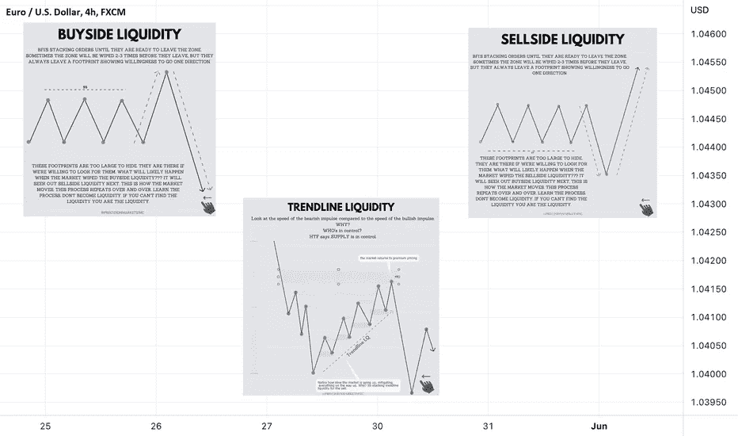

# 关于流动性✅✅✅的有趣事实

> 原文：<https://medium.com/coinmonks/interesting-facts-about-liquidity-602e423fc9bb?source=collection_archive---------75----------------------->

# 正如你可以在我的分析中看到的，我大量使用流动性操纵作为确认之一，这是最重要的智能资金概念之一，因为他们总是在寻找流动性。

> 交易新手？试试[加密交易机器人](/coinmonks/crypto-trading-bot-c2ffce8acb2a)或者[复制交易](/coinmonks/top-10-crypto-copy-trading-platforms-for-beginners-d0c37c7d698c)

# 在大多数情况下，价格形成相等的高点或低点或[趋势线](https://www.tradingview.com/ideas/trendline/)，这意味着低于或高于这些都是流动性，作为散户的止损，聪明的资金试图在开仓前取出这些止损。