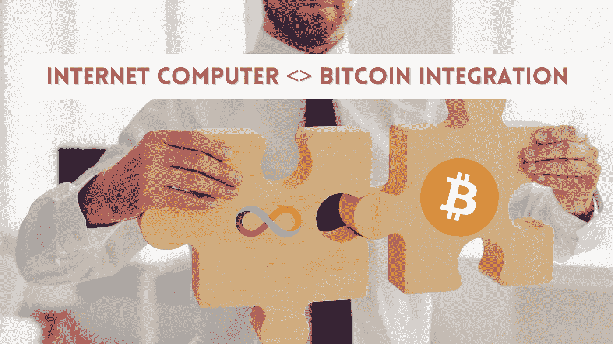

# 互联网计算机<>比特币整合让智能合约在 BTC 成为可能，无需使用摇摇欲坠的桥梁。

> 原文：<https://medium.com/coinmonks/internet-computer-bitcoin-integration-making-smart-contracts-possible-on-btc-without-using-8e7f6a1ddd52?source=collection_archive---------19----------------------->

> 多米尼克·威廉姆斯(Dominic Williams)“你可以在互联网计算机上编写智能合约逻辑，在比特币网络上实际移动比特币

Dfinity 最近在 Twitter spaces 上举办了一次聊天，在这次聊天中，[迭戈·普拉茨](https://medium.com/u/a23dc0f7fd1f?source=post_page-----8e7f6a1ddd52--------------------------------) &马努·德里弗斯简单地讲述了链集成的工作原理以及 IC < > BTC 集成的不同之处。以下是他们会议中的一些要点。

**什么是跨链整合？**如果一个人在区块链 A 上运行一些东西，那么他可以使用区块链 B 和区块链 A 上的本地资产，因此不同的资产可以在不同的区块链之间交叉。

**什么是跨链智能合约？一个区块链可以调用的智能合约或与另一个区块链上运行的智能合约交互。**

一个链需要得到另一个链的许可才能这样做吗？通常它不需要任何许可，尤其是比特币，因为它完全不需要许可。

**到底是什么桥？**桥接意味着可以在一个系统中使用不同区块链的优势，但缺点是通常允许这种互操作性的是一些非区块链本地的外部组件。

**这些桥是如何工作的？**如果一个人想在区块链 A 上拥有一个应用程序，但想在区块链 B 上使用某个应用程序，而这两者之间有一座桥梁，这座桥梁就是第三方中介，然而这可能会严重出错，使整个系统容易受到攻击。

**互联网电脑有什么不同**？在 IC，随着比特币的集成，罐子将能够容纳真正的比特币，而不需要一些单独的第三方桥梁。互联网计算机完全绕过了比特币的桥梁

**什么是包装好的比特币？**包装好的比特币存在于使用桥接协议的不同链上。他们通常是一些充当托管人的实体或实体组。他们的工作方式是“将你的比特币发送给我们，我们会借给你一些包装好的比特币，供你在以太坊或其他链上使用”。当用户想要提现时，他们会重新兑换包装好的比特币，以换取他们真正的比特币。所有这些包装都依赖于中介。

IC 方法有何不同？ IC 与比特币直接集成，这意味着你可以直接将其包装在一个罐子上。这个罐子可以容纳真正的比特币，不需要任何中介。因此，如果有人给你一个真正的比特币，使用集成，他会给你一个包装好的比特币，包装好的比特币是互联网计算机的原生令牌。

**这对实践中的比特币& IC 开发者意味着什么？**对于 IC 开发者来说，他们可以真正持有真正的比特币&建立在其上。相反，这意味着比特币的开发者或其他人可以在比特币上使用智能合约。

**什么样的互联网计算机技术能实现这一点？**它被称为链密钥加密——这是用来让所有不同的子网安全地相互通信的技术。而这个系统实际上非常接近比特币整合所需要的。

**比特币持有者将能够做什么？比特币用户将能够参与他们在以太坊看到的那种 DeFi 热潮。这将通过消除比特币的速度、每秒交易量等限制来释放其潜力。对于真正相信比特币的人来说，他们将能够为比特币编写智能合约，而不必进入另一层。**

新开发者的机会:比特币整合将给新的智能合约开发者带来两全其美的好处。这将给他们非常有表现力和非常强大的 IC 智能合约，然后还将让他们获得比特币的流动性池，这是世界上最大的加密货币。

要了解更多细节，请听多米尼克·威廉姆斯的演讲。

Dfinity founder and chief scientist Dominic Williams calling the feature “extraordinarily exciting.”

> *加入 Coinmonks* [*电报频道*](https://t.me/coincodecap) *和* [*Youtube 频道*](https://www.youtube.com/c/coinmonks/videos) *了解加密交易和投资*

# 另外，阅读

*   [有哪些交易信号？](https://coincodecap.com/trading-signal) | [Bitstamp vs 比特币基地](https://coincodecap.com/bitstamp-coinbase) | [买索拉纳](https://coincodecap.com/buy-solana)
*   [ProfitFarmers 回顾](https://coincodecap.com/profitfarmers-review) | [如何使用 Cornix 交易机器人](https://coincodecap.com/cornix-trading-bot)
*   [十大最佳加密货币博客](https://coincodecap.com/best-cryptocurrency-blogs) | [YouHodler 评论](https://coincodecap.com/youhodler-review)
*   [MyConstant Review](https://coincodecap.com/myconstant-review) | [8 款最佳摇摆交易机器人](https://coincodecap.com/best-swing-trading-bots)
*   [MXC 交易所评论](/coinmonks/mxc-exchange-review-3af0ec1cba8c) | [Pionex vs 币安](https://coincodecap.com/pionex-vs-binance) | [Pionex 套利机器人](https://coincodecap.com/pionex-arbitrage-bot)