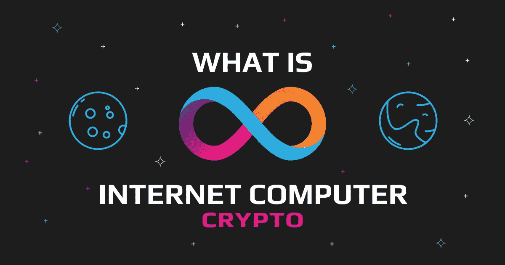

# 互联网计算机加密:已经价值数十亿美元的流行新加密指南

> 原文：<https://medium.com/coinmonks/internet-computer-crypto-a-guide-to-the-popular-new-crypto-already-worth-billions-1edba4893250?source=collection_archive---------18----------------------->

虽然互联网计算机(ICP)在加密货币市场上没有最引人注目的名字，但这个项目有可能不仅彻底改变区块链的世界，还会以其雄心勃勃的 Web 3.0 目标彻底改变互联网本身。

这个项目是由它自己的 [ICP 令牌](https://swapzone.io/currencies/internet-computer(opens%20in%20a%20new%20tab))推动的，它的价格在发布时暴涨，然后又暴跌。现在代币交易折价巨大，那么现在是投资的好时机吗？

在本指南中，我们将为您提供决定 ICP 是否值得在您的加密钱包中保留空间所需的所有信息。

# 什么是互联网计算机加密？

互联网计算机是一个分散的区块链网络，旨在创建一个生态系统，智能合约和 dApps 可以在不需要中央服务器的情况下高速运行。

从本质上来说，开发者和社区相信这个网络可以克服困扰[以太坊(ETH)](https://swapzone.io/currencies/ethereum) 区块链的扩展性问题，并在这个过程中，创建一个快速的 web 3.0 平台。

与以太坊不同，互联网计算机旨在以高速和低成本运行，这使其成为 dApp 开发者的绝佳平台。

推动该项目的想法是使用世界范围内的节点为网络供电，而不是像当前的 Web 2.0 系统(如谷歌的云服务)那样只有一个中央数据库。分散模式防止一个中心玩家在网络上获得太多的权力，并对系统施加偏见。

此外，分散式网络不需要用户管理和保护易受黑客攻击的集中式数据库。

该项目有五个有助于实现其目标的关键特征:

1.  **链密钥技术:**通过使用加密协议，可以使用该技术将节点安全地添加到网络中，从而允许协议扩展。
2.  **非交互式分布式密钥生成(NIDKG):** 不用深入了解这个特性，它本质上使得在不牺牲机密性的情况下验证共享成为可能。
3.  **网络神经系统(NNS):**NNS 是允许社区影响项目发展方向的治理系统。
4.  **互联网身份:**该项目将允许用户创建安全的在线身份。

值得注意的是，这个项目的宏伟目标目前只是“雄心”，但这不一定是一件坏事，因为在项目成为主流之前了解它可能是一项非常有利可图的冒险。

# 互联网计算机是如何迅速流行起来的？

当 ICP 在 2021 年初推出时，其市值飙升，在 72 小时内达到 350 多亿美元，并在其发展过程中从风险投资公司筹集了约 1 亿美元。

ICP 在如此短的时间内出现天文数字般的增长，这让社区中的许多人感到惊讶，并让人们问为什么它如此受欢迎。

虽然不可能准确指出是什么导致了项目发布当天的大肆宣传，但有一些理论。

首先，ICP 成为“以太坊”杀手网络的潜力让许多投资者认为，尽早获得一些 ICP 代币将是一项出色的长期投资。

其次，智能合约兼容性与高速度和低成本的承诺相结合，使人们认为 ICP 将发展成为一个蓬勃发展的 dApp 生态系统。

第三，围绕 Web 3.0 的宣传已经持续了很多年，在众多承诺交付去中心化 Web 的项目中找到一个赢家并不是一件容易的事情；ICP 看起来有可能成为 Web 3.0 的冠军，所以人们争先恐后地加入这个项目。

# 互联网计算机与其他加密货币有何不同

当 Internet Computer 推出时，它承诺在自己的游戏中击败以太坊，通过一些显著的差异，如非常高的速度、低成本和可扩展性，从第一层人群中脱颖而出。此外，开发者在网络中嵌入了一些独特的功能，如链密钥技术和 NIDKG。

然而，与其他密码最显著的区别是互联网计算机在其区块链上运行当前版本 web 应用程序的潜在能力——这一用例尚未完全实现，但如果实现了，ICP 将在 web 3.0 故事中树立一个令人印象深刻的里程碑。

# 互联网计算机可能面临哪些风险？

互联网计算机面临的主要风险是节点在硬件方面需要克服的进入壁垒。如果硬件太贵，只有富裕的组织和个人会成为网络上的节点，增加了 ICP 的中心化。

以太坊 2.0 预计将在今年合并，这可能导致网络变得更具可扩展性和更便宜，潜在地削弱 ICP 作为以太坊可行替代品的地位。

该项目现在面临的另一个风险是激烈的竞争，加密货币如[卡尔达诺(ADA)](https://swapzone.io/currencies/cardano) 和[索拉纳(SOL)](https://swapzone.io/currencies/solana) 正在提供也与以太坊竞争的功能，并可能使互联网计算机变得多余。

# 谁最初开发了互联网计算机？

多米尼克·威廉姆斯(Dominic Williams)启动了这个项目，总部位于瑞士的非营利组织 d infinity(T1)基金会负责其开发。

DFINITY 基金会利用了来自世界各地的研究人员和工程师的技能，并在此过程中获得了 200 多项技术的专利，这表明了该组织对创新的重视。

# ICP 令牌

ICP 令牌通过三种用例以与其他密码非常相似的方式运行:

1.  **治理:** ICP 持有者可以锁定他们的令牌来创建“神经元”，这些神经元通过对提案进行投票来参与治理。
2.  **奖励:**操作节点并锁定‘神经元’中的令牌，获得 ICP 奖励。
3.  **燃料:** ICP 用于交易时会被烧掉，烧掉的数量根据市场而变化，这意味着费用是可变的。

国际比较方案令牌的价格历史非常动荡；发布后，它创下了超过 700 美元的历史新高，但自那以来，它一直在努力获得动力，交易价格仅为 6 美元，折价超过 95%。

# 结果

当互联网计算机推出时，密码世界变得疯狂，数十亿美元涌入人们认为将建设未来互联网的项目。

不幸的是，事实是 ICP 背后的开发者已经开始了一个长期的探索，而不是一个保证短期回报的探索，所以随着网络的令牌从去年的高点暴跌，启动日的投机者已经被烧毁。

然而，只要 DFINITY 的专家们继续致力于着眼于 web 3.0 大奖的项目，因特网计算机的梦想就不会消亡。近 100 个 dApps 已经在网络上运行，这一事实表明 ICP 有很大的潜力。