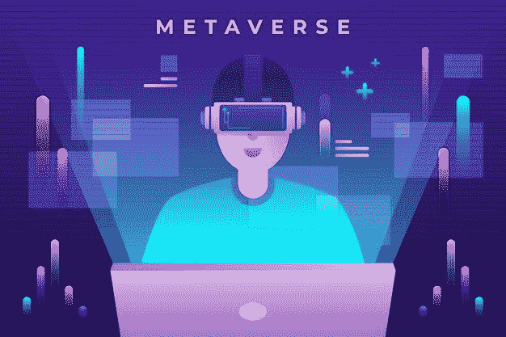

# 互操作性和元宇宙的未来

> 原文：<https://medium.com/coinmonks/interoperability-and-future-of-metaverse-6ff152edc382?source=collection_archive---------13----------------------->

元宇宙通过促进物理和现实世界的融合，承诺在现实的数字空间中生活的沉浸式和增强的体验。虽然企业在寻找利用这一机会并充分挖掘其潜力的方法，但某些问题在前进的道路上制造了障碍。

其中一个障碍是缺乏互操作性。在缺乏互操作性的情况下，跨越虚拟世界的边界变得具有挑战性，用户无法在他们所存在的不同虚拟平台之间保持连续性。

由于元宇宙是真实世界的反映，互操作性是其成功的关键。我们可以不受限制地从物理世界的一个地方自由移动到另一个地方。不仅如此，我们可以带着我们的物品去任何地方。正是这些连续性和互操作性的品质使得物质世界成为可能。正是由于这个原因，专家们认为，一个功能齐全的元宇宙只有通过实现互操作性才有可能。

这里值得注意的是，只有当元宇宙成功地将自己建立为一个互联的虚拟空间时，它才能适合人类化身居住。让我们更深入地研究互操作性的概念，以理解它在实现元宇宙方面的重要性。

## 理解元宇宙的概念

是只有一个元宇宙，还是有很多？元宇宙为什么这么叫？是已经有了还是正在制作中？显然，关于元宇宙，问题多于答案。这就是为什么给元宇宙下定义并不容易。有不同的方式来描述什么是元宇宙，几乎所有的方式都接近元宇宙实际需要的。我们的意思是，所有关于元宇宙的可用解释都围绕着它的一个关键思想:一个所有人都可以访问的共享虚拟环境。这是一个人们可以使用定制的数字化身进行互动和参与活动的空间。随着虚拟现实变得越来越主流，几乎可以肯定的是，在未来的某个时刻，我们都将成为元宇宙的一部分。

## 什么是元宇宙互操作性？

让我们以区块链技术为例来理解“互操作性”在区块链生态系统中，我们有可互操作和不可互操作的平台。然而，如果我们希望利用区块链技术创新和开发更先进和高效的解决方案，互用性是必不可少的。

互操作性使区块链生态系统能够进行通信，共享任意数据，并使用彼此的服务和功能。类似地，互操作性允许各种元宇宙项目通过共享数据、功能、服务和经验以统一的方式运行。它还促进了跨平台交易和其他在封闭空间中几乎不可能进行的活动。

简而言之，[元宇宙](https://www.leewayhertz.com/metaverse-interoperability/)的互操作性与区块链生态系统中的互操作性没有太大不同。用户不需要有多个钱包，只需一个钱包就可以存储和处理不同的元宇宙项目。

但是请注意，要使您的元宇宙具有互操作性，您必须将其构建在可互操作的区块链生态系统上。这将确保元宇宙在其所有层之间具有互操作性。

***第一层——基础层***

互联网构成了基础层，并确保与元宇宙的连接。

***第二层——基础设施层***

硬件组件等基础设施需求构成了这一层，并确保了所需的用户体验。这一层还包括区块链、大数据和物联网等技术，这些技术有助于使元宇宙成为一个共享的生态系统。

***层 3-内容层***

这一层包括为元宇宙创造生动自然体验的应用程序和平台。

***第四层——真实元宇宙***

一旦所有更低的层形成，这一层就产生了。这是开发虚拟空间的最后一层。

## **为什么互操作性在元宇宙如此重要？**

尽管一个全功能的可互操作的元宇宙尚未实现，但互操作性将是元宇宙背后的驱动力。互联网是一种分层结构，允许不同的网络和子网进行通信。

我们可以使用浏览器浏览各种网站，互联网上的网页可以相互链接。这就创造了一个互操作、互连的网络系统，称为互联网。

互操作性的这一特征与现实生活非常相似，人们带着自己的身份四处移动。我们还可以将我们的资产带到任何地方，而不会有太多麻烦。

正是这种相同的互用性原则使元宇宙具备了互联性。互操作性对于连接多个元宇宙项目至关重要，因此用户可以在元宇宙世界参与不同的虚拟社会文化活动时获得统一的体验。

## **元宇宙的未来**

Web3 是元宇宙的重要组成部分。随着我们在 web3 上的进步，我们将更接近拥有生动逼真的真实元宇宙体验。这意味着像 Cryptos 和 NFTs 这样基于区块链的创新将在未来为元宇宙的世界提供动力。

一些元宇宙 NFT 的供应商已经让他们的 NFT 可以在某些元宇宙游戏中使用，更多的玩家正在寻求进入这个领域。NFT 爱好者越来越认识到在这些游戏中购买或租赁虚拟土地并出售或出租的潜力。有趣的是，即使那些对元宇宙不感兴趣的人也认为这是一个有利可图的领域，可能会考虑投资在这一领域工作的公司的股票。可以理解的是，创作者和用户都可以从这样的关联中受益匪浅。

未来的元宇宙也可能成为虚拟经济增长的主要贡献者。它将是开放和可访问的，几乎不会受到任何“一个”公司或社区的干扰。随着越来越多的品牌向更广阔的元宇宙敞开大门，很容易推断出元宇宙未来将非常类似于当今时代的互联网。

因此，元宇宙的未来可能会在许多方面与现实世界极其相似。虚拟现实的倡导者甚至声称，元宇宙最终将取代某些现实世界的活动，如工作或闲逛。

## **尾注**

现在，一个真正的元宇宙更多的是一种愿景，而不是具体的现实。虽然 web3 的最新发展，以及让区块链用例更加主流的努力，是朝着将真实元宇宙的概念变为现实迈出的一大步，但我们仍然有时间创造一个反映真实世界的[元宇宙](https://www.leewayhertz.com/metaverse-the-new-reality/)。

> *加入 Coinmonks* [*电报频道*](https://t.me/coincodecap) *和* [*Youtube 频道*](https://www.youtube.com/c/coinmonks/videos) *了解加密交易和投资*

# 另外，阅读

*   [有哪些交易信号？](https://coincodecap.com/trading-signal) | [Bitstamp vs 比特币基地](https://coincodecap.com/bitstamp-coinbase) | [买索拉纳](https://coincodecap.com/buy-solana)
*   [ProfitFarmers 回顾](https://coincodecap.com/profitfarmers-review) | [如何使用 Cornix 交易机器人](https://coincodecap.com/cornix-trading-bot)
*   [十大最佳加密货币博客](https://coincodecap.com/best-cryptocurrency-blogs) | [YouHodler 评论](https://coincodecap.com/youhodler-review)
*   [MyConstant Review](https://coincodecap.com/myconstant-review) | [8 款最佳摇摆交易机器人](https://coincodecap.com/best-swing-trading-bots)
*   [MXC 交易所评论](/coinmonks/mxc-exchange-review-3af0ec1cba8c) | [Pionex vs 币安](https://coincodecap.com/pionex-vs-binance) | [Pionex 套利机器人](https://coincodecap.com/pionex-arbitrage-bot)