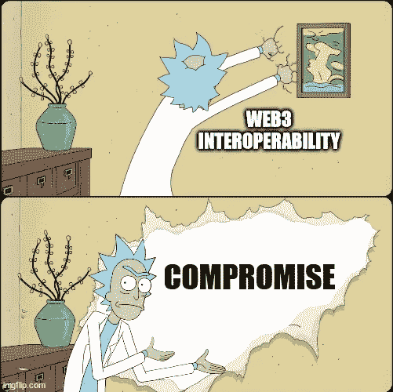
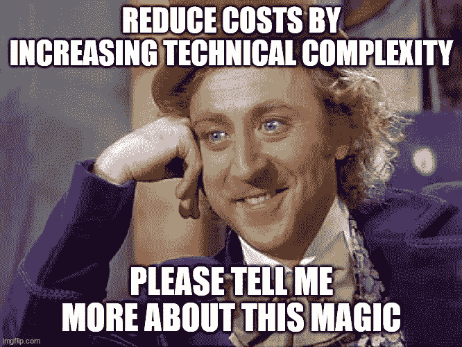

# Web3 中的互操作性和 Rick Sachez 的妥协纪念碑

> 原文：<https://medium.com/coinmonks/interoperability-in-web3-and-rick-sachezs-monument-to-compromise-fd65c140f58?source=collection_archive---------25----------------------->

作为他们中最富有的里克，里克·桑切斯 C-137 通常不需要同伙、盟友、顾问——不需要任何帮助。然而，当谈到建造解剖公园时，他与元宇宙截然相反，建造了一个游乐园，里面有一个人，瑞克选择了合作伙伴。即使是他，他们中最富有的里克，也不能独自建造解剖公园。

虽然每个人都为《解剖公园》做出了贡献，但里克有自己的项目，这完全是他的愿景——胰腺的海盗。瑞克喜欢《胰腺海盗》。这是不妥协的。他对完美游乐园景点的设想。根据其他人的反馈，这似乎有点，嗯…当然不是家庭友好。然而，这是瑞克的幻觉。

当《解剖公园》的第一版爆炸时——确切地说——瑞克组建了一个新团队，在一个不太可能爆炸的新家复兴《解剖公园》。最重要的事情之一？胰腺海盗。新的营销团队问自己，“胰腺是做什么的？它会成为海盗吗？不，它制造胰岛素”。瑞克坚定的愿景现在受到了挑战，因为没有人支持他。他的回应？他愤怒地结束了通话，称新的解剖公园为“ ***妥协的纪念碑*** ”。

I would have ridden Pirates of the Pancreas.

据我所知，强调**据我所知**，Web3 没有人在建解剖公园。然而，我看到的一个共同主题涉及桥接和跨生态系统解决方案。所有这些协作感觉当然很好——这意味着社区正在为一个共同的目标而共同努力！生态系统互操作性将给每个人一个成长的机会！嗯，我知道有三个人会不同意:约翰·洛克菲勒、彼得·泰尔和我。

洛克菲勒用“*美国美女玫瑰*”来比喻自己的经营哲学。如果你碰巧从事园艺，你就会知道种植玫瑰会产生一些艰难的决定。你可以种几朵普通的玫瑰，也可以种一朵壮观的玫瑰。种植那朵玫瑰需要牺牲那些平庸的玫瑰，这样一朵玫瑰就可以自私地利用所有的资源，扼杀其他玫瑰的生命。另一方面，彼得·泰尔对商业的看法要直率得多——他只对能够垄断市场的机会感兴趣。

我发现自己并不经常同意洛克菲勒或泰尔的观点，但我自己的经历告诉我，这种观点有可取之处。在过去的几年里，我从事互操作性标准和协议的工作。这些项目一直被视为解决所有问题的灵丹妙药，这些行业受到有限竞争和无力创新的困扰。该理论认为，互操作性最终会通过增加客户选择、削弱供应商提高利润率的能力来降低成本。

We do tend to forget that Wonka did actually run a bit of a monopoly with slave labor…

伟大的理论。现实中的依据？没有那么多:

1.  互操作性要求所有参与者达成共识。不幸的是，这种共识并不像权力和地位那么简单。相反，它需要有不同目标的商业企业达成一致——自私的目标——成员和投资者的目标。参与者是同一市场的竞争者。有人可能会游说一个对他们有利的解决方案，削弱他们的竞争对手。这是一个漫长的过程。时间是什么？**钱**。
2.  这个极其漫长的过程最终导致了实现互操作性的编码解决方案。由于每个人都已经针对**他们的**用例优化了他们的解决方案，他们现在必须做额外的工作来满足互操作性需求。**更**钱。
3.  有一个关键词——**优化**。每个人都有不同的解决方案，因为他们试图解决不同的问题。现在更难优化**和**互操作。最终结果？效果较差的产品。
4.  在互操作性涅槃之前，任何产品都可以根据自己的愿景开发解决方案。现在，他们必须考虑做出会破坏互操作性的更改的影响。互操作性**是**的一个限制。
5.  当市场变化时会发生什么？解决方案必须做出反应。但是，互操作性标准是刻在石头上的，并且需要达成共识——很难——才能对标准进行修改。但是现在市场在变！我们必须做出反应！参与者将权衡为了追逐市场需求而牺牲互操作性对他们来说是否值得。如果没有，他们必须等到互用性标准也做出反应。**扼杀了**和**减缓了**创新。

或者像里克·桑切斯如此雄辩地描述了《盗胰者》的新愿景——***妥协的纪念碑*** 。以下是 Web3 中的每个人都应该问自己的一些问题:

1.  这些生态系统中有多少能够长期存活？
2.  这些生态系统中有多少能在短期内存活下来？
3.  哪个生态系统允许我优化我的解决方案？
4.  协作如何影响我的优化能力？
5.  互操作性会导致不必要的低效吗？

作为 [Mode3DAO、](https://twitter.com/Mode3DAO)的创始人，这些是我经常思考的问题。我们如何构建工具来使 Dao 更加高效和有效？妥协的门槛在哪里？如果你选择了错误的生态系统会发生什么？我们必须为所有的生态系统建造吗？提倡自私的解决方案是否与道的精神背道而驰？如果你在思考类似的问题，让我们来谈谈。

> 加入 Coinmonks [电报频道](https://t.me/coincodecap)和 [Youtube 频道](https://www.youtube.com/c/coinmonks/videos)了解加密交易和投资

# 另外，阅读

*   [3 商业评论](/coinmonks/3commas-review-an-excellent-crypto-trading-bot-2020-1313a58bec92) | [Pionex 评论](https://coincodecap.com/pionex-review-exchange-with-crypto-trading-bot) | [Coinrule 评论](/coinmonks/coinrule-review-2021-a-beginner-friendly-crypto-trading-bot-daf0504848ba)
*   [莱杰 vs n rave](/coinmonks/ledger-vs-ngrave-zero-7e40f0c1d694)|[莱杰 nano s vs x](/coinmonks/ledger-nano-s-vs-x-battery-hardware-price-storage-59a6663fe3b0) | [币安评论](/coinmonks/binance-review-ee10d3bf3b6e)
*   [Bybit Exchange 审查](/coinmonks/bybit-exchange-review-dbd570019b71) | [Bityard 审查](https://coincodecap.com/bityard-reivew) | [Jet-Bot 审查](https://coincodecap.com/jet-bot-review)
*   [3 commas vs crypto hopper](/coinmonks/3commas-vs-pionex-vs-cryptohopper-best-crypto-bot-6a98d2baa203)|[赚取加密利息](/coinmonks/earn-crypto-interest-b10b810fdda3)
*   最好的比特币[硬件钱包](/coinmonks/hardware-wallets-dfa1211730c6) | [BitBox02 回顾](/coinmonks/bitbox02-review-your-swiss-bitcoin-hardware-wallet-c36c88fff29)