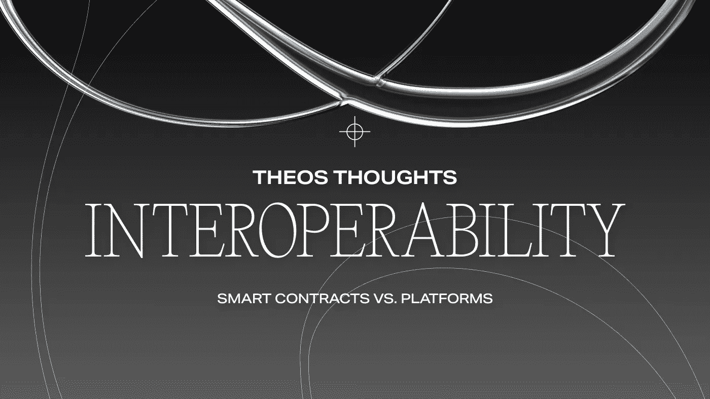

# 互操作性:智能合约与平台

> 原文：<https://medium.com/coinmonks/interoperability-smart-contracts-vs-platforms-90d2ed5c4bfd?source=collection_archive---------35----------------------->

区块链每天都在处理互操作性问题。无论是从一个区块链到另一个交换加密货币，从一个市场到另一个市场销售 NFT，还是从一个 dApp 到另一个 dApp 的简单文件共享，互操作性是 Web3 的下一个飞行前沿。NFT 版税设置是去中心化创作者经济未来的一个标志。

**TL；博士:**

*   区块链每天都在处理互操作性问题。
*   DeFi 项目需要权衡传统金融的成本、安全性、分散性和可扩展性。
*   只要 NFTs 的智能合约在不同平台之间兼容，就不会有问题。但真正的问题是，当非功能性金融交易从一个地方转移到另一个地方时，它们的智能合约就失效了。

DeFi 项目需要权衡传统金融的成本、安全性、分散性和可扩展性。最后一个特征，可伸缩性，承担了回答不同链之间互操作性的普遍关注的负担。想想这样的任务:把你的 NFT 从一个市场转移到另一个市场，或者在一个连锁店生产非功能性食品，然后在另一个连锁店销售。

但是对于 DeFi 项目来说，要实现互操作性并实现不同区块链之间的无缝交互，他们需要与可信的第三方(oracles 或 exchanges)合作或创建解决方案。果然，去中心化的生态系统已经产生了几个可互操作的解决方案和概念——中继、汇总、公证方案和区块链的区块链(BoB)等等。

互操作性背后最近的一个问题是版税设置。如果用户可以打造他们的 NFT，并将其从一个 NFT 市场无缝地带到另一个市场——从一个连锁店到另一个连锁店——你会认为 NFT 的生态系统现在已经爆炸了。但是，寻找区块链如何在彼此之间转移资产和信息的探索仍然盛行。

由于非专利技术在 2020-2021 年爆发，NFT 生态系统中讨论最多的特征之一是其智能合同中的版税设置的潜力。NFT 热潮的所有用户——NFT、市场、NFT 社区、密码创意者、NFT 创造者、NFT 收藏家——应该被孤立在一个单一的本地平台上吗？

# 让我们看看以太坊

一群合作的开发者正在构建加密生态系统，以太坊社区认为有必要的话，他们会把这个行业塑造得最好。这就是 NFT 景观如何在提议/改进的基础上利用以太坊生态系统的所有更新和实现。

“ERC”和“EIP”听起来熟悉吗？EIP 是以太坊社区开发者可以进一步发展成 ERC 或标准的改进建议。ERC 标准在所有基于以太坊的元素中实现和更新。可以把它想象成一个协作改进中心来调整以太坊相关的方面。

在版税方面，EIP-2981 是目前最受欢迎的。这是许多 NFT 平台(并非全部)中最受欢迎的版税 EIP。为什么？它兼容 NFT 标准、ERC-1155 和 ERC-721(多令牌标准和不可替换令牌标准)

问题是这些令牌的智能合约本身并不理解*交易*的概念；它们被设定为预设条件。智能合约本身没有办法确定转让实际上是不是销售。这就是问题所在。在没有 NFT 版税标准的情况下，大多数 NFT 版税都受制于它们所在的 NFT 市场制定的条件，甚至更糟，被禁锢在它们的铸造地。

那么，NFTs 的地位如何呢？目前，平台间的互操作性是更重要的问题。只要 NFTs 的智能合约在不同平台之间兼容，就不会有问题。但真正的问题是，当非功能性金融交易从一个地方转移到另一个地方时，它们的智能合约就失效了。因为每个人都擅长不同的区块链，不同的智能合同，不同的社区版税设置或回报，这是一个价值互联网是否能保持其未来承诺的问题:在区块链不可知的生态系统内无缝的互操作性。

# 结论

鉴于互操作性是一个平台兼容性问题，而不是智能合同设置问题——不管是不是版税问题——web3 现在面临着从互联网协议协会转向分类账间协议世界的挑战。如果人们可以假设有一个共同的愿景，将绝对的权力下放给所有的区块链项目，这将需要大多数，如果不是所有的项目，是区块链不可知论者。希望有些人不会比其他人更“不可知论”。

***关于 THEOS:****THEOS 生态系统由我们传统金融协会和区块链名家团队共同管理和维护。我们设想了一种新的思考、铸造和交易 NFT 的方式，并开发了我们认为将成为下一代社区管理的 NFT 平台。*

关注我们的社交媒体渠道，了解最新消息:

*   电报公告—[https://t.me/theos_fi_announcements](https://t.me/theos_fi_announcements)
*   电报官方社区—[https://t.me/theos_fi](https://t.me/theos_fi)
*   推特—[https://twitter.com/theos_fi](https://twitter.com/theos_fi)
*   不和谐—[https://discord.gg/aMdWsXFzBt](https://discord.gg/aMdWsXFzBt)
*   insta gram—[https://www.instagram.com/theos.fi/](https://www.instagram.com/theos.fi/)

> *加入 Coinmonks* [*电报频道*](https://t.me/coincodecap) *和* [*Youtube 频道*](https://www.youtube.com/c/coinmonks/videos) *了解加密交易和投资*

# 另外，阅读

*   [Bookmap 评论](https://coincodecap.com/bookmap-review-2021-best-trading-software) | [美国 5 大最佳加密交易所](https://coincodecap.com/crypto-exchange-usa)
*   最佳加密[硬件钱包](/coinmonks/hardware-wallets-dfa1211730c6) | [Bitbns 评论](/coinmonks/bitbns-review-38256a07e161)
*   [新加坡十大最佳加密交易所](https://coincodecap.com/crypto-exchange-in-singapore) | [购买 AXS](https://coincodecap.com/buy-axs-token)
*   [红狗赌场评论](https://coincodecap.com/red-dog-casino-review) | [Swyftx 评论](https://coincodecap.com/swyftx-review) | [CoinGate 评论](https://coincodecap.com/coingate-review)
*   [投资印度的最佳密码](https://coincodecap.com/best-crypto-to-invest-in-india-in-2021)|[WazirX P2P](https://coincodecap.com/wazirx-p2p)|[Hi Dollar Review](https://coincodecap.com/hi-dollar-review)