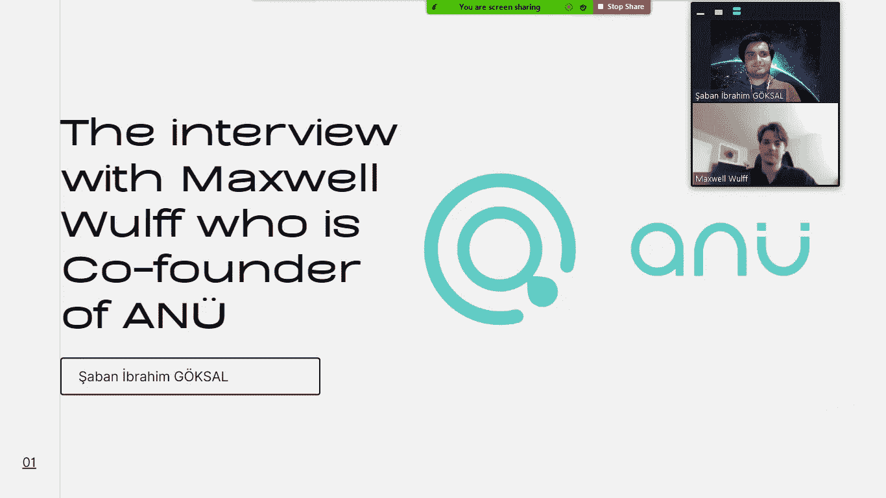
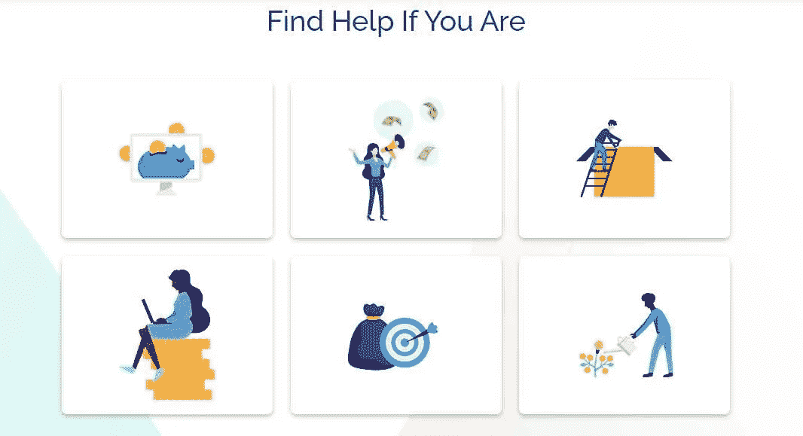
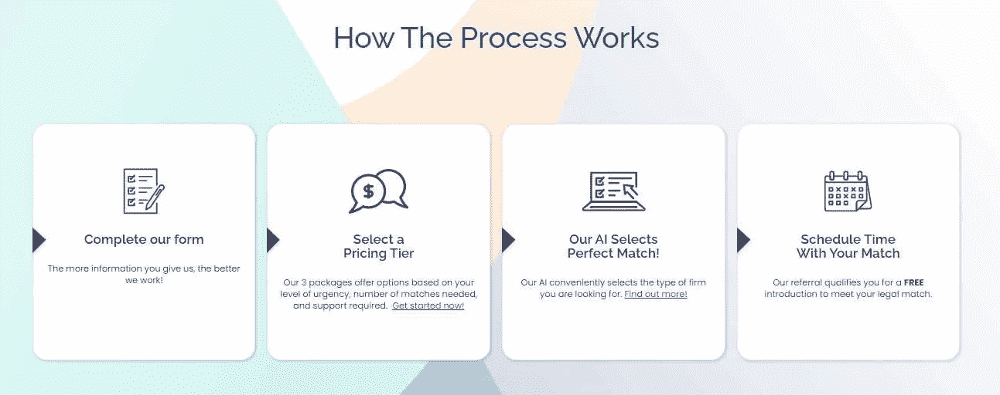

# 采访 Maxwell Wulff-legal tech/启动文件“anü”

> 原文：<https://medium.com/coinmonks/interview-with-maxwell-wulff-legaltech-start-up-file-an%C3%BC-75a1e13e383c?source=collection_archive---------41----------------------->

**简介**

2020 年，美国两位年轻的企业家宣布了一个法律技术初创公司，它的名字叫 anü。由于人工智能支持的软件，这家初创公司在刚刚步入生态系统的企业家和该领域的专家律师之间发挥了桥梁作用。需要法律支持的企业家通过他们可以在 anü网站上轻松填写的表格向该系统提交其企业的详细信息和他们需要的法律问题，该系统通过这些数据在企业家和最符合他们需求的法律专家之间进行匹配。由于它包含的人工智能算法，系统可以执行这种匹配。在准备人工智能算法时，输入了由数千个数据集组成的学术数据，以便人工智能以最有效的方式工作。这样，人工智能通过最小化误差来执行该过程。这家像桥梁一样为企业家和律师提供沟通的初创公司，在成立一年后，决定于 2021 年年中关闭。anü的创始合伙人 Maxwell Wulff 在我对他的采访中，评价了这个想法的产生，它蕴含的潜力，发展的过程，以及在这个过程中遇到的困难。

*anu 是怎么产生的，在和你的伙伴准备这个项目时，你的目标和未来的目标是什么？*

我们和我的搭档蒂亚尼·马约卡一起想出了 ANU 这个主意。她在南非完成了法律教育，目前正在康奈尔大学学习法律、技术和创业，我正在同一所大学攻读工程硕士学位。在与我的合作伙伴一起进行学校项目时，我们注意到这方面的不足，并开始集思广益，看看可以做些什么。创业者，尤其是我们这个年纪的，在环境上是很差的。在实施一个初创企业时，你需要考虑所有的细节，并创建一个有用的商业模式，而这些细节中最重要的是法律阶段。在我们的圈子里，我们听到很多人说，没有律师的企业家在这方面遇到了问题，我们实施了 anü的想法，以找到解决这一问题的办法。我们的目标是把这个领域真正的专家和需要法律支持的企业家聚集在一起。我们从这个项目一开始就知道，企业家不知道他们在哪个阶段或在哪个领域需要法律支持。anü的人工智能分析法律问题，并匹配该领域最好的律师和企业家，这要归功于企业家在申请这项服务时填写的表格。为了将律师和企业家联系起来，我们与专门从事这一领域的公司建立了合作伙伴关系。我们未来的目标是进一步开发 anü，并在美国广泛推广。我们从这个项目一开始就知道，企业家不知道他们在哪个阶段或在哪个领域需要法律支持。anü的人工智能分析法律问题，并匹配该领域最好的律师和企业家，这要归功于企业家在申请这项服务时填写的表格。为了将律师和企业家联系起来，我们与专门从事这一领域的公司建立了合作伙伴关系。我们未来的目标是进一步开发 anü，并在美国广泛推广。我们从这个项目一开始就知道，企业家不知道他们在哪个阶段或在哪个领域需要法律支持。anü的人工智能分析法律问题，并匹配该领域最好的律师和企业家，这要归功于企业家在申请这项服务时填写的表格。为了将律师和企业家联系起来，我们与专门从事这一领域的公司建立了合作伙伴关系。我们未来的目标是进一步开发 ANU，并使其在美国广泛应用。由于企业家在申请这项服务时填写的表格，它分析了法律问题，并为企业家匹配该领域的最佳律师。为了将律师和企业家联系起来，我们与专门从事这一领域的公司建立了合作伙伴关系。我们未来的目标是进一步开发 anü，并在美国广泛推广。由于企业家在申请这项服务时填写的表格，它分析了法律问题，并为企业家匹配该领域的最佳律师。为了将律师和企业家联系起来，我们与专门从事这一领域的公司建立了合作伙伴关系。我们未来的目标是进一步开发 anü，并在美国广泛推广。

*能否介绍一下安奴的工作方法和人工智能算法？*

anü将申请该系统的企业家与该领域的专家律师进行匹配，这要归功于人工智能算法和他收到的关于其企业的详细信息。这里的重点是比赛的成功以及这种成功背后的秘密；人工智能算法。众所周知，人工智能算法的工作逻辑在于深度学习方法。得益于输入人工智能系统算法的数据集，它执行深度学习，并执行你想要从中获得的操作，得益于它从这种学习中获得的能力。你上传给算法的数据集越清晰准确，成功率就越高。这就是 anü成功背后的秘密，事实上，它包含的人工智能算法工作效率高，误差幅度尽可能低。在疫情期间，我们夜以继日地工作了 8 个月，以使这一系统发挥作用。作为数据分析师，我整理数据，我的合伙人收集最好的学术数据作为原始数据，我们的软件开发人员编写 anü。

*您能告诉我们您在开发 ANU 并使系统投入运行时遇到的问题和困难吗？*

对我们来说，准备系统、编写人工智能算法和收集数据集并不是一个容易的过程，我们夜以继日地工作了 8 个月来揭示 anü。这个过程是我们喜欢的，而不是一个挑战，但后来，当我们使系统工作时，我们遇到了一些困难。其中之一；在企业家和法律专家之间进行匹配后，它无法将他们保留在系统中。因为我们没有规划未来的模式。在开始的时候，我们只专注于想法和以最好的方式开发系统，也许我们没有创造出一个成功的商业模式。为了让 anü工作，我们要么需要在比赛后将双方留在系统中，要么需要更多的企业家获得服务。但在美国，我相信在其他国家也是如此，发展你的品牌并扩展到更多领域实际上比发展这个想法更困难，这一困难导致我们关闭了 anü。此外，我们在开发系统并使其发挥作用时遇到的法律义务和税务义务给我们带来了很大的压力。在美国，费用分享给一个刚刚起步的初创企业带来了严重的财务负债。

*你如何看待美国和世界其他国家的法律技术生态系统，这个生态系统在世界经济中的份额与日俱增，你认为当我们完成 21 世纪时，这个份额会增加多少？*

技术发展非常迅速，法律生态系统必然会跟上。但是在美国，legaltech 生态系统非常非常小，与外界的看法相反。可能在某个欧洲国家或者以色列，这个生态系统更发达，规模更大。尽管有需求、需要、发展中的技术和经济，这个生态系统处于一个比它应有的状态小得多的状态。这有很多原因；机构抵制技术发展，没有注意到技术的发展，只在简单的办公室工作中使用这个生态系统，等等。我可以部分地从法律生态系统的角度来看待 legaltech，技术正在开发人工智能、区块链、智能合同、加密货币，但这个生态系统的参与者并没有将 legaltech 超越仅仅用于简单的办公室工作。随着技术的发展，这个生态系统需要改进，我确信这个生态系统在世界经济中的份额将在 21 世纪中叶增加一倍或两倍。

[*你可以访问链接阅读土耳其语的文章……*](https://www.ikonionhukukvekariyerdernegi.com/post/maxwell-wulff-ile-rop%C3%B6rtaj-an%C3%BC)

**参考文献**

1.  [https://goanu.co/](https://goanu.co/)
2.  [https://www . lawsitesblog . com/2020/11/new-service-uses-ai-to-help-startups-connect-with-the-right-lawyer . html](https://www.lawsitesblog.com/2020/11/new-service-uses-ai-to-help-startups-connect-with-the-right-lawyer.html)
3.  [https://www . lawsitesblog . com/2021/06/legal-tech-startup-anu-shuts-down-used-ai-to-connect-startups-to-lawyers . html](https://www.lawsitesblog.com/2021/06/legal-tech-startup-anu-shuts-down-used-ai-to-connect-startups-to-lawyers.html)

> *加入 Coinmonks* [*电报频道*](https://t.me/coincodecap) *和* [*Youtube 频道*](https://www.youtube.com/c/coinmonks/videos) *了解加密交易和投资*

# 另外，阅读

*   [有哪些交易信号？](https://coincodecap.com/trading-signal) | [Bitstamp vs 比特币基地](https://coincodecap.com/bitstamp-coinbase) | [买索拉纳](https://coincodecap.com/buy-solana)
*   [ProfitFarmers 回顾](https://coincodecap.com/profitfarmers-review) | [如何使用 Cornix 交易机器人](https://coincodecap.com/cornix-trading-bot)
*   [十大最佳加密货币博客](https://coincodecap.com/best-cryptocurrency-blogs) | [YouHodler 评论](https://coincodecap.com/youhodler-review)
*   [MyConstant Review](https://coincodecap.com/myconstant-review) | [8 款最佳摇摆交易机器人](https://coincodecap.com/best-swing-trading-bots)
*   [MXC 交易所评论](/coinmonks/mxc-exchange-review-3af0ec1cba8c) | [Pionex vs 币安](https://coincodecap.com/pionex-vs-binance) | [Pionex 套利机器人](https://coincodecap.com/pionex-arbitrage-bot)
*   [我的密码交易经验](/coinmonks/my-experience-with-crypto-copy-trading-d6feb2ce3ac5) | [《比特币基地评论》](/coinmonks/coinbase-review-6ef4e0f56064)
*   [CoinFLEX 评论](https://coincodecap.com/coinflex-review) | [AEX 交易所评论](https://coincodecap.com/aex-exchange-review) | [UPbit 评论](https://coincodecap.com/upbit-review)