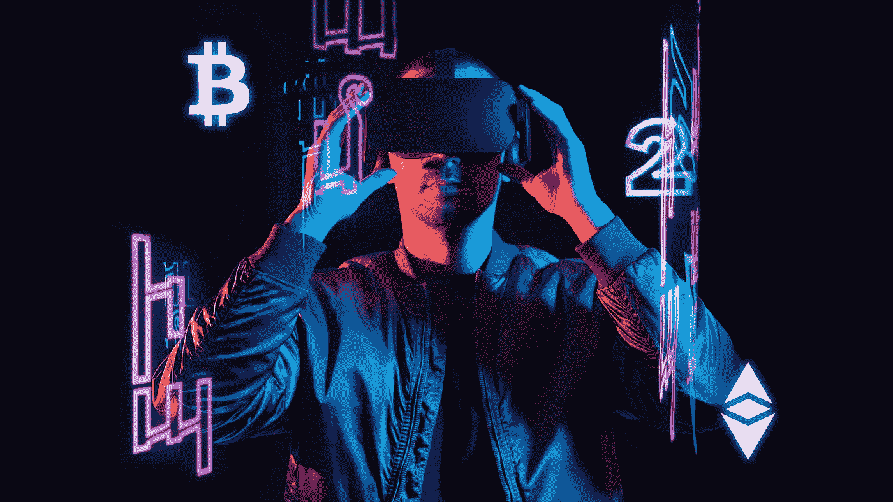
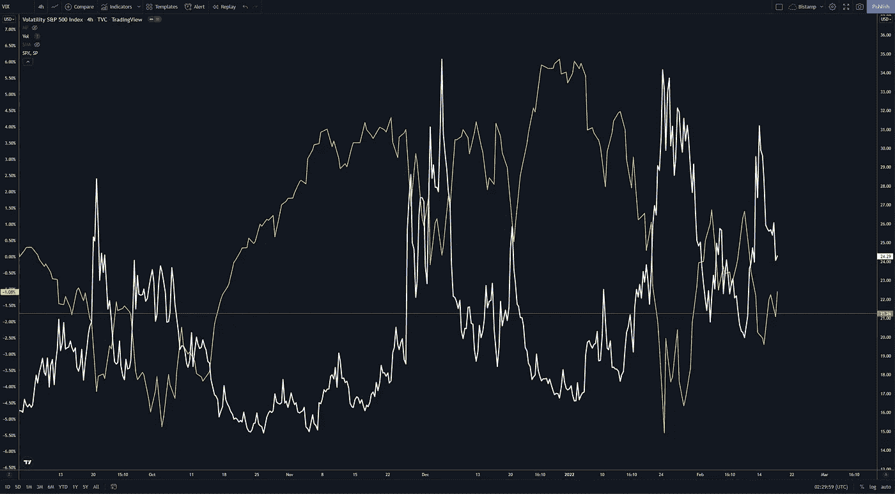
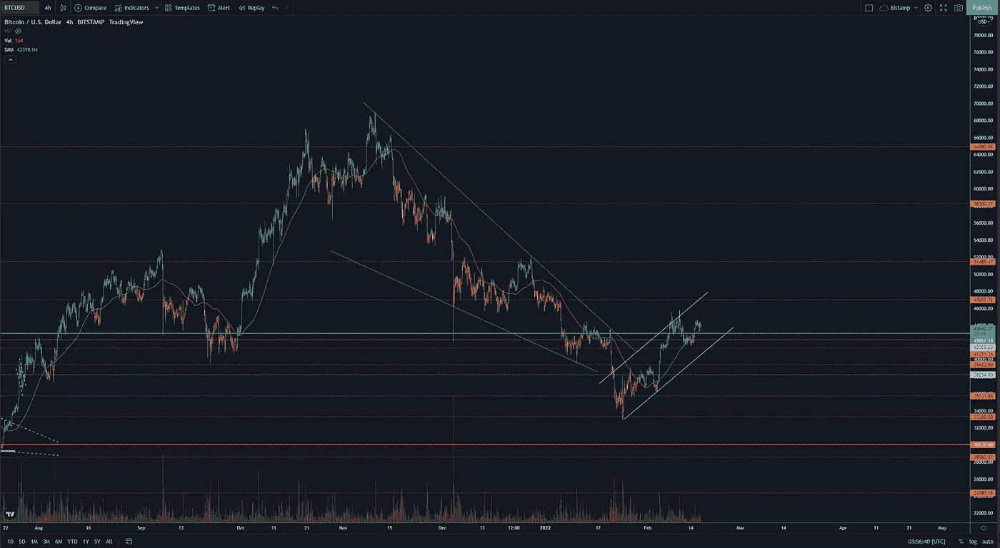
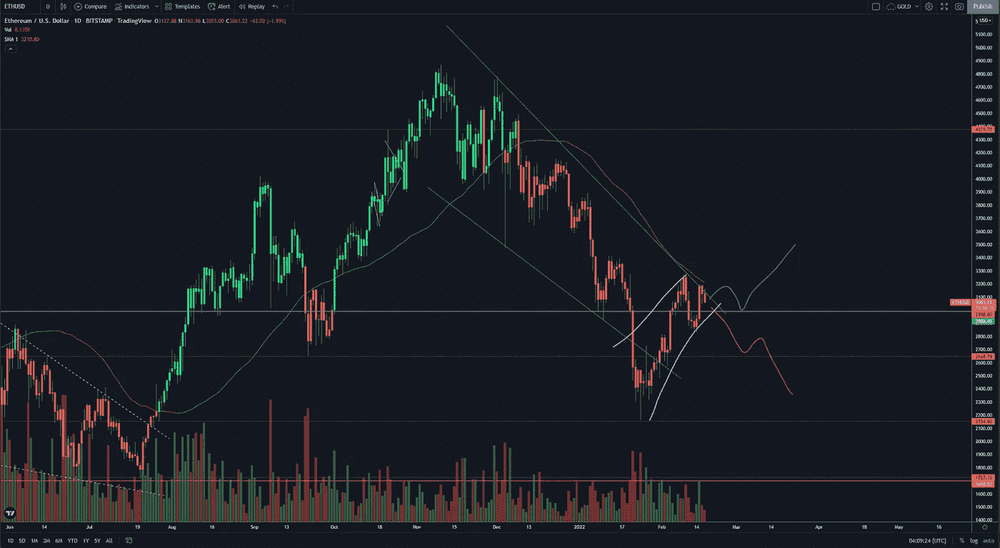
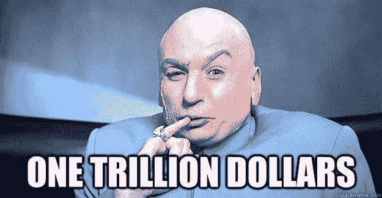

# 进入元宇宙…

> 原文：<https://medium.com/coinmonks/into-the-metaverse-69d60e3ad21c?source=collection_archive---------21----------------------->

欢迎回到 [SINEGY](http://sinegy.com) 的市场分析日记，现在在我们的媒体页面上。

Into the Metaverse — Virtual Reality (VR)

每周我们的目标是提供最新的加密新闻和市场动向的准确分析，以教育和帮助我们的读者导航他们的加密之旅。

在我们开始加密之前，值得注意的是，在全球范围内，金融市场的情绪目前处于不稳定状态，因为地缘政治担忧和收紧货币政策的担忧突显出来。

*   加拿大应对卡车司机罢工的紧急法案(供应链)
*   俄罗斯和乌克兰(战争/能源)
*   疫情限制(生产力/旅行)
*   美联储缩减规模、通胀、加息周期(紧缩货币政策)

当我们看我们最喜欢的指标 VIX 波动率指数时，这些宏观经济担忧就显而易见了。

自去年 11 月以来，VIX 一直很活跃，表明全球最大、最重要的股票市场美国股市的波动性有所上升。

**注意:高 VIX 环境**

VIX (White) vs. US Equities (Yellow)

当 VIX 指数高于 21 时，金融市场的反应是消极的，因为恐惧情绪普遍存在。相反，当 VIX 低于 21 时，市场往往会更快乐，并呈现积极趋势。这在上面的图表中显而易见，该图表显示了 VIX 和标准普尔 500 之间的负相关关系。

因此，作为交易者，当在高波动率环境(VIX>21)中交易时，我们应该非常谨慎，因为波动性和“磁带炸弹”(市场移动标题)导致剧烈波动的可能性很高——使用杠杆是危险的。

谈到加密，让我们来看看两大巨头的情况:

# **比特币**

随着地缘政治和货币政策风险的上升，市场处于避险模式，市场情绪总体上是悲观的。在这种背景下，BTC 在加密市场再次领先，因为恐惧的投资者从高风险的替代硬币转移到稳定和主要的硬币，如 BTC 和 ETH。

BTCUSD 4H — Rotating out of the Bull Flag?

我们目前正在考虑 BTC 的两种情况

*   蓝色大牛旗
*   4H 图上的小白熊旗。

市场正处于一个决策点，我们会看到蓝色牛市旗成功，价格向上旋转，以至于白色熊市旗结构失败，并演变成一个上升趋势吗？

或者我们会看到白熊旗价格下跌，引发另一波大米价格下跌，回到 30 年代吗？

这两种情况都有可能让你为这两种可能性制定交易计划。

# **以太坊**

ETH 的情况非常相似。

ETHUSD Bull flag or Bear Market?

当市场如此不稳定时，交易计划和冷静的情绪非常重要。如果你正在参与这些高波动率指数的交易，请确保关注你的新闻！。

如果你不能双向参与，考虑静观其变，直到一个强大的趋势出现。

# **进入元宇宙**

尽管宏观经济条件导致悲观情绪，但像 NFTs、DEFI 和元宇宙这样的秘密主题继续成为主流新闻。

本周，摩根大通继上个月题为 [*【元宇宙】*](https://www.jpmorgan.com/content/dam/jpm/treasury-services/documents/opportunities-in-the-metaverse.pdf) 中的*机遇的报告之后，发布了一份[巨大公告](https://www.coindesk.com/business/2022/02/15/jpmorgan-is-the-first-bank-into-the-metaverse-looks-at-business-opportunities/)。*

世界上最大的银行在分散地开设了一个休息室，这是一个元宇宙的生态系统，运行资金为 10 亿美元。

摩根大通认为虚拟房地产是一个万亿美元的机会。

Jamie Diamond on Virtual Real Estate ; )

一家银行的首席执行官给 crypto 打上了著名的庞氏骗局的烙印，并威胁要解雇任何发现交易它的员工，这是一个巨大的转变！

虚拟房地产是一个有趣的话题，许多人发现很难超越这样一个概念，即因为它是数字化的，所以没有供应限制..也就是说，你可以编码更多的土地！

然而，将会有一个“赢得”人气投票的元宇宙，大多数人选择建立或编码的生态系统(例如，苹果与安卓)，就像 Ready Player One 中的绿洲。

最酷的虚拟现实服务的普及和访问将决定数字步行交通，而用于进入的密码(如 Mana)的价格将限制建设和供应。

但是虚拟房地产与真实房地产的不同之处在于房地产是关键。

进入 VRE 不依赖于你居住的国家，甚至不依赖于当地的交通联系——从而成倍地扩大了市场规模！

**DEFI**

随着非金融交易和去中心化金融越来越受欢迎，回报以及骗局/黑客也越来越多。

随着执法力度的加大，SEC 迟早会回答这些平台是否真正去中心化的问题。

在这些经常被描述为加密的新的狂野西部的市场中有大量的钱可以赚——但是要小心坏人和法律的长臂。

感谢阅读！

辛尼格

现在就在[能量市场](https://marketplace.sinegy.com/)开始交易吧！

> *加入 Coinmonks* [*电报频道*](https://t.me/coincodecap) *和* [*Youtube 频道*](https://www.youtube.com/c/coinmonks/videos) *了解加密交易和投资*

# 另外，阅读

*   [Bookmap 评论](https://coincodecap.com/bookmap-review-2021-best-trading-software) | [美国 5 大最佳加密交易所](https://coincodecap.com/crypto-exchange-usa)
*   最佳加密[硬件钱包](/coinmonks/hardware-wallets-dfa1211730c6) | [Bitbns 评论](/coinmonks/bitbns-review-38256a07e161)
*   [新加坡十大最佳加密交易所](https://coincodecap.com/crypto-exchange-in-singapore) | [购买 AXS](https://coincodecap.com/buy-axs-token)
*   [红狗赌场评论](https://coincodecap.com/red-dog-casino-review) | [Swyftx 评论](https://coincodecap.com/swyftx-review) | [CoinGate 评论](https://coincodecap.com/coingate-review)
*   [投资印度的最佳密码](https://coincodecap.com/best-crypto-to-invest-in-india-in-2021)|[WazirX P2P](https://coincodecap.com/wazirx-p2p)|[Hi Dollar Review](https://coincodecap.com/hi-dollar-review)
*   [加拿大最佳加密交易机器人](https://coincodecap.com/5-best-crypto-trading-bots-in-canada) | [库币评论](https://coincodecap.com/kucoin-review)
*   [用于 Huobi 的加密交易信号](https://coincodecap.com/huobi-crypto-trading-signals) | [HitBTC 审查](/coinmonks/hitbtc-review-c5143c5d53c2)
*   [如何在 FTX 交易所交易期货](https://coincodecap.com/ftx-futures-trading) | [OKEx vs 币安](https://coincodecap.com/okex-vs-binance)
*   [OKEx vs KuCoin](https://coincodecap.com/okex-kucoin) | [摄氏替代度](https://coincodecap.com/celsius-alternatives) | [如何购买 VeChain](https://coincodecap.com/buy-vechain)