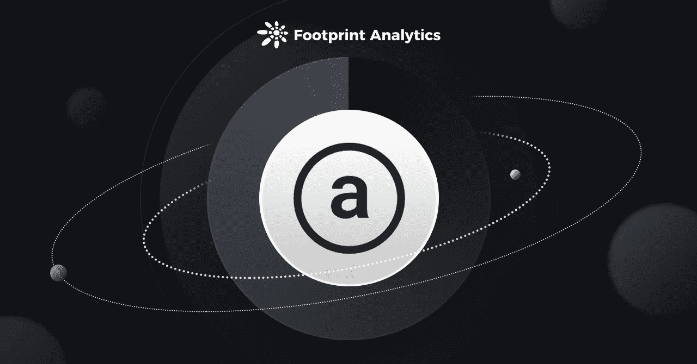
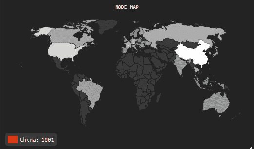
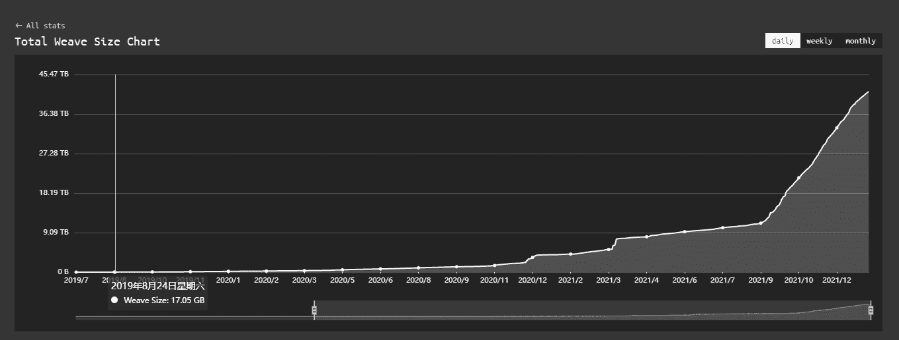
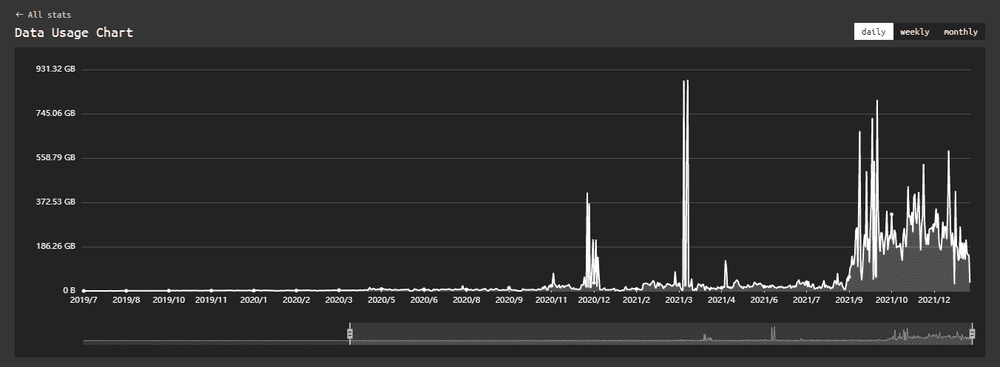
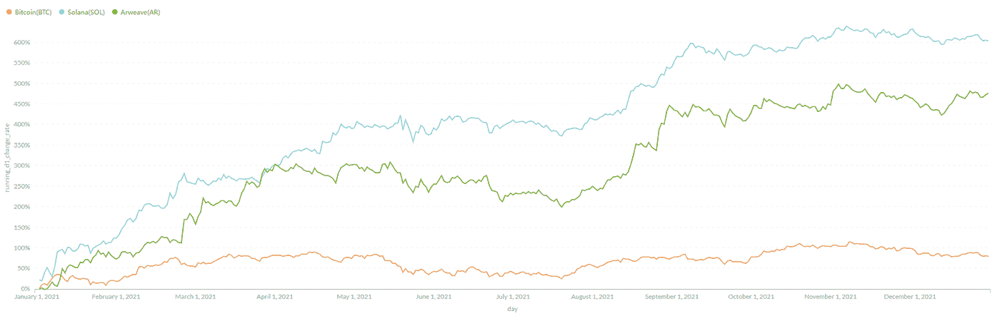
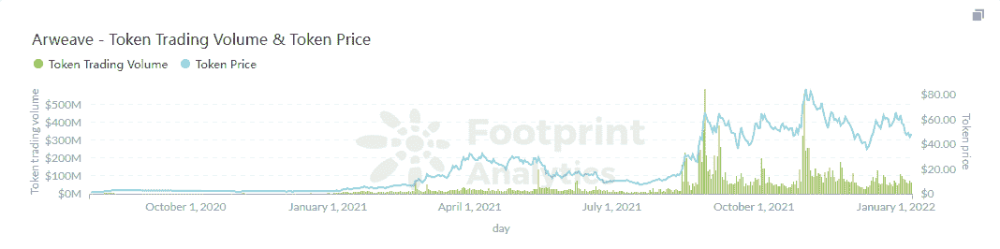

# 区块链云存储平台 Arweave 简介

> 原文：<https://medium.com/coinmonks/intro-to-arweave-a-blockchain-cloud-storage-platform-4b73f62336ea?source=collection_archive---------19----------------------->

Arweave 不仅仅是一个区块链云存储平台。

数据来源: [Arweave 仪表盘](https://www.footprint.network/guest/dashboard/arweave-fp-4c9dff09-7213-4022-9fe2-df0c0eccb88a?channel=u-apcVFj#secret=8CE7F8DAE34B576D1113542854CF8D07)

Arweave 是一个分散的云存储解决方案，旨在颠覆传统的存储市场，使用区块链，提供一次性付款和额外的安全优势。

如果成功，Arweave 将成为 Web 3.0 世界的顶级连锁店。在本文中，我们将解释 Arweave 的目标是什么。要了解更多关于区块链云存储和该项目的长期潜力，你可以在这里阅读这篇更高级的文章。

**什么是 Arweave？**

Arweave 的目标是创建一个系统，用户只需支付一次费用就可以永久保存他们的数据。为此，它创建了存储捐赠，以确保网络上的永久存储。当一条数据被写入 Arweave 网络时，用户支付一笔预付款，并以存储购买力的形式产生兴趣。

Arweave 还开发了 REST API 来开发各种文件存储应用，从而创建了它的生态系统。

【Arweave 有哪些创新？

商业模式

虽然 Filecoin 的商业模式类似于传统的集中式云服务，在用户和存储提供商之间建立一个按需付费的合同，但 Arweave 通过一次付费，永远存储的商业模式解决了长期数据存储的问题。

操作网络

Permaweb 是 Arweave 的 DApps 生态系统的运营网络。它为开发人员提供了极大的灵活性，并使 DApp 开发更加容易。开发者只需要使用一个基于存储共识范式的标准 API 进行开发，没有任何编程语言限制。

社区激励模式

使用 Blockweave 数据结构，Arweave 的矿工只需要存储部分历史块就可以立即开始挖掘，降低了挖掘门槛。

捐赠池激励矿商长期存储数据，利润分享允许开发者分享收入。

数据存储完整性

创新性的将 DApp 前端和智能合约融为一体，前端数据和合约数据为一体。

创新的原子 NFT 新标准允许 NFT 铸币和实际内容作为一个整体存储在链上。

节点分配

Arwearve 在全球拥有超过 1200 个节点，其中大部分位于中国。

增长

Arweave 生态系统在 2021 年增长到近 40 TB 的数据存储。

Arweave 网关数据使用量整体逐月上升，偶尔有大规模数据使用。

与索拉纳的深度合作

Solana 每年生成高达 4 PB(或 4，096 TB)的数据。

Arweave 和 Solana 合作推出了太阳能桥，将于 2021 年正式上市。SOLAR Bridge 经过定制，使 Solana 能够存储 Arweave 的永久网络数据，从而创建一个分散、易于访问、公开可用的存储解决方案，可以处理巨大的可扩展性。

通过成为 Solana 官方存储解决方案，Arweave 的增长趋势与 Solana token 价格相似。

[*Footprint Analytics — Token Price YoY Growth Trend: AR vs. SOL vs. BTC*](https://www.footprint.network/guest/chart/token-price-growth-yo-y-in-2021-btc-vs-sol-vs-ar-fp-d77bacf7-36ae-41e7-8c15-d4a631a12486?token_unique_symbol=Bitcoin(BTC)&token_unique_symbol=Solana(SOL)&token_unique_symbol=Arweave(AR)&day=2021-01-01~2021-12-31&channel=u-apcVFj#secret=A9BFCF478DF34102CEDC4B1A2D271D91)

令牌性能

[AR，Arweave 的代币](https://www.footprint.network/guest/chart/arweave-token-trading-volume-token-price-fp-8445a7eb-b1e0-42b6-b247-8f5e36b06392?channel=u-apcVFj)，从年初的 2.63 美元涨到 2021 年底的 5.38 美元，价格上涨了 21 倍。

[*Footprint Analytics — AR Token Price Peaked at $84.64 in 2021*](https://www.footprint.network/guest/chart/arweave-token-trading-volume-token-price-fp-8445a7eb-b1e0-42b6-b247-8f5e36b06392?channel=u-apcVFj)

存储价格

为了能够在 Arweave 上存储文件，开发人员创建了一个交易，支付一定数量的 AR 令牌作为网络费用(目前为 0.01 美元/MB)，以永久存储数据。同时，亚马逊 S3 的低端套餐每月收费 0.000023 美元/MB。每个 Arweave 用户需要 40 年才能达到收支平衡。这意味着 Arweave 用户要为永久存储支付额外费用。

如果令牌价格上涨，存储成本将会更高，需要更多时间才能实现收支平衡。

**总结**

Web 3.0 存储基础设施 Arweave 是一个分散的云存储解决方案，解决了随着时间的推移永久存储数据的问题。其网络和应用架构支持开发和数据存储作为一个整体，创建一个本地区块链数据解决方案。

**什么是足迹**

足迹分析是一个一体化的分析平台，用于可视化区块链数据和发现见解。它清理和整合链上数据，因此任何经验水平的用户都可以快速开始研究令牌，项目和协议。凭借一千多个仪表板模板和一个拖放界面，任何人都可以在几分钟内构建自己的定制图表。发掘区块链数据，利用足迹进行更明智的投资。

*足迹网址:*[*https://www . Footprint . network/*](https://www.footprint.network/)

*不和:*[*https://discord.gg/3HYaR6USM7*](https://discord.gg/3HYaR6USM7)

*碎碎念:*[*【https://twitter.com/Footprint_DeFi】*](https://twitter.com/Footprint_DeFi)

*Youtube:*[*https://www.youtube.com/channel/UCKwZbKyuhWveetGhZcNtSTg*](https://www.youtube.com/channel/UCKwZbKyuhWveetGhZcNtSTg)

> *加入 Coinmonks* [*电报频道*](https://t.me/coincodecap) *和* [*Youtube 频道*](https://www.youtube.com/c/coinmonks/videos) *了解加密交易和投资*

# 另外，阅读

*   [有哪些交易信号？](https://coincodecap.com/trading-signal) | [Bitstamp vs 比特币基地](https://coincodecap.com/bitstamp-coinbase) | [买索拉纳](https://coincodecap.com/buy-solana)
*   [ProfitFarmers 回顾](https://coincodecap.com/profitfarmers-review) | [如何使用 Cornix Trading Bot](https://coincodecap.com/cornix-trading-bot)
*   [十大最佳加密货币博客](https://coincodecap.com/best-cryptocurrency-blogs) | [YouHodler 评论](https://coincodecap.com/youhodler-review)
*   [my constant Review](https://coincodecap.com/myconstant-review)|[8 款最佳摇摆交易机器人](https://coincodecap.com/best-swing-trading-bots)
*   [MXC 交易所评论](/coinmonks/mxc-exchange-review-3af0ec1cba8c) | [Pionex vs 币安](https://coincodecap.com/pionex-vs-binance) | [Pionex 套利机器人](https://coincodecap.com/pionex-arbitrage-bot)
*   [我的密码交易经验](/coinmonks/my-experience-with-crypto-copy-trading-d6feb2ce3ac5) | [比特币基地评论](/coinmonks/coinbase-review-6ef4e0f56064)
*   [CoinFLEX 评论](https://coincodecap.com/coinflex-review) | [AEX 交易所评论](https://coincodecap.com/aex-exchange-review) | [UPbit 评论](https://coincodecap.com/upbit-review)