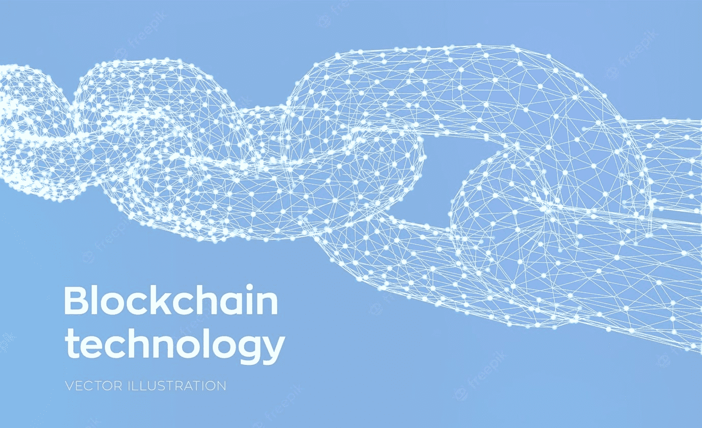
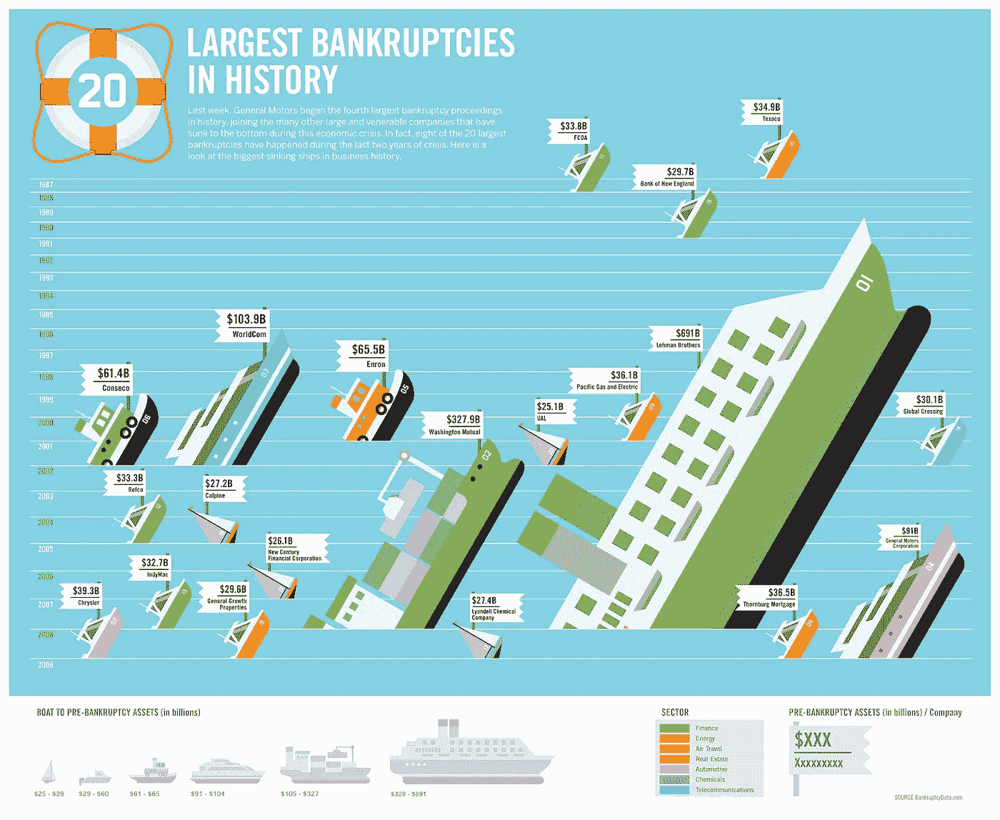

# 区块链简介

> 原文：<https://medium.com/coinmonks/intro-to-blockchain-75ec9a37587e?source=collection_archive---------21----------------------->

from [https://www.freepik.com](https://www.freepik.com/free-vector/block-chain-crypto-currency-blockchain-concept-3d-low-polygonal-chain-consists-network-connections-concept-digital-code-editable-cryptocurrency-template-vector-illustration_23757220.htm)

你好！！让我提出我的想法，介绍一下区块链。相反，往什么方向走？怎么会？为什么？让我倒过来说。首先，我们试图理解为什么我们需要区块链，然后让我们看看它是如何工作的。在此基础上，我会让你自己定义区块链是什么。

在开始之前，我只想声明，我在这里写的任何东西都是我从互联网上的不同资源中学到或听到的我自己的观点。反馈或批评总是受欢迎的

# 我们为什么需要区块链？

## 信任

早些时候(我的意思是直到 2008 年)我们需要信任银行来存钱或交易我们的钱。我们如何建立这种信任？在一段时间内，银行证明了它正在做我们期望他们做的正确的事情，有了这样的声誉，我们信任银行。但我们能肯定银行在未来一直表现良好吗？我们确定我们的交易没有被篡改吗？我们确定银行的债务是可控的吗？不确定！！众所周知的历史！！

在区块链的帮助下，我们可以消除单个实体中的信任，但这种信任是在一个容错的区块链网络上，其中所有的事务都有所有者的签名，而且没有人可以改变这些事务

## 点对点

在对等系统中，事务发生在一个节点到另一个节点之间，没有任何中介。以下是我们认为是对等的例子，但事实并非如此。

如果爱丽丝想把钱转给鲍勃，他们之间不能直接进行。这只能在中间银行的帮助下完成。如果我们想买房或租房，中间有一个经纪人。如果我们想买苹果，要经过中间商，我们不能直接从农场买。

有了区块链，交易可以点对点进行，不需要任何中介。

## 全球化

全球化是**一个用来描述贸易和技术如何使世界变得更加联系和相互依存的术语**。尽管我们已经实现了全球化，但除了在印度，我不能在任何地方使用印度卢比。这同样适用于所有国家的货币。

有了加密货币(区块链的应用之一)，我们可以在世界上任何有互联网连接的地方进行交易。

## 审查制度

私人实体或政府有权审查他们认为令人不快的任何东西。作为消费者，我们可能有权也可能无权质疑这一点，因为我们都知道“条款和条件适用”。

区块链是抗审查的，没有一个实体可以做出决定。

## 分散

让一个实体拥有我们所有的数据是个好主意吗？如果我们拥有自己的数据就好了，对吗？区块链来拯救我们了。

在区块链的帮助下，我们可以将我们的资源分散到世界各地。美妙之处在于，即使一个节点幸免于任何灾难，区块链也可以从该点开始操作，并传播到世界各地。所以它是分散的，也是容错的。这是双赢！！

## 所有权

我们有可能拥有自己在社交媒体上发布的内容吗？有了区块链，很有可能以 NFT 的形式拥有我们的内容。美妙之处在于你甚至可以转让你的所有权。

# 它是如何工作的？

让我们了解一些关键术语，并在最后把所有的东西放在一个故事中

## 公钥和私钥

私钥是一个应该由所有者保密的随机数。公钥将从私钥中导出，并且不可逆转，可以与公众共享。尝试一下[这里](https://andersbrownworth.com/blockchain/public-private-keys/keys)。

## 签署

签名是借助我们的私钥将我们的签名添加到我们的数据中的过程。任何拥有我们公钥的人都可以验证签名。试试这里的。

## 混杂

哈希是哈希的结果。那么哈希是什么呢？哈希是一种加密技术，在这种技术中，我们可以输入数据，并获得固定长度的输出，该输出不能还原为数据。试试这里的。

## 街区

数据块是一个容器，它包含一组事务、随机数、时间戳和前一个数据块的哈希(作为最低要求),并且基于不同区块链的实现，存储在数据块中的数据可能会有所不同。

## 一致性算法

共识算法(consensus algorithm)是一种预定义的算法，通过这种算法，区块链网络中的每个人都可以就区块链的当前状态达成**共同协议**。共识算法确保添加到区块链的每个新区块都是区块链中所有节点一致同意的唯一版本的真相。

## 采矿

在区块链采矿意味着验证一个区块中的所有交易，并将其添加到区块链中。如何开采一个区块？我们需要对数据块的数据进行哈希运算，得到一个小于网络同意的某个预定义值的值。相信我，没那么容易。开采一枚比特币需要 143，000 千瓦时的能量，这足以让一台笔记本电脑运行 3000 多年。

**注:** *采矿特定于区块链，遵循工作证明(POW)共识算法*

现在让我们来讨论一下区块链的整个故事。当爱丽丝和鲍勃之间发生任何交易时，发起交易的人将签署交易数据并将其发布到区块链网络。交易可以是任何事情，如资金转移、所有权转移或任何状态改变。因为事务是由所有者用他们的私钥签名的，所以事务不能被篡改。任何人都可以用所有者的公钥来验证签名。

负责挖掘块的挖掘者将通过用所有者的公钥验证签名来包括该事务以及块中的一组事务，并挖掘该块以将其添加到链中。矿工将获得加密货币形式的奖励。这种对矿工的激励将有助于区块链以更安全的方式前进。

每个区块链都有自己定义的数据块时间间隔，每个数据块都将在此时间间隔添加。当一个拥有更多散列能力的矿工在块时间内不断添加块时会发生什么？众所周知，区块链不喜欢中央集权，区块链将根据区块增加的速度来调整开采难度，这样就不会有任何一个矿工从中获利，这也决定了区块链的安全。

区块链的另一个主要特征是，每个块都有前一个块的散列，这就是链的增长方式。因此，如果任何人试图篡改链之间的一个数据块中的数据，那么他必须再次挖掘更多的数据块，同时链也在增长，所以黑客攻击链并非不可能，但黑客攻击的成本超过了激励。

基于应用和实现，不同的区块链以它们自己的方式运行。

## **区块链的一些有趣的使用案例**

我们已经讨论了加密货币等用例，NFT，让我们在这里讨论其他有趣的用例。

*   *供应链监控* —如果我们存储产品如何从区块链的制造商转移到零售商或消费者的所有记录，我们可以确保真正的原始产品被交付给消费者。 [Everledger](https://everledger.io/) 是解决方案提供商之一。
*   *数据存储* —区块链允许我们以去中心化的方式存储我们的数据，而不是存储在第三方云存储中。如果我们有多余的硬盘空间，我们也可以为数据存储做出贡献并获得奖励。查看[新航网](https://sia.tech/)和 [filecoin](https://filecoin.io/) 。
*   *Web 托管* —区块链允许我们以分散的方式托管静态 Web 应用程序，以便我们的应用程序始终正常运行。查看[班次](https://shiftnrg.org/)和[天网](https://support.skynetlabs.com/)。
*   *VPN —* 我们不再依赖单个服务器来提供 VPN(虚拟专用网络)解决方案，而是将它分散开来，我们中的每一个人，只要有互联网连接，都可以提供 VPN 解决方案，并因此获得奖励。查看神秘网[。](https://www.mysteriumvpn.com/)

还有很多其他的用例，比如分散式域名系统、分散式金融(DEFI)、分散式自治组织(DAO)、数字投票等。，不想在此多拖，请大家本着自己的兴趣去查阅。

# 现在我们来“什么是区块链？”

我在谷歌搜索的时候找到了一些定义。如果我想把它定义为一个标准，

> 区块链是一种共享的、不可变的分类账，有助于记录交易和跟踪商业网络中的资产。

如果我想把它定义为一个技术人员，

> 区块链是一个不断增长的记录列表，称为块，使用加密技术链接在一起。每个块都包含前一个块的加密哈希、时间戳和事务数据。

但是，我到目前为止所讨论的内容将提供一个基本的构建模块和对区块链的一般理解。因此，有了这些，你可以定义你自己对区块链的定义。

> 加入 Coinmonks [电报频道](https://t.me/coincodecap)和 [Youtube 频道](https://www.youtube.com/c/coinmonks/videos)了解加密交易和投资

# 另外，阅读

*   [AscendEx 保证金交易](https://coincodecap.com/ascendex-margin-trading) | [Bitfinex 赌注](https://coincodecap.com/bitfinex-staking) | [bitFlyer 审核](https://coincodecap.com/bitflyer-review)
*   [Bitget 评论](https://coincodecap.com/bitget-review) | [双子星 vs BlockFi](https://coincodecap.com/gemini-vs-blockfi) cmd| [OKEx 期货交易](https://coincodecap.com/okex-futures-trading)
*   [AscendEx Staking](https://coincodecap.com/ascendex-staking)|[Bot Ocean Review](https://coincodecap.com/bot-ocean-review)|[最佳比特币钱包](https://coincodecap.com/bitcoin-wallets-india)
*   [霍比审核](https://coincodecap.com/huobi-review) | [OKEx 保证金交易](https://coincodecap.com/okex-margin-trading) | [期货交易](https://coincodecap.com/futures-trading)
*   [网格交易机器人](https://coincodecap.com/grid-trading) | [Cryptohopper 审查](/coinmonks/cryptohopper-review-a388ff5bae88) | [Bexplus 审查](https://coincodecap.com/bexplus-review)