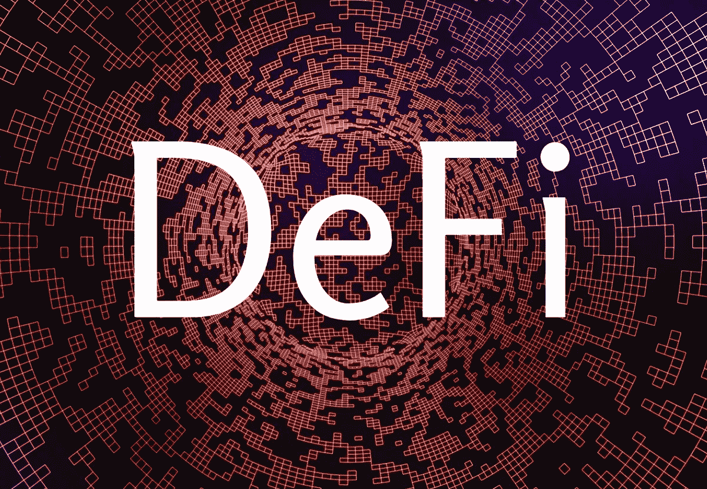
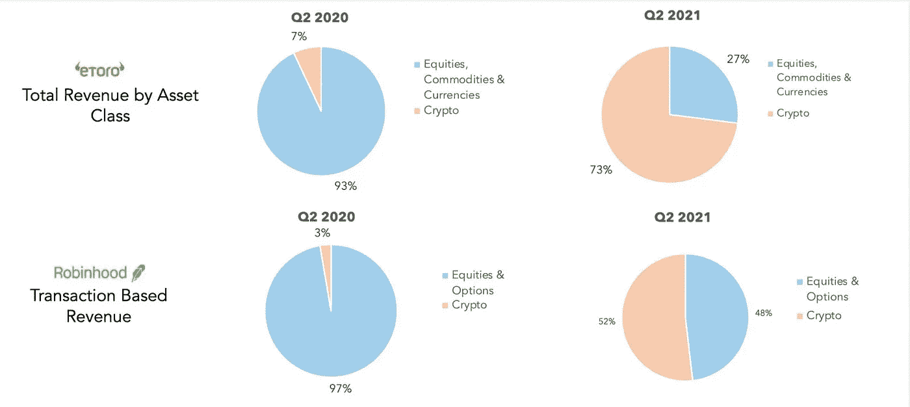
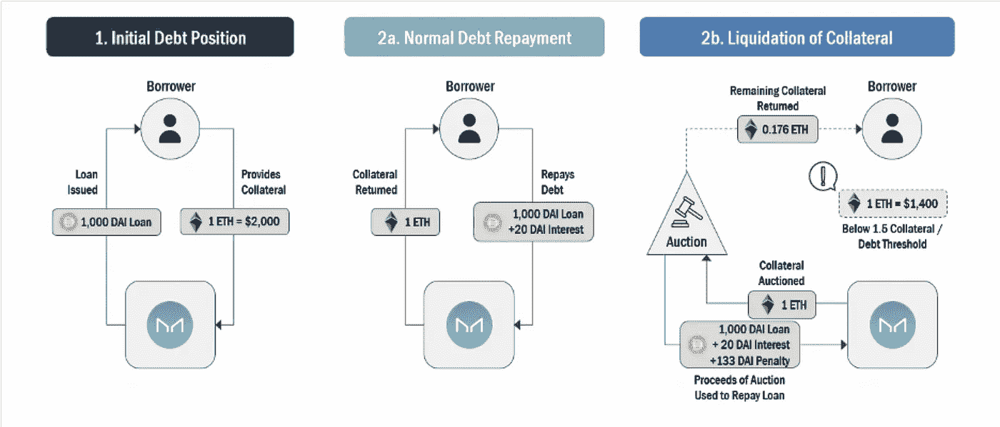
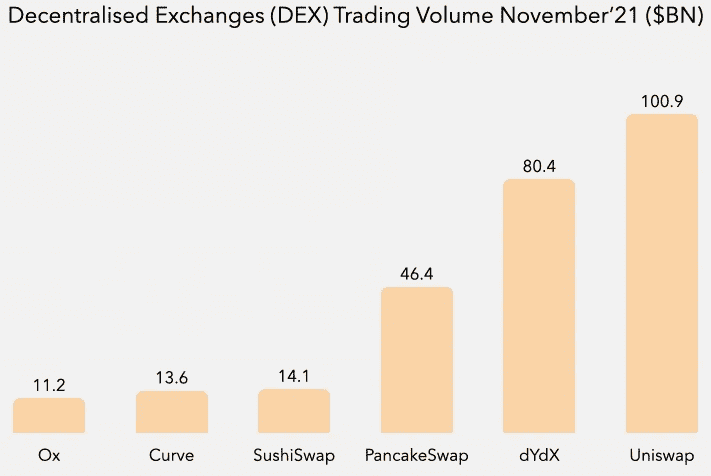
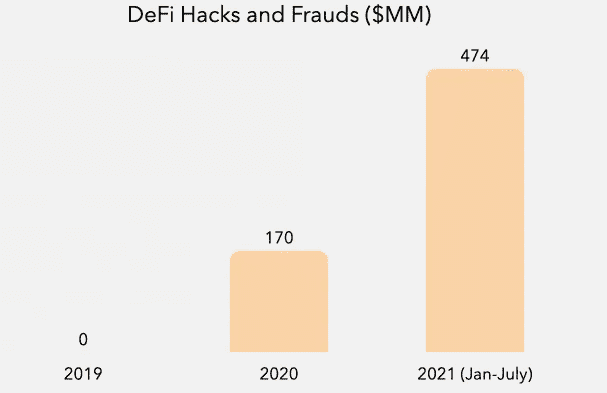
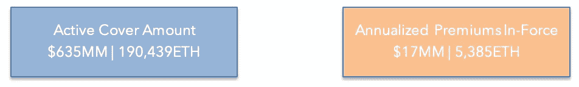

# 去中心化金融简介(DeFi)

> 原文：<https://medium.com/coinmonks/intro-to-de-centralized-finance-defi-6ee1802be3c9?source=collection_archive---------44----------------------->

加密空间继续呈指数增长，导致新的金融系统出现，并允许人们在没有集中中介的情况下跨境使用金融系统。让我们潜入 DeFi 的世界。

在过去的一年里，如果有人向你提到“加密货币”这个词，你会立即想到比特币、NFTs、DeFi 和/或以太坊。随着加密货币空间继续以指数速度增长，所有这些术语在世界各地都变得非常流行。随着这个领域的增长，我们已经看到一些真正奇怪的事情发生，例如[一只微笑的猴子被卖到 225 万美元](https://finance.yahoo.com/news/bored-ape-yacht-club-nft-111457016.html?guccounter=1&guce_referrer=aHR0cHM6Ly93d3cuZ29vZ2xlLmNvbS8&guce_referrer_sig=AQAAAEr04eRN67GH472Yk3qYLjn4p7rMKXeKhC0nb6Ux5xwmgTpRKInAkhz97AZXw7hPhZ0qcKbFEbmrH5HUiC2hWlAAxV87TE8Ji2rOJUZ7JwPxvogm5vmQOE5OOtjxSfCMIvKsYrjY5ok9K4SkedAQoQ_qKdGUVPqKScaJqs56j0Vi)、[通过 DeFi 协议锁定的抵押品总价值超过 2000 亿美元](https://news.bitcoin.com/total-value-locked-multiple-defi-chains-nears-200-billion-ethereums-tvl/)，在美国，我们看到传统的股票交易平台现在开始看起来像加密交易平台。

来源:公司文件

加密货币的普及已经为新的金融系统的出现让路，这种系统允许人们在没有中央中介的情况下跨境使用金融服务。

让我们深入去中心化金融的世界:

# **什么是 DeFi**

去中心化革命始于比特币，它为个人提供了非主权数字价值储存的固定供应。然而，任何稳健和可持续的金融体系都需要不止一种资产，其用户需要服务和产品，让他们能够将资本投入使用。这导致了分散金融的兴起。DeFi 是为各种利用加密货币或区块链技术的金融应用而构建的基础设施。正在构建的各种金融应用包括借贷平台、分散交易所(DEX)、stablecoins、保险和资产管理。目前由银行和金融机构组成的传统金融系统主要由中央数据库系统组成，其中充斥着收取高额费用的中间人、套牢、全球金融服务准入有限以及缺乏透明度。因此，DeFi 将使金融系统能够转变为基于开放源代码协议的开放金融经济，这种协议更易于跨境访问，中介更少，透明度更高。这些 DeFi 协议是使用可编程和可互操作的智能合约构建的，基本上，它们具有相似的技术标准，允许它们轻松地相互通信。

# **建在以太坊上的 DeFi】**

所有的 DeFi 应用程序都以代码的形式存在于区块链，主要是在区块链以太坊。本质上，以太坊是一个开源的基于区块链的分布式计算平台，用于构建分散的应用程序，由于其智能合约功能，它有更多的用例，而不仅仅是促进简单的交易。像大多数公开的区块链一样，以太坊是一个数字账本，允许多个实体持有其交易历史的副本，这意味着没有任何一方可以控制它，以确保完全透明。在传统金融领域，NSE 清算有限公司(国家清算公司)充当金融证券(即股票、债券等)的中央清算所。).类似地，以太坊区块链充当涉及代币和智能合约的交易的分散清算机构。既然我们已经更好地理解了 DeFi 的底层技术和应用程序是如何工作的，那么让我们来探索它们作为分散实体是如何工作的。

# **DeFi 协议作为分散式自治组织(DAO)运行**

大多数 DeFi 协议以 DAO(分散自治组织)的形式运行。道是总部设在区块链的组织，由其成员集体拥有和经营。组织的规则是基于智能契约定义和构建的，并执行协议操作和治理功能。在一个"一体行动"组织中，决策始于各成员中任何一个成员提出的提案，最终由记录在区块链上的成员投票决定。同样的方法被用来控制国库和决定这些组织如何花费他们的资金。DAO 不断增加的透明度使利益相关者有了更多的控制权，这与传统公司的等级结构形成鲜明对比。

# **DeFi 生态系统**

1.  *Stablecoins*

稳定币是一种加密货币，其价值与美元或欧元等稳定资产挂钩。稳定货币存在的原因是因为它作为交换媒介提供的效用，因为它有效地弥合了法定货币和加密货币之间的差距。稳定硬币可以最大限度地减少价格波动，使其成为合适的价值储存手段，鼓励其在日常交易中的使用，并提高加密资产的流动性。我们将关注三种不同类型的稳定账户，**托管账户、抵押担保账户和算法账户**。

**保管型** stablecoins，又称集中式 stablecoins，以持有的法定货币或优质流动资产作为储备。最受欢迎的保管稳定币之一是 Tether (USDT)，它是一种法定担保稳定币，据称由美元/欧元等法定货币支持。拥有 USDT 的个人可以将其兑换成法定货币，相应的数字债务就被销毁了。

**抵押品支持** stablecoins 使用智能合约来收集和清算加密货币或其他资产形式的抵押品。资产支持的稳定币是指平台保持的资产储备(即 ETH)明显大于流通中的总稳定币(即 DAI)，以确保系统免受加密货币价格波动的影响。

**算法**稳定货币试图通过代币供应的动态扩张和收缩来维持人民币与美元的挂钩。Fei 是一种算法稳定的货币，采用一种称为“重新加权”的技术来执行实际交易，然而，其大部分资产都是以加密货币持有的，因此在黑天鹅事件的情况下，资产价值可能会大幅下降。

1.  *借贷&借款*

DeFi 中的协议允许用户借出和借入他们的资产，然而，所有的 DeFi 借出协议都要求用户提供比他们借入的资产更高的抵押品。

最大的 DeFi 借贷平台之一是 MakerDAO。该平台使用 stablecoins 处理抵押贷款。Maker 协议允许用户通过锁定系统金库中价值更高的抵押资产，发行与美元挂钩的稳定货币 DAI。一旦发行了 DAI，保险库所有者就用他们的存款资产进行贷款，如果抵押品的价值降低到特定的阈值以下，协议会自动清算头寸以偿还未偿债务。然而，在正常情况下，保险库所有者偿还他们的原始贷款和利息，以重新获得对其抵押品的控制权。该平台目前支持各种抵押资产，包括各种加密货币、稳定货币和流动性代币。

来源:Messari.io

MakerDAO 平台的收入主要来自三个来源:

*   超额抵押贷款的利息收入
*   清算收入来自对清算金库收取的费用
*   来自挂钩稳定性模块(PSM)的稳定的货币交易费用

Peg 稳定模块(PSM)使用户能够以固定利率直接用给定的抵押品类型(如 ETH)交换 DAI，而不是借入 DAI。PSM 不允许用户保留资产的所有权，因为他们不是借用 DAI，而是直接用他们的资产交换 DAI，协议收取 0.1%的费用。

1.  **分散式交易所**

分散交易所(dex)是点对点市场，允许智能合约支持的两个相关方之间直接交换加密货币，同时允许用户保持对其资金的控制。dex 在传统的订单系统上使用了一种叫做自动做市(AMM)的系统。交易所通常会撮合个人买卖订单，然而，在 dex 中，用户可以将资产存入一个资金池，然后在该平台上进行交易。dex 上的资产价格是根据资产池中的资产比率确定的。

**分散交易协议资产负债表**

来源:梅萨里

全球使用最多的 DEX 之一是 **Uniswap** 。该平台使用自动做市商系统，该系统根据池中的供需情况调整上市资产的价格。Uniswap 运行在两种类型的智能合约上，一种是**交易所**合约，另一种是**工厂**合约。交换合同用于促进所有令牌交换(交易),工厂合同用于向平台添加新令牌。

[来源:令牌终端](https://www.tokenterminal.com/terminal/markets/exchange)

2011 年 11 月 21 日，Uniswap 的交易量超过 1000 亿澳元，是所有分散式交易所中最高的。有超过 35 个活跃的分散交易所，在所有平台上列出了 100 多项资产。

1.  *保险*

DeFi 平台锁定的总价值的增加表明，人们愿意在基于区块链技术的新平台上承担更高的风险。Nexus mutual 是一种点对点 DeFi，相当于传统的自由选择互助保险，提供类似保险的风险保护产品。随着越来越多的客户购买保险，就像传统金融中的股票回购一样，NXM 的治理标志被烧掉了。Nexus mutual 是一个建立在以太坊基础上的非托管保险协议，作为一个分散的自治组织(DAO)运行。通过持有代币加入 Nexus 社区的参与者自动成为会员，并可以选择购买针对智能合同失败和托管违约损失等风险的保险。在智能合同失败或托管违约损失的情况下，保险的支付通过社区投票决定。

[来源:CipherTrace 加密货币情报](https://ciphertrace.com/cryptocurrency-crime-and-anti-money-laundering-report-august-2021/)

由于 DeFi 的爆炸式增长和该领域的肮脏程度，自去年以来，我们目睹了 2.8 倍的黑客攻击和欺诈增长。黑客正在利用平台的薄弱基础设施，因为他们中的一些人仍然在相对较新的技术上构建他们的产品。因此，需要防范这些黑客攻击，这就是为什么用户和平台需要 Nexus Mutual 等协议来保护他们免受任何资金损失。

[来源:Nexus Mutual](https://nexustracker.io/)

目前，Nexus mutual 为超过 70 项 DeFi 协议和 DAO 提供了价值 6 . 35 亿美元的保险。该协议目前每年从其覆盖的用户那里获得 1700 万美元的额外费用，然后分配给社区的所有成员。随着空间的继续增长，我们看到更多 DeFi 平台的发展，对保险的需求也将增加。

**结论**

我们看到的新金融协议仍处于早期阶段，但是，我们看到令人兴奋的新应用程序正在构建，这些应用程序具有民主化的真实使用案例，使金融在全球范围内变得可行。虽然，我们将看到在当前 DeFi 协议的基础上建立更多的层，这将逐步增加成本，我们将看到各种金融机构在其后端采用这些平台，因为这使他们能够访问参与生态系统的各种地理位置和人口统计数据。

**附录**

**协议:**它们是允许计算机之间共享数据的一组基本规则。在加密货币中，他们建立了区块链的结构，这是一个分布式数据库，允许数字货币在互联网上安全地交换。

**智能合约:**在 DeFi 中，智能合约取代了交易中的金融机构。智能合约是一种可以持有资金并根据特定条件发送或接收资金的帐户。一旦智能合同生效，它将始终按照程序运行。

**分散自治组织(DAO):** 管理社区金库的治理结构，由社区而不是中央领导层做出决策。

**稳定币:**稳定币是一种数字货币，与美元或黄金等“稳定”储备资产挂钩。

**挂钩:**挂钩加密货币是一种安全的数字交易媒介，其价值与另一种交易媒介挂钩，如特定国家的货币或黄金。

**戴:**以太坊上运行的稳定币，试图通过锁定其平台上的抵押品来维持 1 美元的价值。

**治理令牌:**它们是令牌，允许持有者帮助塑造协议的未来，因为它们是 DAO 的一部分，这些令牌在 DAO 中具有投票权。

与想进一步了解这个话题的人分享。我们发表了很多这样的文章和更多关于:[www.lightbox.vc/newthinking](http://www.lightbox.vc/newthinking)