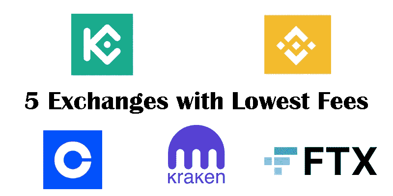
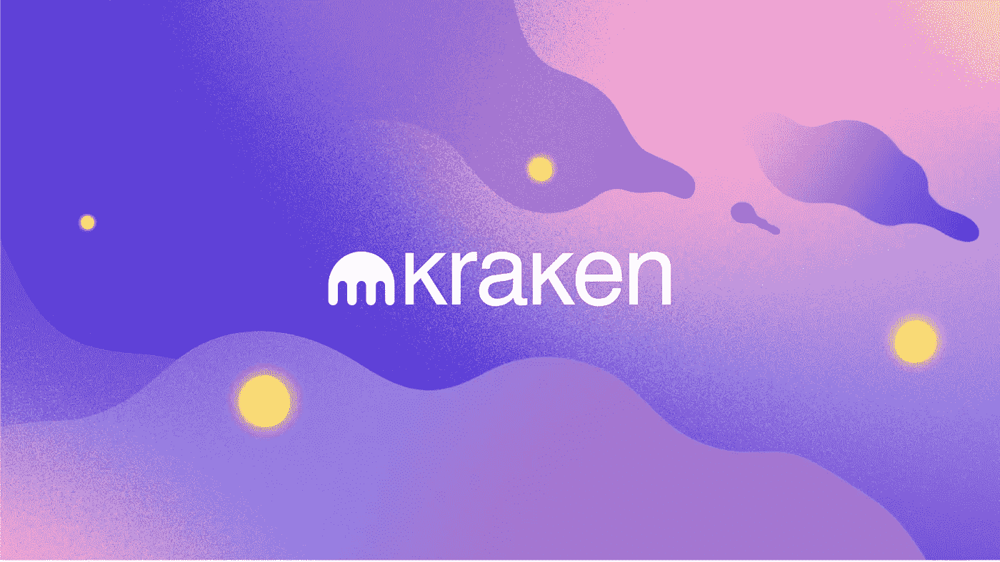
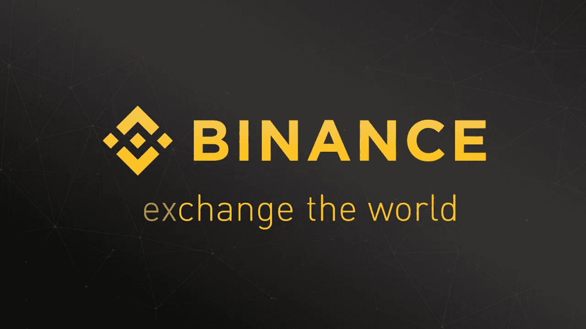
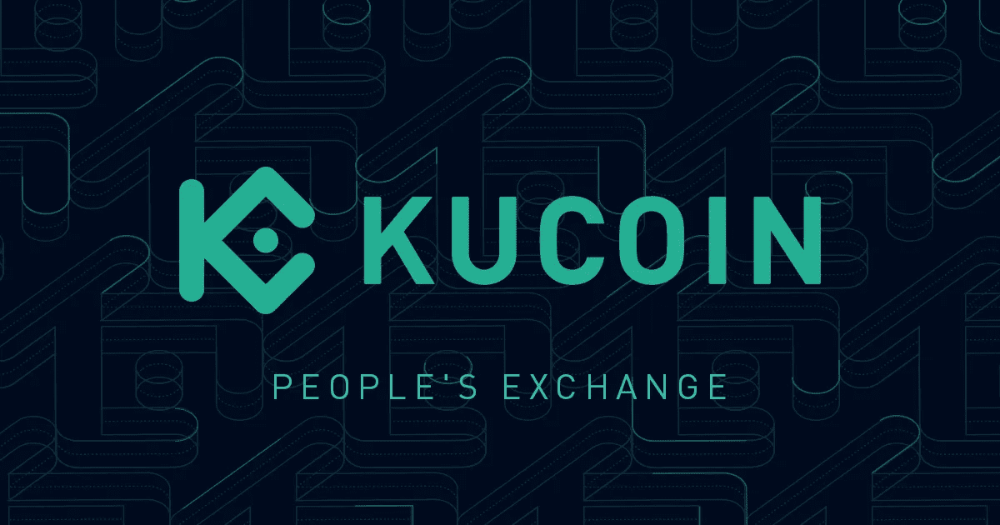
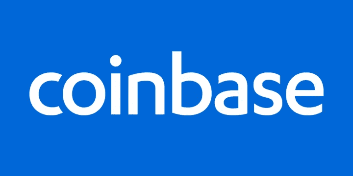
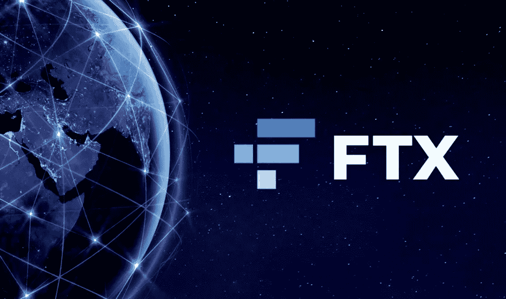

# 介绍 5 家收费最低的交易所

> 原文：<https://medium.com/coinmonks/introducing-5-exchanges-with-lowest-fees-25b8aec7ff9b?source=collection_archive---------41----------------------->

交易所对买卖和转账收取少量费用。这个费用有的交易所低，有的交易所高。你需要意识到你选择的交换会减少多少。如果你选择的兑换费用高，如果你的活跃度高，在费用下你肯定会亏很多钱。

下面，我将介绍 5 个费用最低的交易所。

1.  北海巨妖交易所

北海巨妖是世界上最古老的加密货币交易所之一，自 2011 年开始运营。该交易所支持 90 多种不同的加密货币，使用各种法定货币进行买卖和交易，并具有股票、保证金交易和期货合约等其他功能。北海巨妖是主要的加密货币交易所之一，允许世界各地的交易商进行交易。北海巨妖已经成为最成功的交易所之一，因为它收费低廉，易于使用，并且有安全和监控措施。

北海巨妖交易所费用:

北海巨妖提供低价交易；制造者占 0.16%，接受者占 26%。他们支付 0%。如果交易者的交易量很大，佣金会逐渐减少。这意味着，如果你的交易量很大，做市商和报价机的费用将分别为零和 0.10%。

2.币安交易所

币安是最早在中国成立的一个流行的加密货币交易所的名字。2018 年，这家交易所能够超越竞争对手，成为全球最大的加密货币交易所，并一直能够保住这一头衔。

2017 年 7 月 1 日，该交易所通过 ICO 成功进行了 1500 万美元的初始投资，以筹集所需的资本，作为回报，它向投资者分发了 BNB 代币。BNB 的货币代码是一个 ERC 20 代币。该交易所随后推出了自己的区块链网络，名为币安·区块链网络。下一步，币安还推出了智能链网络，这是一个编写智能合同的平台。

币安交易所费用:

在这个交易所里，对于交易低于 50 个比特币的人；他们为每笔交易支付 0.1%。但是，如果您使用 BinanceCoin 货币进行交易，将为用户提供 25%的折扣。

3.库币交易所

Kucoin Exchange 是一家声誉很好的交易所，在硬币市场排名第三。这个交易所不仅是币安的最佳选择之一，而且交易费用非常合理。在信誉卓著的交易所中，它的交易费是最低的。要了解更多关于可卡因的信息，我们建议阅读以下内容。

库币交易所的收费结构是基于 VIP 等级的。对于零级，maker 和 ticker 的费用仅为 0.1%。通过增加交易量和购买自己的代币，一家名为 KCS 的交易所将在佣金中包含折扣。有趣的是，在更高的级别，交易费用为零，对制造商来说甚至是负数。换句话说，你不仅不用支付交易费用，而且还能以低于董事会的价格买到你想要的货币。

库币兑换费:

在这个交易所里，每笔交易都有 0.1%的固定费用。成本也根据用户交易量而降低。

4.铸币交易所

CoinBase Exchange 是另一家在全球范围内买卖加密货币的交易所。该交易所最初在中国成立，现在已经将其服务器转移到美国。

CoinBase 交换费:

在佣金率方面，CoinBase 可以被认为是最昂贵的交易所之一，因为它在加密货币交易中每笔交易中收取 0.50%的佣金，除了其他额外费用，它还从其用户那里收取一笔金额，这通常是每笔交易 4%左右的佣金率。

在比特币基地，你支付每笔交易的 0.50%，外加基于支付方式的额外费用；事实上，在每笔交易中，平均最多扣除 4%的佣金。

5.FTX 交易所

FTX 是一家加密货币交易所，于 2019 年 5 月在香港成立。该交易所的口号是“由交易者创建，为交易者服务”，它推出了加密货币行业第一个此类衍生产品。在推出后不久，FTX 就成为交易量排名前五的交易所之一，获得了积极的评价。该交易所很快在小交易员和加密衍生品专业人士中流行起来。

FTX 交易所费用

与大多数外汇衍生品平台一样，FTX 交易所有自己基于美元交易量的费用分类结构。平均来说，制造商的佣金是 0.02%，接受者的佣金是 0.07%，如下图所示。

FTX 交易所还为专业交易者开发了一个 VIP 项目。该 VIP 计划为以较低费用大量交易的交易者提供个人管理账户和参与做市计划的机会。

> 加入 Coinmonks [电报频道](https://t.me/coincodecap)和 [Youtube 频道](https://www.youtube.com/c/coinmonks/videos)了解加密交易和投资

# 另外，阅读

*   如何在 Uniswap 上交换加密？ | [A-Ads 审查](https://coincodecap.com/a-ads-review)
*   [WazirX vs coin dcx vs bit bns](/coinmonks/wazirx-vs-coindcx-vs-bitbns-149f4f19a2f1)|[block fi vs coin loan vs Nexo](/coinmonks/blockfi-vs-coinloan-vs-nexo-cb624635230d)
*   [本地比特币评论](/coinmonks/localbitcoins-review-6cc001c6ed56) | [加密货币储蓄账户](https://coincodecap.com/cryptocurrency-savings-accounts)
*   [什么是融资融券交易](https://coincodecap.com/margin-trading) | [成本平均法](https://coincodecap.com/dca)
*   [支持卡审核](https://coincodecap.com/uphold-card-review) | [信任钱包 vs 元掩码](https://coincodecap.com/trust-wallet-vs-metamask)
*   [Exness 点评](https://coincodecap.com/exness-review)|[moon xbt Vs bit get Vs Bingbon](https://coincodecap.com/bingbon-vs-bitget-vs-moonxbt)