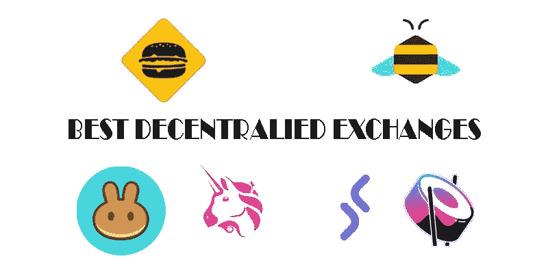
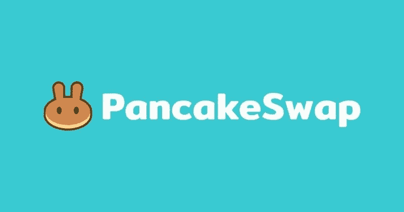
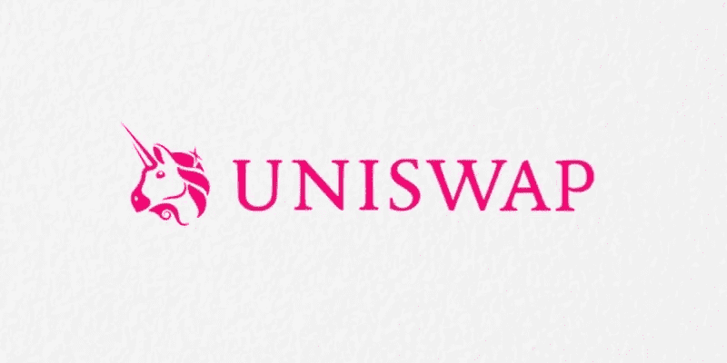
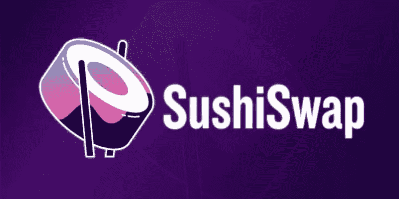
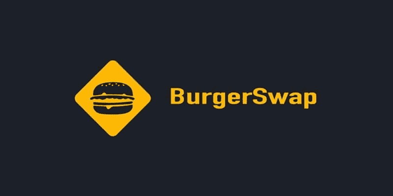
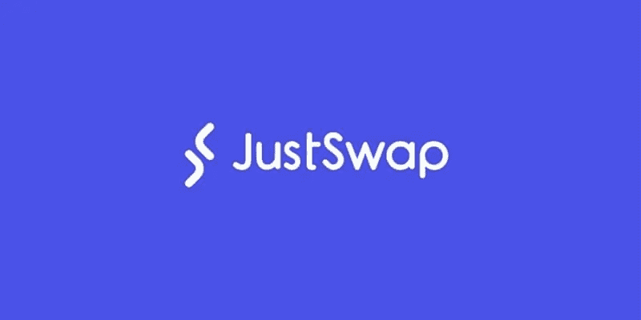
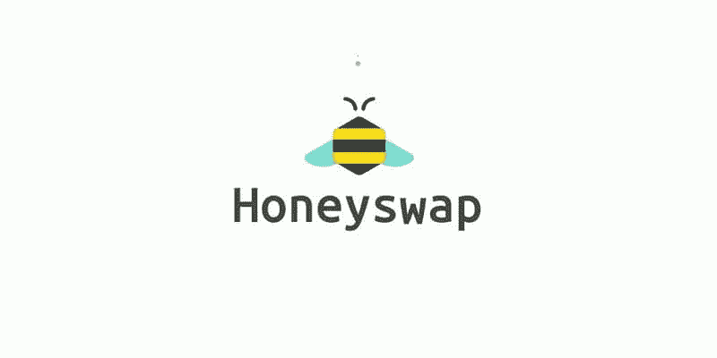

# 在 2022 年引入 6 个最好的分散化交易所

> 原文：<https://medium.com/coinmonks/introducing-6-of-the-best-top-decentralized-exchanges-in-2022-ac12cc01fe79?source=collection_archive---------22----------------------->

在这篇文章中，我介绍了买卖不同类型货币的最著名的指数列表。我想通过介绍最著名的去中心化交易所列表来帮助你找到合适的交易所。

在去中心化的交易所，你所要做的就是连接你的钱包，然后直接通过你的钱包进行交易。这使得交易可以私下快速完成，你不再需要经历开户和交易的繁琐过程；涉及客户身份验证(KYC)搜索的流程，包括身份验证、家庭住址、收入等操作。，侵犯你的隐私。在下文中，您将了解最好的分散交换局。

## **1。煎饼交换**

PancakeSwap 是上市交易所中气氛最欢乐的。在这个交易所的主页上，在亮片和煎饼之间，有诸如农业、赌博和彩票等选项。

这个平台的设计很吸引人，尽管它的标志看起来像一个有两只耳朵的活煎饼。该平台的许多页面使用了一种形状，完美地将七个煎饼放回一个盘子里，这也许是一种改变的伟大隐喻。它肯定会让你对这个设计感觉更舒服。

尽管这家初创公司得到了币安 1000 万美元的资助，并引发了权力下放的传言，但没有一个煎饼掉期开发商的身份是已知的，这可能会让你怀疑。

由于根据其创造者的想法，这种最好的分散化交易所之一的最新版本 PancakeSwap V2 取得了成功，PancakeSwap 应该对那些正在寻找伟大交易所的人有吸引力。

## **2。Uni swap**

2018 年 Uniswap 发布时，它是一个革命性的平台。事实上，您可以在区块链中庭兑换基于中庭的 ERC20 代币，而无需订单簿，这是一个典型的成就。相反，UniSwap 使用智能合同，允许用户之间直接交流，使这些交流分散化和点对点。

通过使用新的流动性池，UniSwap 创造了将数字货币相互转换或互换所需的资产。例如，像您这样的用户可以添加货币对，如 ETH / DAI，以添加到流动性池中。相反，当池中的资产被使用时，用户会收到佣金。价格是根据流动性池中剩余的资产数量确定的。

Uni-swap 用户界面是该平台的最佳特性之一。您可以非常快速地将您的 Uni Swap 连接到 Metamsk 钱包，并开始交易代币。这是一个最好的——去中心化的交易所，简单有效，对数字货币爱好者来说重要的最重要的特征就是它的去中心化。毕竟，Uni Swap 仍然处于分散金融的前沿。

最近发布的 Uniswap V3 提高了 Uniswap 基础架构的流动性、性能和效率。uniswap 协议在不断发展，因此当挑战具有类似离子交换接口的其他协议时，最好的分散交换之一背后的团队能够为用户保持他们的平台最新。

## **3。寿司交换**

SushiSwap 是以烹饪为主题的分散交流列表中的佼佼者。如果你爱寿司而不是单枝，这个平台可能更合你的口味。不管怎么说，寿司互换和离子互换很像，因为它是 uni swap 的子分支之一。

当然，这个平台不仅仅是寿司相关设计的有趣子集。Sushi Swap 颇具争议地对 Uni Swap 发起了“吸血鬼攻击”，通过提供巨大的奖励和激励来吸引从 Uni Swap 迁移到该平台的人，从而耗尽其流动性。两周内转移了超过 10 亿美元的数字货币。在另一起纠纷中，该平台的匿名创始人出售了价值 1400 万美元的寿司币，但后来后悔了，并将其退回。

尽管如此，寿司交易仍然是最好的分散交易之一。股东通过参与流动性池获得的奖金或利润的分配得到了调整，以使那些持股较少的人获得良好的回报，而不仅仅是那些持股较多的人。也有设计类似寿司的奖品。

Sushi Swap 的用户界面看起来比 Uni Swap 现代得多，用它进行交易就像 Uni Swap 一样简单

## **4。汉堡交换**

汉堡掉期，像 uniswap 和食品掉期寿司掉期一样，提供流动性池利润的一定比例。Burger Swap 的与众不同之处在于它为参与治理提供了回报；这意味着，如果你是该协议未来方向投票的积极参与者，你将在汉堡互换中获得一个汉堡货币代码形式的奖励。

虽然交换汉堡看起来不像交换寿司那么现代，但它在视觉上和离子交换一样令人满意。自然，平台是在黑暗模式下发布的，互换、流动性、治理等选项清晰地显示在左侧。

## **5。只是交换**

Just Swap exchange 在创区块链的支持下运作，并使用 TRC-20 代币进行违约。在此兑换中，您可以与区块链中的其他成对代币兑换 TRC-20 代币。

Just Swap 就像它的独角兽兄弟和烹饪主题的同行一样，是一个轻松交换令牌的平台。然而，与其他程序不同的是，Just Swap 并没有太多的功能。因为 Just Swap 协议对它的对手来说是相对较新的，所以这种交换就像其他分散的应用程序一样，不再具有固定和奖励的特性。Just Swap 仍然是使用 TRC-20 代币的主要交换方式，对某些人来说是个不错的选择。区块链现在比中庭区块链更快更便宜，使得许多人的交易更容易。

## **6。蜂蜜交换**

HoneySwap 交换类似于 UniSwap，只是 xDai 对有一些结构上的变化。虽然它几乎不提供去中心化的 xDai 交换，但如果你对这种稳定的硬币感兴趣，honey swap 可能就是你要找的。这种交换提供了一种货币化的方式，或者将 ERC-20 代币转移到 xDai 网络的方式，并允许您与 xDai 交换您的菲亚特。

Honey Swap 并不打算成为 Uni Swap 的模拟版本。

## **结论**

整个去中心化交换空间还是新的，有一个完整的列表，列出了你可以尝试的最好的去中心化交换。许多这样的交换是开源的，允许用户信任点对点协议，并且有创造力的头脑可以检查和改进它们。

> 加入 Coinmonks [电报频道](https://t.me/coincodecap)和 [Youtube 频道](https://www.youtube.com/c/coinmonks/videos)了解加密交易和投资

## 另外，阅读

*   [如何在印度购买比特币？](/coinmonks/buy-bitcoin-in-india-feb50ddfef94) | [WazirX 评论](/coinmonks/wazirx-review-5c811b074f5b)
*   [最佳在线赌场](https://coincodecap.com/best-online-casinos) | [硬件钱包](/coinmonks/hardware-wallets-dfa1211730c6) | [Jet-Bot 评论](https://coincodecap.com/jet-bot-review)
*   [如何在 WazirX 上购买柴犬(SHIB)币？](https://coincodecap.com/buy-shiba-wazirx)
*   [比特币主根](https://coincodecap.com/bitcoin-taproot) | [排名前 6 的比特币信用卡](/coinmonks/bitcoin-credit-card-bc8ab6f377c6)
*   [最佳免费加密信号](https://coincodecap.com/free-crypto-signals) | [YoBit 评论](/coinmonks/yobit-review-175464162c62) | [Bitbns 评论](/coinmonks/bitbns-review-38256a07e161)
*   【Huobi 的加密交易信号 | [BitMEX 评论](https://coincodecap.com/bitmex-review)
*   [7 个最佳零费用密码交易平台](https://coincodecap.com/zero-fee-crypto-exchanges) | [购买流量令牌](https://coincodecap.com/buy-flow-token)
*   [分散交易所](https://coincodecap.com/what-are-decentralized-exchanges) | [比特 FIP](https://coincodecap.com/bitbns-fip) | [Pionex 审查](https://coincodecap.com/pionex-review-exchange-with-crypto-trading-bot)
*   用信用卡购买密码的 10 个最佳地点
*   [OKEx 回顾](/coinmonks/okex-review-6b369304110f) | [Kucoin 交易机器人](/coinmonks/kucoin-trading-bot-automate-your-trades-8cf0ca2138e0) | [期货交易机器人](/coinmonks/futures-trading-bots-5a282ccee3f5)
*   [AscendEx Staking](https://coincodecap.com/ascendex-staking)|[Bot Ocean Review](https://coincodecap.com/bot-ocean-review)|[最佳比特币钱包](https://coincodecap.com/bitcoin-wallets-india)