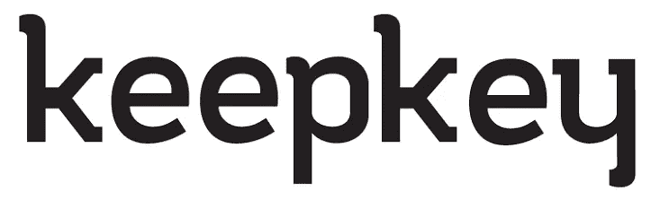

# 介绍 6 款流行的硬件钱包

> 原文：<https://medium.com/coinmonks/introducing-6-popular-hardware-wallets-44f0453d5157?source=collection_archive---------20----------------------->

硬件钱包是一种存储加密货币的物理工具，专门设计具有高安全性。这些设备具有无需互联网即可存储加密货币的功能。因此，它们比其他钱包更安全。

这些钱包有可以用作密码的私钥。只有使用钱包钥匙，才有可能证明你是否拥有一个钱包。丢失该密钥是为了破坏资产，因为在分散的市场中不可能恢复密码。

硬件钱包相对于其他钱包的优势

与其他钱包相比，硬件钱包的主要特点如下:

-高度安全

-支持多种数字货币

-连接到手机的能力

介绍六大硬件钱包

在下面，我们将介绍这些钱包的一般例子。

1.  莱杰纳米 S

莱杰是世界上最大的法国五金钱包制造商之一。这些钱包的流行和受欢迎是由于设计的类型和易用性。用户可以通过使用这些钱包上的内置显示屏轻松了解它的工作原理。使用钱包所需的软件也很容易获得。

伊莱杰钱包的流行型号包括伊莱杰 Nano S，伊莱杰 Nano X，伊莱杰 Blue。这款钱包的唯一区别是 Ledger Blue 的钱包上有一个大屏幕，可以为用户提供特殊功能。

该产品支持比特币、以太币、瑞波币等多种货币。在 ledger.com，你可以看到分类账钱包支持的所有货币。

2.特雷索一号

Trezor 和 Ledger 一样，是最大的硬件钱包制造商之一。第一款钱包 Trezor One 是 2014 年首批上市的比特币钱包之一。

不同类型的 Trezor 钱包包括 Trezor Van、Trezor T，除了比特币，这款钱包还支持其他加密货币。Trezor 的一个重要特性是拥有两步密码的能力。此功能支持密码管理以及文档的 GPG 加密。

3.酷派钱包

Cool Walt 就是 CoolBitX 产品的一个例子。该公司成立于 2014 年，目标是创造安全的钱包。2015 年，第一款名为 CoolWallet 的硬件钱包进入市场。

这个钱包和银行卡一样大，上面有一个按钮。它上面还有一个小屏幕，可以通过蓝牙轻松连接到手机。因此，您可以轻松地检查您的货币，支付和发送您的订单。

鉴于这款钱包提到的所有优点，这款钱包也有缺点，其中最重要的是对少量货币的支持。要查看 CoolWallet 支持的货币，您可以访问 coolwallet.io。

4.KeepKey

硬件钱包的一个最好的例子是 KeepKey，它是三大钱包之一。这款钱包支持比特币以外的 40 多种货币。

这款钱包漂亮的设计和易用的操作，以及其合理的价格和较高的安全性，是这款钱包受欢迎的原因。与其他钱包相比，这个钱包的一个缺点是它的尺寸。

这个钱包里的交易和其他钱包一样，是有佣金的。唯一不同的是，这些佣金是有自定义空间的，这样这个佣金的金额是通过决定交易速度来增加的。该功能仅适用于比特币交易。

5.BitBox02

瑞士公司 Shift Cryptosecurity 推出了 Bitbox。相比于其他钱包，这款钱包鲜为人知。但它是使用比特币的透明钱包之一。这款钱包的外观与其他钱包有所区别。Bitbox 由防弹玻璃体制成，以防止可能的损坏。还有，这个钱包的大小就像一个便于携带的箭头。

这种钱包的优点包括:

合适的尺寸

抗冲击机身

高度安全

由 Micro SD 支持

除了优点之外，这款钱包还有以下缺点:

相对较高的价格

非常低的货币密码支持

这个钱包和其他钱包一样，需要自己的软件来设置。这些应用程序可以安装在 Windows、Mac、Linux a

> 加入 Coinmonks [电报频道](https://t.me/coincodecap)和 [Youtube 频道](https://www.youtube.com/c/coinmonks/videos)了解加密交易和投资

# 另外，阅读

*   [电网交易机器人](https://coincodecap.com/grid-trading) | [Cryptohopper 审查](/coinmonks/cryptohopper-review-a388ff5bae88) | [Bexplus 审查](https://coincodecap.com/bexplus-review)
*   [7 个最佳零费用加密交易平台](https://coincodecap.com/zero-fee-crypto-exchanges)
*   [氹欞侊贸易评论](https://coincodecap.com/anny-trade-review) | [霍比保证金交易](/coinmonks/huobi-margin-trading-b3b06cdc1519)
*   [分散交易所](https://coincodecap.com/what-are-decentralized-exchanges) | [比特 FIP](https://coincodecap.com/bitbns-fip) | [Pionex 评论](https://coincodecap.com/pionex-review-exchange-with-crypto-trading-bot)
*   [用信用卡购买密码的 10 个最佳地点](https://coincodecap.com/buy-crypto-with-credit-card)