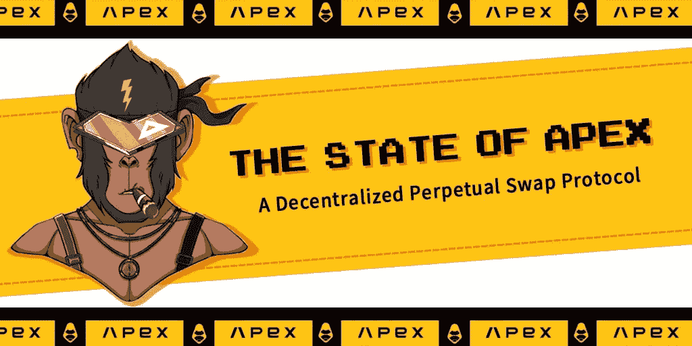

# 推出 ApeX，一种革命性的分散式永久交换协议

> 原文：<https://medium.com/coinmonks/introducing-apex-a-revolutionary-decentralized-perpetual-swap-protocol-7157c851ee4e?source=collection_archive---------38----------------------->

金融的未来是去中心化的。事后看来，这是一个显而易见的想法，但直到最近几年，我们才开始看到这一未来实现的速度。我们不只是在谈论加密交易所或区块链的金融服务；我们正在谈论对金钱运作方式的根本反思，重点是开源代码和无许可网络。

ApeX 是一个分散的、无许可和非托管的平台，允许在任何令牌对上创建永久互换(融资)市场。永久掉期是一种衍生合约，允许两个交易对手进行保证金交易，在一方终止合约之前不会进行结算。

**顶点的状态**

对于 ApeX 来说，这是一个多事之秋，他们成功地在 Arbitrum mainnet 上推出了该协议的测试版，完成了种子期融资，并向用户出售了总共 4，580 个独特的 NFT。凭借预先挖掘的 10 亿令牌的固定总供应量，$APEX 代表了价值和效用，如治理、协议激励和对其用户的赌注。

在加密和其他领域，许多人问的关键问题是:从长远来看，什么更有利可图？持有，还是交易？与这个问题相呼应的是另一个问题——赌注和 NFTs 哪个投资更安全？一个简单的事实是，在当今这个充满挑战的世界里，没有放之四海而皆准的投资建议。你的投资回报率和你使用的平台一样好，一样可靠。

**ApeX 价值主张的三大核心支柱**

ApeX 协议的核心是创建一个完全无许可且全球可访问的永久合同协议。在 ApeX 协议上进行交易而不需要账户或验证的能力向任何能够访问互联网的人打开了交易的世界。

ApeX 有三大支柱:

**完全无权限** —无 KYC 或反洗钱限制。虽然这可能看起来微不足道，但值得注意的是，大多数 DeFi 平台在允许您使用其服务之前都需要某种形式的 KYC/反洗钱验证。这给最终用户造成了不必要的摩擦，并且违背了真正无许可系统的精神。

**永久流动性** —该协议旨在为多个金融垂直领域的未来应用奠定基础，ApeX 认为，为用户提供一种不受任何时间约束或限制的从流动性供应中获利的途径至关重要。

**全方位资产支持** —作为一种利用区块链技术进行跨境和跨经济体价值交易的方式，加密资产不仅仅是代币。ApeX 的最终目标是成为满足所有互换需求的一站式商店。

**ApeX 协议由全球投资者提供资金和支持**

除了提供分散解决方案，ApeX 还优先考虑能够提供稳定的流动性并支持 ApeX 协议的开发。ApeX 得到了全球合作伙伴的支持，包括蜻蜓资本合作伙伴、Jump Trading 和 Tiger Global Management，他们将支持解决方案的开发，从而改变 DeFi 的状况。

【ApeX 与其他永久互换协议的不同之处

ApeX 认为，永久互换协议最重要的特征是做市商设计、定价公式和风险管理系统。这三个领域需要无缝协作，以确保公平定价、高效的价格发现和低风险。ApeX 协议的两个核心特性使其有别于市场上的其他协议。

1.  **弹性自动做市商**

弹性自动做市商(eAMM)是一个自平衡系统，能够创建链上衍生品。它有一个流动性池，被用作支持交易员所有头寸的抵押品。与提供现货和期货交易的传统集中式交易所不同，这允许交易者在不需要交易对手的情况下进行杠杆化的多头或空头头寸。eamm 是有弹性的，因为它们在任何给定时间根据衍生品市场所需的资金量而扩张和收缩，所以流动性更高的市场比流动性更低的市场有更大的 eamm。

1.  **协议控制值**

ApeX 提供协议控制价值(PCV)系统，这意味着协议会跟踪每个用户的所有未结头寸，并保留其抵押品状态的记录。PCV 还确保所有用户都有足够的抵押品来支持他们的头寸，并激励交易者降低其头寸的抵押品以实现利润最大化。这种模式非常适合 ApeX，因为它不需要外部方或第三方进行任何清算。

**ApeX 的未来**

在过去的三个月里，ApeX 协议经历了快速的发展和平台的变化。每周都有新用户作为令牌持有者、社区成员和交易者加入 ApeX 协议。计划于 2022 年上半年在 V1 推出 ApeX 协议，该项目的重点是创建一个绑定程序，并在多链平台上推出高级交易体验。

ApeX 采用弹性自动做市商(eAMM)模式运营，恒定产品配方是价格发现的核心。eAMM 的设计理念是新颖的，应该会减少在创建分散流动性池时出现的一些摩擦。通过创建一个支持抵押资产的真正分散交易的协议，ApeX 为交易者提供资金的完全托管和免受市场崩溃的保护，使其成为当前和未来用户的一个有吸引力的选择。

在未来几个月，ApeX 还准备了不同的计划来激励他们的用户，例如，流动性挖掘计划，推荐计划，赌注计划等。NFT 持有者可以享受 8%的终身交易费折扣，并有权参加他们的 NFT 游戏比赛，赢得高达 12 万多美元的奖金。

ApeX 被定位为一个稳定的协议和生态系统，原因如下:激励结构，奖励$APEX 持有者参与治理；非中介化—没有托管人，没有可信任的第三方；以及自我调节的利率机制。这种协议的潜力可以在许多用例中看到，如令牌化的菲亚特 onramps、价格套利、合成卖空和对冲押注。总的来说，ApeX 是一个构建良好的革命性协议，有可能成为所有加密衍生平台的标准..

**ApeX 官方链接**

网址:【https://app.apex.exchange/trade T3

推特:【https://twitter.com/OfficialApeXdex 

电报:[https://t.me/ApeXdex](https://t.me/ApeXdex)

> 加入 Coinmonks [电报频道](https://t.me/coincodecap)和 [Youtube 频道](https://www.youtube.com/c/coinmonks/videos)了解加密交易和投资

# 另外，阅读

*   [Bookmap 评论](https://coincodecap.com/bookmap-review-2021-best-trading-software) | [美国 5 大最佳加密交易所](https://coincodecap.com/crypto-exchange-usa)
*   最佳加密[硬件钱包](/coinmonks/hardware-wallets-dfa1211730c6) | [Bitbns 评论](/coinmonks/bitbns-review-38256a07e161)
*   [新加坡十大最佳加密交易所](https://coincodecap.com/crypto-exchange-in-singapore) | [收购 AXS](https://coincodecap.com/buy-axs-token)
*   [红狗赌场评论](https://coincodecap.com/red-dog-casino-review) | [Swyftx 评论](https://coincodecap.com/swyftx-review) | [CoinGate 评论](https://coincodecap.com/coingate-review)
*   [投资印度的最佳加密软件](https://coincodecap.com/best-crypto-to-invest-in-india-in-2021)|[WazirX P2P](https://coincodecap.com/wazirx-p2p)|[Hi Dollar Review](https://coincodecap.com/hi-dollar-review)