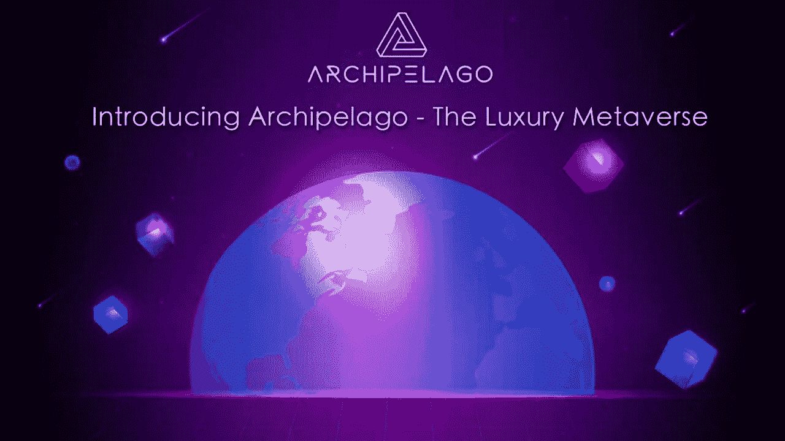

# 介绍群岛——奢华的元宇宙

> 原文：<https://medium.com/coinmonks/introducing-archipelago-the-luxury-metaverse-a9ed14ead3e4?source=collection_archive---------33----------------------->

元宇宙到了，是时候升级您的数字生活了！

随着世界变得越来越丰富，体验虚拟现实的能力越来越强，在这个令人兴奋的新建筑中拥有一个属于自己的地方很重要，一个你可以真正奢侈地数字化存在的地方。

欢迎来到[群岛](https://youtu.be/uLdOvg6VW_s)，以社区为中心的奢华元宇宙岛。我们的专属虚拟世界由 11 个岛屿组成，为各种类型的用户提供独特的体验，无论您是社交名流、企业家，还是只想时尚放松的人。

让 Archipelago 如此特别的是，它专注于在视觉上令人愉悦的天堂般的环境中提供令人惊叹的丰富用户体验。每一个细节都以奢华为理念，从令人惊叹的逼真图形到具有无与伦比沉浸感的高端体验。

作为当今的流行语之一，元宇宙概念已经简化了共享的虚拟空间，人们可以通过定制的化身在虚拟世界中代表你，他们每天都变得越来越真实。然而，作为一个不断发展和扩大的领域，很明显这只是一个开始，现在可用的东西在视觉吸引力和交互性方面仍然相当有限。

这就是群岛的由来。我们已经开发了一个平台，使元宇宙更接近完美，具有独特的，简单易用的，绝对华丽的界面。当您探索我们的世界时，您会发现大量照片般逼真的景观，让您叹为观止，以及您与朋友、业务联系人和岛上居民保持联系所需的所有功能。进入群岛将意味着进入一个充满新的独特的惊奇和兴奋感的环境，这种感觉在第一波元宇宙项目中还没有得到匹配。在这样一个环境中，我们的数字化互动方式得到了增强，人们聚集在一起休闲或工作，公司可以提供完全数字化的零售体验，区块链、NFT 和加密货币等技术可以用来在世界各地创造财富和机会。

做好准备吧，因为马上就要到了！

在 YouTube 上观看视频预览:

加入群岛，享受您最奢华的数字生活。

**关于群岛**

列岛是一个豪华的去中心化 Web3 元宇宙，建立在以太坊区块链之上。

令人惊叹的超真实图形带来了 Metaverses 第一次迭代中尚未体验到的惊奇和快乐感。

由 Steven Brodie 和 Chris Brady 于 2021 年 12 月创建，他们在 2002 年创建 Ai3D 时拥有超过 20 年的虚拟世界创作经验。

关注我们:

[网站](http://www.archipelago.land) | [推特](http://@archipelagometa) | [媒体](https://archipelago-land.medium.com/) | [不和](https://discord.gg/VVPsdK5pwh)

> 加入 Coinmonks [电报频道](https://t.me/coincodecap)和 [Youtube 频道](https://www.youtube.com/c/coinmonks/videos)了解加密交易和投资

# 另外，阅读

*   [氹欞侊贸易评论](https://coincodecap.com/anny-trade-review) | [霍比保证金交易](/coinmonks/huobi-margin-trading-b3b06cdc1519)
*   [分散交易所](https://coincodecap.com/what-are-decentralized-exchanges) | [比特 FIP](https://coincodecap.com/bitbns-fip) | [Pionex 评论](https://coincodecap.com/pionex-review-exchange-with-crypto-trading-bot)
*   [用信用卡购买密码的 10 个最佳地点](https://coincodecap.com/buy-crypto-with-credit-card)
*   [最好的卡达诺钱包](https://coincodecap.com/best-cardano-wallets) | [Bingbon 副本交易](https://coincodecap.com/bingbon-copy-trading)
*   [印度最佳 P2P 加密交易所](https://coincodecap.com/p2p-crypto-exchanges-in-india) | [柴犬钱包](https://coincodecap.com/baby-shiba-inu-wallets)
*   [8 大加密附属计划](https://coincodecap.com/crypto-affiliate-programs) | [eToro vs 比特币基地](https://coincodecap.com/etoro-vs-coinbase)