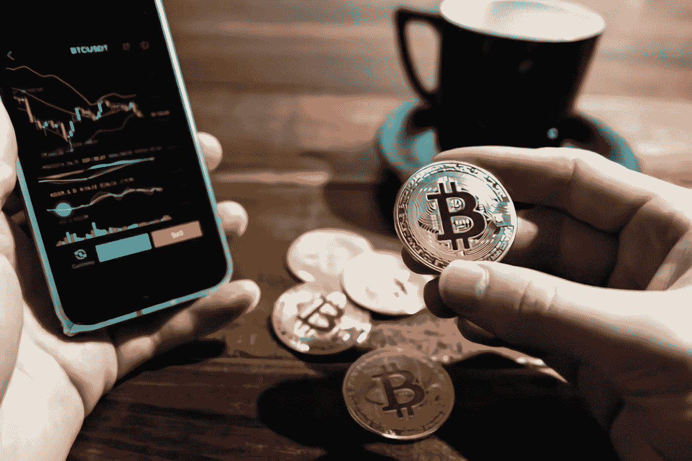

# BIB 加密货币交易所简介

> 原文：<https://medium.com/coinmonks/introducing-bib-cryptocurrency-exchange-679742e3925a?source=collection_archive---------17----------------------->

Photo by [Wance Paleri](https://unsplash.com/@wance0003000?utm_source=medium&utm_medium=referral) on [Unsplash](https://unsplash.com?utm_source=medium&utm_medium=referral)

# **加密货币交易仍处于起步阶段。**

加密货币仍处于起步阶段。然而，随着人们对加密货币交易和区块链技术的兴趣不断增长，我们将会看到更多的人加入这个市场。预计加密货币市场未来将呈指数级增长，到 2020 年将成为最大的市场之一。

提供加密到加密交易的加密货币交易所的数量也在迅速增加。但机构投资者现在介入还为时过早，因为目前还没有足够的法规来保护他们免受欺诈或盗窃。

**加密货币交易是一个蓬勃发展的行业**

加密货币越来越受欢迎，其主要优势在于它们代表了一种新的资产类别。它们是分散的货币，使用加密技术来防止重复消费和伪造交易。加密货币交易是一个蓬勃发展的行业，许多公司开始接受它作为商品和服务的支付方式。

# 什么是 BIB 加密货币交易所？

BIB 是一种加密货币交易所，其设计和开发从根本上强调简单性。它的目标是为用户提供简单、快速、安全和可靠的服务。

该 web 应用程序强调使用的简单性，通过极简设计来实现出色的用户体验，这将成为世界上最值得信赖的加密货币交易所之一。

*BIB 是一个全球加密资产交易和托管服务平台，为全球超过 200 万客户提供加密资产交易和加密托管服务。同时，每日资产移动超过 1 亿美元，加密资产托管超过 5 亿美元。BIB 加密货币交易所依靠集团为超过 500，000 家企业提供加密货币支付服务，并创建了区块链开发、托管和交易的综合业务。*

该交易所已在多个国家和地区建立了数字货币交易合规业务，并在美国、加拿大、塞舌尔、马耳他、新加坡、菲律宾、泰国、澳大利亚等国家获得或申请了相关合规牌照。该公司拥有 5000 多名员工，并在美国、日本、泰国和许多其他国家拥有子公司和合作机构。

# 最后的想法

在选择加密货币交易所时，您需要考虑支持的资产、费用、支付方式和安全性等变量。

我们的下一篇博客文章将根据交易费、取款费以及交易所是否提供加密资产的冷藏等因素来衡量 BIB 加密货币交易所。此外，还需要考虑平台可用性、可用加密货币的数量以及基于 investopedia.com 方法的客户支持选项。

关注并订阅我的博客，了解更多关于加密货币的信息。

您也可以访问并关注 BIB 加密货币官方账户和网站，了解更多信息:

 [## JavaScript 不可用。

### 编辑描述

twitter.com](https://twitter.com/bib_exchange?s=20&t=XiFRewdjtxsx-Z10HbMasA)  [## BIB 加密货币交易所| LinkedIn

### BIB 加密货币交易所| LinkedIn 上的 91 个关注者。围兜交易变得简单 CEX |区块链| Web3 | NFTs |…

www.linkedin.com](https://www.linkedin.com/company/bibexchangeofficial/) 

下载 BIB 加密货币兑换 App:

[https://www.bibvip.com/en_US](https://www.bibvip.com/en_US)

***免责声明:*** *本博客仅用于一般教育目的。此处提供的信息不构成投资或交易建议。在承担财务风险之前，请寻求专业建议。*

***关于作者***

*Brayan Nelson 是一名业余爱好作家，目前是一名大学讲师，同时是 Elemints NFT 项目的实习生和精灵纷争服务器崛起的总版主。在 Medium 上，他写了他在 NFT 和元宇宙的联系和教育之旅。订阅他的时事通讯，成为第一个阅读他的博客故事的人。你也可以在 bnelsonsep3@gmail.com 通过电子邮件联系到他*

[https://www.linkedin.com/in/bnelsonsep3](https://www.linkedin.com/in/bnelsonsep3)

[https://discord.gg/VzBk3KkHgX](https://discord.gg/VzBk3KkHgX?fbclid=IwAR2WGQol6u7UpkCh9V5xUSBr8YT80Wd1ljiy0HW-WVfrCtUMqmjejLSOUdA)

> *加入 Coinmonks* [*电报频道*](https://t.me/coincodecap) *和* [*Youtube 频道*](https://www.youtube.com/c/coinmonks/videos) *了解加密交易和投资*

# 另外，阅读

*   [3 commas Review](/coinmonks/3commas-review-an-excellent-crypto-trading-bot-2020-1313a58bec92)|[Pionex Review](https://coincodecap.com/pionex-review-exchange-with-crypto-trading-bot)|[coin rule Review](/coinmonks/coinrule-review-2021-a-beginner-friendly-crypto-trading-bot-daf0504848ba)
*   [莱杰 vs Ngrave](/coinmonks/ledger-vs-ngrave-zero-7e40f0c1d694) | [莱杰 nano s vs x](/coinmonks/ledger-nano-s-vs-x-battery-hardware-price-storage-59a6663fe3b0) | [币安评论](/coinmonks/binance-review-ee10d3bf3b6e)
*   [Bybit Exchange 评论](/coinmonks/bybit-exchange-review-dbd570019b71) | [Bityard 评论](https://coincodecap.com/bityard-reivew) | [Jet-Bot 评论](https://coincodecap.com/jet-bot-review)
*   [3 commas vs crypto hopper](/coinmonks/3commas-vs-pionex-vs-cryptohopper-best-crypto-bot-6a98d2baa203)|[赚取加密利息](/coinmonks/earn-crypto-interest-b10b810fdda3)
*   最好的比特币[硬件钱包](/coinmonks/hardware-wallets-dfa1211730c6) | [BitBox02 回顾](/coinmonks/bitbox02-review-your-swiss-bitcoin-hardware-wallet-c36c88fff29)
*   [BlockFi vs 摄氏](/coinmonks/blockfi-vs-celsius-vs-hodlnaut-8a1cc8c26630) | [Hodlnaut 点评](/coinmonks/hodlnaut-review-best-way-to-hodl-is-to-earn-interest-on-your-bitcoin-6658a8c19edf) | [KuCoin 点评](https://coincodecap.com/kucoin-review)