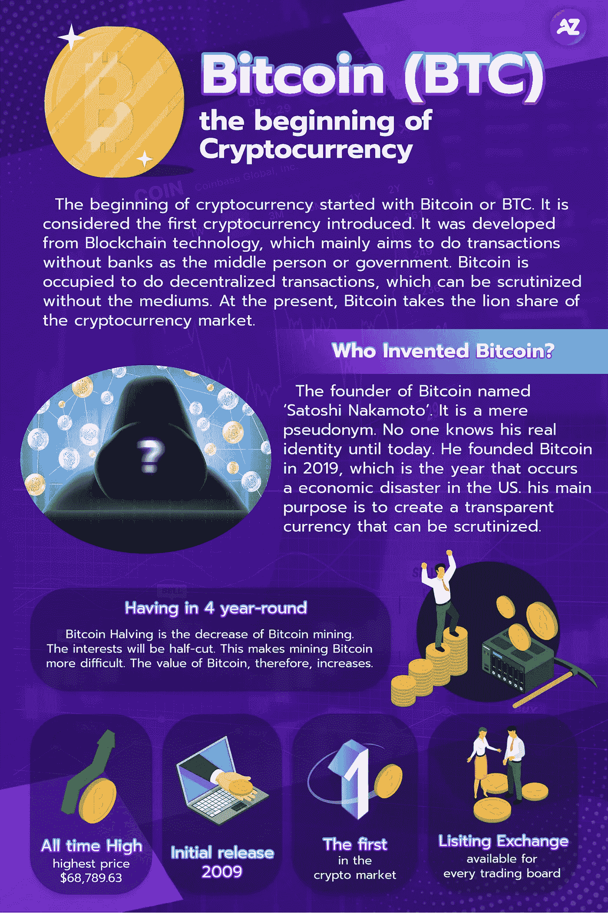

# 介绍比特币(BTC)，加密货币的开端

> 原文：<https://medium.com/coinmonks/introducing-bitcoin-btc-the-beginning-of-cryptocurrency-444e7479edb1?source=collection_archive---------79----------------------->

## 加密货币的开始始于比特币或 BTC

# 加密货币的起源始于比特币或 BTC。它被认为是引入的第一种加密货币。

它是由区块链技术发展而来，主要目的是在没有银行作为中间人或政府的情况下进行交易。比特币被占用来做去中心化的交易，没有介质也能被审查。目前，比特币占据了加密货币市场的最大份额。

比特币的创始人名叫‘中本聪’。这只是一个假名。直到今天没有人知道他的真实身份。我在 2019 年创立了比特币，这是美国发生经济灾难的一年。中本聪的主要目的是创造一种可以被仔细审查的透明货币。中本聪之所以没有暴露身份，可能是不想让它失去一个去中心化的系统。如果他的身份暴露，市场会更重视他的言行，而不是市场趋势。

比特币创立后，也有相应的不同币被创造出来。他们成为所谓的另类硬币，像以太坊、波尔卡多特、XRP 等。

比特币仅限 2100 万枚。如果我们从需求和供给的角度来讨论，当更多的投资者想要购买比特币时，这是有限的，比特币的价值将会增加。因此，它可以在市场上保持其价值。此外，有一个比特币已经存在 4 年了。就是比特币挖矿的减少。利息会减半。这使得挖掘比特币变得更加困难。因此，比特币的价值增加了。

如今，有一些商店和服务可用于加密货币支付。我们可以看到，主要的加密货币大多包括比特币。所以，不可否认的是，比特币是点燃加密货币潮流的原因。

*本文无意劝你投资。数字资产投资包含风险。建议投资者在投资前仔细研究相关信息。

如果投资者对分散资产管理投资感兴趣，您可以向我们咨询更多信息。

您可以在
推特:[https://twitter.com/azirafinance](https://twitter.com/azirafinance)媒体:[https://medium.com/@azirafinance](/@azirafinance)脸书:[https://www.facebook.com/azirafinance](https://www.facebook.com/azirafinance)Reddit:[https://www.reddit.com/user/azirafinance](https://www.reddit.com/user/azirafinance)白皮书:[https://azira-finance.gitbook.io/product-docs/](https://azira-finance.gitbook.io/product-docs/)

> 加入 Coinmonks [电报频道](https://t.me/coincodecap)和 [Youtube 频道](https://www.youtube.com/c/coinmonks/videos)了解加密交易和投资

# 另外，阅读

*   最好的[加密税务软件](/coinmonks/best-crypto-tax-tool-for-my-money-72d4b430816b) | [硬币追踪评论](/coinmonks/cointracking-review-a-reliable-cryptocurrency-tax-software-5114e3eb5737)
*   [Stackedinvest 评论](https://coincodecap.com/stackedinvest-review) | [北海巨妖评论](/coinmonks/kraken-review-6165fc1056ac) | [bitFlyer 评论](https://coincodecap.com/bitflyer-review)
*   最佳[加密借贷平台](/coinmonks/top-5-crypto-lending-platforms-in-2020-that-you-need-to-know-a1b675cec3fa) | [杠杆代币](/coinmonks/leveraged-token-3f5257808b22)
*   最佳[加密制图工具](/coinmonks/what-are-the-best-charting-platforms-for-cryptocurrency-trading-85aade584d80) | [最佳加密交易所](/coinmonks/crypto-exchange-dd2f9d6f3769)
*   [比斯勒评论](https://coincodecap.com/bitsler-review)|[WazirX vs coin switch vs coin dcx](https://coincodecap.com/wazirx-vs-coinswitch-vs-coindcx)
*   [7 大副本交易平台](https://coincodecap.com/copy-trading-platforms) | [BuyCoins 点评](https://coincodecap.com/buycoins-review)