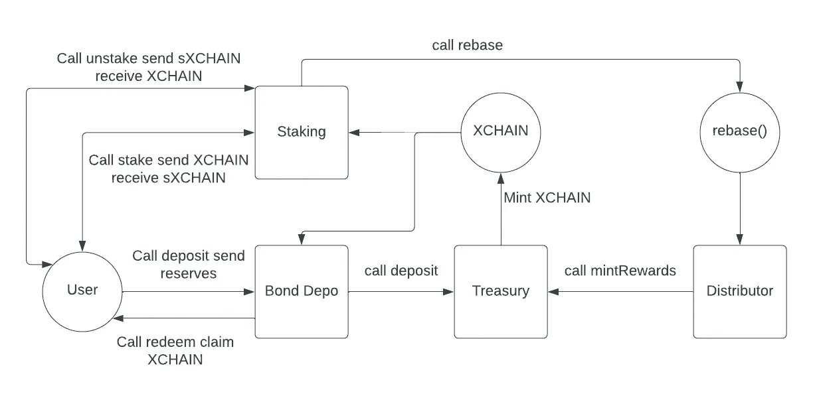

# 介绍链协议

> 原文：<https://medium.com/coinmonks/introducing-breakchain-protocol-aa66cc7516dd?source=collection_archive---------24----------------------->

欢迎使用智能流动性工具…

断链协议(XCHAIN)是一种**去中心化**的算法储备货币，由稳定的硬币和令牌化的不动产支持，运行在多边形网络上。它为你的流动性充当了一个**价值储存库**，与把钱存在银行账户(在那里慢慢贬值)相比，它有可能获得高收益。

# XCHAIN 智能合约

# 这一切是如何运作的

*   主要合同包括国库、债券存管和赌注。
*   国库是存储支持资产的地方。财政部是协议的金库。当支持资产存入财政部时，就铸造了 XHCAIN。
*   债券存管机构负责将支持资产存入国库。债券托管机构不持有任何资产，因为它们会立即转移到国债合同中。投资者通过债券存管机构存放储备资产来购买债券。债券存管机构将钱存入财政部，财政部为投资者铸造 XCHAIN。5 天后，投资者可以赎回他们的 XCHAIN。任何时候购买债券，都会向协议的所有者收取费用(利润)。债券存管是投资者铸造和赎回 XCHAIN 的主要方式。唯一的另一种方法是使用 QuickSwap 这样的交易所在公开市场上购买。
*   赌注合约是投资者可以用他们的 XCHAIN 来换取赌注 XCHAIN (sXCHAIN)的合约。在每次 rebase(每 8 小时)期间，赌注奖励将分配给 sXCHAIN 的持有者。当持有者不再希望下注时，他们可以调用 unstake 方法。如果持有者没有 XCHAIN，他们将无法下注。

# 令牌组学

*   当协议启动时，没有 XCHAIN。XCHAIN 有两种铸造方式:粘合和铆接。
*   任何时候投资者购买债券，都会产生新的 x 链。该协议使用控制变量和债务比率来计算债券价格。如果债券价格为 100 美元，投资者以 200 美元购买 2 只债券，投资者将获得 2 XCHAIN。在这种情况下，财政部铸造 2 XCHAIN。
*   赌注是 XCHAIN 的另一种铸造方式。任何时候都有一个重新基数，取决于多少时代已经过去，取决于奖励率，取决于多少 x 链被押下，财政部将铸造更多的 x 链。
*   这是 XCHAIN 唯一的两种铸造方式。总体象征经济学取决于有多少投资者购买债券，有多少人持有股份。

# 债券资产和储备资产

*   债券资产是储备资产。当协议启动时，第一笔债券资产将是美元硬币(USDC)。每个 USDC 都由一美元或等值的公允价值资产支持，这些资产存在美国监管金融机构的账户中。在整个加密生态系统中，你可以在大多数集中和分散的交易所买到 USDC。USDC 是 CENTRE 的创意，CENTRE 是一个开源技术项目，由 Circle 和比特币基地出资启动。与 UST 相比，USDC 定期接受审计。与戴不同的是，是以美元和短期政府债券作为抵押的。每当投资者使用 USDC 购买债券时，断裂链协议的财政部都会收到 USDC，并将其作为储备资产。这种储备资产维持了 XCHAIN 的价值，并有助于确定债券价格。

# 断链协议与其他储备货币有何不同？

XCHAIN 是欧姆的叉。但是，有几个关键的操作差异:

1.  它将在 [**多边形**](https://polygon.technology/matic-token/)**上可用，这是建立在以太坊区块链**之上的第二层缩放解决方案。以太坊主网上的典型交易费用在 10-12%之间，而 Polygon 上的典型交易费用低于 0 . 1%(低 100 倍以上)。这使得我们的国库能够以更频繁的时间间隔自动复利，显著增加了相对以太坊的潜在 APY 百分比。****
2.  **它将有一个“支持性国债”,实现真正的价格下限(T8 ),其计算方法是支持性国债除以流通供应量。如果 XCHAIN 的价格跌破这个阈值，就会触发算法上的“回购”，以捍卫底价。**
3.  **它将由稳定的美元硬币(USDC)支持，这是市值第二大的稳定硬币。与或戴不同，定期接受审计的是以美元和短期政府债券作为抵押的。**
4.  **XCHAIN 还将得到象征性房地产的支持，以进一步保护国库，并为货币提供稳定性。**

# **谁创建了断裂链协议？**

**尽管会向 Polygonscan 透露他们的身份，但 BreakChain 协议的创建者选择了匿名。这位在麻省理工学院学习区块链技术的创始人还拥有数百万美元的房地产投资组合。**

> **加入 Coinmonks [电报频道](https://t.me/coincodecap)和 [Youtube 频道](https://www.youtube.com/c/coinmonks/videos)了解加密交易和投资**

# **另外，阅读**

*   **[BigONE 交易所点评](/coinmonks/bigone-exchange-review-64705d85a1d4) | [电网交易 Bot](https://coincodecap.com/grid-trading)**
*   **[氹欞侊贸易评论](https://coincodecap.com/anny-trade-review) | [CoinSpot 评论](https://coincodecap.com/coinspot-review)**
*   **[新加坡十大最佳加密交易所](https://coincodecap.com/crypto-exchange-in-singapore) | [购买 AXS](https://coincodecap.com/buy-axs-token)**
*   **[投资印度的最佳加密软件](https://coincodecap.com/best-crypto-to-invest-in-india-in-2021) | [WazirX P2P](https://coincodecap.com/wazirx-p2p)**
*   **[7 个最佳零费用加密交易平台](https://coincodecap.com/zero-fee-crypto-exchanges)**
*   **[最佳网上赌场](https://coincodecap.com/best-online-casinos) | [期货交易机器人](/coinmonks/futures-trading-bots-5a282ccee3f5)**
*   **[分散交易所](https://coincodecap.com/what-are-decentralized-exchanges) | [比特 FIP](https://coincodecap.com/bitbns-fip) | [宾邦评论](https://coincodecap.com/bingbon-review)**