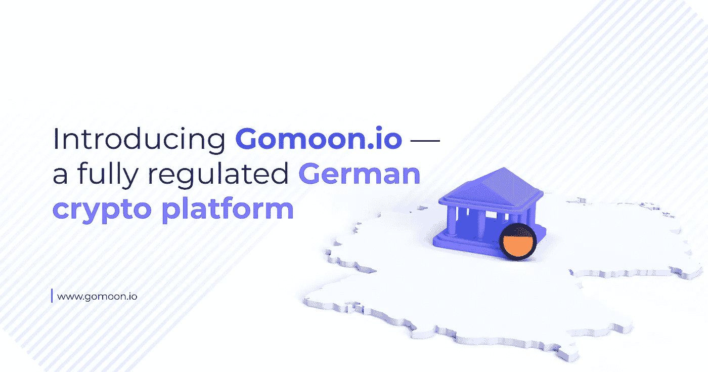

# 介绍 gomoon . io——一个完全受监管的德国加密平台

> 原文：<https://medium.com/coinmonks/introducing-gomoon-io-c64762257906?source=collection_archive---------27----------------------->

加密货币世界有点像深海潜水——它令人兴奋，令人身临其境，有很多东西需要探索，但不建议独自开始。有人帮助你掌握加密货币领域的基础知识，告诉你哪些水域适合探索，哪些水域最好避开，这对第一次接触加密货币的人来说至关重要。Gomoon 正是为了这个目的而开发的——教育我们的游客什么是加密货币，它们是如何工作的，最重要的是，如何安全地浏览加密空间。

Gomoon 是一家获得全面许可的德国金融科技公司，有两个核心目标:

●向新进入加密货币世界的人介绍加密货币的核心概念和动机

●为首次购买者提供一种最便捷、最安全的方式投资加密领域

在 Gomoon，我们对加密货币空间能够为世界各地的每个人带来的积极影响充满热情，但我们都太清楚掩盖这一潜力的噪音和负面影响。这种激情是该平台在 2020 年创建的灵感来源，当时波士顿大学的校友 Ingo Hillenbrand 希望帮助新人在安全的环境中体验加密货币的世界，并为我们希望成为加密货币领域进入者的领先入口奠定了基础。

Gomoon 不仅拥有一个关于加密货币领域的独家在线图书馆，还提供了一系列加密货币供用户购买、持有和出售，并由我们的合作伙伴德国银行提供担保。这给了 Gomoon 在其他地方很难找到的可信度，也意味着你通过我们购买的任何数字资产都存储在该银行的虚拟金库中，与真实资产一样安全。

了解和投资快速增长的加密货币生态系统从未像现在这样简单和安全。开始吧！

# 数字革命现在开始了

比特币已经从一个默默无闻的技术实验变成了过去 12 年中表现最好的资产。它让那些在早期理解其价值并经历了著名的繁荣和萧条的人成为百万富翁甚至亿万富翁，以至于全球银行机构、财富 500 强公司和对冲基金都将它记录在案。许多城市甚至整个国家都将比特币作为法定货币。在成为少数犯罪分子的替罪羊十多年后，比特币的价值和用途终于得到了认可，以至于长期持怀疑态度的人开始认识到它在全球金融格局中的重要性。

其他加密货币也在兴风作浪。以太坊是市值第二大的加密货币，是一场名为 DeFi(去中心化金融)的金融革命的基石，这场金融革命打破了传统金融模式的局限和限制，允许任何人放贷、借款和盈利，鼓励他们成为自己的银行。其他加密货币提供快速廉价的跨境支付，无需昂贵而缓慢的电汇。所有这些都没有一个中央机构来指挥。毫不夸张地说，加密货币是数字革命的资产类别。

数字资产市场增长以及支撑该市场的区块链技术的另一个例子是，各国央行有可能推出自己的数字货币。这些央行数字货币(CBDCs)只是数字格式的英镑、美元和日元等传统货币，是为实物现金被视为过时和低效的世界而设计的。世界上最大的国家正在研究 CBDCs，它们不想在这场已经被称为数字军备竞赛中落后。一些国家已经推出了他们的 CBDCs，而即使是像中国这样的巨人也正处于真实世界的测试阶段。

不可避免地会有更多。数字革命现在开始了。

# 我们的历史

Gomoon 的创始人 Ingo Hillenbrand 在 2013 年首次涉足加密货币领域，当他看到这个领域迅速发展成为一个万亿美元的生态系统时，他意识到许多潜在投资者正在因为大量误导性信息而推迟对加密货币领域的投资，这些信息在他们尝试和研究加密货币时经常会遇到第一次尝试者。从 YouTube 和抖音炒作商人的疯狂乐观，到主流媒体的反加密情绪，Ingo 发现几乎不可能找到一个平台来提供诚实、易懂、不带偏见的加密货币信息。

这些信息也让 Ingo 相信，有了这些信息，许多读者会愿意继续投资加密货币领域。然而，对于第一次尝试的人来说，加密平台的数量已经变得令人不知所措，而且由于这个空间只受到部分监管，很难知道哪些平台值得信任。为了解决这个问题，Ingo 开始与一家国家认可的德国银行合作开发一个用户可以信任的加密货币平台，利用该银行在保护客户资金方面的知识和经验为项目服务。

因此，2020 年 Gomoon 成立，其愿景是将优秀的教育内容与初学者快速、轻松、安全地投资密码空间的能力相结合，最大限度地减少麻烦。

# 处理错误信息

比特币升值的主要障碍之一是理解，更不用说接受了。自推出十多年以来，比特币仍然被当今世界的大多数人误解，他们只知道他们通过主流媒体渠道吸收了什么——大多数主流媒体都有着众所周知的反比特币偏见。在 Gomoon，我们相信，如果比特币的原理得到正确理解，它将得到更公平的报道和更高的采用率，让全球数百万人受益于它的去中心化性质。该领域的其他加密货币也是如此，其中许多都有可能彻底改变整个行业。

关于加密货币存在的大量错误信息启发我们在 Gomoon 创建了一个信息库，将正确地教育游客关于该行业的真相，不带任何偏见。我们喜欢加密货币，不要误解我们，但我们知道它们并不完美。我们希望潜在投资者在交出他们的钱以换取一些硬币之前，双方都得到充分的信息。

# 简单性和安全性

对于许多加密货币领域的新手来说，学习什么是加密货币以及它们如何工作只是成功的一半——实际上如何投资是另一个挑战。令人欣慰的是，购买加密货币比过去容易得多，但仍然需要一定程度的知识来浏览大多数在线平台(称为“交易所”)，现在有数百个。

当 Ingo 在创建 Gomoon 时,“简单和安全”的口号是他设计的一切的首要目标。因此，Gomoon 被设计成非常容易导航，即使是那些对加密货币(以及网站，就此而言)有最基本知识的人也可以以最安全的方式投资各种硬币。许多平台让用户通过多重关卡来创建帐户并购买他们的第一种加密货币，但 Gomoon 的目标是让我们的用户在 10 分钟内启动并运行他们选择的加密货币。

与其他运营细节不透明的加密货币交易所相比，Gomoon 在我们是谁、我们在哪里以及最重要的是，我们客户的资金存放在哪里方面都是公开的。有些平台连注册在哪个国家都不说，有些根本就不是官方注册。不是 Gomoon——我们是一家德国公司，与一家德国银行合作，任何投资于我们的资金都将存放在德国这家银行的数字金库中。还有比这更简单的吗？

# 准备投资吧！

在 Gomoon，我们对加密货币革命以及它如何为世界各地的数百万人提供一些东西感到非常兴奋。我们非常希望你能加入我们的旅程，所以何不[在 Twitter](https://twitter.com/gomoon) 和 [LinkedIn](https://www.linkedin.com/company/gomoon) 上关注我们的最新消息和平台更新，并在 [gomoon.io](http://www.gomoon.io) 上注册我们的时事通讯。

我们期待着见到你！

