# 引入增量收入

> 原文：<https://medium.com/coinmonks/introducing-increment-earn-556420d770af?source=collection_archive---------4----------------------->

***-用例、风险和指南***

**Increment Earn** 是一个基于智能合约、通过算法设定利率的分散式货币市场，面向流量区块链上的主流代币。自 3 周前在 mainnet 上发布以来，160 个供应商和 50 个借款人已经使用了该协议。

看到社区成员对产品有不确定性，我们编辑了这篇文章来给出更多关于用例、风险以及用户指南的解释。

# **用例**:

简单地说，货币市场协议就像一个流动的智能合约银行。与现实世界中的部分准备金银行不同，货币市场是完全抵押的(实际上是超额抵押)，有*抵押因子*和清算机制，以确保智能合约银行总是有偿付能力。

那你能拿银行怎么办？

## **1。存款赚取利息:**

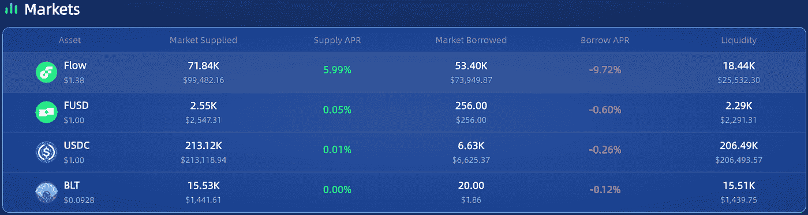

截至发稿时，流量供应商的年利率为 5.99%—**利息实时产生**，以每块为基础，提供的流量令牌**可随时提取**。

有些人可能会问，如果投资一个节点可以获得 8%的年利率，为什么要向货币市场供应呢？嗯，考虑以下原因:

## ***动态利率**

利率完全由资产的需求和供应决定，利率算法被编码到智能合同中。如流量利率模型所示:

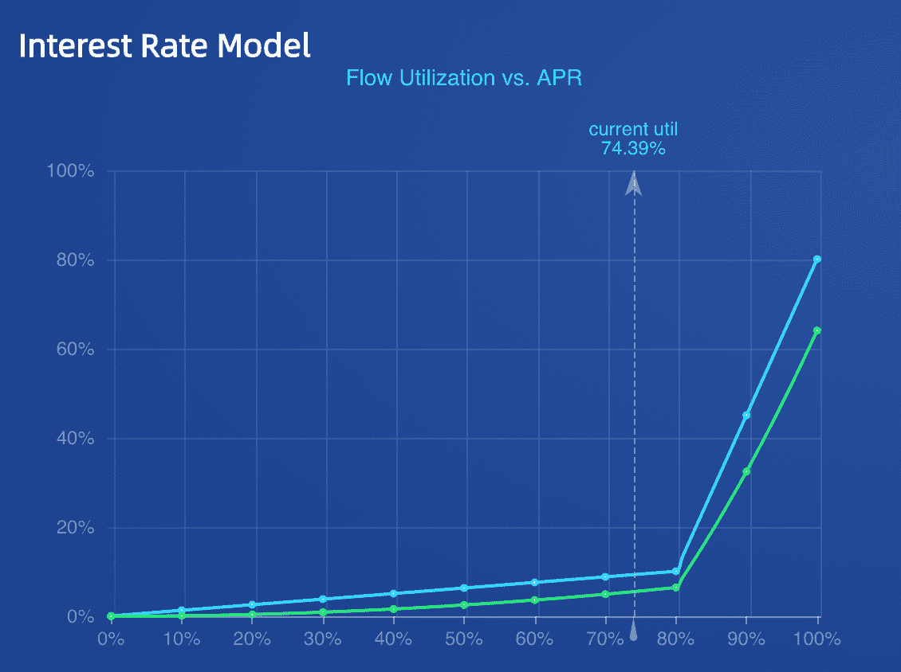

在临界利用率点(80%)之后，借款利率和相应的供给利率对利用率%的变化变得更加敏感，从而鼓励借款人还贷，鼓励供应商存款以赚取更多利息。

在当前的利率模型下，如果借款流量需求很大，在极端情况下流量的最大供给年利率可能高达 64%。

> 交易新手？试试[加密交易机器人](/coinmonks/crypto-trading-bot-c2ffce8acb2a)或者[复制交易](/coinmonks/top-10-crypto-copy-trading-platforms-for-beginners-d0c37c7d698c)

## ***时间有价值，即时流动性也有价值**

就像你不会把所有的钱都存入固定利率储蓄账户，尽管它的收益率更高，相反，你会一直保留一些现金——押记的流动代币至少在 2 个纪元(14 天)内是锁定和非流动的，在此期间，即使你真的需要紧急现金，你也不能提前提取。然而，只要池中有足够的流动性，Increment Earn 供应商可以随意从货币市场撤出。

是时候让你的休闲流动代币为你工作了！

## ***存款授予借款能力**

像银行一样，存放的代币可以用作抵押品，在市场上借用任何其他代币。每种资产都有一个总是小于 1.0 的抵押系数——这确保了货币市场总是被过度抵押，并且无论基础资产价格如何变化都保持偿付能力。如果你问为什么你想从货币市场借钱，看看下面。

## **2。不卖**拿必要的现金

对于霍德勒来说，过早出售真的很痛苦，当出售的代币在出售后几个月暴涨时更痛苦。但人们确实需要一些现金来支付租金和食物——随着 Increment Earn 的出现，它使霍德勒无需出售就能获得 USDC，通过提供流量作为抵押品，发送到比特币基地(圆圈),然后兑换成法定货币。

有些人可能会问，如果一个人需要 100 美元，为什么不卖掉价值 100 美元的流量，嗯，正如前面解释的那样，时间是有价值的，一切都是关于时机:如果流量价格回到 30 美元，你只需要卖掉 3.3 美元的流量来偿还贷款，而不是现在卖掉 78 美元的流量。然而，这并非没有任何风险，这样做实际上是含蓄地渴望心流(见下文)。

## **3。杠杆-多头令牌建仓**

假设我是一个流量长期信徒，我想积累更多的流量，但我已经用光了我所有的现金，现在该怎么办？有了增量收入，您可以:

> *1。作为抵押品的供应流= > 2。借用 USDC = > 3。把 USDC 换成心流= > 4。供应更多流量= > 5。冲洗并重复。*

由于 Flow token 目前的附带系数为 0.66，理论上您可以获得和提供 2.94 倍的原始流量头寸。当然，这伴随着平仓风险，如果流动价格低于某一水平，那么你的供应头寸将被平仓。但不管怎样，它给了你选择杠杆的权利。

## **4。卖空代币获利**

假设在熊市中，我认为流量令牌将进一步下跌，有没有办法从这一预测中赚取一些利润？有了增量收入，您可以:

> *1。供应 USDC(马厩)作为抵押品= > 2。借流= > 3。换回 USDC = > 4。补给 USDC 使你的位置更安全。等流量价格进一步下跌再回购= > 6。偿还借来的流量，并采取一些快乐的利润。*

当然，如果流动价格超过一定水平，就会有平仓风险，所以如果你有任何借入头寸，你应该始终小心。

## **5。三个阿尔法战士，我不会在其他地方分享🤫**

## ***锁定货币清单-销售利润**

如果他们预计在熊市中流量价格将进一步下跌，Coinlist-sale 参与者可以从增量收入中大大受益，以锁定他们今天的流量利润:

> *1。供应 USDC 作为抵押品= > 2。借流= > 3。现在就卖。等待 Coinlist 每月解锁= > 5。归还借入流量*

注意到这实际上是隐性的做空流动，所以 DYOR 还是要在采取任何行动之前意识到潜在的风险。

## ***在不持有流量的情况下赚取＄my token**

Mynft 引入了[赌注奖励](https://mynft2021.medium.com/introducing-my-df89c8eb762)来奖励 *$MyToken* 给与他们下注的流量令牌持有者，估计现在的 apr 是 20%。现在，通过 Increment Earn，您可以获得免费的 *$MyToken* ，即使您目前没有任何流动代币。步骤是相似的:

> *1。供应 USDC 作为抵押品= > 2。借流= > 3。4 与 Mynft = >的利害关系。赚取免费的$MyToken &随时偿还借用的流量*

有了奖励 *$MyToken* 你可以支持平台创建者，并通过其[投票](https://mynft2021.medium.com/introducing-voting-62ac0e9c4cbe)机制获得更多收入。

## ***参与一个没有 BLT 曝光的发射台**

人们喜欢 launchpad 项目，因为它们让零售商有机会以与机构相同的估值进行投资，因此它通常为参与者带来有保证的利润。但一个常见的要求是，一个人必须持有 launchpad 的平台令牌才有资格，分配权重与一个人持有的 launchpad 令牌数成比例。

现在，随着收入增加，人们可以提供流量或马厩，并借用 BLT 令牌来参与 launchpad 销售，神奇！

# **风险**

巨大的利益伴随着巨大的风险。这篇文章不是金融建议，你应该总是做自己的研究。这里列出了一些你在参与任何货币市场产品之前需要评估的风险:

## **1。清算风险**

只要你对平台有债务(借款)，你就可能因代币价格波动而面临清算风险。查看文档[此处](https://docs.increment.fi/protocols/decentralized-money-market/liquidation)了解更多关于清算机制和相应的市场参数。随着金融市场的发展，清算人可能会获利，他们也可以作为安全卫士，保持整个系统的健康和偿付能力。

## **2。甲骨文/价格馈送风险**

价格馈送通常是任何 DeFi 协议中最薄弱和最容易受到攻击的部分。如果它提供错误的价格数据，那么所有借款人都可能遭遇清算。之前已经发生了无数的甲骨文攻击，所以你应该评估货币市场使用的甲骨文，并意识到它的风险。

我们已经在 Flow 上构建了第一个本地分散价格 feed，前端显示当前 feed 状态[在这里](https://app.increment.fi/oracle)。它结合了分散性和实用性的优点:它由多个白名单节点组成，每个节点独立地从主要交易所获取特定令牌的价格数据，并基于交易所权重进行聚合。Medianizer 智能合约汇总并从节点报告的价格数据中选择中值。

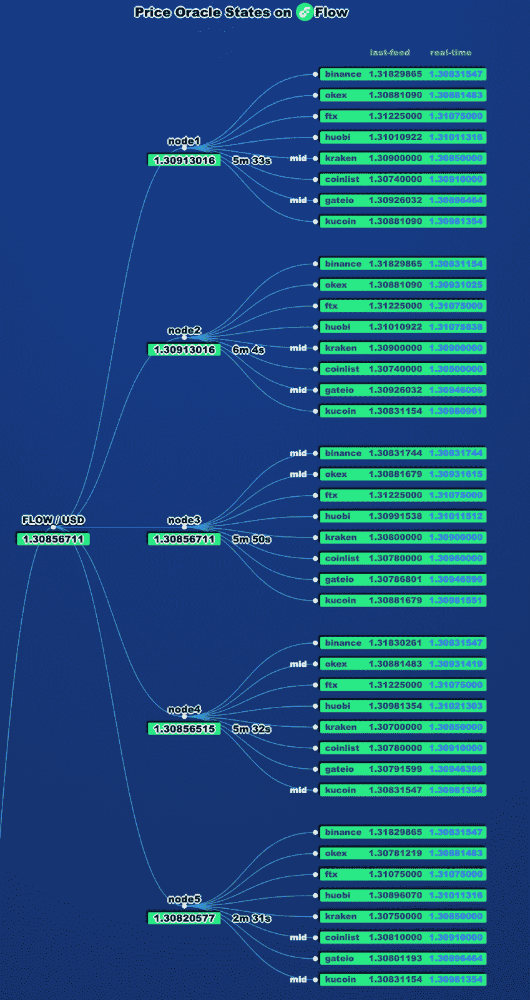

oracle smart contracts 经过审核，所有 5 个白名单节点目前都由我们(Increment Labs 团队)运行，我们计划添加更多价格来源、更多节点，并邀请其他团队/项目运行 oracle 节点，但不是现在。我们认为，从一开始就由专业团队来评估和管理风险是必要的，同时保持透明，实现逐步分权是最安全和最好的策略。如果你对此感到不安全或不舒服，最好不要使用货币市场产品。

## **3。智能合同风险**

该银行通过复杂智能合同中编码的业务逻辑全天候运行。任何缺陷都可能导致黑客的利用，从而造成资金损失。虽然我们对它的安全级别很有信心，因为所有的智能合约都经过了三轮[审核](https://docs.increment.fi/protocols/decentralized-money-market/audit-report)，包括:

*   增量团队内部审计
*   在未经许可的部署之前，由 Dapper 实验室审核
*   由第三方专业安全公司 Oak Security 审计

用户仍应意识到潜在的智能合约风险，不要投入输不起的资金。整篇文章不是金融建议，我们总是鼓励你做自己的研究，不要碰任何你不明白的东西。

# 用户指南

## 1.连接钱包

第一步是将应用程序与钱包连接，以使用货币市场。在本指南中，我们将继续使用 bloc 钱包。它还支持与 LilicoWallet 连接。

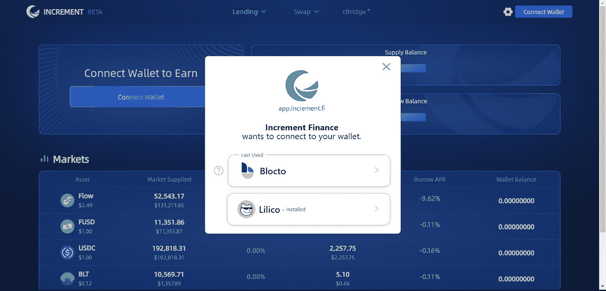

bloc 钱包需要您的电子邮件来登录/注册，一次性密码将发送到您的电子邮件。如果你经常使用 Blocto，它可能也会自动连接。

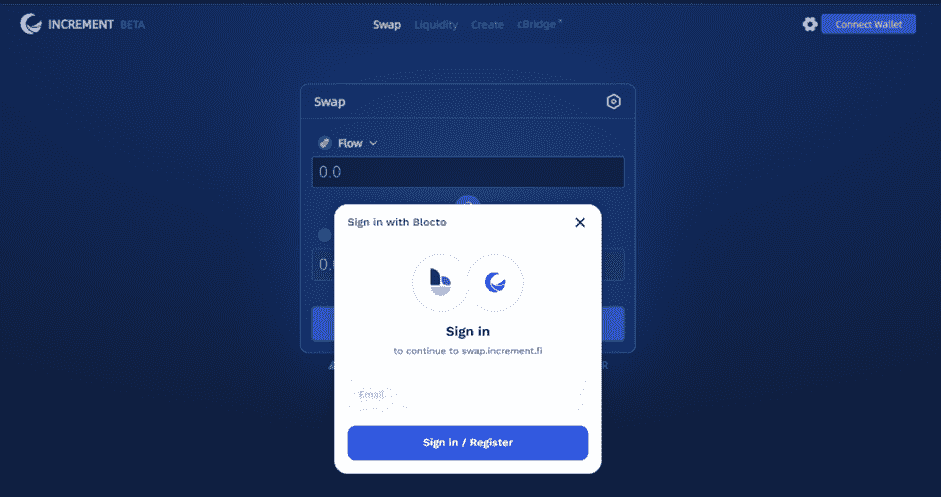

## 2.1.供应(存款)

选择您要存入的代币市场(目前有 FLOW、FUSD、USDC 和 BLT 可用)，点击“提供”按钮，然后批准交易:

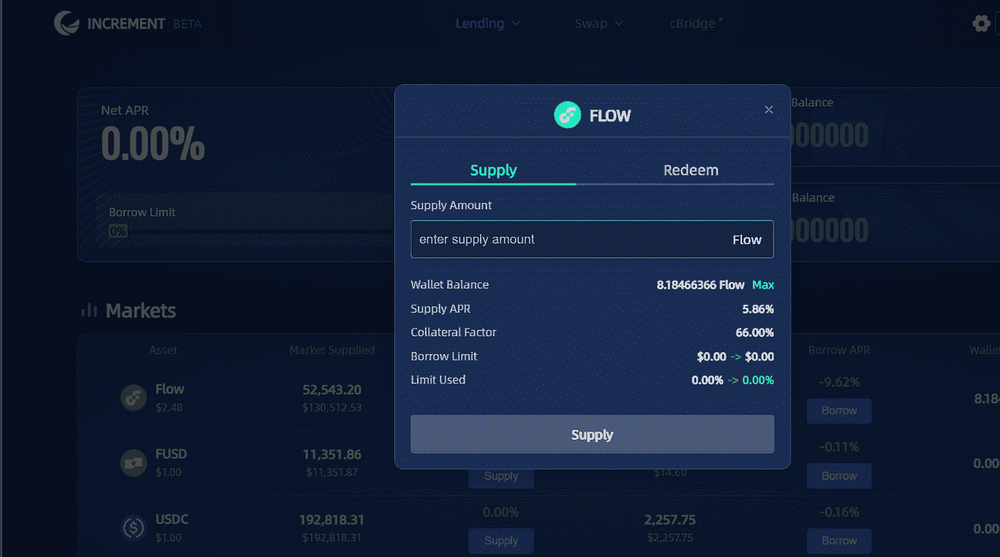

## 2.2.借

所提供的资金可以用作抵押，以借入其他可替代的代币。让我们以流令牌为例:

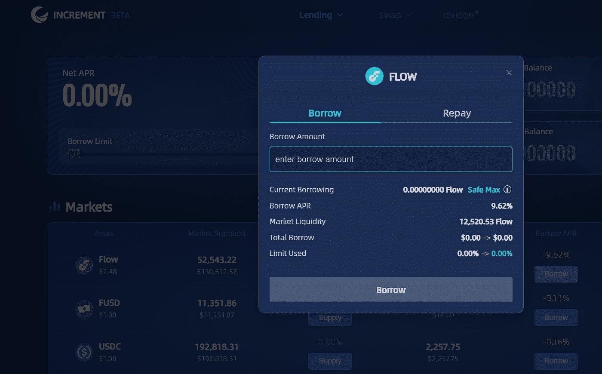

单击“安全最大值”自动填写借款金额，以便只使用最大借款限额的 60%。您可以手动编辑该值，但请记住，使用的借款限额百分比越高，帐户越接近清算。

一旦借入，页面状态将改变并显示您的头寸状态、净 apr 和供应/借入余额。

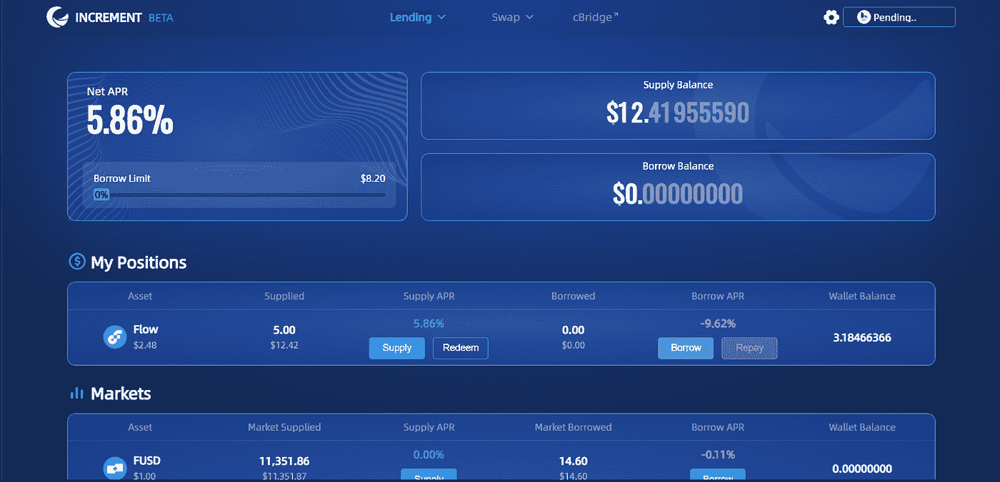

在本例中,“偿还”按钮是灰色的，因为用户没有需要偿还的借款头寸。

## 2.3.偿还

通过偿还借款金额加利息来降低借款限额百分比。点击“还款”按钮，切换到“还款”卡进行交易:

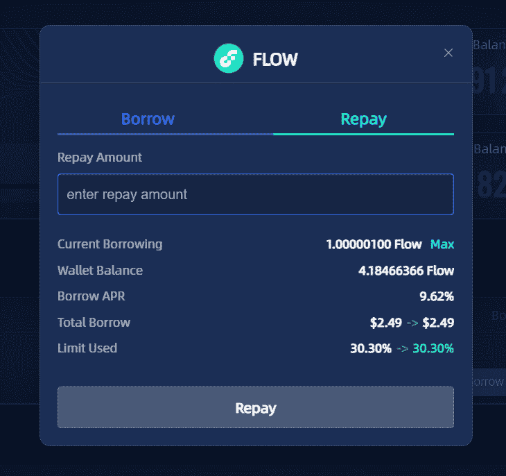

## 2.4.赎回(撤回)

通过点击“兑换”按钮并切换到“兑换”卡，提取所提供的资产和产生的收益:

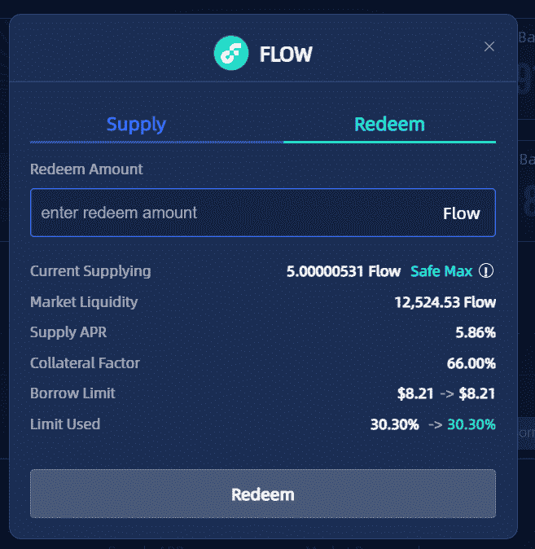

尽管如此,“安全最大值”标签是为了保护账户免于清算，并自动填写赎回金额，这可以手动修改。

## 3.了解市场数据

“/Markets”页面显示全球统计数据，如总 TVL、供应商和借款人数量，以及每个市场的数据，如市场流动性、供应 APR 和借款 APR 等。：

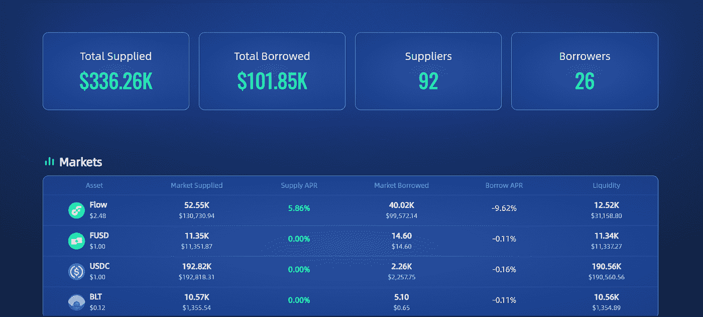

其他市场参数，如利率模型、抵押品系数等。可以通过单击资产列表来查看:

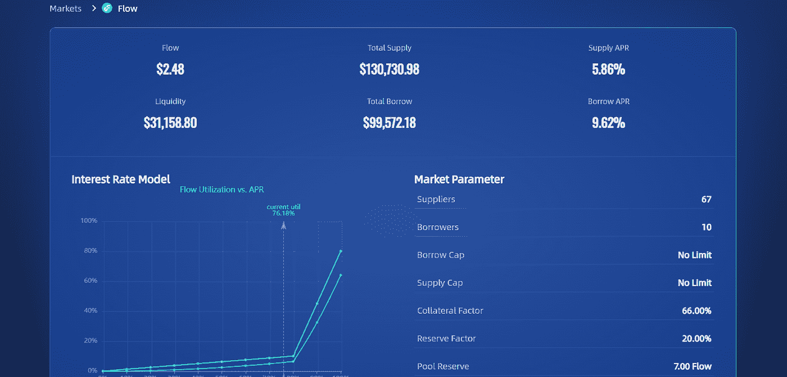

# 最终注释

同样，这篇文章不是财务建议，你应该总是做自己的研究。不过，接受去中心化融资的好处是显而易见的:你可以完全控制你的资产和钱包钥匙，而且这一切都是透明的，因为一切都在链上，由智能合同来管理和监管。

# 关于增量 Fi:

一站式 DeFi 平台可提高流动性，并在 Flow 区块链上创造机会。
**App**:[https://App . increment . fi](https://app.increment.fi)

**推特**:[https://twitter.com/incrementfi](https://twitter.com/incrementfi)

**不和**:[https://discord.gg/increment](http://discord.gg/increment)