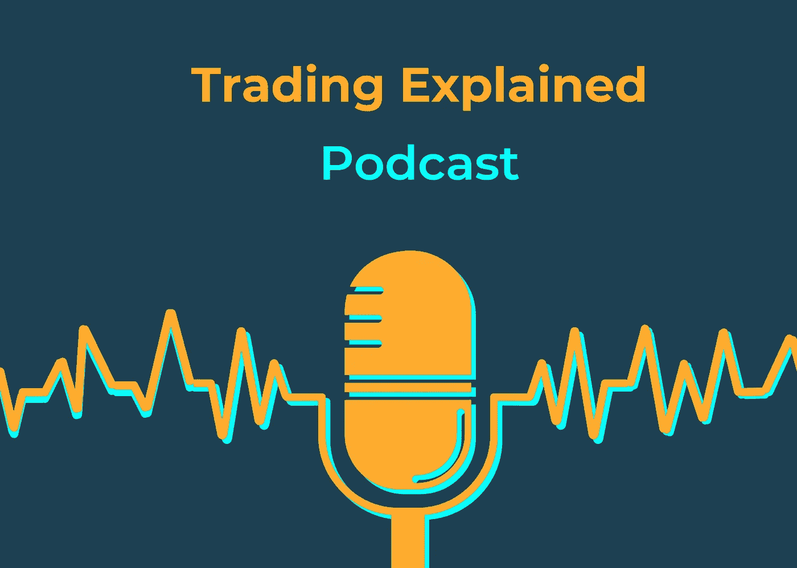

# 介绍 ArcTaurus 播客

> 原文：<https://medium.com/coinmonks/introducing-the-arctaurus-podcast-de2c8cb7a884?source=collection_archive---------55----------------------->

ArcTaurus 自豪地宣布我们的播客系列“交易解释”，创始人兼首席执行官 Jonty Small 与我们的常驻交易大师 Andrew 一起深入探讨自动化交易策略。Jonty 和 Andrew 拥有多年的自动交易经验，并且都是受过教育的专业数据科学家。

在我们的播客系列中，我们将深入探讨自动化交易策略和工程、风险管理等细节。

如果您有兴趣了解更多关于自动化您的加密交易策略的信息，以及 ArcTaurus 如何在没有任何编码知识的情况下轻松设置交易机器人，请查看我们的播客或访问我们的[网站](http://www.arctaurus.com)！

链接:

*   [YouTube](https://www.youtube.com/channel/UCmuXnSY2Q0Gw-E5IzQ2oFLA)
*   [Spotify](https://open.spotify.com/show/6pQh77gFjlS8RzmpJz8Jf8?si=8c25d375309e4460)

*注意:我们博客和播客上的内容纯属教育性质，不应理解为财务建议。交易加密货币本身就有风险，你不应该冒超过你能承受的损失。*

> 加入 Coinmonks [电报频道](https://t.me/coincodecap)和 [Youtube 频道](https://www.youtube.com/c/coinmonks/videos)了解加密交易和投资

# 另外，阅读

*   [OKEx vs KuCoin](https://coincodecap.com/okex-kucoin) | [摄氏替代品](https://coincodecap.com/celsius-alternatives) | [如何购买 VeChain](https://coincodecap.com/buy-vechain)
*   [ProfitFarmers 点评](https://coincodecap.com/profitfarmers-review) | [如何使用 Cornix 交易机器人](https://coincodecap.com/cornix-trading-bot)
*   [如何匿名购买比特币](https://coincodecap.com/buy-bitcoin-anonymously) | [比特币现金钱包](https://coincodecap.com/bitcoin-cash-wallets)
*   [瓦济里克斯 NFT 评论](https://coincodecap.com/wazirx-nft-review) | [比茨盖普 vs 皮奥克斯](https://coincodecap.com/bitsgap-vs-pionex) | [坦吉姆评论](https://coincodecap.com/tangem-wallet-review)
*   [如何使用 Solidity 在以太坊上创建 DApp？](https://coincodecap.com/create-a-dapp-on-ethereum-using-solidity)
*   [加密交易机器人](/coinmonks/crypto-trading-bot-c2ffce8acb2a) | [OKEx vs 币安](https://coincodecap.com/okex-vs-binance)