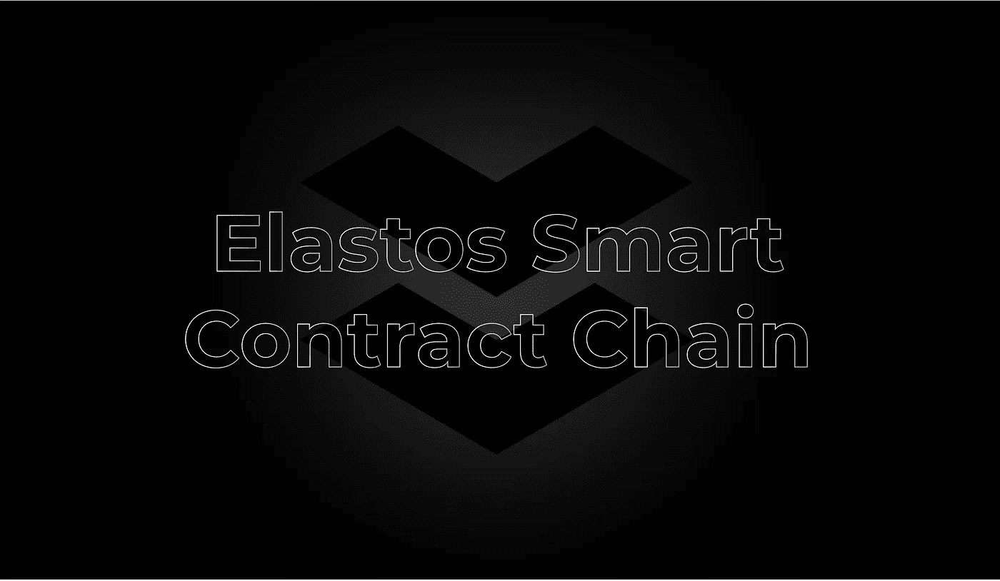

# 简介:Elastos 智能链(ESC)和交叉链操作手册

> 原文：<https://medium.com/coinmonks/introducing-the-elastos-smart-chain-esc-and-cross-chain-operation-manual-523a063b0dd3?source=collection_archive---------22----------------------->

Elastos 智能链(ESC)是 Elastos 技术堆栈中最通用、最强大、最有前途的组件之一，是一种完全兼容 EVM 的侧链，支持 Solidity 智能合同执行。受到 Elastos 社区支持的 DPoS 共识的保护，ESC 是一个高性能、可扩展的链，用于开发分散式应用程序(dApps)。用户和开发者都可以利用 ESC 来实现他们在以太坊上享受的相同功能和特性。

# **ESC:主要特性**

Elastos 智能链(ESC)支持一系列高效功能:

1)可靠性智能合同支持

ESC 支持执行用 Solidity 编写的智能合同，为 dApp 开发打开了一个可编程的环境。

2)来自比特币哈希力量的强大安全性

凭借其与 Elastos 主链的联系，ESC 受到比特币网络行业领先的 hashpower 的保护。

3) EVM 兼容性

在将 Solidity 智能合约支持引入 Elastos 生态系统的过程中，ESC 为大量区块链开发人员社区打开了大门，他们可以在 Elastos 上构建复杂的应用程序，并移植用 Solidity 编写的现有应用程序。

4)灵活、可扩展的侧链架构

和欣思的主链-侧链架构具有高度灵活性和高度可伸缩性。Elastos 主链支持大量用于可扩展性目的的相同侧链的开发，以及具有不同形式共识的大量独特侧链的开发。

5)分散融资

通过可编程智能合同模块，ESC 能够开发一个可互操作的 DeFi 应用生态系统。

# **ESC:Live 应用**

目前，许多 Elastos 社区团队都在 ESC 上运行应用程序:

1) Glide Finance —分散式交易所(DEX)

Glide Finance 是一个分散交易(DEX)协议，允许用户交易者以较低的成本享受高性能的交易环境。Glide 已经部署在 ESC 上，支持 ELA 和其他数字资产的分散交换，也有助于促进 Elastos 生态系统 DeFi legos 的发展。

2)订阅源—分散的社交媒体

Feeds 是第一个建立在 Elastos 生态系统中的去中心化社交应用。Feeds 与和欣思有着共同的愿景和目标:建立一个平台网络，为用户层面的自我所有权提供全面的保护。在 Feeds 上，用户拥有他们生成的数据，无论是评论、帖子、赞还是整个个人频道。除了支持已经活跃在主要社交应用中的核心功能，Feeds 还专注于社交媒体-原生 Web3 功能。用户已经可以在 Feeds 应用程序上直接创建 NFT，该应用程序通过 ESC 支持 NFT 功能。

3)电子城市— Web3 市场

Elacity 是一个基于 Elastos 智能链(ESC)的 Web3 市场和生态系统。Elacity 利用技术堆栈将 ESC 智能合同、服务和工具整合到一个用户友好的智能城市门户中。

4)奥丁 NFT — NFT 和元宇宙平台

奥丁 NFT 是一个分散的 NFT 和元宇宙平台。奥丁·NFT 致力于在元宇宙创造一个以中国文化艺术为特色的生态系统。奥丁的长期愿景是成为他们所说的“中国版的超级稀有”目前，ODin 利用 ESC 来验证 NFT 的所有权和交易。

# **ESC:操作手册**

**设置**

要在 MetaMask 上配置 Elastos 智能链网络，请执行以下步骤:

1)登录 MetaMask，点击“网络”，选择“添加网络”。

2)在相应的框中填入以下参数:

**网络名称** : ESC

**新的 RPC URL**:[https://api.elastos.io/esc](https://api.elastos.io/esc)

**链条 ID** : 20

**区块链浏览器**:[https://ESC . elastos . io](https://esc.elastos.io)

**使用影子令牌进行跨链操作的说明**

ShadowTokens 是一座跨链桥，在 Elastos 主链、HECO 链和以太坊之间运行。使用 ShadowTokens，用户可以在三个链之间高效、安全地转移数字资产(以太网、ELA 和任何 ERC20、ERC677 或 ERC827 令牌)。想要将资产从以太坊或 HECO Chain 发送到 ESC 的用户必须首先通过 ShadowTokens 将资产发送到 Elastos 主链。然后，用户可以通过 Elastos Essentials 将他们的资产从 Elastos 主链发送到 ESC 来完成交易。

**从 Elastos 到 Ethereum 的跨链传输说明**

1)参观 https://tokbridge.net。将钱包(MetaMask 或 WalletConnect)连接到 Elastos 网络。连接到网络后，你的地址会显示在右上角的导航栏中，“Max”按钮会显示在“ELA 平衡”的位置。此外，该页面将显示两个 ELA 余额:

I .上面的余额代表当前网络上的资产(Elastos)。

二。较低的余额代表目的网络(以太坊)上的资产。

页面上会有“锁定位置”、“释放”、“刻录”和“铸造”的徽标，这些徽标会根据您选择的资产而变化。在这种情况下，ELA 将被锁定在 Elastos 主链上，其影子令牌(以太坊上的 ELA)将在以太坊上以 1:1 的比率成为 mint，并由相关的智能合约管理。当 ELA 被转移回 Elastos 主链时，“以太坊上的 ELA”令牌被烧掉，主链 ELA 被释放到 ESC 上的指定地址。该流程适用于所有资产转移。

2)输入您想转移到以太坊的 ELA 金额。最低转账金额为 1 ELA。需要注意的是，ELA 用于 ESC 上的燃气费。因此，应该保留一些 ELA 来支付交易费用。当您输入有效金额时,“下一步”按钮将被激活。单击“下一步”按钮继续。

* *注:地址栏可以更改。如果您想将资产转移到另一个地址，可以更改该地址。在大多数情况下，这个函数可以也应该被忽略。**

3)接下来，您将看到一个确认页面。确保交易详细信息正确，然后单击“确定”。

4)应用程序将提示您授权钱包中的合同。有一个默认的燃气费，不需要调整。但是，如果您希望加快交易确认，您可能会增加费用。

* *注:转让 ELA 和瑞士联邦理工学院不需要授权。但是，对于 ERC-20 代币，将有一个费用授权请求，以允许智能合约从代币合约中检索资金，并且将有一个后续请求来确认桥接转移。**

5)界面将显示传输进度，包括关于原始网络上的块确认和桥接验证交易的信息，以及在目的网络上生成或释放您的资产。当事务完成时，一个链接将提示用户在目标链的块浏览器上查看已确认的事务。

* *注意:在某些情况下，传输时间可能会比预期时间长，即超过 5 分钟。这是因为大桥使用的是固定的燃气费。如果您遇到这样的延迟，请检查块浏览器的连接。无论如何，请放心，您的资金是安全的，尽管有延迟，交易仍将成功完成。**

**以太坊到和欣的跨链传输说明**

1)在 Metamask 中，将网络切换到以太坊，等待应用程序同步，然后检查您在以太坊网络上的余额。

2)要查看您在以太坊上制作的 ELA，请单击“ETH”下拉菜单，打开默认令牌列表，然后选择“ELA”。

* *注意:您也可以通过单击“切换”图标来检查相反的桥接方向，但您需要首先在 Metamask 中切换网络。否则，它可能不会自动将您的钱包连接到所需的网络。**

* *注意:您也可以通过在搜索栏中粘贴令牌合同地址来添加自定义令牌。**

3)要将 ELA 从以太坊转移到 Elastos，重复上述相同的过程。现在反方向转移，你可以在以太坊上燃烧 ELA 代币，在和欣思上释放原始的 ELA。但如果从以太坊发起转账，由于需要更大的确认量，燃气费会高很多。当然，更昂贵的交易应该提前考虑。

**在 ESC 上充值的说明**

1)打开 Elastos Essentials，将网络切换至“Elastos”，选择“mainchain ELA”，点击“交易和转账”。

2)进入下一页，选择“转账”，然后选择“ELA 智能连锁”

3)输入存款金额，确认信息，点击“充值”，等待充值完成。

和欣智能链是一项激动人心的多维技术，刚刚开始引起和欣生态系统中应用程序开发人员的关注。ESC 及其功能一直在不断优化和改进，开发人员的兴趣也在快速增长。为了跟上 ESC 继续支持现有和即将推出的应用中的新的和创新的生态系统用例，请关注 CR Herald，并在官方 Elastos Info Medium 博客上了解最新动态。

> 加入 Coinmonks [电报频道](https://t.me/coincodecap)和 [Youtube 频道](https://www.youtube.com/c/coinmonks/videos)了解加密交易和投资

# 另外，阅读

*   [最佳期货交易信号](https://coincodecap.com/futures-trading-signals) | [流动性交易所评论](https://coincodecap.com/liquid-exchange-review)
*   [南非的加密交易所](https://coincodecap.com/crypto-exchanges-in-south-africa) | [BitMEX 加密信号](https://coincodecap.com/bitmex-crypto-signals)
*   [MoonXBT 副本交易](https://coincodecap.com/moonxbt-copy-trading) | [阿联酋的加密钱包](https://coincodecap.com/crypto-wallets-in-uae)
*   [雷米塔诺评论](https://coincodecap.com/remitano-review)|[1 英寸协议指南](https://coincodecap.com/1inch) | [购买 Floki](https://coincodecap.com/buy-floki-inu-token)
*   [MoonXBT vs Bybit vs 币安](https://coincodecap.com/bybit-binance-moonxbt) | [Arbitrum:第二层解决方案](https://coincodecap.com/arbitrum)