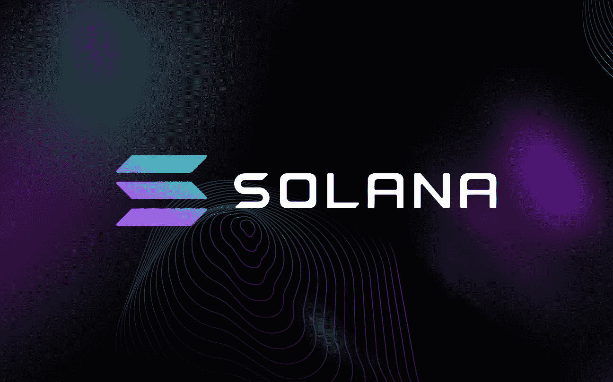
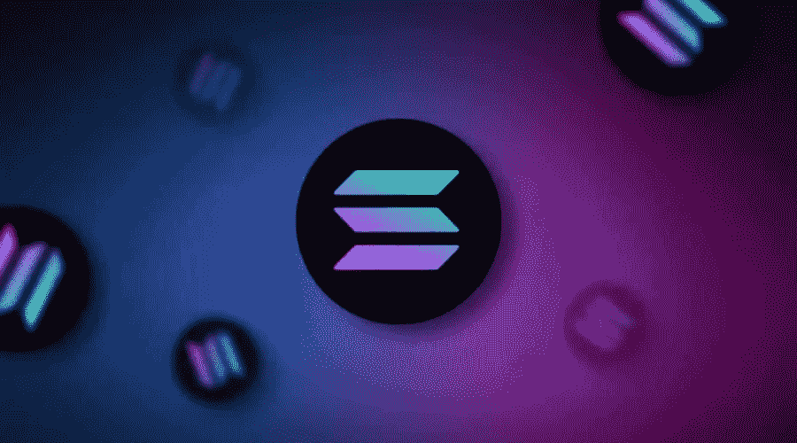
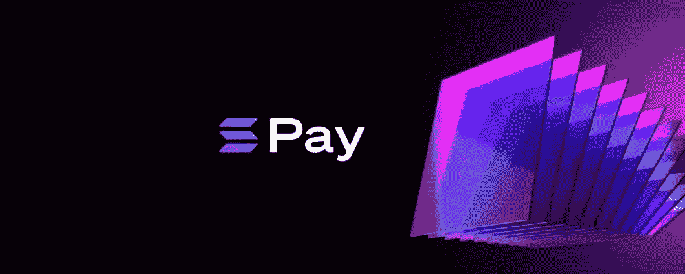

# 介绍索拉纳

> 原文：<https://medium.com/coinmonks/introduction-solana-83f9cb2101bf?source=collection_archive---------51----------------------->

索拉纳项目是由亚科文科发起的，他是一名熟练的软件开发人员，曾在高通工作。Solana 是第 1 层，它也被提议作为传统支付方法(如 Visa 和 Mastercard)的替代。

Solana 仅在四年前创建，今天它在数量和支持方面是最受赞赏的第 1 层之一。

它是如何工作的

区块链基于 PoH(历史证明)算法，该协议始终基于用 PoS 表示的概念，因为 Solana 验证者必须在赌注中有一定数量的 SOL 才能投票。

Solana 上的所有事务都用 SHA256 函数散列。系统接受一个输入并产生一个输出，然后使用这个输出作为下一个散列的输入。验证器将转换添加到块中。Solana 技术的真正核心是时间戳。加密时钟在达到有效性之前向交易提供时间戳。

SOL 令牌

索尔是区块链代币，大约有 511，616，946 枚代币，流通中的供应量为 337，328，595.66
索尔被用作奖励和支付佣金。就代币而言，一个奇怪的事实是，索拉纳实验室团队向风投提供代币来获得资金。这不是一件坏事。

索拉纳生态系统

目前，索拉纳在 NFT 地区也很受欢迎，人们对基于索拉纳区块链创建 NFTs 的兴趣大增，这也是由于费用较低。
基于 Solana 的虚拟现实项目也如雨后春笋般涌现，还有像 Star Atlas 这样的视频游戏。

一个非常有趣的项目是 Solana Pay，它旨在成为全球范围内授权的日常支付手段。

总之，我认为 Solana 是一个有效的项目，它也旨在对抗加密货币之外的金融世界。社区和风投的支持对于确保最初的想法得以实现至关重要。

*   本文并不代表投资上述项目的财务建议或激励措施。每篇提议的文章都讨论了这些加密货币的技术和技术未来。

> 加入 Coinmonks [电报频道](https://t.me/coincodecap)和 [Youtube 频道](https://www.youtube.com/c/coinmonks/videos)了解加密交易和投资

# 另外，阅读

*   最佳[密码交易机器人](https://coincodecap.com/best-crypto-trading-bots) | [购买索拉纳](https://coincodecap.com/buy-solana) | [矩阵导出评论](https://coincodecap.com/matrixport-review)
*   [酷卡点评](https://coincodecap.com/coldcard-review) | [BOXtradEX 点评](https://coincodecap.com/boxtradex-review)|[Uniswap 指南](https://coincodecap.com/uniswap)
*   [比特币基地点评](/coinmonks/coinbase-review-6ef4e0f56064) | [德里比特点评](/coinmonks/deribit-review-options-fees-apis-and-testnet-2ca16c4bbdb2) | [FTX 点评](/coinmonks/ftx-crypto-exchange-review-53664ac1198f)
*   [Coinmetro 点评](https://coincodecap.com/coinmetro-review) | [VirgoCX 点评](https://coincodecap.com/virgocx-review)
*   [法国 4 大最佳加密货币交易平台](https://coincodecap.com/copy-trading-platforms-france)
*   [从 WazirX 转向 CoinDCX 的 5 个理由](https://coincodecap.com/reasons-to-switch-from-wazirx-to-coindcx)
*   [比特币点评](https://coincodecap.com/unocoin-review) | [最佳数字加密货币](https://coincodecap.com/best-crypto-staking-coins)