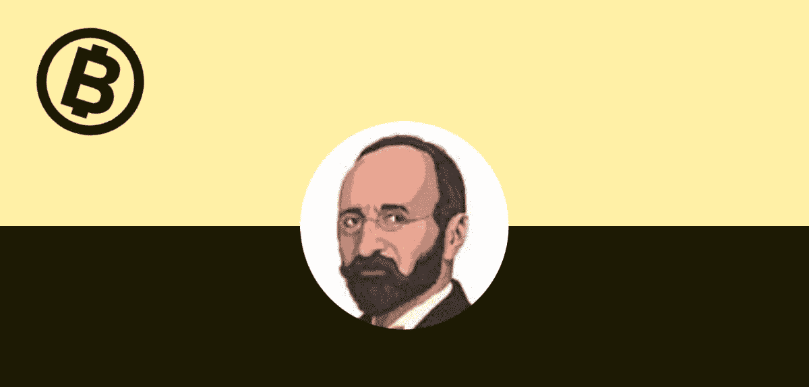

# 第一部分:奥地利经济学简介

> 原文：<https://medium.com/coinmonks/introduction-to-austrian-economics-54adae65d38b?source=collection_archive---------25----------------------->

这是我系列文章的第一部分，我从奥地利经济学的角度来审视比特币。这一部分是关于奥地利经济学派使用的一些核心研究方法的简短介绍。在这里阅读其他部分:

*第一部分:* [*奥地利经济学简介*](https://satoshibaggins.medium.com/introduction-to-austrian-economics-54adae65d38b) *第二部分:* [*货币的起源*](https://satoshibaggins.medium.com/origin-of-money-e04e756578e7) *第三部分:* [*货币的功能和性质*](https://satoshibaggins.medium.com/the-function-and-properties-of-money-975c8f52857)

*第四部分:* [*透过奥地利经济学的镜头看比特币的出现*](https://satoshibaggins.medium.com/the-emergence-of-bitcoin-through-the-lens-of-austrian-economics-36cf7bcd09ff)

*第五部分:* [*回归定理和原型货币悖论*](http://The regression theorem and proto money paradox)

*第六部分:* [*比特币与回归定理*](https://satoshibaggins.medium.com/bitcoin-and-the-regression-theorem-2d290167ccf1) *第七部分:* [*比特币的畅销*](https://satoshibaggins.medium.com/salability-of-bitcoin-845f393ec844)

—

奥地利经济学是一个经济思想流派，是一种经济思维方式。像所有其他经济思想流派一样，奥地利经济学旨在描述社会世界。奥地利经济学是一个经济分析的框架:一套关于市场和经济如何基本运作的分析假设。在根本层面上，奥地利学派的分析框架从具体的假设出发分析现象，并评估各种主张是否有道理或基于有缺陷的逻辑。从这些假设中，我们可以开始对多个主题进行逻辑推理。这使得奥地利经济学成为基于演绎推理的人类行为科学。演绎思维是一种个人可以不依赖外部世界、不亲身经历就能思考的东西。这种思维被用来发现支配社会世界的普遍适用的经济规律，社会世界由人及其相互作用组成。

人们需要理解奥地利经济学中的一些核心假设，才能将奥地利学派的分析框架更广泛地应用于货币现象，更具体地应用于比特币。

**人类行为与行为学**

核心前提是经济学源于*行为学*，研究人类的行动。行为学是一种演绎研究方法，知识来自推理能力。从观察到的或先前推导出的前提出发，用逻辑的、口头的演绎来探索特定的主题是最好的。这与自然科学形成对比，在自然科学中，实验是最基本的分析方法。被当作真理的假设可以被称为公理(假设)，或者不证自明的陈述。行为学的核心公理是人类行动，这是人类有目的地行动以实现其目标，即满足其需求的前提。

使用行为学和以人类行为公理为出发点的演绎推理，使得对人类行为作出普遍的和客观的结论成为可能。在奥地利经济学中，使用行为学是因为经济学被认为是一门社会科学，因此不应该依赖自然科学的方法，因为它们处理的是根本不同的问题。

**方法论个人主义**

所有节约都基于方法论个人主义，即主观的个人动机，而不是群体动力，来解释社会现象的原则。这意味着群体的行为不能解释社会现象和市场；群体不会思考、感受、重视和行动。个人有。为了充分描述一群人的行为，我们应该把注意力集中在一个群体中的个体身上；所有的经济生活都始于个人，也止于个人。因此，所有的市场都是人类行为和自发事件的结果，而不是人类的设计。市场是一个进化过程，随着时间的推移，从个人的选择中产生。按照这种逻辑，市场是自组织和自适应的有机体，我们作为人类，不能随心所欲地构建和重建它们。另一个相关的原则是*方法论的独特性*，它关注的是单一的具体行动，而不是整体和共性。

> 抱歉这样打断你的阅读！但是你想要更多但是不同的比特币内容吗？我可能有你需要的东西。
> 
> 它叫做 TLDR 比特币。
> 
> 每周我花 20 个小时看比特币新闻。每个星期天，我都会在一封 3 分钟的邮件里分享我学到的东西。
> 
> 我会一勺一勺地给你讲最好的比特币故事，还夹杂着一些堕落的幽默。
> 
> 你可以在这里订阅:[https://tldrbtc.substack.com/](https://tldrbtc.substack.com/)
> 
> 下周日见，
> 
> 巴金斯
> 
> 好吧，回到奥地利经济学

**方法论主观主义**

行为学和经济学不提供关于个人目标的价值判断，也不提供他们是好是坏的价值判断。它接受主观目的是真实的，并且不去评判它们。它只关注个人实现个人最终目标的工具。目标是多样的，就像个人是多样的存在一样。方法论主观主义解释了个人如何基于他们的知识或思想以及他们对自己的决定和选择的期望做出判断和选择。方法论上的主观主义决定了品味、偏好、成本、价值和效用是如何主观的。只有产品或服务的接受者才能评估该产品或服务的价值。为了理解一个人的行为，一个人应该试着只参照这个人的知识、信仰、感知和期望来看待他的行为。

方法论上的主观主义与另一个重要概念密切相关:*机会成本*，经济行为者评估必须牺牲的替代方案的成本。奥地利经济学派认为机会成本是主观的，因为只有个人能够知道他们想象他们会从他们没有做出的选择中得到什么。这是因为成本从来没有经历过。毕竟，我们为了另一个机会放弃了它，因此，又付出了另一个未知的代价。就像机会成本一样，一切事物的价值都是主观的。

**边缘主义**

边际分析理论的中心概念是边际效用理论*。这一理论认为，个人的总体效用是由最后一个单位在总单位数中的重要性决定的。这导致正或负的边际效用，取决于增加的单位是增加还是减少总效用。边际效用理论与主观价值紧密相连，它解释了社会世界中所有事物的价值。这与边际效用递减定律联系在一起，该定律指出，随着商品数量的增加，它们在个人心目中的主观价值会减少。*

**时间偏好**

另一个关键概念是生产和消费的时间结构，即时间偏好，这是个人对现在和未来的估价比率。这个假设是，在所有事情都相同的情况下，个人更喜欢他们的目标尽早实现。所有人都有积极的时间偏好，可以观察到，如果他们总是喜欢晚一点而不是早一点达到目标，他们就永远不会行动。每当人们延迟满足他们的需求时，那是因为对未来的期望比现在能得到的更高。在个人的头脑中，未来的满足感需要得到比现在更高的足够重视，以补偿这种延迟。将延迟的主观成本与更高的未来满意度的主观估价进行比较。因此，延迟决定了时间偏好的程度。

经济科学的本质是发现支配节约个人的规律，也就是理解我们在经济生活中观察到的由个人有目的的经济行为产生的现象。总而言之，奥地利经济学的科学方法是接受基础行为推理，这种推理假设个人从事有目的的行为，而不是对外生触发因素的反身性。根据这一公理，经济学关注的不是人类应该如何行动，而是他们应该使用什么工具来达到他们的目标。

*在* [*第二部分*](https://medium.com/r?url=https%3A%2F%2Fsatoshibaggins.medium.com%2Forigin-of-money-e04e756578e7) *中，我将考察货币的起源和货币的本质。*