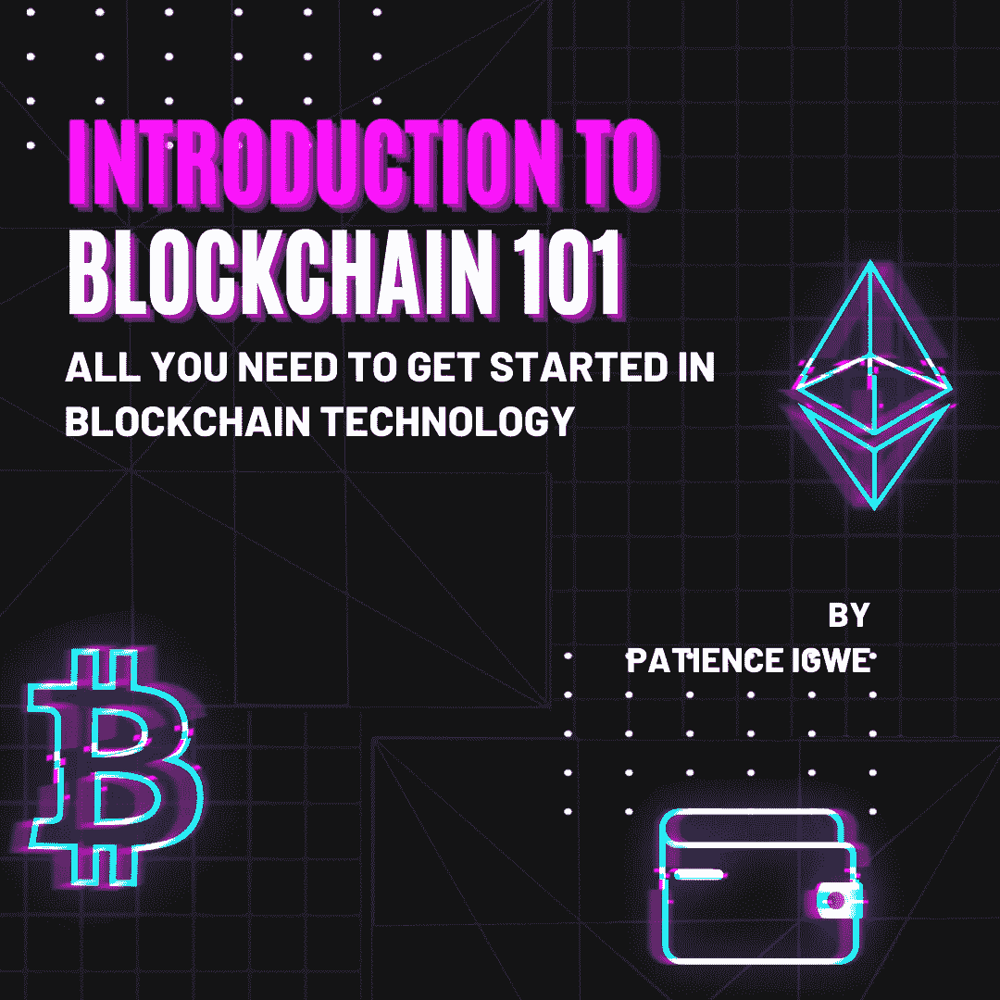
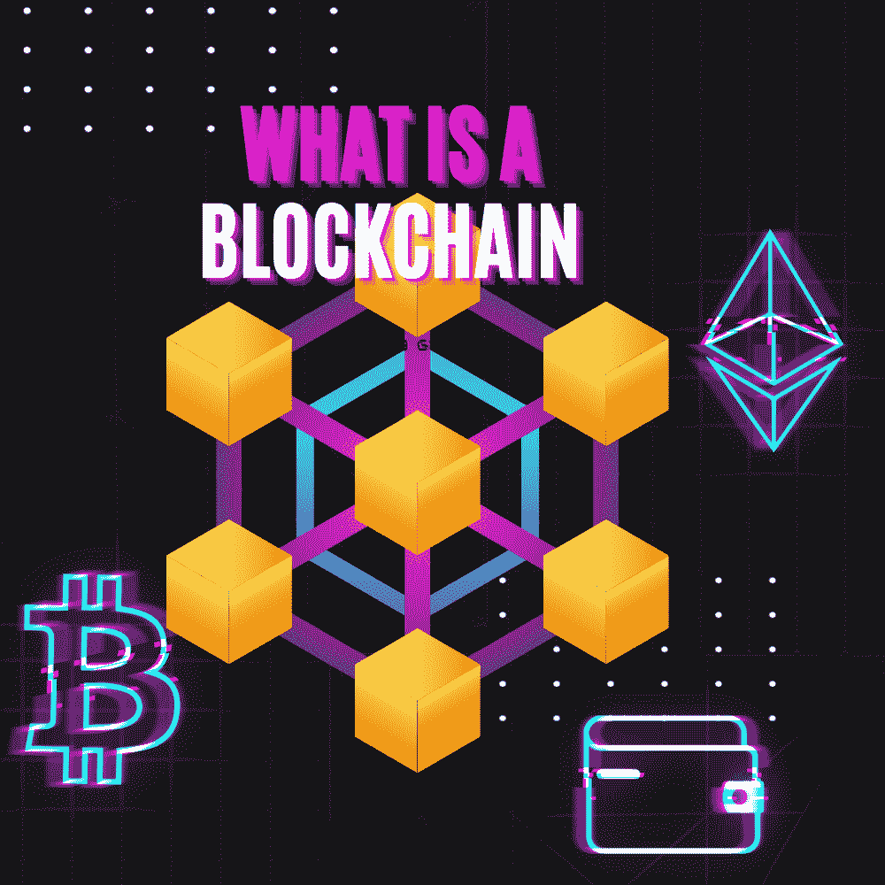
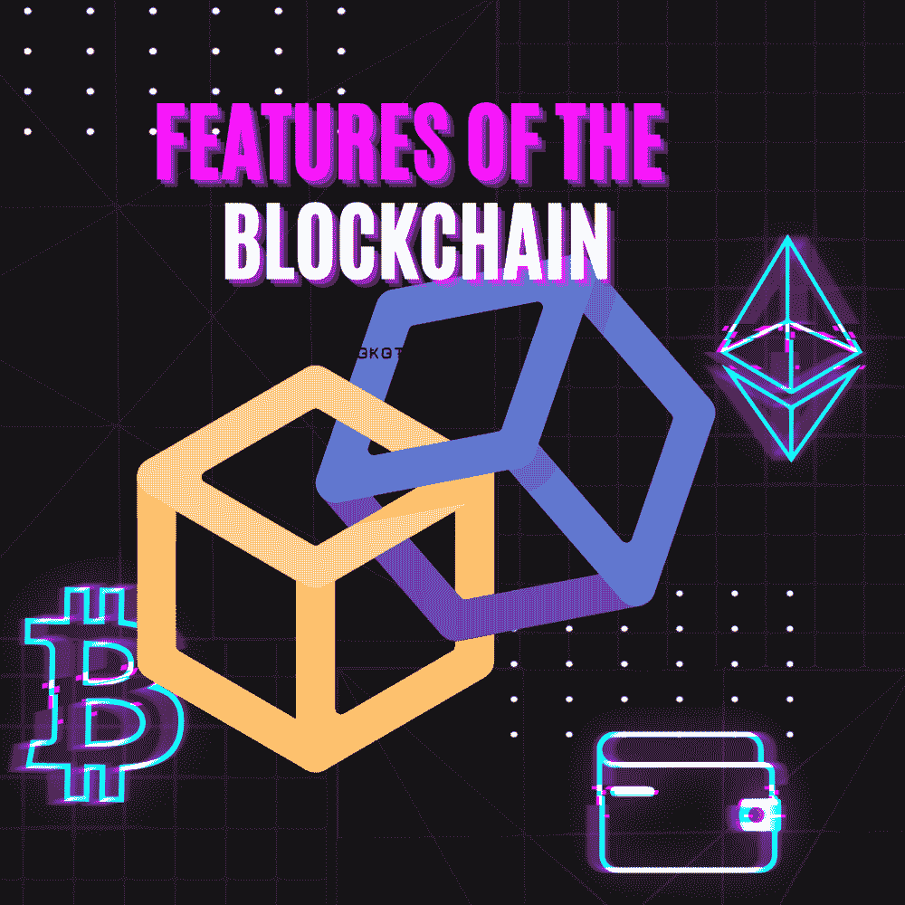
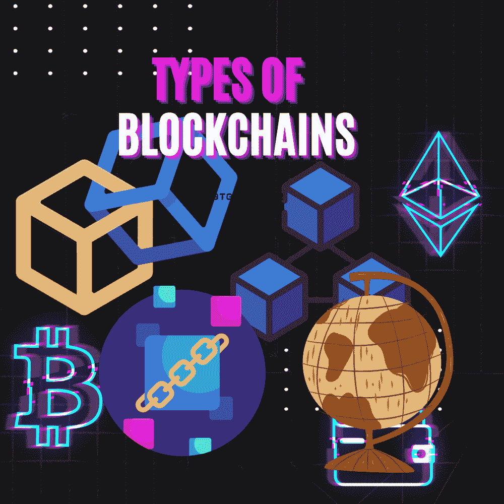

# 区块链 101 简介-区块链技术入门所需的一切

> 原文：<https://medium.com/coinmonks/introduction-to-blockchain-101-all-you-need-to-get-started-in-blockchain-technology-d6d3ec6c63e?source=collection_archive---------6----------------------->

introduction to blockchain 101- all you need to get started in blockchain technology

# 介绍

你有没有想过你存在银行里的钱会怎么样？银行是不是把这笔钱留着，等你来拿回去？你是否曾经历过或目睹过这样的场景:你想从银行提取一定数额的钱，但被告知无法提取或无法提取这笔钱？那是因为你银行里的钱不是你的钱。它被集中保管，任何事情都可能在任何时候发生。这就是区块链的演变过程。

## 什么是区块链？

区块链是在计算机网络的不同节点之间共享的分布式分类帐或数据库。它以电子方式存储信息，促进安全和分散的交易。

用 laymans 的话来说，区块链是一个记录簿，它记录了网络上所有的交易，而不需要第三方。例如，如果你想给某人汇款，你将需要银行的服务。这意味着银行将拥有你的详细资料，就像你将钱寄给的人的详细资料一样。此外，在某些情况下，可能存在延迟或网络问题，从而导致交易延迟。

区块链允许你在没有银行等中介的情况下发送交易，在区块链上进行的交易由与区块链相关的所有计算机共享，这意味着，很难删除或编辑在区块链上进行的任何交易。

## 区块链的特点

区块链的众多特色包括:

1.  分散化:区块链通过采用公钥加密作为区块链安全手段，消除了一些与集中保存数据相关的风险。公钥(由一长串数字和字母组成)是区块链上的一个地址，其他人使用它与您进行交互。通过网络发送的任何令牌都被记录为属于该地址。它没有名字和位置，所以你的身份是安全的
2.  开放性:区块链技术对用户友好，对所有人开放，不像一些传统的所有权记录，仍然需要物理访问才能查看。
3.  免许可:这意味着任何机构都可以在区块链进行交易。它不需要任何人的许可或批准。
4.  不可变:区块链是永久的，不可编辑的。这意味着每一笔交易都有一个永久的、不可更改的记录，跨越计算机的几个节点。
5.  分布式:所有网络参与者都有一份完整透明的分类帐副本。分布式账本技术将提供关于网络和交易中所有参与者的完整信息。
6.  安全性:区块链上的每一条信息都经过加密哈希处理，这意味着每一条数据在网络上都有唯一的身份。任何修改数据的尝试都意味着改变所有散列的身份，这是完全不可能的。

然而，区块链产业并不是一个新的创新。，其发展仍处于非常早期的阶段，这就是为什么需要更多的区块链开发商和工程师。区块链一旦启动就无法关闭，但是它可以工作、改进和验证。这是区块链的一个重要特征，如前所述，它连接在计算机的不同节点之间(透明)。这仅仅意味着，即使一台计算机关闭，也不会影响其他计算机，因为它们将继续平稳运行，或者可能不平稳。

有没有想过 2021 年发生了什么，脸书、Instagram 等社交媒体平台关闭了几个小时？世界各地都出现了恐慌，因为它影响了人们的业务和联系。事实上，根据跟踪停机的 downdetector 的统计数据，这是他们见过的最大的故障，因为它有来自世界各地的超过 1060 万个问题报告。

就连脸书的主人马克·扎克伯格也未能幸免，因为他损失惨重，还必须在社交媒体上向所有人道歉。

区块链的创新之处在于它可以全天候运行，保证数据记录的安全性，并且无需可信任的第三方就能产生信任。现在，我们将考虑不同类型的区块链

## 区块链的类型

区块链除了权力下放的一般特征之外，还具有不同的结构。一些区块链服务器是其他区块链的主机，这意味着其他区块链可以建立在它们的基础上，而其他区块链服务于其他目的。

有四(4)种不同类型的区块链结构，因此:

1.  公共区块链
2.  二等兵区块链
3.  区块链财团
4.  混合区块链

*   **公共区块链**

公共区块链是不需要权限就可以运行的区块链。任何人都可以加入，不管你是谁，因为他们是完全分散的。这种类型的区块链允许所有参与者拥有进入区块链的平等权利。它们主要用于交换和挖掘加密货币。这种类型的区块链有很多优点，但最重要的优点之一是它们完全独立于创建它们的组织。因此，如果创建他们的组织不复存在，公共区块链将仍然能够运行。

公共区块链的例子有比特币、以太币和莱特币等。

*   **列兵区块链**

私人区块链，也被称为受管理的区块链，是由单一实体控制的区块链。在私人区块链中，中央权力机构决定谁可以成为参与者。私立区块链只有部分权力下放，因为公众进入这些区块链完全受到限制。

私有区块链的例子有 Multichain、Hyperledger Fabric、Hyperledger 锯齿、Corda 等。

*   **区块链财团**

区块链联盟也被称为联邦区块链，是由一组组织(联邦单位)管理的许可区块链，而不是像私人区块链一样的一个实体。在这种类型的区块链中，组织的某些方面是公开的，而其他方面仍然是私有的。区块链财团比私人区块链享有更多的权力下放，导致更高的安全水平。

财团区块链的例子:马可波罗，能源网络基金会，IBM 食品信托，R3 等。

*   **杂交区块链**

混合区块链是由单个实体控制的区块链，但具有由公共区块链执行的监督级别，这是执行某些交易验证所必需的。

混合区块链的例子:Dragonchain，XinFin 的混合区块链等。

## 摘要

在区块链技术中，信息被分组收集，称为块。这些块有一个时间戳，表示交易的准确时间，这使得区块链上的每个人都可以看到，并且是不可逆的。此外，这些块具有一定的存储容量，当被填充时，这些存储容量被关闭并链接到先前填充的块。这种形式的数据链被称为区块链。

对于每一个区块链。有一个创世街区。起源区块是加密货币(如比特币)开采的第一个区块的名称。创世纪区块是区块链的第一个区块，包含了区块链本身的规则。为了加入或创建任何网络，必须包括 genesis 块的数据。然后，新添加的块之后的所有新信息被编译到新形成的块中，该新形成的块一旦被填充也将被添加到链中。

在开始使用区块链技术之前，您需要了解一些事情。我希望你今天学到了一些美好的东西。不要犹豫，在评论区分享你的观点或问题。

感谢阅读

# 关于作者

Igwe Ihuoma Patience 是一名自学成才的创意和特定行业内容作家，也是一名加密货币爱好者，拥有 2 年多的经验和不断发展的区块链空间的知识。

我擅长内容创作、文案撰写、字幕管理、视频编辑和手机图形设计，我教其他人如何在加密货币和区块链领域起步，我的目标是让区块链的学习和更新易于任何人理解。

> 加入 Coinmonks [电报频道](https://t.me/coincodecap)和 [Youtube 频道](https://www.youtube.com/c/coinmonks/videos)了解加密交易和投资

# 另外，阅读

*   [比斯勒评论](https://coincodecap.com/bitsler-review)|[WazirX vs coin switch vs coin dcx](https://coincodecap.com/wazirx-vs-coinswitch-vs-coindcx)
*   [7 大副本交易平台](https://coincodecap.com/copy-trading-platforms) | [BuyCoins 点评](https://coincodecap.com/buycoins-review)
*   [XT.COM 评论](https://coincodecap.com/profittradingapp-for-binance)币安评论 |
*   [SmithBot 评论](https://coincodecap.com/smithbot-review) | [4 款最佳免费开源交易机器人](https://coincodecap.com/free-open-source-trading-bots)
*   [杠杆代币](/coinmonks/leveraged-token-3f5257808b22) | [最佳密码交易所](/coinmonks/crypto-exchange-dd2f9d6f3769) | [Paxful 点评](/coinmonks/paxful-review-4daf2354ab70)
*   [加密套利](/coinmonks/crypto-arbitrage-guide-how-to-make-money-as-a-beginner-62bfe5c868f6)指南| [如何做空比特币](/coinmonks/how-to-short-bitcoin-568a2d0b4ae5)