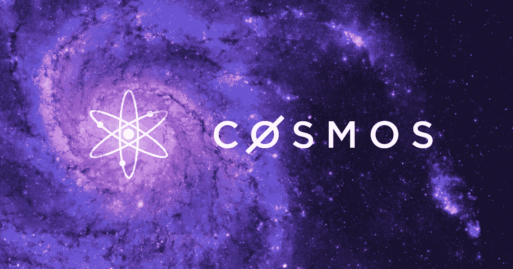
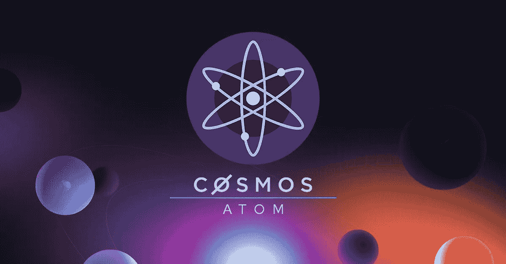
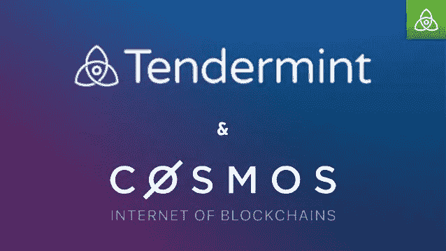
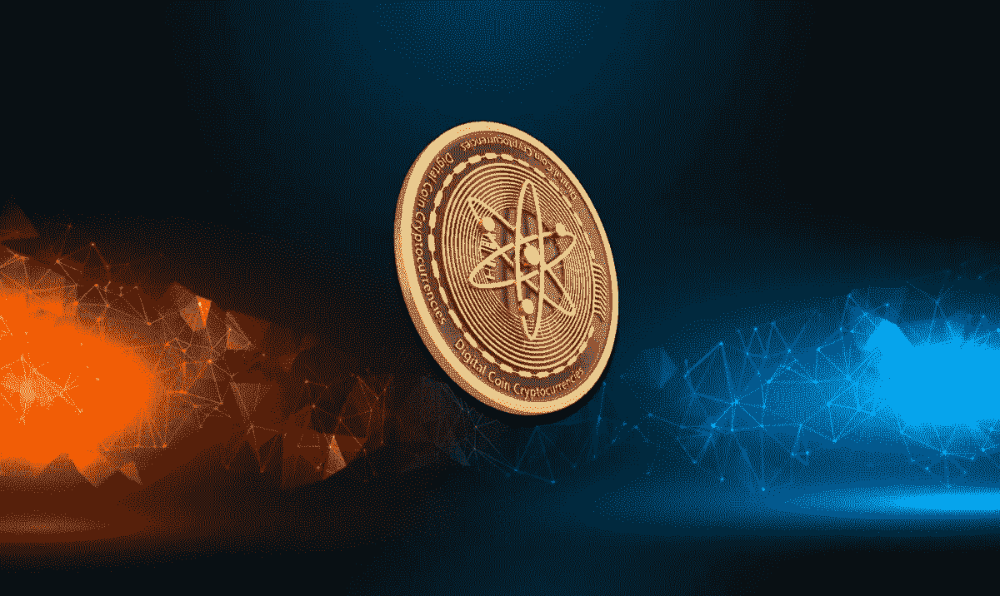
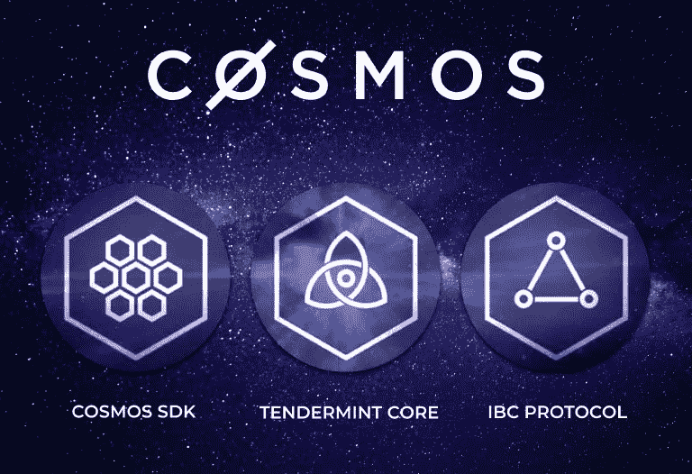

# 宇宙入门

> 原文：<https://medium.com/coinmonks/introduction-to-cosmos-6b6cccf7410?source=collection_archive---------21----------------------->

“区块链的互联网”

今天我们将谈论宇宙，它的生态系统和它的技术。Cosmos 的目标真的很大，它被提议作为各个区块链之间的桥梁。使它们可以互操作。
宇宙项目始于 2016 年 Jae Kwon 发表白皮书的时候。最初，为了发展这个想法，有人提议通过出售私人代币来筹集资金。大约几个月后，宇宙 ICO 到来了。流通中的当前报价为 286，370，297(取自 Coinmarketcap)。

Cosmos 背后的技术是什么？

一切的基础是宇宙中心。跟踪所有生态系统相关活动的区块链。假设两个区块链在宇宙中工作，所有三个区块链的活动都会被记录下来。每隔 5-6 秒就会生成一次数据块。

Cosmos 背后的算法叫做 Tendermint。

Tendermint 显然是基于 PoS 的。Tendermint 开发的时候，开发的重点是速度。因为为了连接更多的区块链，拥有更广阔的生态系统，速度肯定是首要目标。该算法被设计成高速 BFT SMR(状态机复制)。一些测试显示 10，000 TPS 是当前的极限，这是一个很大的数字。这对 Cosmos 的可扩展性来说是很好的数据。

原子，宇宙生态系统的象征

原子是宇宙的象征。令牌被用作系统验证器的额外奖励。与其他 PoS 系统一样，验证器必须使用原子的总和。根据他们的份额，他们可以投票。

福田，佣金的象征

这个令牌比 Atom 更快，并且具有更高的流动性。Fotons 被选择用于到集线器的各种链路之间的交易。

IBC 议定书

这个协议是一个宇宙工作狂。我们可以把它定义为他们技术中跳动的心脏之一。IBC 技术允许不同区块链之间的互操作性。IBC 可以在比特币和以太坊或其他现成的区块链之间架起一座桥梁。

总之，我们可以将 Cosmos 定义为加密货币/区块链领域有史以来最雄心勃勃的技术项目之一。毫无疑问，这是一颗真正的技术宝石，旨在解决桥接和互操作性的问题。

> 加入 Coinmonks [电报频道](https://t.me/coincodecap)和 [Youtube 频道](https://www.youtube.com/c/coinmonks/videos)了解加密交易和投资

# 另外，阅读

*   [CoinFLEX 评论](https://coincodecap.com/coinflex-review) | [AEX 交易所评论](https://coincodecap.com/aex-exchange-review) | [UPbit 评论](https://coincodecap.com/upbit-review)
*   [AscendEx 保证金交易](https://coincodecap.com/ascendex-margin-trading) | [Bitfinex 赌注](https://coincodecap.com/bitfinex-staking) | [bitFlyer 点评](https://coincodecap.com/bitflyer-review)
*   [Bitget 回顾](https://coincodecap.com/bitget-review)|[Gemini vs block fi](https://coincodecap.com/gemini-vs-blockfi)cmd |[OKEx 期货交易](https://coincodecap.com/okex-futures-trading)
*   [AscendEx Staking](https://coincodecap.com/ascendex-staking)|[Bot Ocean Review](https://coincodecap.com/bot-ocean-review)|[最佳比特币钱包](https://coincodecap.com/bitcoin-wallets-india)
*   [霍比评论](https://coincodecap.com/huobi-review) | [OKEx 保证金交易](https://coincodecap.com/okex-margin-trading) | [期货交易](https://coincodecap.com/futures-trading)