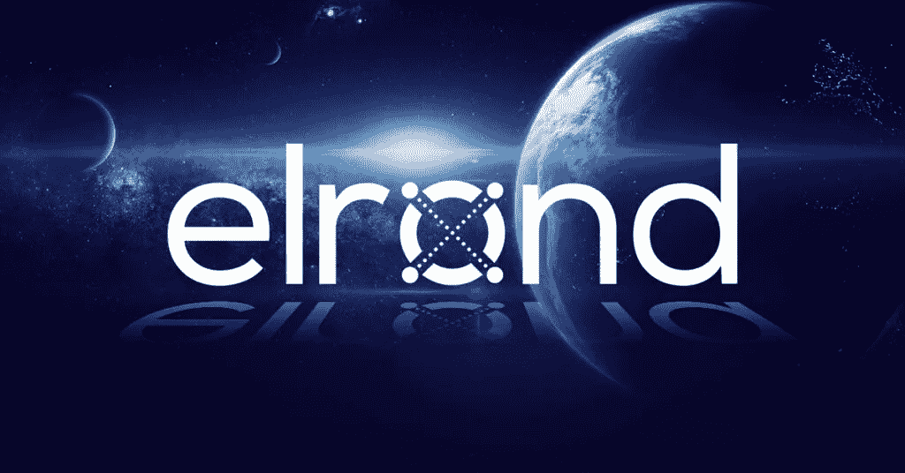
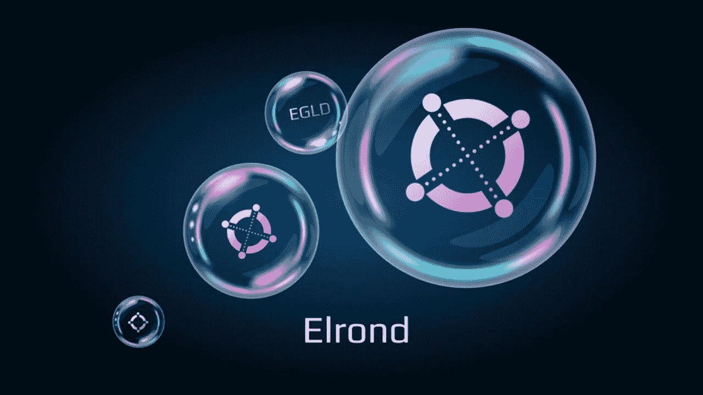

# 埃尔隆德简介

> 原文：<https://medium.com/coinmonks/introduction-to-elrond-71988f629cbd?source=collection_archive---------29----------------------->

埃尔隆德网络成立于 2017 年，而区块链的推出是在 2020 年。埃尔隆德是第 1 层，旨在解决可伸缩性问题，而不牺牲分散性。

埃尔隆德背后的技术

让我们从这个区块链的共识系统开始，与其他许多连锁店不同，它使用了一种创新的 SPoS。安全的赌注证明是基于著名的赌注证明算法，被许多区块链使用，很快也被以太坊使用。简而言之，SPoS 就是基于这一点:验证器是随机选择的，为了平均分配工作，验证器得到一个片段。作为回报，他获得 EGLD 代币作为奖励。和所有的赌注证明一样，这里验证者也必须押一笔赌注。

埃尔隆德区块链采用的方法被称为自适应状态分片。网络被划分成相互连接的碎片。节点的排列每 24 小时改变一次，它根据以前的配置重新平衡。

区块链有自己的虚拟机，名为埃尔隆德虚拟机。与 EVM 兼容，这总是一个很大的优点，因为这使得它与以太坊上开发的应用程序兼容。

网络的令牌

这个令牌被称为 EGLD，在最大可用性 31，415，926(来自 coinmarketcap 的数据)中，当前的流通量为 21，883，053—EGLD 在网络中使用，也是对验证者的奖励。

埃尔隆德进入了第一层战争，他用非常有趣和优秀的技术进入了第一层。SPoS 同意系统基于 PoS，但增加了几个新功能。以及允许更大的可扩展性的区块链技术，决定采用基于分片的系统。总之，埃尔隆德是一个非常好的项目，具有创新的技术和有限的令牌可用性。

> 加入 Coinmonks [电报频道](https://t.me/coincodecap)和 [Youtube 频道](https://www.youtube.com/c/coinmonks/videos)了解加密交易和投资

# 另外，阅读

*   最佳[密码借贷平台](/coinmonks/top-5-crypto-lending-platforms-in-2020-that-you-need-to-know-a1b675cec3fa) | [杠杆令牌](/coinmonks/leveraged-token-3f5257808b22)
*   最佳[加密制图工具](/coinmonks/what-are-the-best-charting-platforms-for-cryptocurrency-trading-85aade584d80) | [最佳加密交易所](/coinmonks/crypto-exchange-dd2f9d6f3769)
*   [比斯勒评论](https://coincodecap.com/bitsler-review)|[WazirX vs coin switch vs coin dcx](https://coincodecap.com/wazirx-vs-coinswitch-vs-coindcx)
*   [7 大副本交易平台](https://coincodecap.com/copy-trading-platforms) | [买币点评](https://coincodecap.com/buycoins-review)
*   [MyConstant 点评](https://coincodecap.com/myconstant-review) | [8 款最佳摇摆交易机器人](https://coincodecap.com/best-swing-trading-bots)
*   [Godex.io 审核](/coinmonks/godex-io-review-7366086519fb) | [邀请审核](/coinmonks/invity-review-70f3030c0502) | [BitForex 审核](https://coincodecap.com/bitforex-review)