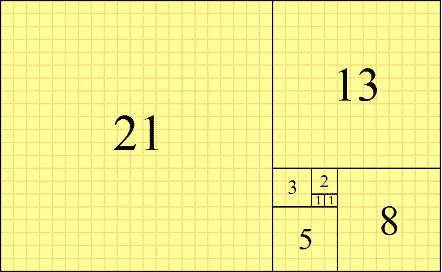
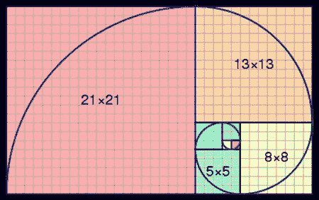
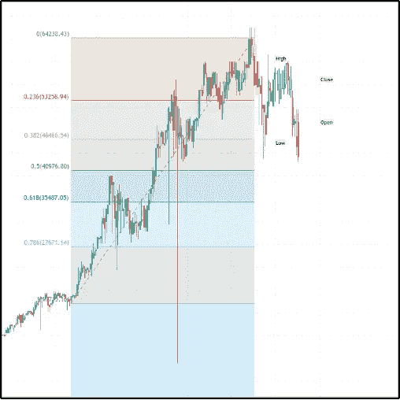
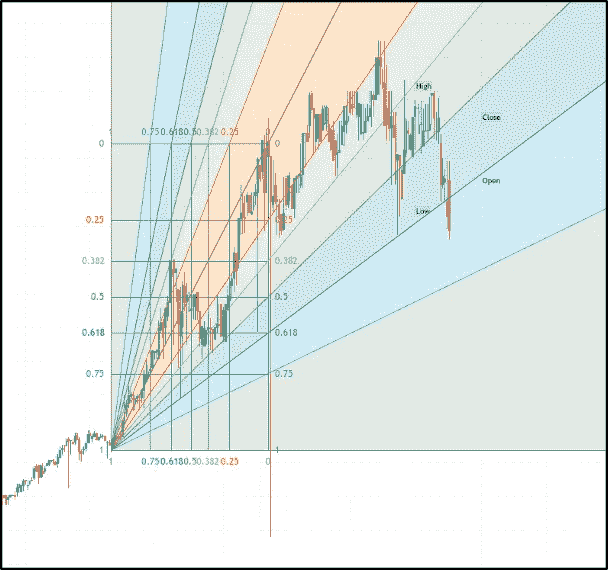
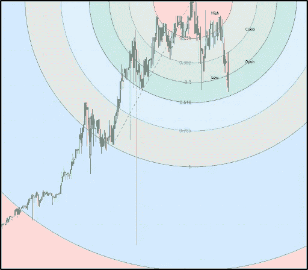

# 斐波那契指标简介

> 原文：<https://medium.com/coinmonks/introduction-to-fibonacci-indicators-b764d7585712?source=collection_archive---------32----------------------->

你可能听说过斐波那契数列、黄金螺旋或斐波那契数列。斐波那契数字和工具占据了指标市场的首位，并保持着狂热的追随者。斐波那契数列是由比萨的莱昂纳多(1180-1250)发明的，他在中世纪的北非长大。他的绰号是斐波那契。斐波那契写了一部名为“Libre Abaci”的作品，大致翻译过来就是“计算之书”。这本书普及了印度-阿拉伯数字系统，与当时使用的罗马数字系统相对。在书中，后来成为斐波那契数列的数字序列被用来计算兔子数量的增长。[【2】](#_ftn2)计算的前提开始于兔子种群的大小问题，在最初的一对兔子在一个月的不育期后每个月产生另一对兔子。(假设每对无限繁殖)。结果是一个等式，将前两项相加得到下一项:

F(n) = F(n) + F(n-1)

在这种情况下，会发生以下情况:

1 + 0 = **1**

0 + 1 = **1**

1 + 1 = **2**

1+ 2 = **3**

2 + 3 = **5**

5 + 3 = **8**

8 + 5 = **13**

8 + 13 = **21**

13 + 21 = **34**

21 + 34 = **55**

34 + 55 = **89**

55 + 89 = **144**

产生的序列和等式(前两项的和)称为斐波纳契数列。反过来，黄金螺旋是从斐波那契数列衍生出来的。斐波纳契螺旋和黄金数字都涉及 1.618 的“黄金比例”。斐波那契数列和黄金分割率在自然界中随处可见，并被证明是一种自然发生的模式，在松果、鲜花、各种水果和蔬菜、蜂群甚至人体中都可以找到。

> 交易新手？尝试[加密交易机器人](/coinmonks/crypto-trading-bot-c2ffce8acb2a)或[复制交易](/coinmonks/top-10-crypto-copy-trading-platforms-for-beginners-d0c37c7d698c)

从那以后，人们发现斐波那契数列在股票市场上占据主导地位。所有的斐波纳契市场工具都包含一条在两点之间画出的趋势线(通常是多倍线),主要表示支撑和阻力。

The Golden Numbers

The Fibonacci Spiral

**斐波那契回撤**

斐波纳奇回撤指标按照斐波纳奇序列绘制回撤线。回撤是一个微小的回调或方向的改变，所以回撤线是一条表明支撑和阻力(因此，回调和方向的改变)可能发生的线。

斐波纳契回撤是通过在两点之间画一条趋势线来创建的，通常是低点和高点，反之亦然。然后在与原始趋势线相交的点上自动绘制六条水平线。这些截距点出现在 0.0%、23.6%、38.2%、50%、61.8%和 100%的斐波纳契水平(以分数形式:0、0.236、0.382、0.5、0.618 和 1)。这些线确定了可能的支撑位和阻力位。

(tradingview.com) Fibonacci Retracement

**斐波那契迷**

斐波纳契扇形线类似于斐波纳契回撤指标。首先，在两点之间画一条趋势线(通常是一个极值点——高点或低点)。然后，从起点画出四条趋势线，穿过前面描述的斐波纳契百分比水平的第二个极值点下方的一条看不见的垂直线。

(tradingview.com) Fibonacci Fans

**斐波那契弧线**

斐波纳契弧是从两个极值点中的第二个延伸的垂直线向外延伸的半圆。半圆的弧线画在斐波那契水平趋势线的兴趣点上。

(tradingview.com) Fibonacci Arcs

其他斐波那契指标:

纤维楔-一组基于斐波那契的弧线。

Fib 通道——平行的基于斐波那契的趋势线。

纤维圆——11 层基于斐波那契的圆。

Fib 时区——代表基于斐波纳奇时间增量的潜在价格行为的垂直线。

笔记

根据各种原始资料，他的名字也可能是列奥纳多·斐波那契、莱昂纳多·博纳奇或莱昂纳多·皮萨诺。

斐波那契本人并不认为他的计算很重要。取而代之的是，在 1877 年，数学家爱德华·卢卡斯发表了关于这个数列的研究，为了纪念最初的作者，他将这个数列命名为“斐波那契数列”。