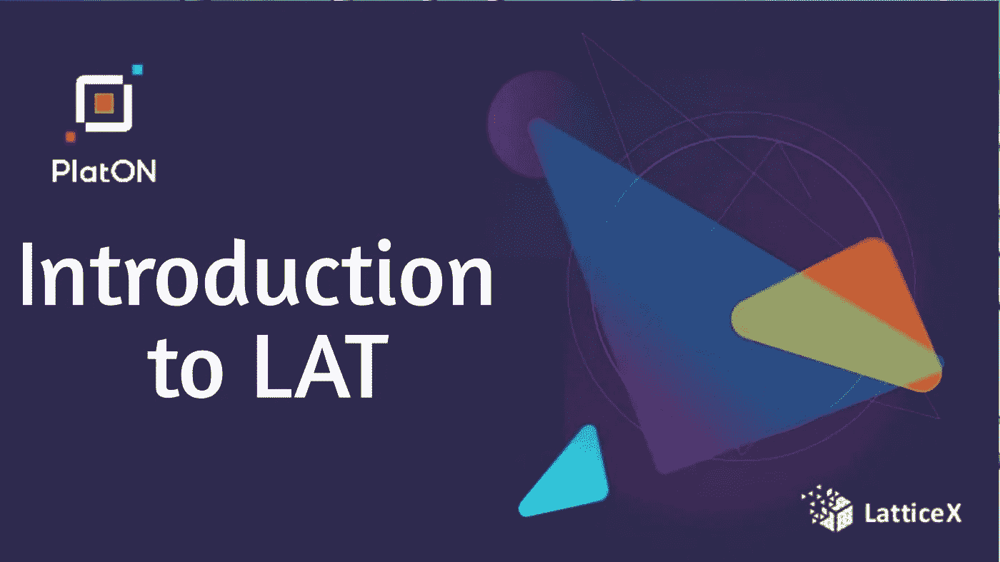

# LAT 简介

> 原文：<https://medium.com/coinmonks/introduction-to-lat-d790bb68454b?source=collection_archive---------33----------------------->

加密令牌是建立在另一种加密货币的区块链上的数字资产。一个[区块链](https://www.fool.com/investing/stock-market/market-sectors/financials/blockchain-stocks/)是一个数字分类账，以链接的块存储信息。这些信息可以是交易记录，也可以是在区块链上运行的成熟程序，它们被称为[智能合约](https://www.fool.com/investing/stock-market/market-sectors/financials/blockchain-stocks/smart-contracts/)。

> *例如，当一种加密货币的交易被确认时，它们将被分组到一个区块中，然后该区块将被添加到区块链中。*

# **柏拉图和加密令牌**

PlatON 由 LatticeX 基金会发起并推广。基于区块链的基本属性，在隐私保护计算网络的支持下，PlatON 提供了以“计算互操作性”为特征的下一代互联网基本协议。

它构建了由可验证计算、安全多方计算、零知识证明、同态加密、区块链技术等密码算法联合组装的计算系统，为全球人工智能、分布式应用开发者、数据提供者以及各类有计算需求的机构、社区和个人提供开源架构下的公共基础设施。

*每种加密货币都建立在区块链之上。如果一种加密货币没有自己的区块链，而是使用另一种加密货币的区块链，那么它被视为一种令牌。LAT 是柏拉图网络的原生令牌。*

**柏拉图网络的 LAT token 是什么？**

LAT 是柏拉图网络的原生令牌。它是一种数字货币。您可以通过 PlatON 网络传输它，或者使用基于 PlatON 和 LATs 构建的应用程序。

目前，您可以通过参与 LatticeX 基金会支持的[资助计划](https://latticex.foundation/grants)来获得 LAT，或者您可以跟进其他社区发展计划来获得 LAT。

# LAT 有什么独特之处？

拉特为普拉东提供燃料和安全保障

当您使用 LAT 或 PlatON 应用程序时，您需要支付少量 LAT 作为费用。该费用用于激励节点处理和验证您的交易。

在 PPOS 机制中，LAT 对网络非常重要。有了 LAT，人们可以委托给验证者，或者通过标记自己来成为验证者，这有助于维护 PlatON 网络安全性。验证者和删除者都可以获得 LAT 奖励。如果你想了解更多关于 LAT 的经济机制，[点击了解更多信息](https://devdocs.platon.network/docs/en/Economic_Model#platons-economic-solution)。

**LAT 充当数据交易市场的媒介**

作为一种支付媒介，lat 被用来结算 PlatON 市场上的数据和计算能力交易。柏拉图计算网络的参与者通过提供数据使用、计算能力和算法来赚取 lat。

# **你如何保护你最新代币？**

知道 PlatON 和 LAT 不受任何组织控制是非常重要的，因为它们是分散的。所以 LAT 是开放给大家使用的，这也意味着你需要认真对待自己的资金安全。

*   对自己的资金负责

集中交易会将你的钱包与一个用户名和密码联系起来，你可以用传统方式恢复。你需要选择一个值得信赖的，安全的交易所。如果该交易所遭到攻击或倒闭，你的资金就有风险。

*   备份助记符和私钥

钱包通常会给你一个种子短语或私钥，你必须把它写在安全的地方。这是你找回钱包的唯一方法。

# 在哪里浏览最新交易？

随着网络利用率的增长，链上的数据中会有越来越多有价值的信息。block explorer 可以为您提供链上的浏览块、交易、帐户、节点和其他活动的实时数据。PlatScan — PlatON 区块链探索者和分析平台，有英文和中文版本。

请随意访问以下网站，了解更多关于

[铂顿网络](https://medium.com/u/2e5e2c345b4f?source=post_page-----416ff1d5c1a0--------------------------------)

信息和学习资源

PlatON 网址:https://platon.network/en

阿拉亚网址:https://www.alaya.network/en

LatticeX 基金会:https://LatticeX . Foundation/home

社区媒体

中:https://medium . com/platon-network

Twitter:https://Twitter . com/PlatON _ Network

论坛:https://forum . latticex . foundation/

platon world:https://platon world . org/

微信官方:铂顿 _ 网络

开发者门户

PlatON Doc:https://dev docs . PlatON . network/docs/en/

alaya Doc:https://alaya . network/alaya-dev docs/en/

开源代码库

LatticeX 基金会:https://github . com/LatticeX-Foundation

柏拉图网络:[https://github.com/PlatONnetwork](https://github.com/PlatONnetwork)

阿拉亚网络:[https://github.com/AlayaNetwork](https://github.com/AlayaNetwork)

开发者计划

拨款:【https://latticex.foundation/grants】T2

开发商-事件:【https://github.com/AlayaNetwork/Developer-Events 

黑客马拉松:https://github . com/AlayaNetwork/Alaya-Season-黑客马拉松

dev-Bounty:https://github . com/LatticeX-Foundation/dev-bounties

作者达乌达·拉瓦尔。

LinkedIn 个人资料-

 [## 达乌达·拉瓦尔-尼日利亚|职业简介| LinkedIn

### 查看达乌达·拉瓦尔在世界上最大的职业社区 LinkedIn 上的个人资料。达乌达教育上市于…

www.linkedin.com](https://www.linkedin.com/in/daslaw26) 

> 加入 Coinmonks [电报频道](https://t.me/coincodecap)和 [Youtube 频道](https://www.youtube.com/c/coinmonks/videos)了解加密交易和投资

# 另外，阅读

*   [币安 vs FTX](https://coincodecap.com/binance-vs-ftx) | [最佳(SOL)索拉纳钱包](https://coincodecap.com/solana-wallets)
*   [如何在 Uniswap 上交换加密？](https://coincodecap.com/swap-crypto-on-uniswap) | [A-Ads 审查](https://coincodecap.com/a-ads-review)
*   [加密货币储蓄账户](/coinmonks/cryptocurrency-savings-accounts-be3bc0feffbf) | [YoBit 评论](/coinmonks/yobit-review-175464162c62)
*   [Botsfolio vs nap bots vs Mudrex](/coinmonks/botsfolio-vs-napbots-vs-mudrex-c81344970c02)|[gate . io 交流回顾](/coinmonks/gate-io-exchange-review-61bf87b7078f)
*   [CoinFLEX 评论](https://coincodecap.com/coinflex-review) | [AEX 交易所评论](https://coincodecap.com/aex-exchange-review) | [UPbit 评论](https://coincodecap.com/upbit-review)
*   [AscendEx 保证金交易](https://coincodecap.com/ascendex-margin-trading) | [Bitfinex 赌注](https://coincodecap.com/bitfinex-staking) | [bitFlyer 审核](https://coincodecap.com/bitflyer-review)