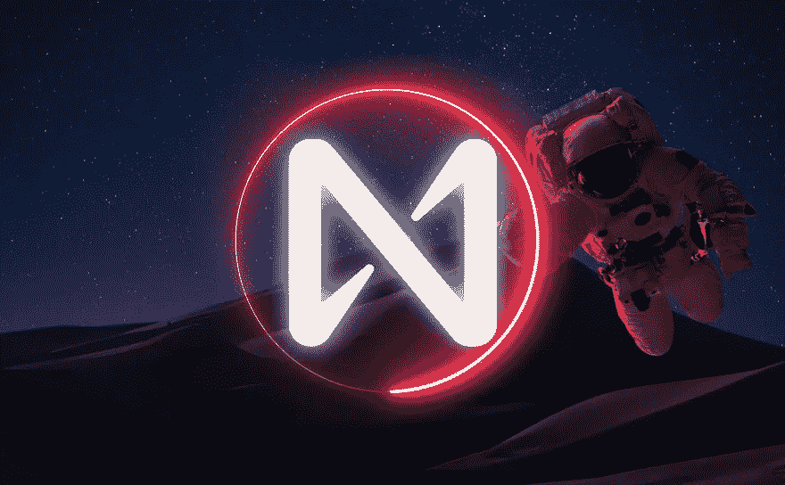
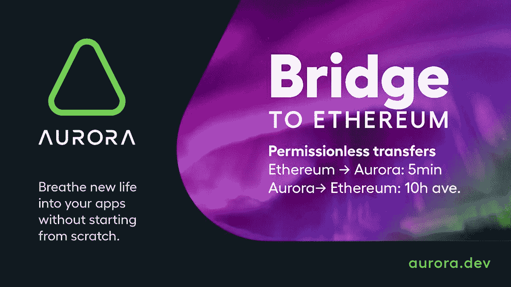
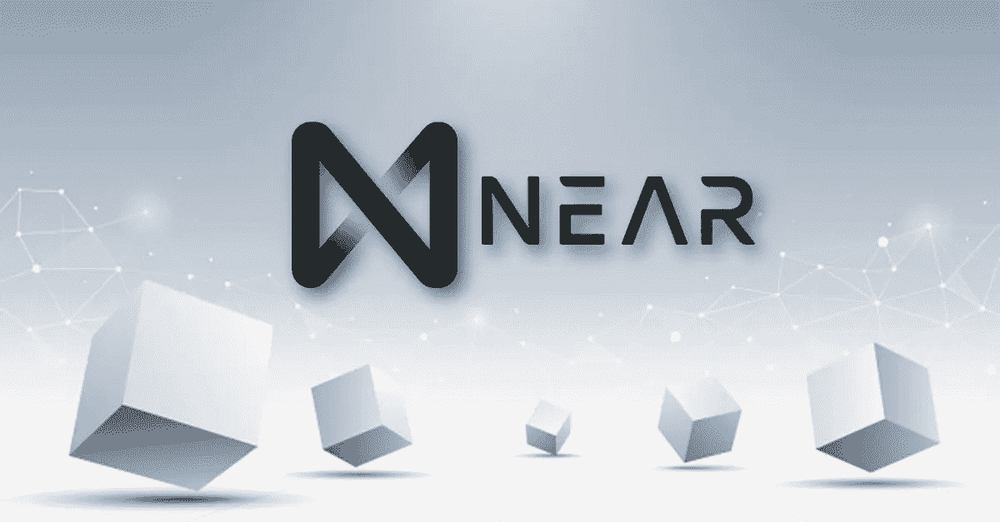
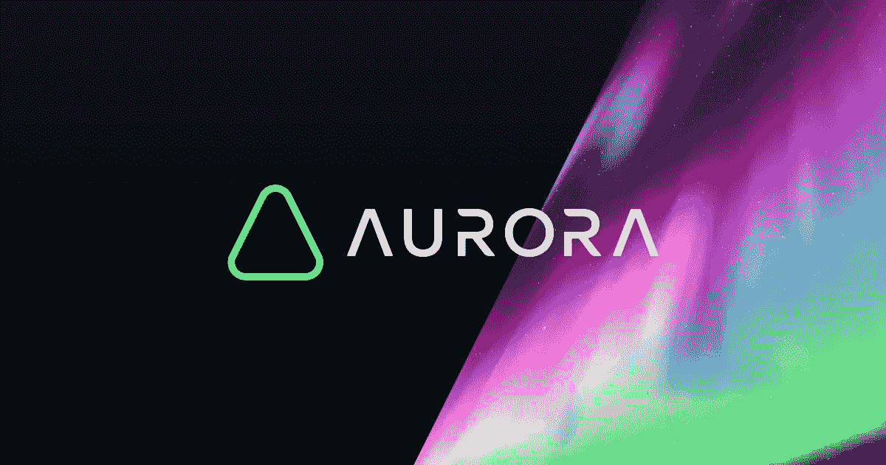

# Near 协议简介

> 原文：<https://medium.com/coinmonks/introduction-to-near-protocol-c9322d8e1193?source=collection_archive---------23----------------------->

今天，我们将探索 Near 协议、其技术及其工作原理。

接近协议的是 2020 年推出的第 1 层区块链，流通中有 679，412，414 个(coinmarketcap 数据)

分片技术的使用使得 Near 协议项目很特别。

Near 协议背后的技术

第 1 层使用 PoS 系统。但 Near 协议的核心是茄科分片技术。

分片技术提供了跨多个验证节点的转换处理负载的划分。这种技术允许节点只管理一小部分转换，同时允许更高的 TPS。

块的每个部分称为一个组块。

事务数量越多，验证节点的数量就越多。

Near 协议的一个有趣因素是 PoS 机制的处理方式。引入了 PoS 系统的一个变体，该变体被称为 TPoS。与经典系统不同，在经典系统中，谁在赌注中拥有最多令牌，谁就成为验证者。在 TPO 上，有一个拍卖,“可能的”验证者指出他们可以下注多少代币。该算法将选择最小阈值来成为验证器。

彩虹桥工具

开发人员开发了彩虹桥，允许用户利用以太坊和近桥来转移 ERC-20 代币、NFT 和包装代币。

近令牌，生态系统令牌

像许多其他区块链一样，Near 协议也有它的令牌:Near。Near 可用于投票和决策、佣金支付，以及作为一种奖励方法。

极光引擎

Aurora 是基于 Near 协议的第 2 层。极光的一部分叫极光桥，另一部分叫极光引擎。后者基本上是一个运行在 Near 协议上的 EVM。这是非常重要的数据，因为开发者不必编写新的应用程序，而是可以利用以太坊上现有的应用程序。

总之，我们可以把 Near Protocol 作为一个有趣的项目来讨论，它使用新的系统来管理每秒更多的事务。切分系统的使用对于区块链技术的未来当然是有趣和重要的。

> 加入 Coinmonks [电报频道](https://t.me/coincodecap)和 [Youtube 频道](https://www.youtube.com/c/coinmonks/videos)了解加密交易和投资

# 另外，阅读

*   [3 商业评论](/coinmonks/3commas-review-an-excellent-crypto-trading-bot-2020-1313a58bec92) | [Pionex 评论](https://coincodecap.com/pionex-review-exchange-with-crypto-trading-bot) | [Coinrule 评论](/coinmonks/coinrule-review-2021-a-beginner-friendly-crypto-trading-bot-daf0504848ba)
*   [莱杰 vs Ngrave](/coinmonks/ledger-vs-ngrave-zero-7e40f0c1d694) | [莱杰 nano s vs x](/coinmonks/ledger-nano-s-vs-x-battery-hardware-price-storage-59a6663fe3b0) | [币安评论](/coinmonks/binance-review-ee10d3bf3b6e)
*   [Bybit Exchange 评论](/coinmonks/bybit-exchange-review-dbd570019b71) | [Bityard 评论](https://coincodecap.com/bityard-reivew) | [Jet-Bot 评论](https://coincodecap.com/jet-bot-review)
*   [3 commas vs crypto hopper](/coinmonks/3commas-vs-pionex-vs-cryptohopper-best-crypto-bot-6a98d2baa203)|[赚取加密利息](/coinmonks/earn-crypto-interest-b10b810fdda3)
*   最好的比特币[硬件钱包](/coinmonks/hardware-wallets-dfa1211730c6) | [BitBox02 回顾](/coinmonks/bitbox02-review-your-swiss-bitcoin-hardware-wallet-c36c88fff29)