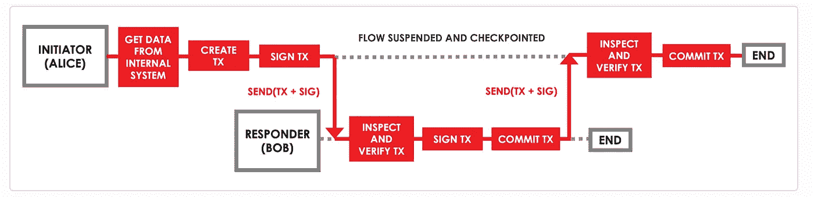

# 私有区块链应用介绍— Corda

> 原文：<https://medium.com/coinmonks/introduction-to-private-blockchain-application-corda-43dfbb325fed?source=collection_archive---------21----------------------->

# 公共区块链应用

加密货币背后的技术是公共分布式账本。它是公开的，因为每个人都可以查看存储在分类账中的交易，尽管通常很难将账户 id 映射到现实世界中的实际持有人。此外，所有交易都经过验证，没有人可以修改分类帐中的交易，因为交易存储在区块链数据结构中，这是区块链的不变性。

# 私有区块链应用

区块链和分布式账本技术可以应用到其他领域。然而，由于分类账是公开的，因此会有隐私问题。这就是私有分布式账本的由来。其中一个是 [R3 Corda](https://docs.r3.com/en/platform/corda/4.7/open-source/key-concepts.html) 。在 Corda 中，交易仅对参与交易的各方可见。例如，如果银行 A 向银行 B 交易 1 美元，该交易由银行 A 和银行 B 双方签署，并且仅对银行 A 和银行 B 可见。这保护了银行 A 和银行 B 的隐私。

# 以太坊和科达的区别

Corda 上的应用程序开发与以太坊等公共区块链上的智能合约开发截然不同。在以太坊中，智能契约就像普通 OOP 语言中的类。它包含状态变量和如何操作状态的方法实现，这实际上是应用程序逻辑。在 Corda 中，契约不会操纵状态，它只验证交易，如参与方的签名以及交易的输入和输出状态的形状。实际的应用逻辑是在“流”中实现的。

# Corda 如何更新数据

在 Corda 中，状态一旦被存储就不可改变，但是它可以创建一个新版本的状态并将以前的状态标记为历史状态(这被称为“已消耗”)。一个事务可以包含任意数量的输入和输出状态，其中输入状态是旧状态，输出状态是它将要转换的新状态。事务是原子性的。例如，当银行 A 向银行 B 转账 1 美元时，交易的输入状态是两家银行的当前余额，输出状态是转账后的新余额。交易将由双方银行签署，并在存储到分类账之前由合同验证。事务由流创建。该流将创建事务、输入状态和输出状态，然后请求各方签署该事务。由于它负责创建输入和输出状态，这意味着它包含计算新余额的应用程序逻辑。下面是流程运行的序列图，从 Corda 网站获取。

# 共识；一致

由于 Corda 是一个分布式分类帐，我们需要定义共识算法。有两种类型的共识:(1)有效性共识，和(2)唯一性共识。有效性共识是由交易的每个要求的签署方进行的检查。唯一性共识是防止交易的重复花费。它是由称为公证人的节点服务来执行的。你可以在 [Corda 网站](https://docs.r3.com/en/platform/corda/4.7/open-source/key-concepts-notaries.html)找到更多关于公证人的细节。

# 应用程序—共享社区库

我对如何使用 Corda 有了一个简单的想法。这个想法是:对于一组位于附近的当地学校，他们可以组成一个社区来建立共享图书馆，这样他们的学生就可以从社区中的任何一所学校借书。

`BookState`将由每本书的属性组成，包括书名和作者、ISBN、所有者学校和持有者学校。`flow`包括`IssueBook`、`BorrowBook`、`ReturnBook`，在这里借书和还书都需要书主和持有人的签名。

我们还添加了请求借阅书籍的功能。每个请求都会是一个状态:`RequestState`，同一本书上的多个请求通过在前一个`RequestState`中加入下一个`RequestState`的引用，形成一个`RequestState`的 FIFO 队列(链)。

这个简单的应用程序可以从 Corda 网站[上发布的示例 Cordapp 构建。当我有时间的时候，我会尝试实现我的想法，然后在这里分享 git。](https://docs.r3.com/en/platform/corda/4.7/open-source/tutorial-cordapp.html)

> 加入 Coinmonks [电报频道](https://t.me/coincodecap)和 [Youtube 频道](https://www.youtube.com/c/coinmonks/videos)了解加密交易和投资

# 另外，阅读

*   [如何在 Uniswap 上交换加密？](https://coincodecap.com/swap-crypto-on-uniswap) | [A-Ads 评论](https://coincodecap.com/a-ads-review)
*   [WazirX vs coin dcx vs bit bns](/coinmonks/wazirx-vs-coindcx-vs-bitbns-149f4f19a2f1)|[block fi vs coin loan vs Nexo](/coinmonks/blockfi-vs-coinloan-vs-nexo-cb624635230d)
*   [本地比特币审核](/coinmonks/localbitcoins-review-6cc001c6ed56) | [加密货币储蓄账户](https://coincodecap.com/cryptocurrency-savings-accounts)
*   [什么是保证金交易](https://coincodecap.com/margin-trading) | [美元成本平均法](https://coincodecap.com/dca)
*   [支持卡审核](https://coincodecap.com/uphold-card-review) | [信任钱包 vs 元掩码](https://coincodecap.com/trust-wallet-vs-metamask)