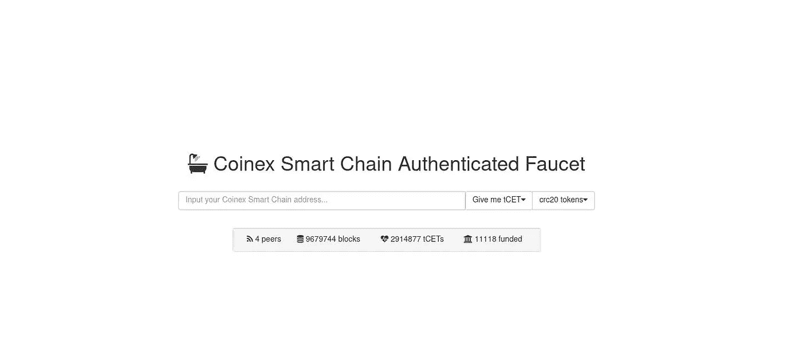

# CSC 上的智能合约和 Dapp 开发简介-第 1 部分

> 原文：<https://medium.com/coinmonks/introduction-to-smart-contract-and-dapp-development-on-csc-part1-e2e9e89c43e7?source=collection_archive---------19----------------------->

嘿嘿嘿！

0Xlive 在这里😃

在本系列中，我们将讨论 coinex 智能链上的智能合约和 dapp 开发

**Coinex 智能链**

coinex.org

基于`[CPoS](https://docs.coinex.org/#/en-us/consensus)`共识协议，CoinEx 智能链(CSC)是一个智能契约链，支持多达 101 个验证器。除了更短的块生成时间和更低的交易费用外，`CSC`还完全兼容以太坊虚拟机(EVM)和协议，同时支持高性能交易。同时，`CSC`坚持去中心化和免许可的原则，这样任何人都可以下注硬币并成为验证者。

# [CSC 特性](https://docs.coinex.org/#/en-us/introduction?id=csc-features)

*   去中心化:无需许可，任何人都可以通过下注`CET`成为验证者。
*   EVM 兼容性:与以太坊虚拟机(EVM)完全兼容，这意味着以太坊上几乎所有的 DApps、生态系统组件和工具都可以直接迁移到`CSC`或者做很小的改动。
*   高性能:600+ TPS，3s 块时间

# 大学英语四级考试

`CSC`上的`CET`运行方式与`ETH`在以太坊上运行方式相同，其主要功能有:

1.  作为对验证者的整体奖励
2.  支付`CSC`上用于转移和合同调用的天然气
3.  支付在`CSC`部署智能合约的交易费用
4.  委托给选定的验证者

# 刷卡机

Proof of Stake

利害关系证明是一种[共识机制](https://ethereum.org/en/developers/docs/consensus-mechanisms/)，由区块链用来实现分布式共识。在工作证明中，矿商通过消耗能源来证明他们的资本处于风险之中。在股权证明中，验证者明确地将以太形式的资本投入到以太坊的智能合约中。如果验证者的行为不诚实或懒惰，这个被支撑的以太就会作为抵押品被销毁。然后，验证器负责检查通过网络传播的新块是否有效，并偶尔自己创建和传播新块。

利益证明对工作证明系统进行了大量改进:

*   更高的能效—无需在工作验证计算上耗费大量能源
*   更低的准入门槛，更低的硬件要求—不需要精英硬件就有机会创造新的区块
*   降低集中化风险——风险证明应能让更多节点保护网络
*   由于能源需求较低，因此激励参与所需的 ETH 发放较少
*   与工作证明相比，对不当行为的经济处罚使 51%风格的攻击对攻击者来说代价更高
*   如果一个 51%的攻击克服了秘密经济防御，社区可以求助于诚实链的社会恢复。

**我们开始吧！**

首先，我们将在[的 Metamask](http://metamask.io) 中添加 CSC

网络名称:Coinex TestNet

新的 RPC 网址:【https://testnet-rpc.coinex.net 

链条编号:53

货币符号:tCET

区块浏览器网址:[https://testnet.coinex.net](https://testnet.coinex.net)

您也可以使用 Chainlist 通过两次点击来添加:

 [## 链表

### 链表是 EVM 网络的列表。用户可以使用这些信息连接他们的钱包和 Web3 中间件…

chainlist.org](https://chainlist.org/) 

**水龙头**

让我们从 coinex 智能链龙头获得一些 testnet csc 来开始开发:

 [## Coinex 智能链认证水龙头

### 编辑描述

testnet.coinex.net](https://testnet.coinex.net/faucet) 

祝贺🥳

我们将在接下来的课程中学习稳健。和我在一起