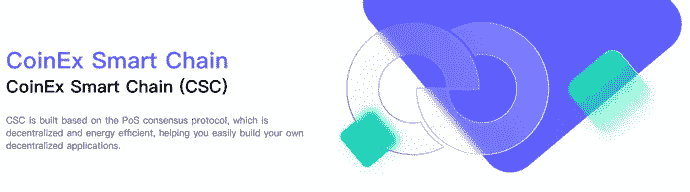
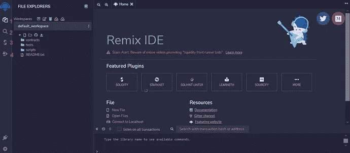
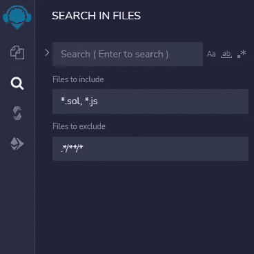
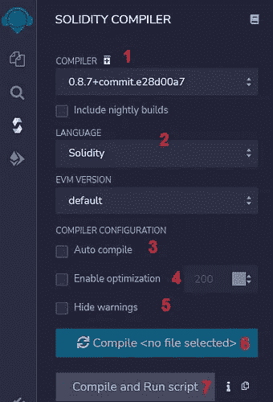
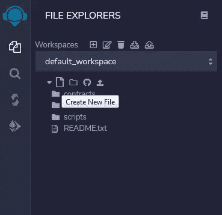
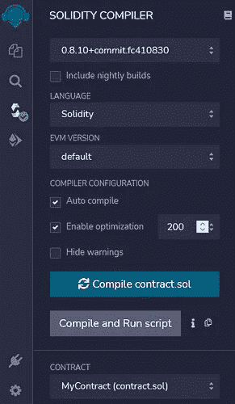
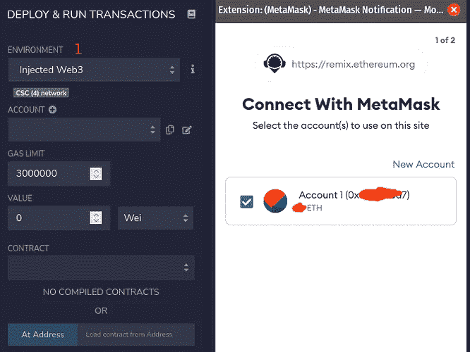
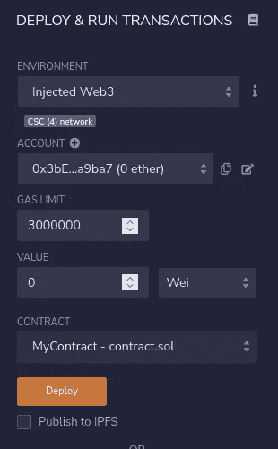

# CSC 上的智能合约开发和 Dapp 开发简介-第 2 部分

> 原文：<https://medium.com/coinmonks/introduction-to-smart-contract-development-and-dapp-development-on-csc-part2-13f253c60c13?source=collection_archive---------17----------------------->

嘿嘿嘿！

0Xlive 在这里😃

在本系列中，我们将讨论 coinex 智能链上的智能合约和 dapp 开发



coinex.org

**开发环境**

要开发任何程序，我们都需要开发环境

一般来说，要开发智能合同，我们需要以下东西:

1-实体代码编辑器

2-可靠性编译器

3-部署工具

我们将引入各种工具来帮助我们开发智能合同。

**混音**

Remix 是用于智能合约的基于浏览器的在线开发环境。

对于希望快速轻松开始的人来说，这非常有用:

[](https://remix-project.org/) [## 混合以太坊 IDE 和社区

### 请随时联系我们，我们是一个 7 人团队，主要在柏林(德国)、美国、印度远程工作…

remix-project.org](https://remix-project.org/) 

注意:remix 将数据存储在浏览器的本地存储器中，所以当你使用 http 或 https 打开网站时，你可能什么也看不到！请更改协议，然后重试



Remix

1-这是一个工作区。我们所有的文件都将存储在这里。



Search

2-这是搜索框。我们可以搜索文件或文件中的句子



Compiler Section

我们可以在这里选择编译器版本和编程语言

此外，我们可以启用优化和编译我们的可靠性代码

**智能合同开发**



让我们创建合同。sol:

```
// SPDX-License-Identifier: MIT

pragma solidity ^0.8.10;

contract MyContract {

string public myString = 'hello world';

}
```

我们来破解密码吧！

在第一行中，我们以机器可读的格式设置代码许可证

```
// SPDX-License-Identifier: MIT
```

在第二行中，我们设置了 solidity 编译器版本

```
pragma solidity ^0.8.10;
```

最后是主合同:

```
contract MyContract {

string public myString = 'hello world';

}
```

注意:可靠性代码必须在合同{}中

让我们编译代码



我们的代码编译成功，现在我们将部署到网络上



它会先询问是否允许访问我们的帐户来签署交易

当您接受它时，它将被启用部署



点击部署按钮，嘣！

祝贺🥳

我们的智能合同部署在 coinex 智能链测试网上。在接下来的课程中，我们将更进一步。和我在一起