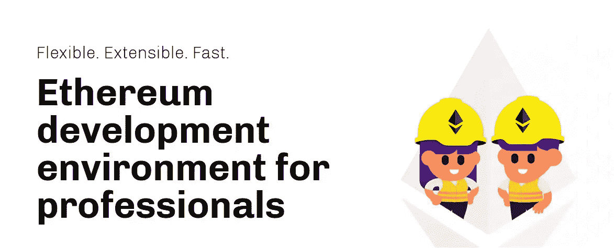

# CSC 上的智能合约开发和 Dapp 开发简介-第 3 部分

> 原文：<https://medium.com/coinmonks/introduction-to-smart-contract-development-and-dapp-development-on-csc-part3-e5ddbe2c23fa?source=collection_archive---------21----------------------->

嘿嘿嘿！

0Xlive 在这里😃

在本教程中，我们将讨论 Hardhat 以及如何使用它在 coinex 智能链网络上编译和部署我们的智能合同



Hardhat.org

# 建筑工人

Hardhat 是一个编译、部署、测试和调试以太坊软件的开发环境。它帮助开发人员管理和自动化构建智能合约和 dApps 过程中固有的重复性任务，并围绕该工作流轻松引入更多功能。这意味着在核心处编译、运行和测试智能合约。

## 项目设置

首先，我们需要为我们的项目创建一个目录。

```
mkdir hardhat
cd hardhat // we changed directory to 'hardhat'
```

并在以下目录中安装 hardhat:

```
npm init
npm install --save-dev hardhat
```

安装后，我们可以使用 npx 运行 hardhat:

```
npx hardhat
```

注意:由于本地安装，我们使用 npx 运行 hardhat

当你运行 Hardhat 时，它会问一些类似下面的问题:

```
$ npx hardhat

Welcome to Hardhat v2.0.8

? What do you want to do? …
❯ Create a sample project
  Create an advanced sample project
  Create an advanced sample project that uses TypeScript
  Create an empty hardhat.config.js
  Quit
```

它将创建一个简单的项目？

第二:它将创建具有更多细节的样本项目？

第三:它将创建一个使用 TypeScript 项目

第四:它只是创建一个空的安全帽配置文件

我们选择第一个选项

当你选择第一个选项时，它会要求你提供 hardhat-waffle 和 hardhat-ethers 库。它们会给我们很大的帮助，所以我们同意！顺便说一下，您可以手动安装它:

```
npm install --save-dev @nomiclabs/hardhat-waffle ethereum-waffle chai @nomiclabs/hardhat-ethers ethers
```

只需输入“是”即可😎

最后，Hardhat 将创建一个具有以下结构的项目:

```
contracts/
scripts/
test/
hardhat.config.js
```

让我们选择安全帽配置。把这个放到 hardhat.config.json 里:

```
module.exports = {
  solidity: "0.8.10",
  networks: {
    csc: {
      url: "https://testnet-rpc.coinex.net",
      accounts: ["YOUR PRIVATE KEY"],
    }
  }
};
```

注意:`YOUR PRIVATE KEY`是您的钱包私钥，我们用于签署交易。千万不要和任何人分享！

如果你不知道如何找到你的钱包私人钥匙，也许这将帮助你

[](https://metamask.zendesk.com/hc/en-us/articles/360015289632-How-to-Export-an-Account-Private-Key) [## 如何导出帐户的私钥

### 警告！导出您的帐户可能有风险，因为它会以明文形式显示您的私钥。为了避免…的可能损失

metamask.zendesk.com](https://metamask.zendesk.com/hc/en-us/articles/360015289632-How-to-Export-an-Account-Private-Key) 

Hardhat 有自己的本地以太网，但我们希望部署在 csc 网络上。

为了自动化编译和部署我们的智能契约，我们使用 javascript。在脚本目录中创建 deploy.js，并将它放入:

```
async function main() {
  // We get the contract to deploy
  const Greeter = await ethers.getContractFactory("Greeter");
  const greeter = await Greeter.deploy("Hello, Hardhat!");

  await greeter.deployed();

  console.log("Greeter deployed to:", greeter.address);
}

main()
  .then(() => process.exit(0))
  .catch((error) => {
    console.error(error);
    process.exit(1);
  });
```

现在是时候运行我们的脚本了。在终端类型中:

```
npx hardhat run --network csc scripts/deploy.js
```

Hardhat 将运行 deploy.js 并在 csc testnet 上部署我们的智能合同

祝贺🥳

我们现在可以在 csc 上编译和部署我们的智能合同了！

要进一步了解安全帽世界，您可以查看安全帽文档:

[](https://hardhat.org/guides/create-task.html) [## 通过 Nomic Foundation 为专业人员创建任务|以太坊开发环境

### 本指南将探索在 Hardhat 中创建任务，这是用于自动化的核心组件。任务是一种…

hardhat.org](https://hardhat.org/guides/create-task.html) 

> 加入 Coinmonks [电报频道](https://t.me/coincodecap)和 [Youtube 频道](https://www.youtube.com/c/coinmonks/videos)了解加密交易和投资

# 另外，阅读

*   [WazirX vs coin dcx vs bit bns](/coinmonks/wazirx-vs-coindcx-vs-bitbns-149f4f19a2f1)|[block fi vs coin loan vs Nexo](/coinmonks/blockfi-vs-coinloan-vs-nexo-cb624635230d)
*   [本地比特币审核](/coinmonks/localbitcoins-review-6cc001c6ed56) | [加密货币储蓄账户](https://coincodecap.com/cryptocurrency-savings-accounts)
*   [什么是融资融券交易](https://coincodecap.com/margin-trading) | [成本平均法](https://coincodecap.com/dca)
*   [支持卡审核](https://coincodecap.com/uphold-card-review) | [信任钱包 vs 元掩码](https://coincodecap.com/trust-wallet-vs-metamask)
*   [Exness 回顾](https://coincodecap.com/exness-review)|[moon xbt Vs bit get Vs Bingbon](https://coincodecap.com/bingbon-vs-bitget-vs-moonxbt)
*   [如何开始用加密贷款赚取被动收入](https://coincodecap.com/passive-income-crypto-lending)