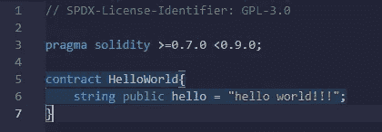
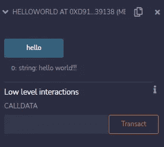

# 坚固性介绍

> 原文：<https://medium.com/coinmonks/introduction-to-solidity-6033bd091b01?source=collection_archive---------17----------------------->

可靠性并不是什么新东西，只是它的使用案例是几年前才出现的。Solidity 只是一种高级面向对象语言，熟悉其他面向对象语言如 C++，Java 等的人可以使用。会发现非常相似。

**这将是一系列的博客，最后，我们将在 testnet** 上部署我们的 ERC20、ERC721 和 ERC1155 令牌。

坚实度的**学习**曲线取决于两个因素:

*   **具备 C++、Java、PHP 等面向对象语言的基础知识**。- >对于那些有先验知识的人来说，曲线几乎是线性的，除了语法之外没有什么新的东西也很容易学习，所有与语法相关的东西都可以在网上找到。
*   没有先验知识- > 那些没有其他 OOPS 语言知识的人，我建议他们先学习上面提到的任何一种语言，然后跳到 solidity 来体验一个线性曲线，否则如果你直接跳到 solidity，曲线会非常陡峭。

**用例**

了解你计划学习的东西的用例是很重要的，如果这不能让你兴奋，那么你就不会享受你的学习之旅。

*   这是一个也是唯一一个最流行的用例，就是用简单的语言编写智能合同，智能合同是在区块链上运行的代码。如果你不知道智能合同，请了解它的基本概念，因为在后面的教程中，我们将从头到尾编写智能合同。

**设置**

没有什么需要设置的，你只需要一个浏览器，然后你就可以写你的第一份智能合同了。

我们将使用 remix 来编写智能合同。

 [## Remix -以太坊 IDE

### 编辑描述

remix.ethereum.org](https://remix.ethereum.org/) 

**数据类型**

*   uint
*   （同 Internationalorganizations）国际组织
*   线
*   弯曲件
*   排列
*   结构体
*   地址
*   字节
*   合同
*   枚举

这是 solidity 中常用的一些数据结构

**uint 和 int** 类似，只是在 int 中可以有负值，而在 uint 中不能。

**注:** uint 和 int 也可以写成 uint256 和 int256。我们也可以使用 uint8 uint16 uint24 …..为了节省一些汽油。

**地址**是一种新类型，它保存一个 20 字节的值作为以太坊地址。

契约就像一个类。

让我们把第一份合同写在混音上。

**你好世界**

**第 1 行**:我们不得不提一下许可证，不要把重点放在它上面就照原样写就行了。

**第三行:**提到坚固版。

第 5 行:C 契约名就像其他语言中的类声明一样

**第 6 行:**声明一个名为 hello 的字符串变量，并给它赋值。它的修饰符保持为 public，这样编译器就可以为它附加一个 getter，我们不必手动创建它。

写完这段代码后，只需按 Ctr + s 或转到左栏第三个图标，**编译**代码，如果没有错误，转到第四个选项，**部署**您的代码。您将看到类似这样的内容:

您将看到智能合约中指定的值。

**嘣，你已经成功地编写了你的第一个智能合同，并在区块链上部署了它**。

这就是我的博客，如果你有任何疑问，请在评论区提出，如果你喜欢它，别忘了给它一个大拇指。在下一篇博客中，我们将写一些基本的智能合同。

**保持安全，不断学习。**

> 加入 Coinmonks [电报频道](https://t.me/coincodecap)和 [Youtube 频道](https://www.youtube.com/c/coinmonks/videos)了解加密交易和投资

# 另外，阅读

*   [CoinLoan 审查](https://coincodecap.com/coinloan-review) | [YouHodler 审查](/coinmonks/youhodler-4-easy-ways-to-make-money-98969b9689f2) | [BlockFi 审查](https://coincodecap.com/blockfi-review)
*   [XT.COM 评论](https://coincodecap.com/profittradingapp-for-binance)币安评论 |
*   [SmithBot 评论](https://coincodecap.com/smithbot-review) | [4 款最佳免费开源交易机器人](https://coincodecap.com/free-open-source-trading-bots)
*   [比特币基地僵尸程序](/coinmonks/coinbase-bots-ac6359e897f3) | [AscendEX 审查](/coinmonks/ascendex-review-53e829cf75fa) | [OKEx 交易僵尸程序](/coinmonks/okex-trading-bots-234920f61e60)
*   [如何在印度购买比特币？](/coinmonks/buy-bitcoin-in-india-feb50ddfef94) | [瓦济克斯审查](/coinmonks/wazirx-review-5c811b074f5b)