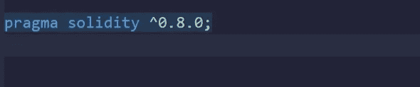
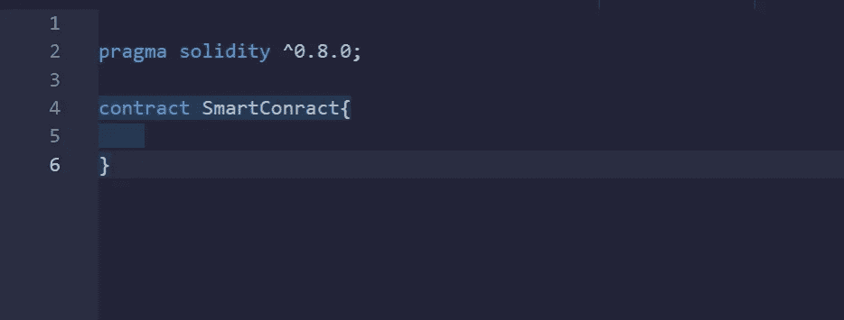
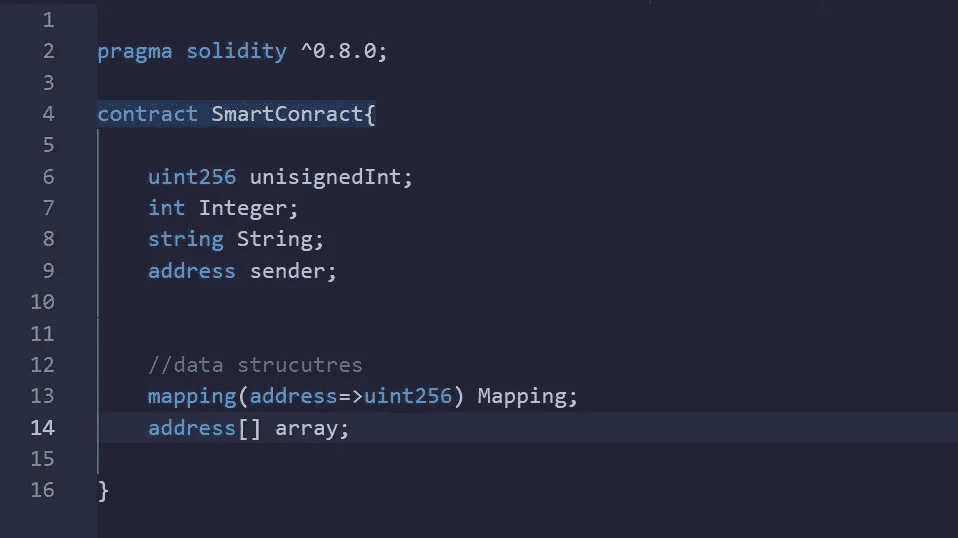
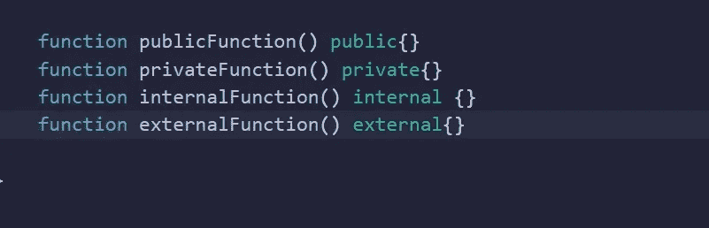

# 坚固性介绍

> 原文：<https://medium.com/coinmonks/introduction-to-solidity-6309188c8ef1?source=collection_archive---------73----------------------->

我们来看看扎实的基础。(第一部分)

如果你听说过智能合约，你可能知道它们是程序化的。像所有的程序一样，必须用一种语言来编写它们。虽然主流语言可以被配置来编写智能合同，但专业语言是存在的，当涉及到以太网时，solidity 脱颖而出。

Solidity 是一种面向对象的编程语言，用于编写智能合同。它用于在各种区块链平台上实现智能合约。

今天，我们将学习书写智能合同的语言——可靠性的基础知识。

**执照**

最佳做法是为您创建的每个 solidity 文件包含一个许可证。然而，这并不是合同生效的必要条件

**版本控制**

每个 Solidity 文件必须有它所依赖的一系列版本中的一个版本。这必须包括在文件中，通常在申报任何合同之前。使用关键字 **pragma solidity** 声明版本，后跟数字范围的版本号。

**合约**

契约是 solidity 代码所有其他方面的基础，solidity 中的所有代码都必须写在契约中。把它想象成你的常规编程语言如 Dart、Java 中的一个类。然而，我们没有使用 class 关键字，而是使用关键字 ***contract*** 后跟契约名称和花括号 ***。***

Declaring a new smart contract in solidity

**常见数据类型。**

solidity 中常见的数据类型包括

无符号(uint)、整数(int)、地址和字符串。数据结构，如使用唯一位置标识符的数组，类似于 Javascript 数组或 python 列表。映射，使用键和值对，类似于 Javascript 对象或 python 字典。

**变量:**

Solidity 是一种静态类型语言，这意味着所有变量必须用它们的类型来声明，且不能被重新分配另一种数据类型。

**功能**

solidity 中的函数非常类似于 Javascript。函数是用名称和类型来声明的，有四种类型的函数，即内部函数、私有函数、外部函数和公共函数。内部函数只能由协定和从基协定继承的其他协定中的函数调用。私有函数只能由协定中的函数调用。公共函数既可以被其他函数调用，也可以在契约之外调用。外部函数只能在契约外调用。

Declaring functions in solidity (basics)

唷，这是坚实的基本框架，还有更多需要学习，我们鼓励你去学习。现在你已经了解了撰写智能合同时最流行的语言之一，你可以尽情发挥。干杯！。

> 交易新手？试试[加密交易机器人](/coinmonks/crypto-trading-bot-c2ffce8acb2a)或者[复制交易](/coinmonks/top-10-crypto-copy-trading-platforms-for-beginners-d0c37c7d698c)