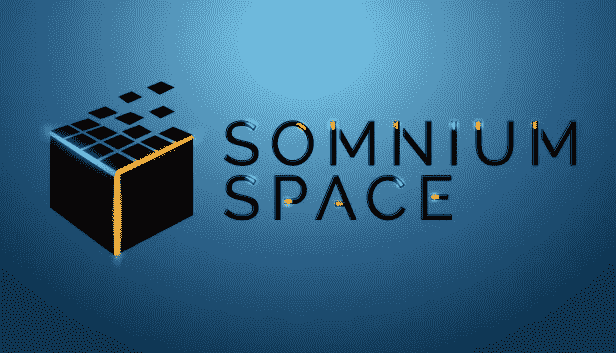
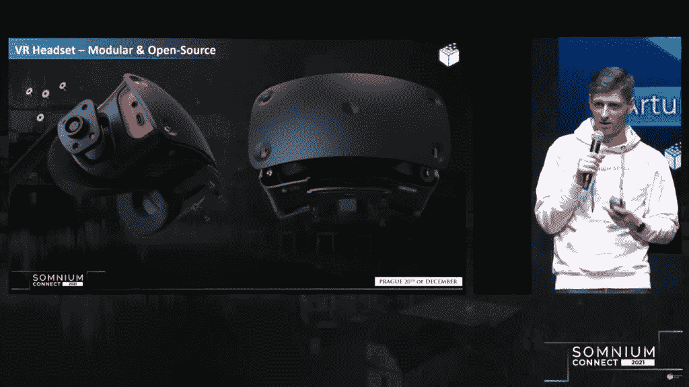
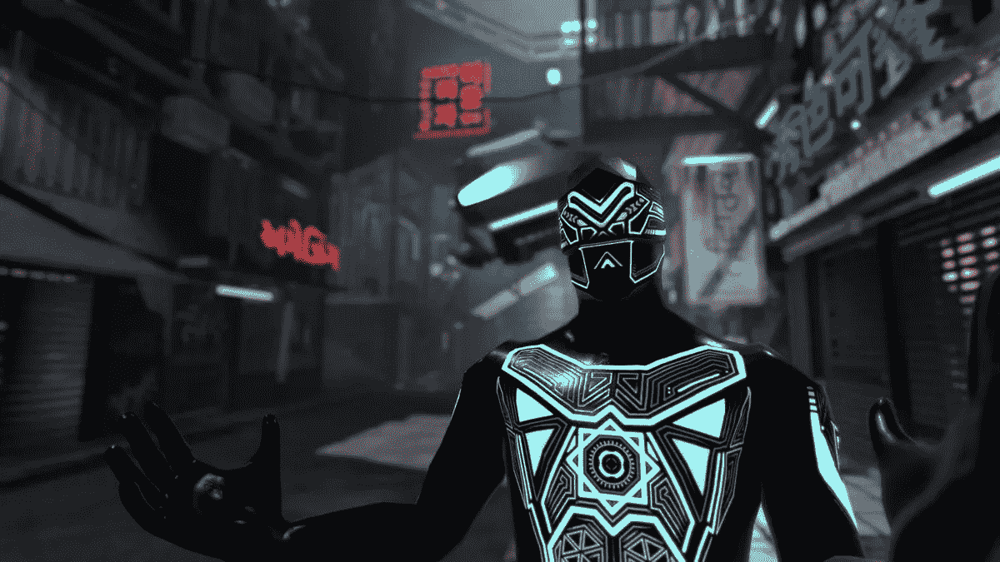
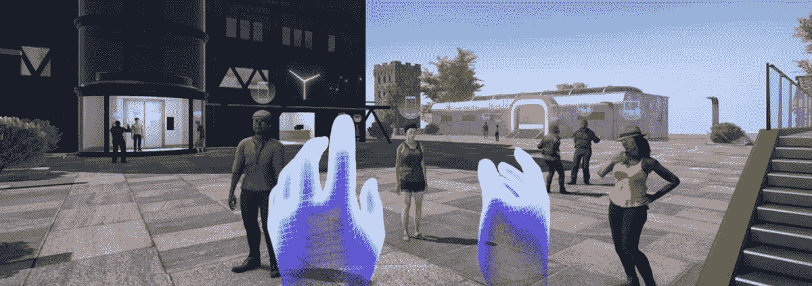

# Somnium 空间介绍

> 原文：<https://medium.com/coinmonks/introduction-to-somnium-space-5750539b2e86?source=collection_archive---------32----------------------->

随着 Meta(前脸书)在 2021 年 10 月改变核心业务，许多致力于虚拟现实(元宇宙)的加密项目随着价格的不断上涨而越来越受欢迎。你们中的许多人会知道 Decentreland(法力令牌)——沙盒- Blocktopia 等等。有人可能错过了 Somnium Space，但我向你保证，这是这个领域有史以来最雄心勃勃的项目之一。

我不想抹黑任何一个平台，因为开发者是一个非常艰难的工作，我不喜欢对任何人苛刻。但是今天我们将谈论我认为目前最先进的元宇宙加密项目。

小提示:我将使用元宇宙这个术语，尽管我发现它作为一个术语已经变得太流行了，并且在不了解事实的情况下被使用。

Somnium 的技术

Somnium Space 是一个基于以太坊和索拉纳区块链的项目。在 Somnium 内，你可以购买土地、衣服、头像等等。我不知道你们中的一些人是否看过，但是 Somnium Space 的 NFT 价值相当高(尤其是土地),这不是财务建议。

回到 Somnium 的世界，你也可以通过浏览器访问游戏世界地图。最吸引人的体验是通过虚拟现实观看者。是的，Somnium Space 是少数几个支持虚拟现实并试图推动质量的项目之一。

Somnium 最大的优点之一是能够在一个大的虚拟世界中进行分组，而不用分成不同的房间。关键词是互操作性和去中心化。

游戏世界中的化身是 VR 世界中最先进的化身之一。一颗真正的太空宝石。

去年，在专门的活动中，来自 Somnium 的家伙们展示了他们未来的 VR 耳机。这是一个模块化的观察器，每只眼睛的分辨率为 2880 x 2880，FOV 为 115 度，刷新率为 90 赫兹，最重要的是，它将内置一个 XR2 芯片。这将允许耳机以独立的方式使用

Somnium 空间令牌

目前，这种代币被称为 CUBE，流通供应量为 12，500，000.00 立方，总供应量为 100，000，000 立方(数据取自 coinmarketcap)。

谁相信索姆空间技术？

目前，两家巨头已经决定支持 Somnium，我们正在谈论 FTX 和双子交换。他们都看到了技术的优点，并决定支持它。
前一段时间，Tesla Suit (haptic suits)和 Somnium 建立了合作关系。

在这个世界上能做些什么？

虽然仍然是一个低资本项目，团队正在努力增加内容而不损失质量，而不是增加它。里面已经有几个社交活动了，但是你可以通过官方门户了解最新情况。有一个日历标记了虚拟世界中最重要的事件。你可以通过尝试获得被动收入来将你的虚拟空间货币化。在我看来，这是虚拟世界中最美的东西之一。创造第二人生，拥有第二份工作，让你有所收获，结识新朋友。
开发人员还在研究一项名为“永生”的技术——通过复制一个具有我们相似性、语言和动作的化身。如果用户死了，化身将继续存在，世界将能够与我们互动。通过人工智能的进步，所有这一切都将成为可能。鉴于团队将不得不管理大量的数据，这无疑是一个雄心勃勃而又充满风险的项目。我们将看到他们如何表现。

总之，我相信 Somnium Space 是加密元宇宙空间中最具技术含量和雄心的项目之一。目前唯一的缺陷是可见性/营销，团队正在从代码的角度努力工作。我相信他们的愿景是“让产品为我们说话”——没错，每个人都有自己的愿景。

> 加入 Coinmonks [电报频道](https://t.me/coincodecap)和 [Youtube 频道](https://www.youtube.com/c/coinmonks/videos)了解加密交易和投资

# 另外，阅读

*   [如何匿名购买比特币](https://coincodecap.com/buy-bitcoin-anonymously) | [比特币现金钱包](https://coincodecap.com/bitcoin-cash-wallets)
*   [币安 vs FTX](https://coincodecap.com/binance-vs-ftx) | [最佳(SOL)索拉纳钱包](https://coincodecap.com/solana-wallets)
*   [比诺莫评论](https://coincodecap.com/binomo-review) | [斯多葛派 vs 3Commas vs TradeSanta](https://coincodecap.com/stoic-vs-3commas-vs-tradesanta)
*   [Capital.com 评论](https://coincodecap.com/capital-com-review) | [香港的加密借贷平台](https://coincodecap.com/crypto-lending-hong-kong)
*   如何在 Uniswap 上交换加密？ | [A-Ads 审查](https://coincodecap.com/a-ads-review)