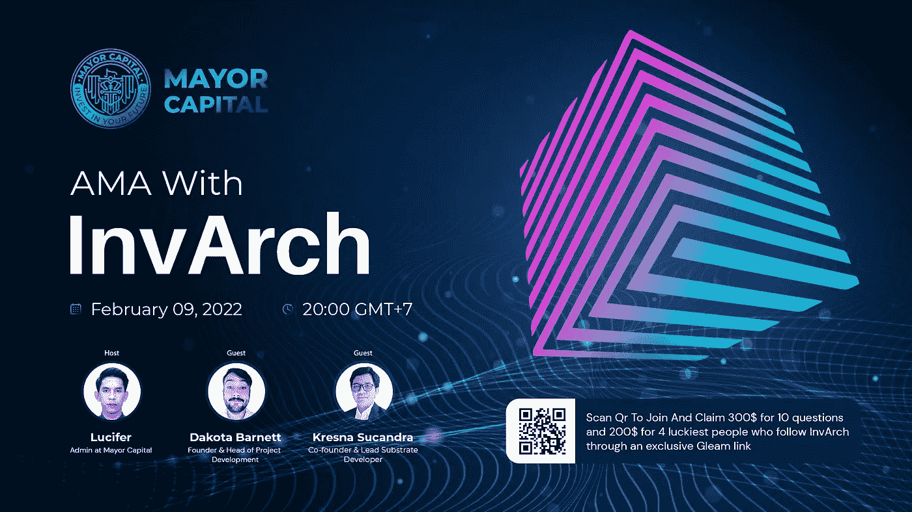

# 因瓦赫·AMA 由首都市长主持

> 原文：<https://medium.com/coinmonks/invarch-ama-hosted-by-mayor-capital-471fec5f0a2?source=collection_archive---------13----------------------->

Web3 的所有权、效用和跨链认证协议 InvArch

主持人:露西·路西法|市长资本

嘉宾:Dakota Barnett | InvArch 创始人& Kresna Sucandra | InvArch 联合创始人/基板开发主管。

电报上写着:[http://t.me/mayorchat/](https://t.co/KFiSgmW0n8)AMA

2022 年 2 月 9 日— 20:00 GMT+7

# 第一部分

路西法:嘿，你今天怎么样？
达科塔·巴尼特:太棒了&兴奋！感谢您邀请我们来与您的社区分享 InvArch🙏💪克里斯纳·苏坎德拉:我很好，谢谢你邀请我们。很高兴来到这里！
路西法:很高兴你今天能和我们谈论因瓦奇

的话题，我们现在可以开始了吗？你准备好了吗？达科塔·巴尼特:当然，让我们开始派对吧！是的，当然

路西法:和往常一样，今天的 AMA 将由 3 部分组成:
第一部分:关于项目的一些介绍性问题
第二部分:项目回答了从 Telegram
上的评论中选出的 6 个问题第三部分:聊天锁将会打开，供大家提问，选出的 4 个问题将会给最幸运的 4 个人带来奖励。

路西法:那你有我们社区关注你的专属微光链接吗@ ks _ sha 888 @ xc autumn

达科塔·巴奈特:正如我所承诺的:[https://gleam.io/OeRER/invarch-x-mayor-capital-ama](https://gleam.io/OeRER/invarch-x-mayor-capital-ama)

我们期待着每一个在机会来临时加入我们的人

路西法:是的，所以 hottt
所以我们现在从 AMA 的第一部分开始
一些问题来介绍你的项目

你能给我们介绍一下这个项目吗？项目的使命是什么？

DAKOTA BARNETT: InvArch 是世界上第一个 IP 所有权、效用和跨链认证(XCA)协议。💡

简而言之，InvArch 正在将基于知识产权(IP)的资产令牌化引入 Web3。为了更好地理解因瓦奇，我请你从头开始&想象一张空白的画布。现在，想象一个 PDF 文件，一个 PNG 文件，几个。WAV 文件和一个. MP4 文件。我们都熟悉这些概念。我想大多数听众也熟悉 Git 和 Github，他们知道什么是存储库，存储库是存储和管理数据的中心位置。为了理解 InvArch，我邀请观众将他们所知道的一切(例如 GitHub)与部分和分散所有权、可编程许可协议和认证文件的概念结合起来，这些概念能够使其未经授权的复制或其他形式的侵权在互联网上自动执行。我们谈论的实际上是经过认证的 IP 文件、盲目组合的 IP 集、改变游戏规则的 IP 令牌和子资产、IP 副本、桥接和包装的 IP、SmartIP 合同和 IP 虚拟机(或 IPVM)。老实说，这只是三分之一主要项目亮点的基础，但我不想详尽无遗。它有可能成为一个价值数十亿美元的巨型副链，虽然这不一定会让我个人兴奋，但这是我坚定不移的信念。💯

想象一个未来，只要有一个互联网连接，你就可以访问所有 Web3 的无缝入口(因为对我来说，Web3 有一天成为“互联网”是不可避免的)，在这个未来，所有的链都可以互操作。大规模的全球社区运营 Dao 运营着独立的、部分拥有的、但可互操作的连锁店之间的桥梁。hibs 中的网桥不会在恶意攻击时将连接的链置于危险之中，相反，由于使用彼此来成倍增加跨网络的安全性和效率，以及这些集线器的网桥部分的数量。连接到桥上的是区块链、副链、中继链等。连接到这些链的是 dApps，在它的下面&通过这个不可避免的使用跨共识消息传递(XCM)和 XCM 桥接的协议互联网进行集成。最后，在这个无缝地延伸到整个 Web3 的底层，有一个协议为每个文件创建了一系列基于哈希的标识符，例如 CID 哈希和 sim 哈希，为每个文件创建了一个真实的、自动的、不可信的数字指纹，这些指纹存在于这个不可避免的互联网中。指纹会被编入索引并相互交叉引用，应用程序用户不会太在意。大约 6 到 12 秒后，文件会自动更新为“已验证”状态或“已标记”状态(尽管对于其他用例&实例，还存在其他状态)。最后，在这个不可避免的未来，所有被标记、拷贝或未经许可使用的文件都将自动失效。🧠🔐

在这个世界里，开源知识产权和社会协作可以携手共存，没有信任的负担。这就是任务。我之所以如此自信，是因为这是绝对可能的，而且绝对会随着时间的推移而发挥作用，因此应该如此。🚀
路西法:哇非常详细的回答
我能感受到你对项目
的强烈信心
达科塔·巴奈特:谢谢，哈哈。

至少你可以说我们对此充满热情🙂

路西法:**那么，你能给我们介绍一下你的主要团队成员吗？**

达科塔·巴尼特:首先，我叫达科塔·巴尼特&我是因瓦奇的创始人。这个想法我已经有将近 5 年了，是受一个朋友的启发，他有一个很棒的想法，但缺乏实现它的人才和资金。快进到今天，跳过在政界工作的背景，我是因瓦奇的项目开发负责人，监督这一切的愿景和整体成功。🧠💡🔐

Gabriel Facco de Arruda 是我们的联合创始人之一，也是负责技术开发的资深 Rust 工程师，他是巴西人，很遗憾目前不能参加，但他绝对才华横溢，富有创新精神，足智多谋。他监督更横向的技术目标，如工具&提高网络的使用。👨‍💻🦀

还有明道加斯·萨维卡斯，生态系统开发的联合创始人兼负责人，他帮助协调、制定战略和管理以社区为中心的发展计划。尽可能有效地去中心化是一个成功网络的目标和特征，&明道加斯帮助实现这一未来。🌐🌱

最后，但肯定不是最不重要的，这个项目的最初创始人是 Kresna Sucandra，他和我在一起，我们的首席衬底开发人员&协议开发主管。克瑞斯纳像他们来时一样勤奋和忠诚&一个绝对的巫师。几乎感觉他在马不停蹄地推动 PRs，他的智慧是他谦逊的两倍。他更关注垂直技术目标，比如基础设施需求&努力为未来的开发者提供尽可能强大的功能。⛓🧙:我们有一个 9 加 4 顾问的完整团队。你可以在我们的网站上了解他们，他们和任何创始人一样重要。

路西法:他们似乎都是热情的人，致力于他们的工作
达科塔·巴尼特:谢谢，我们只是对因瓦奇的可能性感到兴奋🙂

路西法:**那么你能告诉我们到目前为止项目已经取得了哪些重大进展吗&未来会有什么进展吗？**

KRESNA SUCANDRA:迄今为止:因瓦奇公司因成功开发实现 IP 令牌化的定制基板托盘而获得资助，并为此感到自豪。然而，从那以后&更令人兴奋的是，扩展 IP 集以包括子集，引入 IP 副本&这是一个我们一直在设计的真正令人兴奋的中间件，它将简化实现 InvArch 协议的过程。

展望未来，实际上有很多东西即将推出。我一直在学习，有时最好的结果需要时间；然而，我们计划很快发布我们的第一个 testnet，叫做 Tinker。最终目标是有一天 Tinker 可以作为一个永久的非激励测试网，模拟或展示中继链连接&与一个或多个其他连接的测试副链通信的能力。我们有一些关于 IP 令牌及其关联子资产的详细信息，这是一种全新的东西，我们相信它将在开发者中大受欢迎。

路西法:我刚刚再次通知了社区关于因瓦奇最近成功筹款的成就

 [## InvArch 筹集了 175 万美元来资助跨链 IP 应用和认证

### 瑞士楚格-因瓦赫，该项目通过其对 NFT 的独特理解彻底改变了发展的未来…

cointelegraph.com](https://cointelegraph.com/press-releases/invarch-raises-175m-to-fund-cross-chain-ip-utility-and-authentication) 

恭喜你们！克里斯纳·苏坎德拉:谢谢你，我们正在努力实现它，并将继续这样做🙏达科塔·巴尼特:谢谢🙏

我们非常自豪；虽然，我们认为这更多的是一种义务和承诺，而不是一种成就。真正的成就是实现不变。

路西法当然期待了😊我们很快地回答了项目介绍问题

# 第二部分

接下来将是第二部分:市长社区答疑
**首先，IP 文件和 NFT 有什么区别？IP 文件相比 NFT 有什么突出的优势？团队在构建 IP 文件概念时的目标是什么？** 
DAKOTA BARNETT:有两种直接不同的方式来查看非文件系统，而不是 IP 文件。首先&最重要的是，IP 文件&以一种分散的、不可信的、透明的方式被认证&主动保护。

其次，由于 Web3 中已经存在大量的 NFT，InvArch 也可以在 NFT 标准中实现，作为支持这些标准的核心托盘。

同样的 NFTs，增加了一层基于散列的标识符&底层的新功能。🖼🆙🔐

通过这种方式，InvArch 可以直接通过与其他链的模块集成来扩展其本地 IP 技术，并为预先存在的 NFT 提供资产认证。InvArch 旨在与 NFT 项目共存，但不仅仅被视为另一个项目。

路西法:**第二个问题，VARCH token 在系统中有哪些应用？什么会创造购买和持有 VARCH 的需求，导致 VARCH 价格上涨？为什么既要有 VARCH 令牌又要有 IP 令牌？KRESNA sucan DRA:$ VARCH 令牌不仅仅是另一个令牌。真相&基板的美丽& Polkadot 技术是许多功能、dApps、&甚至链都不需要令牌就可以使用。考虑到这一点，我可以很肯定地说$VARCH 存在的唯一原因是因为它是独特的、无缝的、但是关键的实用程序。作为基础设施令牌中的一个标准，$VARCH 为网络治理、争议事项、&激励支出的投票权重做出了贡献。$VARCH 是什么权力&激励整理器&需要激励安全，当然；但更重要的是，VARCH 是一种货币，它将允许个人跨 Web3 做以下事情:跨任何集成协议或 dApp 创建 IP 文件，参与&从链上 IP 资助机制中受益，&参与一系列新的 DeFi，如以 IP 令牌、子资产、&合成 IP 资产为特色的 dApp。
最后但同样重要的是，随着我们一直在幕后工作的即将到来的 GitArch 项目的推出，持有并下注少量的$VARCH 将会释放更多的高级功能和实用特性👀**

路西法:**接下来第三个问题:InvArch 如何产生利润和收入来维持项目？InvArch 的营收和客户潜力能有多大？达科塔·巴尼特:InvArch 并不真的与利润有关，它更适合 dApp 或半分散的计划。🌐**

最终目标是完全去中心化，经济目标是可持续性&为链上知识产权融资和 XCA 在所有 Web3 上的扩展提供永久燃料。然而，考虑到所有这些，它促使我们建立一些非常令人兴奋的机制和模型；像链上无股权的 IP 自举，通过$VARCH staking，IP Farming，为 IP 集及其关联的 IP 集建立流动性手段和社会验证，其中一部分是以交换$VARCH staking 奖励的预定比率提供的。我们还引入了知识产权捐赠，这是一种为开发者提供资金的新方式&所有项目都一样，同时包括可能的税收减免，甚至可能平衡你的收入并保留更高的数字，同时支持创新。💡🚀

所有这一切，再加上将成为可能的全新 dApps 世界，以及扩展到其他链并在这些链上需要$VARCH 的 IP 模块(默认情况下，VARCH 具有 Polkadot 互操作性)，对令牌的需求无疑是强大的。🧠💯

路西法:**那么第四个问题:利用 InvArch 提供的协议，将知识产权标记化并存储为不可替代资产(IP 文件)是否快速简单？我是密码新手，对技术了解不多，为了我的知识产权可以做吗？我相信很多市长都有同样的问题😄**

KRESNA SUCANDRA:简单明了的答案是肯定的。只要您的 IP 存在或者能够以文件和/或文件夹的形式存在，那么它就可以使用 InvArch 进行标记化。我们希望 IP 令牌化的门槛尽可能低，过程尽可能平稳！💡

路西法:对我们来说听起来很简单😊
**第五个问题就在这里:解释一下以下几段 Tokenomics 是什么意思:20%协议金库；10%生态系统开发；15%的社区增长；20%副链结合奖励；10%因瓦赫模块集成。各部分具体归属？**

KRESNA SUCANDRA:协议库是链上资金，以帮助推动一系列链上功能，如治理激励、知识产权资助、赌注激励等等！生态系统开发的重点是业务协作、开发者激励以及最终的 InvArch Builders 计划。授予期(如有)因协议条款而异。最少 1 年，当涉及因瓦奇建造者计划参与者时，有可能忽略这一点。社区的发展推动了因瓦奇大使计划，数百名大使将深入到目前支持该项目的数千人当中。此外，还为独家社区活动和某些大使活动设立了基金。Parachain Bonding rewards 是一笔预留金额，用于交换我们的 Parachain crowdloan 支持者，更独特的是，我们预留了 10%作为十(10)个单独的 1%分配，空投到前 10 个链，以集成 InvArch IP 模块，这一功能可能会通过链上国库的资金继续下去。具体的授权条款和协议可以在最近发布的 InvArch 白皮书最终草案的 tokenomics 部分找到，可从 [https://invarch.network](https://invarch.network) 网站获得

DAKOTA BARNETT:
英文白皮书:[https://InvArch . network/files/InvArch _ % 20 draft . pdf](https://invarch.network/files/InvArch_%20Draft.pdf)
中文:[https://InvArch . network/files/InvArch _ % 20 draft % 200 _ % E4 % B8 % AD % E8 % 8B % B1 . pdf](https://invarch.network/files/InvArch_%20Draft%200_%E4%B8%AD%E8%8B%B1.pdf)
其他语言即将推出🙂路西法:希望也会有越南人😊
达科塔·巴内特:知道有什么好的翻译吗，@Lucy_Lucifer102？😎路西法:也许我们社区的某个人可以在 AMA 之后马上向你申请😆

路西法:很快，我们进入第二部分的最后一个问题:**关于伊多瓦奇令牌的信息:什么时间，哪个平台？我看火币风投在种子轮投资给了 vArch，那么 VARCH 有机会在火币上市吗？**

达科塔·巴尼特:

1️⃣的第一步是在波尔卡多特中继链上获得一个位置，然后上市。💹这将是 2022 年的四月底或夏天。
虽然我们目前有 Huobi 作为我们的主要投资者之一，此外 Gate.io 也支持 InvArch，但我们目前唯一的重点是开发有意义的技术和可靠的令牌实用程序。我们愿意假设，在时机成熟的时候，世界可以预见火币网、Gate 和其他公司的上市。路西法:非常感谢这个项目优先关注技术，这样一切都不会停留在纸上

所以第二部分结束了，我们将很快进入整个社区都期待的第三部分:在这里回答现场问题，🥳

# 第 3 部分

路西法:有很多项目都有令牌，同时几乎没有代码编写。只是一个象征，一个价格上涨的希望。

我们更喜欢一个强烈的目标。我想，当你首先关注科技的时候，它会让你更容易成长为一个强大的市值😉

路西法:聊天锁很快就会打开，几分钟内就会出现成百上千的问题。为了节省时间，我们将帮助您选择 2 个问题，你们只需要再选择 2 个问题，好吗？
达科塔·巴尼特:我们开始吧！

市长资本社区问题:**在产品开发过程中，您是否考虑过社区的反馈/要求，以便为您的项目拓展新的思路？许多项目失败是因为目标受众和客户不被理解。所以我想知道谁是你产品的理想消费者？**

KRESNA SUCANDRA:用户故事是我们的首要任务。未来因瓦奇会有很多潜在的使用案例，但是我们会给用户提供大量的特性，相反，我们会一次实现一个

市长资本社区问题:**全球扩张有什么计划？您目前是专注于市场，还是专注于建立、开发或获得客户和用户，或者合作伙伴关系？** KRESNA SUCANDRA:当然可以。我们正在全球范围内扩大我们的社区，拥有超过 17k 名不和谐成员和 5000 名推特关注者。

市长资本社区问题:**令牌持有人是否有权参与项目治理？对于这个项目，他们可以投票做出什么样的决定？** 达科他·巴尼特:我们准备推出的一项新技术被称为“子资产”
它们是 Pallet_IPT 的一个特征，允许管理与一个 IP 集相关的 IP 令牌资产。知识产权令牌也可以有与其关联的子资产。
想象一个拥有 100 万个 IPT 令牌(ipt)的应用程序，这些令牌用于筹资、治理，& dApp 实用程序权限。
然后想象 500 个 IPT-Sub1 令牌，通过 IP 文件提供编辑访问。
例如，可能有 50 个 IPT-Sub2 令牌提供对 IP 文件的完全管理权限。

不同的令牌用于唯一可识别和定制的访问、投票权、条款等。
续:如果你指的是$VARCH 令牌，是的，100%。InvArch 具有独特的双主体治理结构，其核心是提供一个可持续、公平、&非寡头协议。将来，任何拥有$VARCH 的人都将对 IP 令牌化&身份验证的未来拥有发言权。

市长资本社区问题:**我在路线图上看到 testnet 将于 2022 年第一季度发布。快到二月中旬了，那么 testnet 什么时候能上线呢？InvArch 会有 airdrop 程序来收集用户对你的测试网的反馈吗？达科塔·巴尼特:我们正准备开始推出关于我们的测试网的具体细节，被称为修补链。信息很快就会发布，而测试网虽然落后几周，但因为我们忘乎所以地开发新功能，它 100%会在 2022 年第一季度发布🙂路西法:太棒了！**

达科塔·巴尼特:😎🔧

路西法:所以我们的 AMA 已经走到了尽头。你们都加入 gleam link 了吗😆因为几分钟后 AMA 就要结束了

达科塔·巴尼特:我们将在未来几天通过因瓦奇推特宣布获胜者，所以请确保你密切关注👀

再次感谢@Lucy_Lucifer102 给我这么好的机会和你的社区交流🙏🙏🙏
路西法:非常感谢你今天给我们分享关于因瓦赫的事情@ ks _ sha888 @宇航员

这么多对我们社区有用的信息
KRESNA SUCANDRA:谢谢@Lucy_Lucifer102 和所有市长资本社区为这个令人惊叹的 AMA🙏
达科塔·巴尼特:别忘了查看[https://invarch . network](https://invarch.network)并关注社交媒体。我们非常希望您能在这个庞大项目的开始阶段到场！

访问因瓦赫官方渠道:
[**网站**](https://invarch.network/)】[**推特**](https://twitter.com/InvArchNetwork)**不和**】[**亚社会**](https://app.subsocial.network/5857)】[**中社会**](https://invarch.medium.com/)[**电报**](https://t.me/InvArch)[**Github**](https://github.com/Invarch)】

> 加入 Coinmonks [电报频道](https://t.me/coincodecap)和 [Youtube 频道](https://www.youtube.com/c/coinmonks/videos)了解加密交易和投资

# 另外，阅读

*   [分散交易所](https://coincodecap.com/what-are-decentralized-exchanges) | [比特恩斯 FIP](https://coincodecap.com/bitbns-fip) | [Pionex 审查](https://coincodecap.com/pionex-review-exchange-with-crypto-trading-bot)
*   [用信用卡购买密码的 10 个最佳地点](https://coincodecap.com/buy-crypto-with-credit-card)
*   [最好的卡达诺钱包](https://coincodecap.com/best-cardano-wallets) | [冰棒副本交易](https://coincodecap.com/bingbon-copy-trading)
*   [印度最佳 P2P 加密交易所](https://coincodecap.com/p2p-crypto-exchanges-in-india) | [柴犬钱包](https://coincodecap.com/baby-shiba-inu-wallets)
*   [八大加密附属计划](https://coincodecap.com/crypto-affiliate-programs) | [eToro vs 比特币基地](https://coincodecap.com/etoro-vs-coinbase)