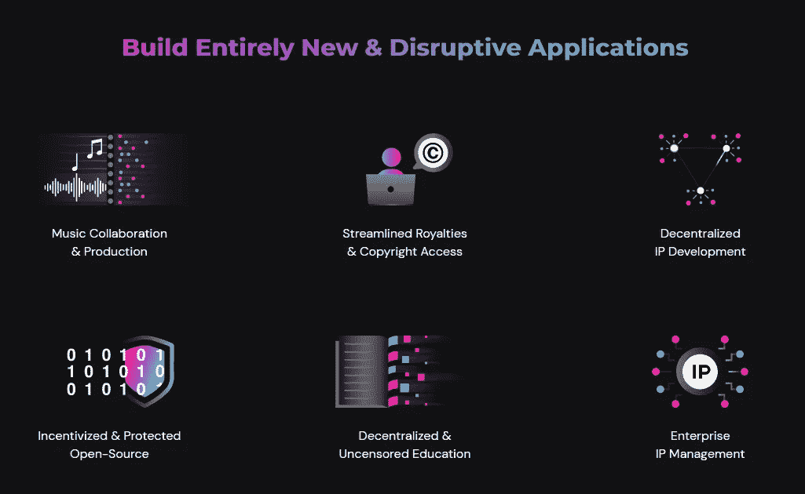

# 因瓦奇大使计划同步 2 月 26 日星期六

> 原文：<https://medium.com/coinmonks/invarch-ambassador-program-sync-saturday-feb-26th-d0f1b1949b9d?source=collection_archive---------13----------------------->

## 因瓦奇及其大使计划的主要更新

因瓦赫社区经理(CM)Casey Richardson 在每个月的最后一个星期五晚上 11 点(UTC)召集所有大使。大使们就成就进行交流，询问并获得他们的问题的答案，提出任何期望的改进，并强调他们关注的问题。此外，社区经理或 InvArch 创始人会进一步更新大使社区，并跟踪团队成员对未来一个月的期望。

最后一次节目同步推迟了一天，在世界协调时 2 月 26 日星期六晚上 11 点举行。在本文中，我分享了社区管理器提供的最重要的更新。

## **见习大使**

内阁向过去一个月新加入的见习大使表示祝贺。他们从大量的申请中被接受了。他一直在审查所有的申请，以确保他们选择的人是最适合这些职位的。然后，凯西利用这个机会向地区和全球大使大声疾呼，要求他们保持领先。他们出色地确保了见习大使得到答复，他们提交的材料得到及时审查。

## **回合、点数和 VARCH 分配**

该团队将提供第二轮(11 月 22 日至 12 月 21 日)和第三轮(12 月 22 日至 1 月 21 日)的分配，可能很快会提供第四轮(1 月 22 日至 2 月 21 日)的分配。他们知道大使们非常渴望弄清楚他们将得到多少，以及他们在这段时间的提交中收到了多少。因此，已经准备好提供轮次分配，它们可能会在未来几天内出来。

## **因瓦赫大使馆**

InvArch embassy 是该团队一直在努力的一个项目。他们想建立一个程序来代表因瓦赫所有不同的社区。
这是什么意思？InvArch 希望基于使用该协议的人来构建社区:思想家、开发者、音乐家、艺术家、律师。

因此，InvArch 将关注这些类型的人以及他们对协议的使用，围绕他们建立社区，并以这种方式帮助激发创新。因此，InvArch 将开始专注于协议的用例，并确保这些用例是经过深思熟虑的、清晰的、解释清楚的。为此，团队将提供教育资源。
作为将焦点转移到协议用例的结果，将会有一种对不和谐的修补。CM 不想过多介入，泄露太多剧透；然而，社区可以预见到一些新的渠道正在被创建，除此之外，将会有更多关于 InvArch 的实际想法和产品的讨论。人们将能够谈论用例，例如，思想家将有一整个部分供他们合作，谈论和分享他们对未来的想法。

## 大使项目管理委员会

一旦执行了对用例的关注，团队计划在治理方面彻底检查大使计划。他们计划建立一个类似于波尔卡多特的议会，就像因瓦奇大使馆议会一样。它将由外交部长组成，但是只要没有平局，他就不会对决定进行投票，还有 14 名成员被选出来领导这个大使馆委员会。它将在未来帮助对影响大使计划的事情进行投票和决策，成员将直接向全球大使、CM 和团队的其他成员发出声音。

一个半月以来，该团队一直承诺进行治理改革，他们已经收到了许多关于他们如何计划这样做的问题。这只是他们开始采取的步骤之一，他们将组建一个委员会来帮助投票决定。这样，就有了一些民主，而不仅仅是一个人的决定。

## 因瓦赫每周三在虚拟现实(VR)

进入下一个激动人心的时刻。因瓦奇将举办官方称为“因瓦奇每周三”的活动。该团队将 InvArch 的每周更新转移到美国东部时间周三晚上 7 点。这种变化带来了一些令人兴奋的事情。该团队不再仅仅是以亚社交和书面形式提供它们；他们也将被记录在虚拟现实中。这有什么令人兴奋的？因为在 InvArch 每周更新的五到三分钟的文章中，团队不能总是真正强调他们试图传递给每个人的令人兴奋的信息，或者真正表达对正在实现的目标的激情和兴奋。对于开发人员社区和世界上的其他人来说，这种变化是令人激动的。当他们从现在开始在 VR 中记录这些更新时，该团队将能够提供关于协议成就的深入更新，进一步触及基础，并提供该技术正在实现的定义和好想法。
社区还可能会有来自团队的一些客人，如 CM，提出一些问题，而创始人 Dakota Barnett 将会引导并谈论这些问题。此外，来自 InvArch 的社交媒体经理 A.J. Recana 将提供这些 VR 每周更新的书面文章。该团队希望确保人们从 InvArch 每周更新中获得营养，因此他们认为最好的方法是将他们转移到 VR，并希望社区对此感到兴奋。

## **作为草间弥生的校场试验网**

该团队想要谈论的另一件重要事情是 Tinker Testnet。Tinker 网络将像 InvArch Mainnet 的表亲链一样。虽然不能保证，但廷克有可能成为草间弥生。因瓦奇团队正在与奇偶校验团队进行谈判。这还不是一个保证，但这是他们非常兴奋的事情。

因瓦赫还将主持一个非灵感化的洛可可试验网。InvArch 的开发人员一直在努力工作，并且非常渴望在不久的将来与社区分享一些信息和更新。他们实际上已经制定了几个月，并确保这个公告的一切都是完美的。

**驻乌克兰大使** 在回答大使们的问题之前，CM 谈到了当前俄乌战争中令人担忧的局势。因瓦奇在乌克兰有很多大使。许多人已经伸出手，让 CM 知道他们是安全的，并且团队重视这一点。内阁非常感谢在此期间继续履行职责的大使们。然而，CM 要求他们优先考虑他们的安全。他明白这是一个紧张的局势；所以，安全永远是第一位的；安全是最重要的，所以他们应该照顾好自己。

## 问答部分

在这些重大更新之后，CM 开始了问题征集。下面是对重要问题的简要总结。

**问题** : **草间弥生。** **有没有拍卖，可否解释一下？**
答:tinker network，虽然仍有一些关于成为草间弥生的可能性的讨论，但团队还不能谈论太多，因为这仍然只是一种可能性，所以他们不想进入太多的细节发布，并确保他们在未来不会踩在他们的脚趾上。

**问题** : **如何成为全球大使？**这基本上是成为全球大使的最佳方式之一。另一种方式是，如果该地区的社区总体规模足够小，并且需要填补那里的领导职位。全球大使的角色从一开始就变得有点困难。这个项目只有其中的几个。然而，他们是非常突出并符合项目需求的个人，例如，用大多数人或相当数量的人说的一种新语言提供某些文章的翻译。

建议: **我们需要彻底改变大使计划，更多地关注 Twitter、Reddit 和论坛。** 回答:会有一点彻底的改变，CM 还有一些他不想剧透的东西。然而，他听到了社区对该项目的关注和担忧。在接下来的几周内，他将对其中的许多问题发表演讲。整个大使计划将在 3 月发生的转变将带来更多的参与和更多的兴奋。通过更多地关注用例，团队希望为社区举办类似的挑战，以帮助阐明一些可能尚未想到的用例。此外，每个人都可以参与测试网。
大使计划即将发生的变化再次与生态系统开发团队分享。他们很兴奋，他们认为这很棒，因为这将是完全独一无二的。

## 结论

还有一些其他的问题，CM 耐心的一一解答。然而，本文涵盖了所有重要的主题。这是一个非常棒的节目，有很多新的信息和重要的互动。社区可以期待在即将到来的周三每周 VR 更新中更多关于新因素的澄清。

网址:[https://invarch . network/](https://invarch.network/)

迪斯科德:[https://discord.gg/J5Qwcb7tbN](https://discord.gg/J5Qwcb7tbN)

电报:【https://t.me/InvArch 

推特:【https://twitter.com/InvArchNetwork 

subsocial:[https://app . subsocial . network/5857](https://app.subsocial.network/5857)

https://www.reddit.com/r/InvArchNetwork/

中:[https://invarch.medium.com/](https://invarch.medium.com/)

领英:[https://www.linkedin.com/company/invarch/](https://www.linkedin.com/company/invarch/)

github:[https://github.com/InvArch](https://github.com/InvArch)

— — — — — — —

# web 3 # NFTs # Polkadot # Innovation # Technology # Startups # Crypto # Crypto currency # gems # IP # intellectual property # art # ideas # Devs # Devs # Developers # Git # Github # para chain

> 加入 Coinmonks [电报频道](https://t.me/coincodecap)和 [Youtube 频道](https://www.youtube.com/c/coinmonks/videos)了解加密交易和投资

# 另外，阅读

*   [如何购买 Ripple (XRP)](https://coincodecap.com/buy-ripple-india) | [非洲最好的加密交易所](https://coincodecap.com/crypto-exchange-africa)
*   [非洲最佳加密交易所](https://coincodecap.com/crypto-exchange-africa) | [晤交易所评论](https://coincodecap.com/hoo-exchange-review)
*   [eToro vs robin hood](https://coincodecap.com/etoro-robinhood)|[MoonXBT vs by bit vs Bityard](https://coincodecap.com/bybit-bityard-moonxbt)
*   [Stormgain 评论](https://coincodecap.com/stormgain-review) | [Probit 评论](https://coincodecap.com/probit-review) | [北海巨妖评论](/coinmonks/kraken-review-6165fc1056ac)
*   [如何在无法阻挡的域名上购买域名？](https://coincodecap.com/buy-domain-on-unstoppable-domains)