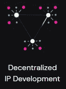

# 因瓦赫网络——用例

> 原文：<https://medium.com/coinmonks/invarch-network-use-cases-1ddaa13e666c?source=collection_archive---------51----------------------->

## 波尔卡多特生态系统推广团队

***免责声明*** *:本文系由*[*Polkadot PromoTeam*](https://medium.com/polkadot-ecosystem-promoteam)*改编的同名* [*视频*](https://youtu.be/WRMJ5r858-A) *的翻版，意在推广有价值的评论。*

Polkadot 生态系统推广团队已经回顾了 InvArch 的架构和主要目标，现在是时候回顾它的用例了。

> 有这么多可能的用例场景，因为每一个创意或开发工作都意味着处理知识产权。

鉴于 InvArch **IP 框架**的灵活性，开发者可以用 **IP 令牌**做任何他们想做的事情，为他们认为必要的任何目的编写程序。

> InvArch 为 devs 提供了各种各样的工具。

已经集成了 EVM 支持，所以所有 Solidity 开发者都可以在 InvArch 上构建 dapps，而不需要学习任何新东西。
**WASM 支持**也将于 2022 年初上市，在 mainnet 之前。
**其他特性还有** 可编程令牌、
甲骨文
以及与基于 Polkadot 的分散式 KYC 平台的集成。

## 我们希望在 InvArch 上看到的用例包括:

- **分散开发:**

任何开发者社区都可以开始一个项目，并根据他们的贡献在所有参与者之间分配项目所有权。开发者、设计师、经理、创始人——他们都可以成为项目的所有者。当项目部署后，所有 IPT 所有者都将获得他们应得的利润。

*   **开源协作:**

想象一下代码模块。这些模块可以组合成 IP 集或独立的 IPF。每当一个项目或开发人员使用另一个开发人员的模块时，他们可以提供他们项目的一部分 ipt 以换取使用代码。然后，如果该应用程序有任何收入，使用其模块的开发人员将获得这些未来利润的一部分。

*   **收取版税:**

艺术家可以铸造他们的音乐文件，并作为样本与其他艺术家分享，以换取部分 IPTs。这将为原创艺术家提供对其他艺术家的任何包含他们音乐的作品进行版税索赔的权利。

*   **分散流:**

有可能建立一个 iTunes 的去中心化版本，在那里艺术家可以流式播放他们的音乐，如果他们的音乐受欢迎，就可以获得订阅费的一部分。请记住，IPT 令牌是完全可编程的，其应用的多样性几乎是无限的。

*   **企业知识产权管理:**

无论两家公司有多么不同，也无论 IP 管理应用程序如何，只要这些应用程序是使用 InvArch 协议构建的，它们就可以共享数字 IP 资产，而不会有任何想法被窃取的风险。

*   **分散教育:**

整个教育讲座可以制作成 IP 文件，组合成 IP 集，形成整个课程，甚至整个教育体系。
知识产权代币可以根据对课程或系统的贡献进行编程，并免费分发给参与者。这一机制可以允许社区管理的教育系统。

*   **iDEX (IPOwnership DEX):**

可以创建完整的市场和分散的交易所，以便为知识产权筹资提供工具。一个简单的 DEX，用于交易某些项目的 IP 令牌，甚至是部分所有权的市场，降低了散户或机构投资者的金融壁垒。

> InvArch 提供了一种全新的项目工作和知识产权管理方法。

通过采用这种方法，**分散的开发者社区将能够在不签署任何书面合同的情况下参与项目并做出贡献，但如果他们的项目成功，仍然可以获得收入。
**工程师和研究人员**将获得一个工具来上传和标记他们的工作，以便与合作伙伴分享，摆脱了每次迭代都要获得专利的问题。初创公司的创始人将会因为他们的绝妙想法而获得融资。
**音乐和视频创作者**将获得合作项目的机会，并获得版税。**

可能的用例数量非常多。

访问因瓦赫官方渠道:
[**网站**](https://invarch.network/)】[**推特**](https://twitter.com/InvArchNetwork)**不和**】[**亚社会**](https://app.subsocial.network/5857)】[**中社会**](https://invarch.medium.com/)[**电报**](https://t.me/InvArch)[**Github**](https://github.com/Invarch)】

— — — — — — — — — — — — — — — — — — — — — — — — — — — — — —

# web 3 # NFTs # Polkadot # Innovation # Technology # Startups # Crypto # Crypto currency # gems # IP # intellectual property # art # ideas # Devs # Devs # Developers # Git # Github # para chain

> 加入 Coinmonks [电报频道](https://t.me/coincodecap)和 [Youtube 频道](https://www.youtube.com/c/coinmonks/videos)了解加密交易和投资

# 另外，阅读

*   [加密保证金交易交易所](/coinmonks/crypto-margin-trading-exchanges-428b1f7ad108) | [赚取比特币](/coinmonks/earn-bitcoin-6e8bd3c592d9)
*   [WazirX vs CoinDCX vs bit bns](/coinmonks/wazirx-vs-coindcx-vs-bitbns-149f4f19a2f1)|[block fi vs coin loan vs Nexo](/coinmonks/blockfi-vs-coinloan-vs-nexo-cb624635230d)
*   [BlockFi 信用卡](https://coincodecap.com/blockfi-credit-card) | [如何在币安购买比特币](https://coincodecap.com/buy-bitcoin-binance)
*   [火币交易机器人](https://coincodecap.com/huobi-trading-bot) | [如何购买 ADA](https://coincodecap.com/buy-ada-cardano) | [Geco？一次回顾](https://coincodecap.com/geco-one-review)
*   [加密复制交易平台](/coinmonks/top-10-crypto-copy-trading-platforms-for-beginners-d0c37c7d698c) | [五大 BlockFi 替代品](https://coincodecap.com/blockfi-alternatives)