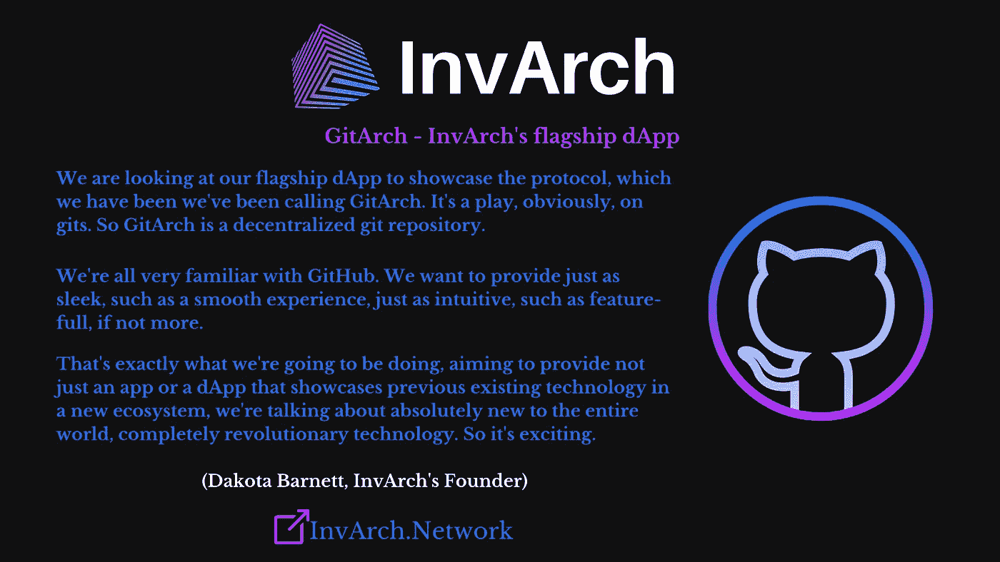

# 因瓦赫—技术特征

> 原文：<https://medium.com/coinmonks/invarch-technological-features-8c5983e09494?source=collection_archive---------41----------------------->

## 即将推出

在[之前的文章](/@Cap_0438/invarchs-technological-development-fcc72128fb38)中，我描述了 InvArch 的基本架构，以及它使强大的可组合性成为可能:该协议利用了 NFT 的潜力，将其应用于任何将它们存储为称为 IPF 的增强型 NFT 的知识产权，允许它们以 IPSs 的形式可组合，并使用 IPTs 简化版税共享。
本文介绍 InvArch 即将推出的技术特性。

**GitArch——因瓦奇的旗舰 dApp**

开源在区块链世界受到高度重视，如何保护知识产权是一个问题。GitHub 是科技界最大的赢家。GitArch 是 Git Repository 上的一个游戏，通过它，InvArch 想要建立一种去中心化的 GitHub。git 中间件将实现 InvArch 协议来创建一个分散的 Git 存储库，简化代码认证、许可和管理。开发人员可以将他们的代码推送到 InvArch，同时大大简化了将他们的代码认证为 IP 文件的过程。此外，由于 InvArch 可以在多个所有者之间分割和建立所有东西的所有权，这为激励性的开源代码打开了大门。

这个项目背后的团队希望提供一些同样流畅的东西，比如流畅的体验，同样直观的东西，比如像 Github 一样功能齐全，如果不是更多的话。此外，他们的目标不仅仅是提供另一个应用程序或 dApp，在新的生态系统中展示现有的技术；我们可以期待对整个世界来说是全新的，完全革命性的技术。

**知识产权许可—** 将会有 IPL(知识产权许可)，这意味着，InvArch 将建立一种模块化的方法来达成各种许可协议。因此，在不同的许可协议中，模块化库可供个人选择。此外，该团队还探索了个人上传自己的许可协议的能力。更令人兴奋的是，他们可能会找到一种方法来激励或奖励那些创建大量使用的流行许可协议的人，从而激励整个链条上所有地方的所有参与者。这听起来很酷。

**OCIF(链上创新基金)——**最后，因瓦奇团队将深入 OCIF:链上创新基金。这里有三种不同的创新链资金机制，知识产权赌注，知识产权农业，知识产权捐赠。用户还可以将他们的一部分赌注奖励转移到一个 IP 集，以换取一定数量的 IP 令牌，这些令牌可用于为有前途的想法筹集资金。InvArch 将成为所有人的强大资源，无论是被动收入还是创业流动性和资金。

**XCA 协议(跨链认证协议)——**最后但并非最不重要的一点，需要交付一个核心技术件，即 IP 的跨链认证。XCA 是一种跨链协议，用于索引、引用和验证不可替换的数字资产，并保护它们免受未经授权的复制、拷贝或任何其他访问。

**一个充满可能性的新世界** 所有这些技术为协议打开了一扇强大用例世界的大门。通过采用这种方法，*分散的开发人员*可以在不签署任何书面合同的情况下参与项目并做出贡献，但如果他们的项目成功，仍然可以获得收入。
*工程师和研究人员*将获得一个工具来上传和标记他们的工作，以便与合作伙伴分享，摆脱了每次迭代都获得专利的问题。
*初创公司的创始人*将会因为他们出色的想法而获得融资。
*音乐和视频创作者*将获得合作项目的机会，并获得版税。

# 结论

我们已经可以预见到 InvArch 会带来大量全新的用例，如果没有 InvArch 提供的关键技术，这些用例目前是不可能实现的。因此，我们相信每个人都会很快发现 InvArch 是一个有价值的开创性项目。

访问因瓦赫官方渠道:
[**网站**](https://invarch.network/)[**推特**](https://twitter.com/InvArchNetwork)[**不和**](https://discord.gg/J5Qwcb7tbN)**子社会**[**媒介**](https://invarch.medium.com/)[**电报**](https://t.me/InvArch)[**Github**](https://github.com/Invarch)

— — — — — — — — — — — — — — — — — — —

# web 3 # NFTs # DAOs # Polkadot # Innovation # Technology # Startups # Crypto # Crypto currency # gems # IP # intellectual property # art # ideas # dev # Devs # Developers # Git # Github # Parachain

> 加入 Coinmonks [电报频道](https://t.me/coincodecap)和 [Youtube 频道](https://www.youtube.com/c/coinmonks/videos)了解加密交易和投资

# 另外，阅读

*   [3 商业评论](/coinmonks/3commas-review-an-excellent-crypto-trading-bot-2020-1313a58bec92) | [Pionex 评论](https://coincodecap.com/pionex-review-exchange-with-crypto-trading-bot) | [Coinrule 评论](/coinmonks/coinrule-review-2021-a-beginner-friendly-crypto-trading-bot-daf0504848ba)
*   [莱杰 vs n rave](/coinmonks/ledger-vs-ngrave-zero-7e40f0c1d694)|[莱杰 nano s vs x](/coinmonks/ledger-nano-s-vs-x-battery-hardware-price-storage-59a6663fe3b0) | [币安评论](/coinmonks/binance-review-ee10d3bf3b6e)
*   [Bybit Exchange 审查](/coinmonks/bybit-exchange-review-dbd570019b71) | [Bityard 审查](https://coincodecap.com/bityard-reivew) | [Jet-Bot 审查](https://coincodecap.com/jet-bot-review)
*   [3 commas vs crypto hopper](/coinmonks/3commas-vs-pionex-vs-cryptohopper-best-crypto-bot-6a98d2baa203)|[赚取加密利息](/coinmonks/earn-crypto-interest-b10b810fdda3)
*   最好的比特币[硬件钱包](/coinmonks/hardware-wallets-dfa1211730c6) | [BitBox02 回顾](/coinmonks/bitbox02-review-your-swiss-bitcoin-hardware-wallet-c36c88fff29)
*   [BlockFi vs 摄氏度](/coinmonks/blockfi-vs-celsius-vs-hodlnaut-8a1cc8c26630) | [Hodlnaut 审核](/coinmonks/hodlnaut-review-best-way-to-hodl-is-to-earn-interest-on-your-bitcoin-6658a8c19edf) | [KuCoin 审核](https://coincodecap.com/kucoin-review)
*   [Bitsgap 审查](/coinmonks/bitsgap-review-a-crypto-trading-bot-that-makes-easy-money-a5d88a336df2) | [Quadency 审查](/coinmonks/quadency-review-a-crypto-trading-automation-platform-3068eaa374e1) | [Bitbns 审查](/coinmonks/bitbns-review-38256a07e161)