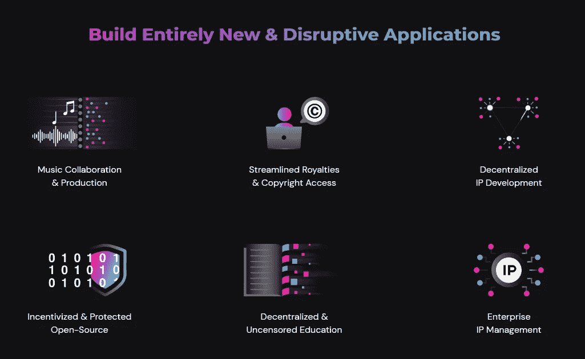
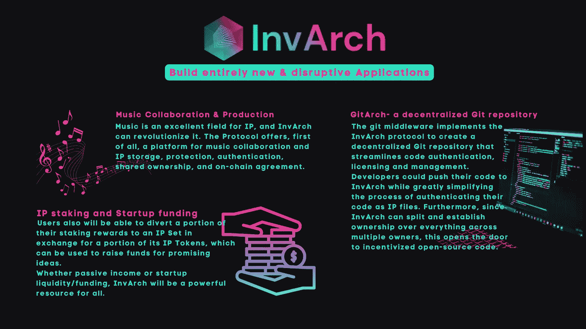

# InvArch —用例

> 原文：<https://medium.com/coinmonks/invarch-use-cases-dcb0cdee5a16?source=collection_archive---------78----------------------->

## 构建完全颠覆性的应用

InvArch 是一项知识产权(IP)协议，将于 2022 年在 Q2 Polkadot 推出。该项目旨在通过其对 IP、、DAO 和 Polkadot 技术的独特采用，彻底改变未来的发展。本文给出了该协议将提供的一些惊人的实用程序和用例的例子。

**您的发明—** 用户可以利用智能合同功能，并将其用于智能 IP。这意味着知识产权文件(IP 文件)可以在 InvArch 上存储程序，这些程序在满足预定条件时运行。它们可以用于简化各方之间的无信任跟进，以便所有参与者可以立即确定结果，而没有任何第三方的参与或时间损失。

例如，如果你有一个伟大的想法，创造了一些东西，一个朋友来提供你需要的钱。你可以在 InvArch 上铸造你的知识产权，并给他一定比例的所有权。当创建智能 IP 合同时，您将向您的朋友发送与您的 IP 的 IP 挂钩的 IP 令牌的相应份额。因此，该知识产权将归你和你朋友的账户集体所有。这个例子揭示了 InvArch 协议的伟大之处，有了它，任何一个 IP 项目都可以成为 DAO(分散自治组织)。

**艺术家具—**Polkadot 委员会的一名成员从事艺术地毯的工作，他给出了这样一个例子:“我相信，有了 InvArch，Khawachen 将能够通过他们先进的知识产权、效用和基于 Polkadot 的 XCA 协议，为我们的艺术地毯系列创造在线利润分享支持。我还相信，通过简化的知识产权许可、版权条款、资产包装和无信任协议，InvArch 将能够为 NFTs、元宇宙，甚至全球品牌带来更丰厚的现金流动性。”

**音乐—** 音乐对于 IP 来说是一个极好的领域，因瓦奇可以对其进行革命性的改变。该协议首先提供了一个平台，用于音乐协作和 IP 存储、保护、认证、共享所有权和链上协议。

**IP 赌注和启动资金—** 用户还可以将一部分赌注奖励转移到一个 IP 集，以换取一部分 IP 代币，这些代币可用于为有前途的想法筹集资金。

无论是被动收入还是创业流动资金/资金，InvArch 都将是所有人的强大资源。

**giarch 项目—** 开源在区块链世界备受推崇，如何保护知识产权是一个问题。GitHub 是科技界最大的赢家。GitArch 是 Git Repository 上的一个游戏，InvArch 想用它来构建一个 GitHub，但是是分散的。git 中间件实现了 InvArch 协议，创建了一个分散的 Git 存储库，简化了代码认证、许可和管理。开发人员可以将他们的代码推送到 InvArch，同时大大简化了将他们的代码认证为 IP 文件的过程。此外，由于 InvArch 可以在多个所有者之间分割和建立所有东西的所有权，这为激励性的开源代码打开了大门。

## 结论

有了所有可用的部件，InvArch 不会将其令人兴奋的潜力局限于目前顶尖的区块链技术。相反，该协议是面向未来的，将允许构建未来的用例及技术。尽管如此，我们已经可以预见 InvArch 会带来大量全新的用例，如果没有 InvArch 提供的关键技术，这些用例目前是不可能实现的。因此，我们相信每个人都会很快发现 InvArch 是一个有价值的开创性项目。

访问因瓦赫官方渠道:
[**网站**](https://invarch.network/)[**推特**](https://twitter.com/InvArchNetwork)[**不和**](https://discord.gg/J5Qwcb7tbN)】[**子社会**](https://app.subsocial.network/5857)】[**中**](https://invarch.medium.com/)[**电报**](https://t.me/InvArch)[**Github**](https://github.com/Invarch)

— — — — — — — — — — — — — — — — — — — — — — — — — — — — — —

> 加入 Coinmonks [电报频道](https://t.me/coincodecap)和 [Youtube 频道](https://www.youtube.com/c/coinmonks/videos)了解加密交易和投资

# 另外，阅读

*   [Exness Review](https://coincodecap.com/exness-review)|[moon xbt Vs Bitget Vs bing bon](https://coincodecap.com/bingbon-vs-bitget-vs-moonxbt)
*   [如何通过密码借贷获得被动收入](https://coincodecap.com/passive-income-crypto-lending)
*   [密码货币储蓄账户](/coinmonks/cryptocurrency-savings-accounts-be3bc0feffbf) | [密码交易机器人](https://coincodecap.com/best-crypto-trading-bots)
*   [大 ONE 交易所点评](/coinmonks/bigone-exchange-review-64705d85a1d4) | [CEX。IO 审查](https://coincodecap.com/cex-io-review) | [Swapzone 审查](/coinmonks/swapzone-review-crypto-exchange-data-aggregator-e0ad78e55ed7)
*   [最佳比特币保证金交易](/coinmonks/bitcoin-margin-trading-exchange-bcbfcbf7b8e3) | [比特币保证金交易](https://coincodecap.com/bityard-margin-trading)