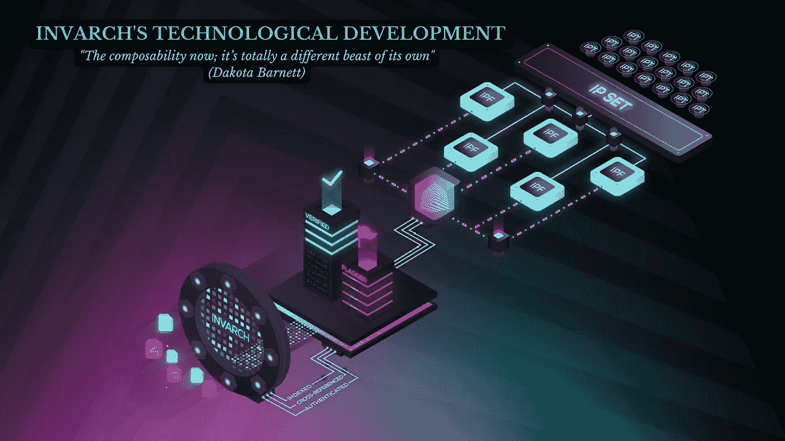

# 因瓦赫的技术发展

> 原文：<https://medium.com/coinmonks/invarchs-technological-development-fcc72128fb38?source=collection_archive---------58----------------------->

## 现在的可组合性；这是完全不同的野兽

InvArch 加速未来的技术创新，用今天不可能的工具将想法带入生活。该协议利用了 NFTs 的潜力，并将其与 Polkadot 的安全性和互操作性相结合，创建了世界上第一个 IP(知识产权)所有权、效用&跨链认证协议，用于 Web3。

本文简要介绍了这个吉祥项目的重大技术发展。

因瓦奇在幕后做了很多事情。一切都在一起。感觉这是命中注定的。该团队一直在不知疲倦地努力扩大。世界上每一个有意义的变化都始于一个想法。对于因瓦赫项目，其想法是将强大的 NFT 技术应用于多种艺术。
该协议的基本架构有三个组成部分:

*   **1 IPF(知识产权档案)** 因瓦赫利用 NFTs 令人振奋的力量，并将其应用于艺术之外的领域；该协议允许用户以现在称为知识产权文件(IPF)的增强型 NFTs 的形式标记和存储任何知识产权文件。
*   **IP(知识产权集)** IPF 可以一起存储在可互换和绑定的集合中，称为知识产权集(IPSs)。IPSs 实现了任何文件类型之间的绝对可组合性。IPSs 可以比作 NFT 收藏；InvArch 为 IP 文件提供了一个类似的分组系统，但是限制更宽松，功能更强大。
*   **IPT(知识产权令牌)** 该协议继续创新，将可替换、可编程和可定制的 IP 令牌(IPT)与 IP 集绑定在一起。因此，IP 集可以利用 ipt，就像 dApps 和智能合约与它们的实用工具令牌交互一样。此外，知识产权协议是神奇的，因为它们可以简化任何知识产权的版税分享，为无信任、分散的协作打开大门。换句话说，有了 InvArch 每个项目，每个 IP 都可以变成 DAO(去中心化自治组织)。

IPFs、IPSs 和 IPTs 只是因瓦奇想为世界提供的令人惊叹的技术的基石。而且扩大了这么多！

> “现在的可组合性；这完全是一个不同的野兽。”(达科塔·巴尼特，[因瓦赫第一推特空间](https://twitter.com/i/spaces/1BRKjnVYgjBKw?s=20))。

为了帮助可视化技术组件是如何组合在一起的，您可以在桌面上思考。你创建一个文件夹；你创建一个文件；你把文件放在文件夹里；你把那个文件夹和另一个文件夹放在一起，等等。你上传；您为开发人员组织了一个存储库和一个 GitHub 存储库。你可以组织你的代码；您正在进行版本控制；你可以储存和使用任何东西。而在幕后，认证正在进行，可以帮助保护和提供对 IP 的版权保护，并提供一个扩展的、强大的系统，称为子资产。

想想所有不同的机制在这里发挥作用是很有趣的。例如，让我们说，对于某个人推送并被接受和提交到项目中的每五行代码，他们得到了其中一个子资产，其中一个令牌。他们能够赢得那些代币。这些令牌不仅代表了他们参与编辑的能力；也许这些代币会增加他们的赌注奖励。这些代币可能会清算那些公用代币，它们很常见，比如人们熟悉的 ERC20 代币。

这个项目背后有更多的东西。查看我的下一篇文章,关于 InvArch 团队准备发布的特性，这些特性有可能让许多人大吃一惊。

访问因瓦赫官方渠道:
[**网站**](https://invarch.network/)[**推特**](https://twitter.com/InvArchNetwork)[**不和**](https://discord.gg/J5Qwcb7tbN)】[**子社会**](https://app.subsocial.network/5857)】[**中**](https://invarch.medium.com/)[**电报**](https://t.me/InvArch)[**Github**](https://github.com/Invarch)

— — — — — — — — — — — — —

# web 3 # NFTs # DAOs # Polkadot # Innovation # Technology # Startups # Crypto # Crypto currency # gems # IP # intellectual property # art # ideas # dev # Devs # Developers # Git # Github # Parachain

— — — — — — — — — — — — —

> 加入 Coinmonks [电报频道](https://t.me/coincodecap)和 [Youtube 频道](https://www.youtube.com/c/coinmonks/videos)了解加密交易和投资

# 另外，阅读

*   [电网交易机器人](https://coincodecap.com/grid-trading) | [Cryptohopper 审查](/coinmonks/cryptohopper-review-a388ff5bae88) | [Bexplus 审查](https://coincodecap.com/bexplus-review)
*   [7 个最佳零费用加密交易平台](https://coincodecap.com/zero-fee-crypto-exchanges)
*   [氹欞侊贸易评论](https://coincodecap.com/anny-trade-review) | [霍比保证金交易](/coinmonks/huobi-margin-trading-b3b06cdc1519)
*   [分散交易所](https://coincodecap.com/what-are-decentralized-exchanges) | [比特 FIP](https://coincodecap.com/bitbns-fip) | [Pionex 评论](https://coincodecap.com/pionex-review-exchange-with-crypto-trading-bot)
*   [用信用卡购买密码的 10 个最佳地点](https://coincodecap.com/buy-crypto-with-credit-card)
*   [最好的卡达诺钱包](https://coincodecap.com/best-cardano-wallets) | [Bingbon 副本交易](https://coincodecap.com/bingbon-copy-trading)