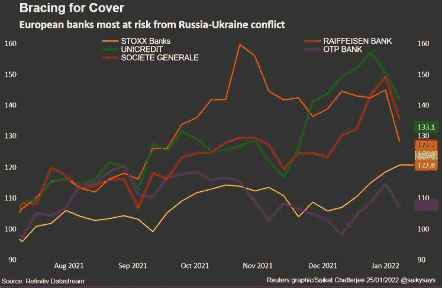

# 入侵乌克兰使投资基金转向:对市场风险的新评估

> 原文：<https://medium.com/coinmonks/invasion-of-ukraine-turns-investment-funds-new-assessments-of-market-risks-f6783addf16a?source=collection_archive---------53----------------------->

ESG 公司收购是资金管理行业最热门的趋势之一，到 2020 年初，吸引的投资总额超过 35 万亿美元。

但对于从波士顿到伦敦的基金经理来说，关注的焦点主要是公司，在决定投资一个国家时，治理风险基本上被忽略了。

现在，随着西方银行和公司重新考虑其在俄罗斯的数千亿美元敞口，路透社采访的超过六名基金经理表示，乌克兰危机促使他们重新思考如何定义风险。

“我们必须承认，作为一个行业，我们犯了一个巨大的错误，没有正确看待 2014 年对(克里米亚)的入侵，并采取相应的行动，”870 亿美元丹麦养老基金的可持续发展负责人 Sasya Beslik 说。

彼得森国际经济研究所的尼古拉斯·拉迪解释说，西方投资者在中国的投资决策中至少更关注股东价值而不是人权。

由金融专家和学者运营的非营利组织可持续金融市场网络的总裁 Martina Macpherson 表示，分担主权风险是投资者的下一个前沿领域。

麦克弗森补充说，尤其如此，“当它涉及到环境、社会和机构治理的系统性风险时，如气候、生物多样性、侵犯人权和国家管理不善。”

随着对日常经济活动的干扰停止，更多的投资涌入相关国家，政府有时会进行压制，就像两年前中国叫停香港的民主抗议活动后那样。2021 年外商对华直接投资增长 14.9%。

例如，国际投资者去年因持有白俄罗斯发行的债券而受到抨击，当时该国总统亚历山大卢卡申科(Alexander Lukashenko)加强了对抗议者的镇压。

随着北京方面去年发起监管打击，从科技到房地产开发商等一系列中国公司的投资者都蒙受了损失。

例如，路孚特的数据显示，贝莱德 Eyeshare 基金在俄罗斯的投资约为 3%，但在中国的投资为 28%。

“它太大了，不容忽视，而且非常有利可图，”拉迪在谈到中国的投资者房地产时表示。嘉宝川崎财富管理与投资公司总裁罗斯·嘉宝也表达了同样的观点。他说，中国巨大的全球经济影响力使得投资者很难回避它。

他补充说，“人们批评我，因为我在中国有投资，而不是在俄罗斯，但这是非常不同的。批评的人在中国制造的 iPhone 上写字，穿中国制造的衣服。”

相比之下，挪威 1.3 万亿美元的主权财富基金表示，它已经取消了中国李宁公司的资格，因为这家运动服装制造商在新疆助长严重侵犯人权的“不可接受的风险”。

在俄罗斯，外国人拥有近 800 亿美元债务，包括以卢布、欧元和美元计价的主权债券，以及公司硬通货证券。与此同时，俄罗斯以外的投资者也拥有俄罗斯股市 86%的股份。

此外，英国石油公司、法国兴业银行、花旗集团和苹果公司等西方公司也与俄罗斯建立了联系。自入侵以来，许多人已经暂时中止或终止了他们的业务，一些人说这证明了良好的公司治理的价值。它现在已经从资金管理渗透到企业决策。

总部位于美国的 Zevin Asset Management 总裁索尼娅科瓦尔(Sonia Kowal)在谈到投资一些国家时表示:“没有保护你的规则。”她指出，自己避免投资俄罗斯和中国国有企业。

专注于新泽西州治理的财富管理公司杰弗里·古特曼(Jeffrey Gutterman)说，在俄罗斯入侵后，他上周卖掉了他的公司在新兴市场的 5%股份，除其他外，他担心中国的持股也可能面临限制。

“我们所知道的是，新兴市场在投资组合中的角色正在被重新评估，”他补充道。

> *加入 Coinmonks* [*电报频道*](https://t.me/coincodecap) *和* [*Youtube 频道*](https://www.youtube.com/c/coinmonks/videos) *了解加密交易和投资*

# 另外，阅读

*   [Bookmap 评论](https://coincodecap.com/bookmap-review-2021-best-trading-software) | [美国 5 大最佳加密交易所](https://coincodecap.com/crypto-exchange-usa)
*   最佳加密[硬件钱包](/coinmonks/hardware-wallets-dfa1211730c6) | [Bitbns 评论](/coinmonks/bitbns-review-38256a07e161)
*   [新加坡十大最佳加密交易所](https://coincodecap.com/crypto-exchange-in-singapore) | [购买 AXS](https://coincodecap.com/buy-axs-token)
*   [红狗赌场评论](https://coincodecap.com/red-dog-casino-review) | [Swyftx 评论](https://coincodecap.com/swyftx-review) | [CoinGate 评论](https://coincodecap.com/coingate-review)
*   [投资印度的最佳密码](https://coincodecap.com/best-crypto-to-invest-in-india-in-2021)|[WazirX P2P](https://coincodecap.com/wazirx-p2p)|[Hi Dollar Review](https://coincodecap.com/hi-dollar-review)