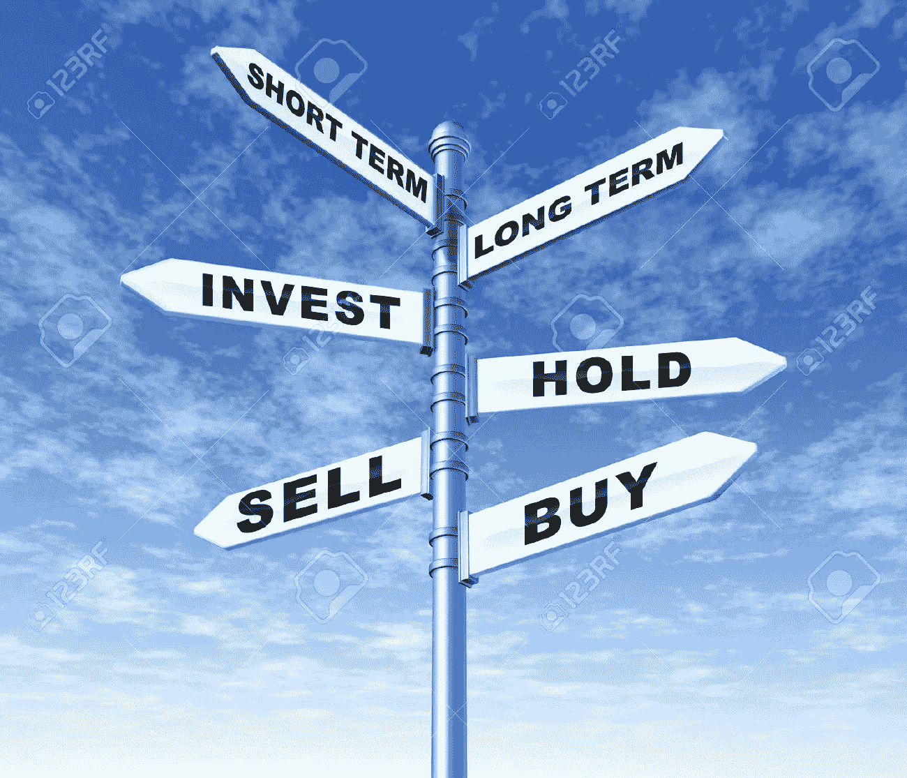
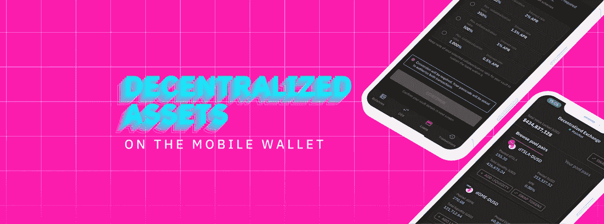
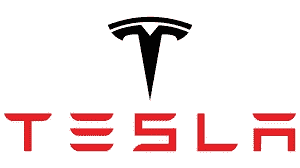
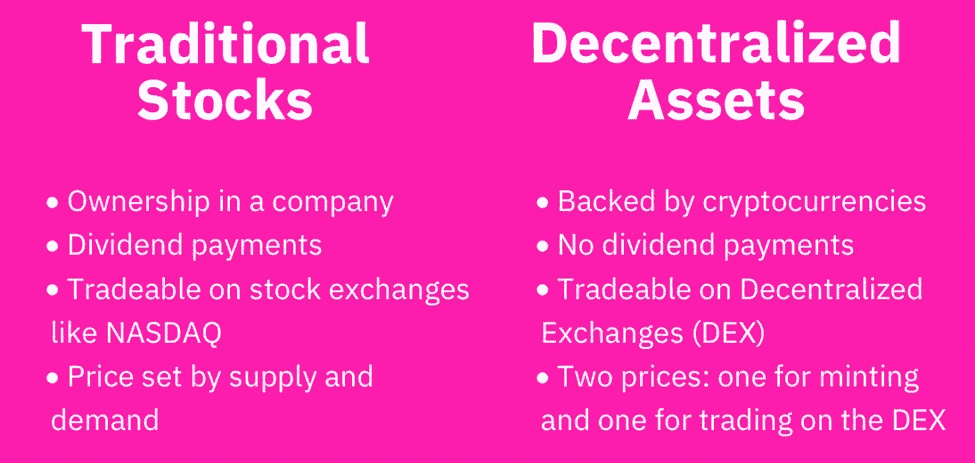
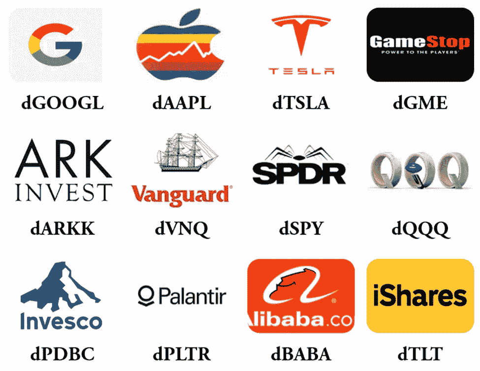
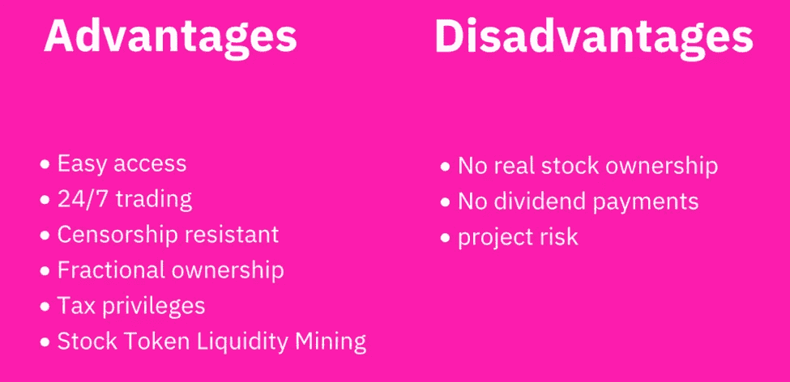

# 用分散的资产轻松投资特斯拉、谷歌和苹果！

> 原文：<https://medium.com/coinmonks/invest-in-tesla-google-apple-easily-with-decentralized-assets-cdfe4e58330b?source=collection_archive---------7----------------------->

# 概述

投资股票只意味着购买一家上市公司的少量股份。这些小股被称为公司的股票——出于善意购买，并希望感兴趣的公司随着时间的推移会升值，同时其股票的价值也会增加，投资者可以出售这些股票以获取利润。一些交易者持有股票是为了分红——相当于加密货币霍德尔。无论你喜欢哪种策略，无论是积极交易(低买高卖)还是长期持有股票，股市都是产生被动收入的诱人机会。

Riding on the highs and lows of the stock market can be both a daunting and exciting experience,

# 问题是

It is not uncommon to find early investors overwhelmed by the art of trading stocks.

你是否曾经好奇并渴望进入股票市场，却被以下因素所困扰？

不确定从哪里开始？

不确定何时投资，或何时把握市场时机？

不确定投资哪些股票？

不知所措的交易术语，如股票，问/报价，投标，蔓延，收益率，PNL，每股收益，PBR 等等？

被高昂的经纪费吓倒？

根据 investopedia 的数据，每笔交易的平均交易费用从 10 美元(对于折扣经纪人)到 150 美元(对于全方位服务经纪人)不等——这可以转化为一笔相当大的金额，尤其是如果你的资本本来就不多的话。

不要烦恼，你并不孤单！这些是我几年前开始涉足股市时的担忧。虽然我自称不是这方面的专家，但这么多年来，我在股市交易中经历了相当多的起起落落。由于投资于数字资产，当我遇到“分散资产”的概念时，我的好奇心被激起，这使我进入了这个令人兴奋的可能性领域，这确实有望成为一种革命性的加密投资形式！

# 分散资产介绍

D 非中央化资产是加密货币，任何人都可以在区块链创建。本质上，它们是由加密货币(如 DFi、比特币或 USDT 或 USDC 等稳定货币)支持的数字资产，反映了感兴趣股票的价格(oracle price)。

TESLA

以特斯拉为例——特斯拉股票的实际股票代码是 TSLA。然而，由于在 DeFiChain 中生成 dTokens 的方式，TSLA 变成了 dTSLA。必须说明的是，持有 dTSLA 令牌并不能为用户提供 TSLA 的所有权；它只是一个数字代币，可能会跟随 TSLA 的价格；然而，它的价格也受分散交易所(DEX)供求关系的影响。因此，dToken 的价格可以自由变动，并独立于 oracle 价格，这取决于 DeFiChain DEX 上给定 dToken 的供应和需求；但它的变动最终会在一定程度上反映出感兴趣的原始股票的甲骨文价格。

# **与常规股票的区别**

传统股票是公司的股份，由公司自己发行，受许多法规的约束，并授予股东某些权利，如投票权，还享有股息支付等利益。

另一方面，分散资产(dTokens)存在于 defichain 区块链，不是由公司发行的。分散资产是其甲骨文股票的“数字”反映，其价格可能受甲骨文价格以及其他因素(如供应和需求)的影响。因此，这些数据令牌是由用户创造的，任何分散资产的内在价值主要取决于集体赋予它的价值(通过在 DEX 上交易)。

# 可用分散资产列表

投资热门科技股，比如谷歌、苹果、特斯拉；或者像景顺 QQQ 信托系列 1、SPDR 标准普尔 500 ETF 信托这样的 ETF；甚至像金银这样的重金属！这个列表还在继续，并且将随着 defichain 的未来发展而进一步扩展。

# 可能性

分散的资产一旦被购买，既可以作为价格敞口持有，也可以交易(低买高卖！)，或者通过将其与 dUSD(与 defichain 上的美元价值挂钩)配对，参与流动性开采池，以获得高达 200% APR 的可观回报(取决于 defichain 的原生标志 DFI 的价格)。从流动性挖掘中获得的回报大约每 12 个小时就开始涌入，主要是以 DFI 的形式，但也有少量你投入的 dToken(如 dTSLA 和 DUSD)。然后，通过参与赌注或流动性开采，这些回报可用于复利；或者撤回。

# 分散资产如何投资？

1.  Via [Cake DeFi](https://cakedefi.com/?ref=677920) —一个一站式金融平台，提供最优质的赌注、流动性挖掘和贷款服务，年利率高达 200%！观看下面的视频，了解如何投资 Cake DeFi 的简短教程。(敬请关注即将发布的关于如何投资分散资产的详细文章！)

2.通过本地 defichain 钱包。

# 诚实的评价

# 赞成者

**密码和股票市场排名第一！**

分散资产结合了流动性挖掘的高收益(高达 200%的年利率！)以投资一家上市公司的熟悉程度。从分散化资产的价格上涨中获利，同时获得直接从区块链分配的流动性挖掘奖励，还有什么比这更好的呢？

**#2 轻松访问**

任何拥有笔记本电脑或移动设备的人都可以通过 Cake DeFi 或 defichain wallet 轻松访问 defichain 网络，并开始投资分散资产，免去了注册经纪服务的麻烦。

**#3 最低交易费用**

昂贵的经纪交易费的日子已经一去不复返了；在 Cake DeFi 上购买分散式资产的唯一费用是 0.5%的小额转换费，用于在分散式交易所将您的 DFI 转换为上述数字资产。

**#4 小额购买能力**

购买少量的股票是可能的——适合想要涉足这一激动人心的投资领域的年轻投资者！

**#5 轻松转让**

所有的代币都是可自由计数的，可以立即转让给世界各地的其他人，而不必依靠中间人。

# 坏处

**#1 固有项目风险**

永远不要低估项目风险本身——尽管采取了措施来确保赤字链的增长和可持续性，但只投资你能承受损失的资金！不过，请放心，defichain 是一个由金融专家和加密爱好者组成的繁荣社区，他们不懈地朝着稳定的分散金融的目标努力；因此，你的资金最有可能是 SAFU。

**#2 DFI 价格**

由于流动性挖掘奖励主要在 DFI 支付，收益受到加密货币 DFI 价格的影响。虽然 DFI 的价格一直在飙升，甚至在大部分时间里都超过了比特币，但过去的表现并不是未来表现的指标。

**#3 缺少股息/公司所有权**

拥有分散的资产不会带来拥有传统股票的好处，如股息支付或拥有公司所有权，从而带来特权，如投票权等。

# 最后的想法

通过分散的资产，现在每个人都可以用很小的金额投资股票。此外，还可以通过流动性挖掘获利，允许你将分散的资产令牌放入流动性池，并因此获得挖掘奖励。

除了利用所述股票的价格变动，投资者还可以使用移动设备以最低的费用轻松购买分散资产，与传统的股票市场投资相比，收益更高。

[**Cake DeFi**](https://cakedefi.com/?ref=677920) 是一个值得信赖和可靠的一站式平台，以多种方式产生被动现金流，其中分散资产是最近令人兴奋的新增内容！[今天就报名](https://cakedefi.com/?ref=677920)，开始享受被动收入！锦上添花的是，当您在此处注册[时，将获得 30 美元的注册奖金+10 美元的 learn & earn +独家额外奖金](https://cakedefi.com/?ref=677920)！

Generate passive cashflow with Cake DeFi!

Introduction to DeFi taken from the official youtube channel of defichain

探索蛋糕定义上的分散资产

*一如既往，这不是财务建议！而只是我投资过的，觉得值得分享的投资平台。在投资前做好自己的研究，不要存你输不起的钱。下面有什么问题可以随时问我。*

*如果你喜欢这篇文章，* [*关注&订阅*](/@cybery) *！*

*查看以下值得信赖的平台！*

*🎁*[*honey gain*](https://r.honeygain.me/CYBER577DD)*一款被动收入应用，从你未使用的互联网带宽中赚钱。* [*免费获得 5 美元*](https://r.honeygain.me/CYBER577DD) *，无需投资。*

*🎁* [*蛋糕 Defi*](https://cakedefi.com/?ref=677920) *一站式投资平台，以高达 200%的年利率烘焙被动现金流！* [*拿 30 美元*](https://cakedefi.com/?ref=677920) *在 DFI 拿 50 美元存款。*

*🎁*[*Nexo*](https://nexo.io/ref/hce5cfdt5o?src=web-link)*全球最先进、受监管的数字资产机构，在 200 多个司法管辖区提供 40 多种法定货币的即时加密贷款、每日资产收益、交换和服务。* [*用 100 美元存款获得 25 美元*](https://nexo.io/ref/hce5cfdt5o?src=web-link) *。*

*🎁* [*摄氏度*](https://celsiusnetwork.app.link/174094633e) *一个金融科技平台，提供带息储蓄账户、借贷以及用数字和法定资产进行支付。* [*在 BTC 获得 50 美元*](https://celsiusnetwork.app.link/174094633e) *与 400 美元存款。*

*🎁*[*Hodlnaut*](https://www.hodlnaut.com/join/RTbHxuJMX)*一个稳健的新加坡加密借贷平台，成立于 2019 年，从你闲置的加密货币中产生被动现金流。* [*得到 30 美元*](https://www.hodlnaut.com/join/RTbHxuJMX) *在 USDC 有 1000 美元存款。*

*🎁*[*BlockFi*](https://blockfi.com/?ref=a16e37fd)*一种加密货币兑换和钱包。* [*用 100 美元存款获得 10 美元*](https://blockfi.com/?ref=a16e37fd) *。*

*🎁* [*库币*](https://www.kucoin.com/land/register/r/rJH29LZ) *最大的加密货币交易所之一。*

*🎁* [*火币*](https://www.huobi.com/en-us/topic/double-invite/register/?invite_code=5t5jb) *最大的加密货币交易所。*

*🎁*[*MEXC*](https://m.mexc.com/auth/signup?inviteCode=1NAJC)*最大的加密货币交易所之一。*

*🎁*[*Crypto.com*](https://read.cash/@TraderFX/10-tips-to-maximize-earnings-on-honeygain-an-effortless-free-passive-income-app-68535728#bad-link)*一款基于新加坡的加密货币兑换 app。* [*获得 25 美元*](https://crypto.com/app/fcbsjmf5pb) *在 CRO 赌赢一张红宝石牌。*

*针对马来西亚投资者*

*🎁*[*【Stashaway】*](https://www.stashaway.my/referrals/kenleel9jx)*免费投资 6 个月！*

*🎁Wahed 代码' KENLIE1' RM10 注册奖金*

*🎁Capbay P2P 代码' 8879c6' RM100 注册奖金*

*接我* [*中*](https://cybery.medium.com/)*|*[*read . cash*](https://read.cash/r/TraderFX)*|*[*Youtube*](https://www.youtube.com/c/SmartInvestingChannel)*|*[*电报*](https://t.me/kkkk289) *|* [*推特*](https://twitter.com/cybertraderfx)*|*[*Linktree【链接*](https://linktr.ee/trader.fx)

> *加入 Coinmonks* [*电报频道*](https://t.me/coincodecap) *和* [*Youtube 频道*](https://www.youtube.com/c/coinmonks/videos) *了解加密交易和投资*

# 另外，阅读

*   [有哪些交易信号？](https://coincodecap.com/trading-signal) | [Bitstamp vs 比特币基地](https://coincodecap.com/bitstamp-coinbase) | [买索拉纳](https://coincodecap.com/buy-solana)
*   [ProfitFarmers 点评](https://coincodecap.com/profitfarmers-review) | [如何使用 Cornix Trading Bot](https://coincodecap.com/cornix-trading-bot)
*   [十大最佳加密货币博客](https://coincodecap.com/best-cryptocurrency-blogs) | [YouHodler 评论](https://coincodecap.com/youhodler-review)
*   [my constant Review](https://coincodecap.com/myconstant-review)|[8 款最佳摇摆交易机器人](https://coincodecap.com/best-swing-trading-bots)
*   [MXC 交易所评论](/coinmonks/mxc-exchange-review-3af0ec1cba8c) | [Pionex vs 币安](https://coincodecap.com/pionex-vs-binance) | [Pionex 套利机器人](https://coincodecap.com/pionex-arbitrage-bot)