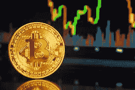

# 投资于您的加密知识

> 原文：<https://medium.com/coinmonks/invest-in-your-crypto-knowledge-ba1f082af5f9?source=collection_archive---------46----------------------->

别搞错了。熊市，或者可以说是隐秘的冬天，正在向我们袭来。

当其他人都在忙碌的时候，这可能是获取更多知识的最好时机，这样你就可以在市场变化的时候应用它们。

这里有一个资源、材料和工具的列表，你需要在一个无情的加密世界中保持高效和安全。使用它们来获得竞争优势，因为你需要在 Web 3 中脱颖而出的每一个优势。

这是:

**学历:**

*   币安学院—涵盖从初级到高级的所有级别的加密概念，来自领先的集中式加密交换。https://t.co/lowp8Vr98u
*   莱杰学院——非常重视数字资产的安全性(防范黑客、诈骗等),这非常重要。他们 Youtube 频道的优秀视频。这很自然，因为他们是我使用的领先冷钱包硬件制造商。【https://t.co/MKIzZFnUR0 
*   新闻与分析。有一个详细的加密术语词汇表，当然，也是一个伟大的价格跟踪工具。[https://t.co/3tq3NHGuAB](https://t.co/3tq3NHGuAB)
*   连锁汇报—关于加密的新闻、分析、指南、视频和报告。[https://t.co/d4lKRwD7Q5](https://t.co/d4lKRwD7Q5)
*   每日猿-超级收集了广泛的加密主题。加入电报小组，了解加密世界中的每日更新。[https://thedailyape . idea . site/thedailyape/The-Daily-Ape-c 96 c0b 6727 c 0433 a 962 e 897 ef 43 efb 7 e](https://thedailyape.notion.site/thedailyape/The-Daily-Ape-c96c0b6727c0433a962e897ef43efb7e)
*   我关注的致力于提供教育价值的加密 Twitter 账户:
*   [@shivsakhuja](https://twitter.com/shivsakhuja)
*   [@Route2FI](https://twitter.com/Route2FI)
*   [@DeFi_Made_Here](https://twitter.com/DeFi_Made_Here)
*   [@DU09BTC](https://twitter.com/DU09BTC)
*   [@petergyang](https://twitter.com/petergyang)
*   [@bobbyong](https://twitter.com/bobbyong)
*   [@ hashufl](https://twitter.com/hasufl)
*   [@维塔利布特林](https://twitter.com/VitalikButerin)
*   [@ thedefedge](https://twitter.com/thedefiedge)
*   [@TimBeiko](https://twitter.com/TimBeiko)
*   [@丹克拉](https://twitter.com/dankrad)
*   [@rossboothr](https://twitter.com/rossboothr)
*   [@Cov_duk](https://twitter.com/Cov_duk)
*   [@JackNiewold](https://twitter.com/JackNiewold)
*   [@FatManTerra](https://twitter.com/FatManTerra)
*   [@zachxbt](https://twitter.com/zachxbt)
*   [@Galois_Capital](https://twitter.com/Galois_Capital)
*   [@laurashin](https://twitter.com/laurashin)
*   [@SpartanBlack_1](https://twitter.com/SpartanBlack_1)
*   [@mrjasonchoi](https://twitter.com/mrjasonchoi)
*   [@nansen_alpha](https://twitter.com/nansen_alpha)
*   [@FreddieRaynolds](https://twitter.com/FreddieRaynolds)
*   [@danheld](https://twitter.com/danheld)
*   [@TusharJain_](https://twitter.com/TusharJain_)
*   [@SBF_FTX](https://twitter.com/SBF_FTX)
*   [@ cz _ 币安](https://twitter.com/cz_binance)

**新闻:**

*   加密简报—加密领域的最新新闻、更新和分析[https://t.co/IRa85GT5TL](https://t.co/IRa85GT5TL)
*   coin desk——与加密相关的新闻、研究、播客、视频和网络研讨会的绝佳资源。[https://t.co/DXEcwwzs9p](https://t.co/DXEcwwzs9p)

**简讯:**

*   无银行——传承了最好的加密教育之一，涵盖战略、指南、播客等[https://banklesshq.com](https://t.co/YO30lgUMzi)
*   block crunch——我是付费的 VIP 时事通讯会员。你得到投资备忘录，市场分析，可操作的见解。固体播客也是。[https://t.co/GLVFI230nG](https://t.co/GLVFI230nG)
*   挑衅者 DeFi 上的一切。播客也很棒。https://t.co/1ehjZTf9Qs

**研究:**

*   所有加密白皮书——白皮书是加密项目的重要信息来源。我通过阅读(反复阅读)比特币和以太坊白皮书开始了我的加密之旅。这里是一个包含超过 3000 多份白皮书的数据库。[https://t.co/RfG0ETApAx](https://t.co/RfG0ETApAx)
*   Block——详细而深刻的研究报告。必读！[https://t.co/ktpNZpe31r](https://t.co/ktpNZpe31r)
*   梅萨里—市场研究和情报[https://t.co/b5fPm40fwh](https://t.co/b5fPm40fwh)
*   dapp 的状态——涵盖你能想到的各种分散式应用(dapp ),涵盖广泛的 [b](https://twitter.com/hashtag/Blockchain?src=hashtag_click) 锁链和类别。[https://stateofthedapps.com](https://t.co/ZXIPm6UpUe)

**工具:**

*   crypto Miso——根据 GitHub repository 上的提交历史记录，对开发人员在加密项目上的活跃程度进行排名。高开发活动和积极的贡献预示着项目的潜力。[https://t.co/BCyBsqxEYN](https://t.co/BCyBsqxEYN)
*   Nansen——区块链分析，让你可以跟踪智能资金和 NFT。我喜欢他们的代币神模式功能之一。发现新机会非常方便。一定在你的密码库里。[https://t.co/MpHpXpgaPd](https://t.co/MpHpXpgaPd)
*   硬币指标-顶级加密货币的数据指标。[https://t.co/lOHg3VD3Or](https://t.co/lOHg3VD3Or)
*   令牌终端—机构级加密资产数据。有免费和付费版本。[https://t.co/dBLoxA74uA](https://t.co/dBLoxA74uA)
*   沙丘分析——社区创建的加密、定义、NFT 分析。[https://t.co/5kKxQyy7fe](https://t.co/5kKxQyy7fe)
*   无价的加密货币交换数据。伟大的应用程序与伟大的投资组合跟踪器，我每天都在使用。[https://t.co/GbPYUjb3w5](https://t.co/GbPYUjb3w5)
*   Breadcrumbs 应用——用于追踪和调查加密交易的区块链分析。在一个充满骗局的加密环境中，我们需要这样的工具来带来透明度和问责制。[https://bread crumb . app](https://t.co/3LTwfbfqoq)
*   令牌嗅探器——我讨厌加密骗局！带来了这么多的耻辱，败坏了我们的行业！这个工具提供智能来帮助你避免他们，地毯拉，恶意合同等。a 必须有！【tokensniffer.com 
*   DeFi Llama —涵盖超过 80 个区块链的 DeFi 协议的全面数据分析。[https://t.co/1IRVwUJGxy](https://t.co/1IRVwUJGxy)
*   Defi Pulse — [De](https://twitter.com/hashtag/Defi?src=hashtag_click) Fi 排行榜和统计数据。[https://t.co/fqaxSTh56B](https://t.co/fqaxSTh56B)
*   DeFi prime——为便于研究而策划的 DeFi 项目列表。[https://t.co/BLRPj838u3](https://t.co/BLRPj838u3)
*   rug doc——强调高风险 DeFi 智能合同，防止自己变得粗糙！[https://t.co/RzyS5g1s0x](https://t.co/RzyS5g1s0x)
*   DeBank-(DeFi Wallet)-非常适合跨不同的区块链和协议跟踪您的加密资产，我特别喜欢跟踪他们排名靠前的用户(即鲸鱼)的功能。[https://t.co/iDLZYht2d1](https://t.co/iDLZYht2d1)
*   Coincarp.com—加密货币价格、图表等。查看他们的“富豪榜”功能，在那里你可以找到 BTC，瑞士联邦理工学院，SOL 和更多的顶级加密持有者！[https://t.co/GFTZB9DJBM](https://t.co/GFTZB9DJBM)
*   rabby——基于浏览器的 DeFi 扩展。帮助筛选交易中的任何风险。还有一个非常有用的令牌批准管理功能，可以检查(和撤销)您以前给予的令牌的无限制批准。[https://t.co/6EhXMCh62D](https://t.co/6EhXMCh62D)
*   PeckShield —有一个浏览器扩展，可以提醒您任何垃圾网络钓鱼和令牌网站！[https://t.co/6i3ICfDL8d](https://t.co/6i3ICfDL8d)
*   稀有性工具——追踪大量即将推出的 NFT 项目的稀有性。[稀有.工具](https://t.co/VpTw8IeWOI)
*   Yubico —我们看到的许多被破坏的在线帐户都是由于缺乏双因素身份验证(2FA)造成的。在加密领域，2FA 对于保护您的数据和资产绝对至关重要。没有比硬件认证器 Yubikey 更安全的了。我个人使用的 Series 5 NFC 版本也支持移动认证。https://t.co/MZbCAQ0PI8
*   连锁经营——每一个性感的小玩意儿背后都有一个坚实的基础设施。Chainstack 提供托管区块链基础设施服务，使开发人员能够轻松构建和扩展。支持多种区块链协议。【https://t.co/7Gh64xTiad 

如果你从这篇文章中发现了价值，请**尽情鼓掌**，**尽情分享**， [**关注**](/@JagFoo) 我在[中](/@JagFoo) & [推特](https://twitter.com/blocksaurus1152)。

> 加入 Coinmonks [电报频道](https://t.me/coincodecap)和 [Youtube 频道](https://www.youtube.com/c/coinmonks/videos)了解加密交易和投资