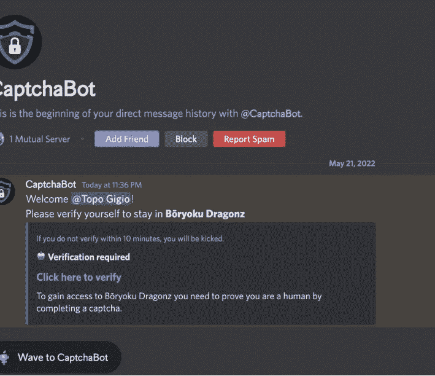
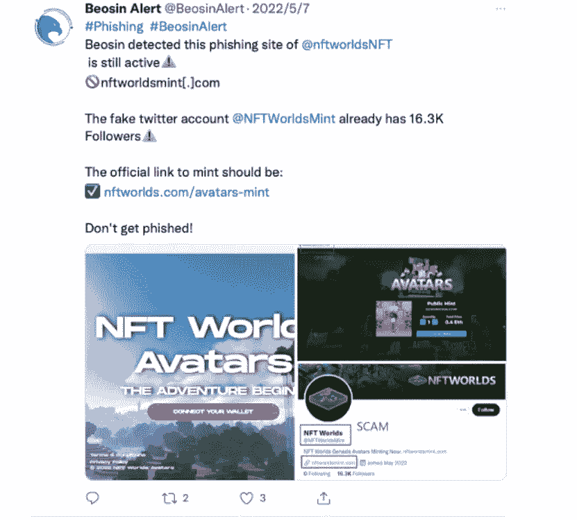

# 调查 Web 3.0 中常见的网络钓鱼攻击:不和谐、谷歌广告、虚假域名及其他

> 原文：<https://medium.com/coinmonks/investigation-of-common-phishing-attacks-in-web-3-0-discord-google-ads-fake-domains-and-others-713ec4c4bcc1?source=collection_archive---------9----------------------->

# 关键要点

Web 3 网络钓鱼活动呈上升趋势，一些主要的网络钓鱼技术包括:

1.  利用被攻破的 Discord 机器人在一些官方 Discord 服务器上发布钓鱼链接；
2.  在直接邮件中发送网络钓鱼链接；
3.  利用搜索引擎上的广告推广虚假网站；
4.  通过虚假的不和谐机器人直接发送消息；
5.  与官方网站高度相似的域名和内容；
6.  利用 Opensea 等 NFT 交易平台推广假项目；
7.  使用地址略有变化的假合同地址。

**BeO sin 的一般建议:**

1.  一定要多渠道查询信息，不要轻易相信“bot”或“官方链接”；
2.  警惕直接信息:官方机器人不会在 DM 中要求验证；
3.  仔细检查域名或合同地址；
4.  尽量减少不和谐使用的机器人数量；
5.  不要在你的浏览器中添加一些敏感网站的书签。

# 网络钓鱼的定义

根据维基百科的定义，网络钓鱼是一种犯罪骗局，它试图通过伪装成信誉良好的法律实体的媒体，从电子通信中获取敏感的个人信息，如用户名、密码和信用卡详细信息。这些通信声称来自流行的社交网站(YouTube、脸书、MySpace)、拍卖网站(易贝)、网上银行、电子支付网站(PayPal)或网站管理员(雅虎、互联网服务提供商、企业团体)，以引诱受害者上当。网络钓鱼通常是通过电子邮件或即时消息进行的。它通常会将用户引导到一个虚假网站，该网站的 URL 和界面看起来与真实网站几乎相同，以输入个人信息。即使有强大的加密和 SSL 服务器认证，仍然很难检测一个网站是否是假的。网络钓鱼就是利用社会工程技术来愚弄用户的一个例子。它依赖于当前 web 安全技术的低亲和力。

在 web3 世界中，网络钓鱼主要通过一系列手段实现，如 twitter、discord 和网站伪造，在此过程中通常伴随着社会工程攻击，如假冒员工、在线聊天、诱饵、等价交换和同情(参见维基百科:社会工程了解更多详细信息)，使其难以防御。

# Web3 典型网络钓鱼案例

本文将揭示 web3 世界中几种常见的钓鱼方法:

# 1.警惕不和谐机器人

2022 年 5 月 23 日，Discord 的 MEE6 bot 被攻破，导致一些 Discord 官方服务器中关于造币的钓鱼网站信息被释放。

2022 年 5 月 6 日，Opensea 官方不和妥协，黑客利用 bot 账户在频道上发布虚假链接，声称“OpenSea 与 YouTube 合作，点击链接即可铸造限量 100 张 mint pass NFTs”。

最近针对 Discord 官方服务器的攻击案例越来越多，原因可能有以下几点:

1.  对项目所有者的员工进行网络钓鱼攻击，导致账户被盗；
2.  项目负责人下载了恶意软件，导致账户被盗；
3.  项目负责人未设置双因素认证，使用弱密码，导致账户被盗；
4.  项目所有者遭受了网络钓鱼攻击，添加恶意书签以绕过浏览器认证规则，导致 Discord 令牌被盗。

**温馨提示:**

1)项目方应采用官方推荐的安全操作，如双因素认证和设置强密码来保护您的帐户；警惕各种传统网络攻击和社会工程攻击，避免下载恶意软件，或访问钓鱼网站。

2) Web3 用户要有意识，不和谐官方发布的也可能是钓鱼信息，官方不保证绝对安全。另外，在任何需要自己授权或交易的地方都需要谨慎，尽量多途径交叉核对信息。

# 2.周杰伦的无聊猿 NFT 被一个不和谐的钓鱼攻击偷走了

2022 年 4 月 1 日，流行歌星周杰伦在 Instagram 上透露，他的无聊猿 NFT 被钓鱼网站偷走了。

经过 Beosin 的技术团队查看，我们发现周杰伦在 11 点左右签署了以 0x71de2 开头的钱包地址以批准交易，授予攻击者以 0xe34f0 开头的钱包 NFT 批准。此时周杰伦还没有意识到他的 NFT，已经处于危险之中。

就在过去的几分钟内，攻击者在 11:07 将无聊的 Ape BAYC #3738 NFT 转移到自己的钱包地址，然后在 LooksRare 和 OpenSea 上以大约 169.6 ETH 的价格出售偷来的 NFT。

**温馨提示:**

1)不要轻易相信直接消息。攻击者通常会通过私人信息或电子邮件引诱您点击钓鱼网站链接。所有信息都要先和官网核对，多渠道核实其真实性。

2)周杰伦被钓鱼的案例是在铸就一个新项目之后，他当时对钓鱼攻击的警惕性可能没有那么高。所以用户必须时刻保持警惕，确保每一步都是安全的。

# 3.谷歌广告上的钓鱼网站

2022 年 5 月 10 日，@Serpent 发推文称，NFT 交易平台 X2Y2 的谷歌搜索页面上的第一个搜索结果是一个欺诈网站，该网站利用谷歌广告中的一个漏洞，使真实网站和欺诈网址看起来完全相同，大约 100 个 ETH 已经被盗。

**温馨提示:**

1)搜索引擎方便，但不一定真实。搜索引擎广告系统很容易被恶意网站利用。尽量通过官方 twitter 或 Google 认证的官网入口进入，确认官方信息时交叉核对。

2)注重细节。搜索引擎的结果，如果是广告，会有广告这个词。避免点击带有“广告”字样的链接。

# 4.通过假机器人直接发送消息

最近有一个用户加入了一个官方的 Discord 社区，加入服务器后有一个 bot 直接发消息要求验证。

然而，当点击链接时，它会自动弹出 Metamask 钱包并要求输入密码，而这时用户几乎可以确定网站出现了问题。后来经过调试分析，发现该站点并不是真正的 Metamask 弹出，而是一个假的 Metamask 钱包界面。如果有人输入密码，它会要求帮助者验证，最后密码和帮助者都会被发送到攻击者的后端服务器，钱包就已经被盗了。

**温馨提示:**

1)警惕不和谐的直接消息:官方机器人不会在 DM 中要求验证。

2)身份验证的过程将不需要钱包连接。

3)一定要留意你发现的奇怪或异常的操作，多交叉验证信息。

# 5.高度相似的域名和内容

目前，市场上有各种各样的假冒网站，大部分都是模仿官方网站，域名和内容高度相似。这是最常见的钓鱼方式，其主要形式如下。

1.  更改顶级域名，保持主域名不变。比如下图的官网顶级域名就是。而钓鱼网站顶级域名是。乐趣:

2.为容易混淆的主域添加单词，如 openesa-office、xxxmint 等。

3.为混淆和网络钓鱼添加二级域:

**温馨提示:**

1)进入一个网站，先找到官方 twitter 或者 discord，把链接一个一个对比，看是否正确。

2)时刻保持警惕:虽然这些类型的钓鱼网站最容易识别，但数量极其庞大，用户如果不小心很容易被骗。

3)添加反网络钓鱼扩展，有效帮助识别某些恶意网站。Beosin Alert extension 可以识别用户当前正在浏览的 Web3 站点是否是网络钓鱼、诈骗和其他类型的恶意网站，目前支持 Google Chrome 和 Chromium 浏览器。

# 6.Opensea 上的网络钓鱼项目

前段时间我们在 Opensea 上发现了一个还没有正式开盘销售的项目，但是这个项目已经上市 10k 的物品，有 5.4k 的业主。经过仔细分析，我们发现了一种新的网络钓鱼方式。这个项目先用上述战术伪造了一个类似的官网和类似的域名，然后在 Opensea 上列出一个类似的项目，用“免费造币”等字眼吸引眼球。

此外，还有钓鱼网站和钓鱼 twitter 一起推广骗局:

**温馨提示:**

1)仔细识别推特账号。有时候钓鱼账号也有大量的关注者，但是大部分评论都是假的。或者帐户的创建日期很早，但只是最近才激活，等等。

Opensea 上的项目并不总是官网上的真实项目。上面还是有很多造假和钓鱼的项目，用户需要仔细甄别。

3)总是从多个渠道获取信息。从官网、opensea 项目、twitter、discord 等交叉查询信息。也可以直接和官方联系核实真伪。

# 7.假合同地址

今年 3 月出现的一个新骗局也令人大开眼界。攻击者伪造一份前后位数相同的合同，用钓鱼链接推广诈骗。

真正的 APEcoin 合约地址是:0x4d 224452801 aced 8 b 2 f 0 aebe 155379 bb 5d 594381。

假合同是:0x4d 221 b 9 c 0 ee 56604186 a 33 F4 f 2433 a 3961 c 94381

这种类型的攻击不常见，但令人困惑。通常人们会查看合同地址的正反面，看是否正常，但很少有人会查看完整地址。

**温馨提示:**

1)对于直接转账交易，最好检查完整的合同地址的正确性。

2)确保地址是从官方渠道获得的，以避免被中间攻击者修改。

**变通办法**

以上仅列出了网络钓鱼诈骗中常用的策略，然而随着 web3 的持续流行，网络钓鱼诈骗的方式也多种多样。用户需要记住上面的提示。然而，万一你被骗了，你可以尽你所能采取以下步骤来补救:

-立即隔离资产，并尽快将剩余资产转移到安全的地方，以避免更大的损失。

-主动发布声明，告知他人有关诈骗账户的信息，以避免危及朋友和社区。

-尽可能保留证据，并寻求项目业主或机构的后续帮助。

-寻求专业的安全公司进行资金追踪，如 BEOSIN。

最后，如果你不幸被诈骗或钓鱼，建议在社交媒体上记录并与他人分享你的经历。

# 更大的

[***1。LUNA 崩溃和 DeFi“出逃”后对 Web3 有什么影响？***](/coinmonks/what-is-the-impact-on-web3-after-lunas-crash-and-defi-fled-b80334e00aba)

[***2。在 Web 3.0 热潮下，如何保证 NFT 的安全？***](/@Beosin_com/how-to-ensure-the-security-of-nft-under-the-web-3-0-boom-beosin-vaas-has-provided-with-a-solution-50697ccd4f56)

[***3。DEUS Finance 遭遇今年第二次闪贷攻击:Beosin 详细分析***](/@Beosin_com/deus-finance-suffered-its-second-flashloan-attack-this-year-beosins-detailed-analysis-5032be0ec4f2)

[***4。Beosin 已经完成了加密乐高算法***](/@Beosin_com/beosin-has-completed-security-audit-service-of-crypto-lego-alg-no-critical-high-or-medium-risk-b656849e9334) 的安全审计服务

[***5。「重述」AMA 关于如何在使用 Beosin VaaS***](/@Beosin_com/recap-ama-about-how-to-keep-your-smart-contract-secure-during-development-with-beosin-vaas-f7ecd2dc27a) 开发期间保护您的智能合约的安全

# 接触

如果您需要任何区块链安全服务，请联系我们:

[**网站**](https://beosin.com/) [**邮箱**](http://contact@beosin.com/) [**官方推特**](https://twitter.com/Beosin_com) [**预警**](https://twitter.com/BeosinAlert) [**电报**](https://t.me/beosin)**[**LinkedIn**](https://www.linkedin.com/company/beosin)**

> **加入 Coinmonks [电报频道](https://t.me/coincodecap)和 [Youtube 频道](https://www.youtube.com/c/coinmonks/videos)了解加密交易和投资**

# **另外，阅读**

*   **[如何在印度购买比特币？](/coinmonks/buy-bitcoin-in-india-feb50ddfef94) | [瓦济克斯评论](/coinmonks/wazirx-review-5c811b074f5b)**
*   **[隐翅虫替代品](/coinmonks/cryptohopper-alternatives-d67287b16d27) | [HitBTC 审查](/coinmonks/hitbtc-review-c5143c5d53c2)**
*   **[CBET 点评](https://coincodecap.com/cbet-casino-review) | [库币 vs 比特币基地](https://coincodecap.com/kucoin-vs-coinbase)**
*   **[折叠 App 审核](https://coincodecap.com/fold-app-review) | [Kucoin 交易机器人](/coinmonks/kucoin-trading-bot-automate-your-trades-8cf0ca2138e0) | [Probit 审核](https://coincodecap.com/probit-review)**
*   **[如何匿名购买比特币](https://coincodecap.com/buy-bitcoin-anonymously) | [比特币现金钱包](https://coincodecap.com/bitcoin-cash-wallets)**
*   **[币安 vs FTX](https://coincodecap.com/binance-vs-ftx) | [最佳(索尔)索拉纳钱包](https://coincodecap.com/solana-wallets)**