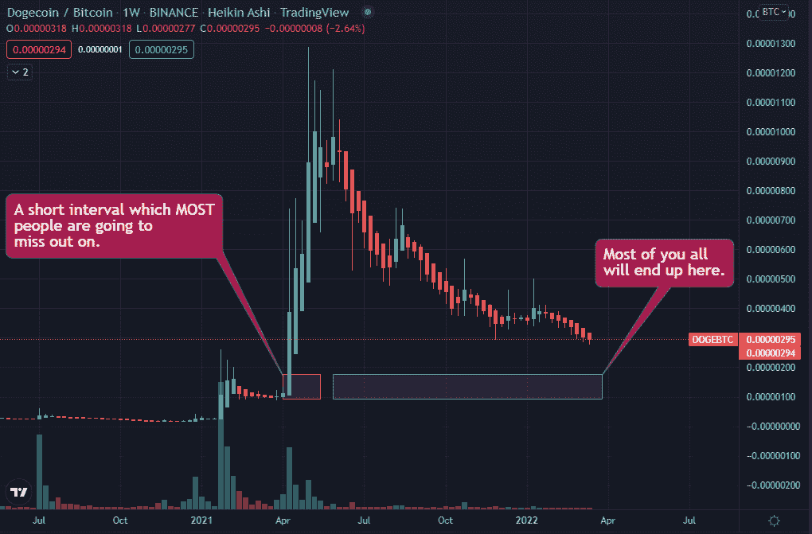
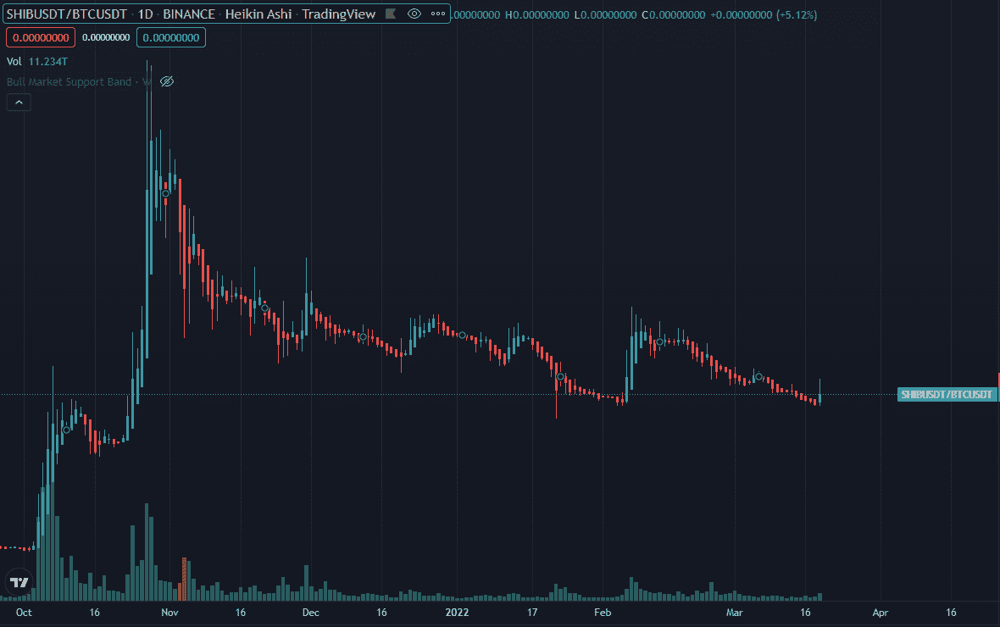

# 投资 ApeCoin 是个坏主意:原因如下

> 原文：<https://medium.com/coinmonks/investing-in-apecoin-is-a-bad-idea-heres-why-d896c27bc385?source=collection_archive---------5----------------------->

ApeCoin 正在各地流行，所以现在是一个很好的时间来看看流行的 meme coins 过去的表现，看看为什么模仿 Apecoin 是一个坏主意。

## **技术分析**

“但是那个狗币的家伙通过把他一生的积蓄投资在可爱的狗币上成为了百万富翁”。这是 Dogecoin 的图表。

这里没有惊喜。Dogecoin 反对比特币已经快一年了。这意味着，购买 doge 的投资者(比 BTC 投资者)承担了难以置信的高风险，却获得了更差的回报。我想不出任何一种金融资产的风险调整回报比它更差。简而言之，如果你投资另类硬币，你会希望你的另类硬币表现得和 BTC 一样好，甚至更好，因为它们本来就风险更大。柴犬也有类似的故事:

正如前面的图表所示，我们可以看到最初几天的大肆宣传，然后是对 BTC 的持续出血。

## **基本面分析**

-

## **计时**

现在可能是投资高投机性资产的最糟糕时机。可怕的俄罗斯-乌克兰战争正在发生，全球经济和供应链因此受到严重影响。在这个时候承担过多的金融风险是你最不想做的事情。

最后，如果你在玩短期游戏，你已经输了。像所有金融市场一样，crypto 将财富从缺乏耐心的投资者手中转移到耐心的投资者手中。

TLDR:不要买硬币或任何迷因硬币。你可能会后悔的。

> 加入 Coinmonks [电报频道](https://t.me/coincodecap)和 [Youtube 频道](https://www.youtube.com/c/coinmonks/videos)了解加密交易和投资

# 另外，阅读

*   [Bitsgap 审查](/coinmonks/bitsgap-review-a-crypto-trading-bot-that-makes-easy-money-a5d88a336df2) | [Quadency 审查](/coinmonks/quadency-review-a-crypto-trading-automation-platform-3068eaa374e1) | [Bitbns 审查](/coinmonks/bitbns-review-38256a07e161)
*   [密码本交易平台](/coinmonks/top-10-crypto-copy-trading-platforms-for-beginners-d0c37c7d698c) | [Coinmama 审核](/coinmonks/coinmama-review-ace5641bde6e)
*   [印度的加密交易所](/coinmonks/bitcoin-exchange-in-india-7f1fe79715c9) | [比特币储蓄账户](/coinmonks/bitcoin-savings-account-e65b13f92451)
*   [OKEx vs KuCoin](https://coincodecap.com/okex-kucoin) | [摄氏替代度](https://coincodecap.com/celsius-alternatives) | [如何购买 VeChain](https://coincodecap.com/buy-vechain)
*   [币安期货交易](https://coincodecap.com/binance-futures-trading)|[3 commas vs Mudrex vs eToro](https://coincodecap.com/mudrex-3commas-etoro)
*   [如何购买 Monero](https://coincodecap.com/buy-monero) | [IDEX 评论](https://coincodecap.com/idex-review) | [BitKan 交易机器人](https://coincodecap.com/bitkan-trading-bot)