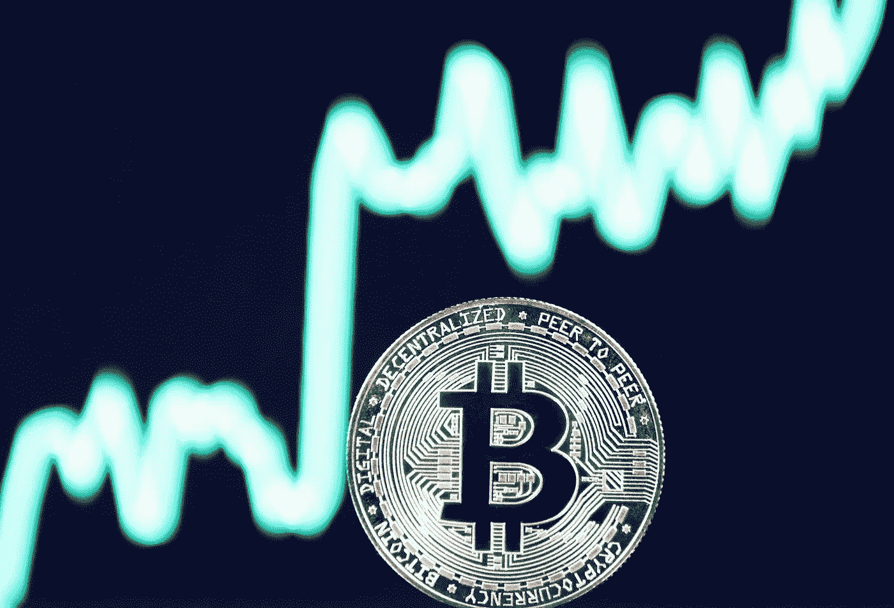

# 投资加密货币 2022

> 原文：<https://medium.com/coinmonks/investing-in-cryptocurrency-2022-175b80a29bd1?source=collection_archive---------76----------------------->

在[Thinkingtoday.co.uk](http://Thinkingtoday.co.uk)阅读更多

关注我 Medium—[https://Medium . com/coin monks/cryptocurrency-for-初学者-投资须知-549225716365](/coinmonks/cryptocurrency-for-beginners-everything-you-need-to-know-about-investing-549225716365)

约瑟夫·思维今天写的

比特币正迅速成为一个家喻户晓的名字，其价值也在持续飙升。在过去的一年里，它的估值已经推到了前所未有的水平，而且不会很快放缓。随着越来越多的人了解比特币及其潜力，它只会继续升值。无论您是进行长期投资还是只想赚点快钱，您都需要了解围绕这种令人兴奋的新货币的所有最新消息和趋势。

加密货币是数字或虚拟令牌，使用加密技术来保护其交易并控制新单位的创建。加密货币是分散的，这意味着它们不受政府或金融机构的控制。

比特币不再仅仅是一种货币，而是一种数字商品和投资。比特币是最大、最受欢迎的加密货币，其运作方式与传统货币完全不同。与英镑不同，比特币没有任何实物形式的交易。这意味着它不容易受到通货膨胀或政治动荡的影响。比特币是一种数字货币，不像传统货币那样依赖于中央权威机构。这意味着不需要任何形式的物理交换，这使它成为一个更加安全的选择。比特币已经被证明是一项成功的投资，仅在去年一年，其价格就上涨了 1000%以上！

目前的比特币价格令人震惊，而且有充分的理由！加密货币是一种不可预测的资产类别，没有人真正知道比特币的价格会有多高。但由于价格如此之高，政府也在考虑如何最好地监管这些硬币，一些投资者决定带着他们已经获得的利润继续前进。如果你想趁现在价格还高的时候参与进来，重要的是要意识到这是一个动荡的市场，有价格暴跌的风险。

随着比特币不断创下新的历史新高，一些投资者可能会忍不住兑现他们的利润。然而，这一决定可能有风险，因为加密货币市场仍然非常新，存在许多不确定性。随着政府考虑如何最好地监管这些硬币，比特币的价格也可能会下降。

比特币是一种数字资产和支付系统，由一个不知名的人或一群人以中本聪的名义发明。比特币自诞生以来一直备受争议，有人将其视为庞氏骗局，也有人将其视为货币的未来。尽管如此，比特币和其他加密货币仍在使用，并有可能成为更主流的货币。

比特币是一种新的创新的商业方式，因此其价格会有很大的波动。然而，这只是加密货币自然生态系统的一部分——这是令人兴奋的一部分！

在过去的一年里，比特币的价值持续上升，达到新高，并越来越被接受为一种货币形式。截至 2021 年 11 月，一个比特币的价值约为 4 万英镑，而同年 7 月，它的价值不到这个数字的一半，约为 2.1 万英镑。这种价格波动是比特币的一个恒定特征，这意味着它的价值可能会快速而不可预测地变化。然而，尽管存在波动性，比特币仍是市场上最受欢迎的货币形式之一。

总的来说，比特币和其他数字货币都是风险非常大的投资。无论你是购买比特币来购买商品，还是仅仅希望持有这种资产，直到你卖掉它以获得更多的钱，都不能保证你会拿回你的钱。如果你在考虑购买比特币。

[www.thinkingtoday.co.uk](http://thinkingtoday.co.uk)

> 加入 Coinmonks [电报频道](https://t.me/coincodecap)和 [Youtube 频道](https://www.youtube.com/c/coinmonks/videos)了解加密交易和投资

# 另外，阅读

*   [ProfitFarmers 回顾](https://coincodecap.com/profitfarmers-review) | [如何使用 Cornix 交易机器人](https://coincodecap.com/cornix-trading-bot)
*   [如何匿名购买比特币](https://coincodecap.com/buy-bitcoin-anonymously) | [比特币现金钱包](https://coincodecap.com/bitcoin-cash-wallets)
*   [瓦济里克斯 NFT 评论](https://coincodecap.com/wazirx-nft-review)|[Bitsgap vs Pionex](https://coincodecap.com/bitsgap-vs-pionex)|[Tangem 评论](https://coincodecap.com/tangem-wallet-review)
*   如何使用 Solidity 在以太坊上创建 DApp？
*   [币安 vs FTX](https://coincodecap.com/binance-vs-ftx) | [最佳(SOL)索拉纳钱包](https://coincodecap.com/solana-wallets)